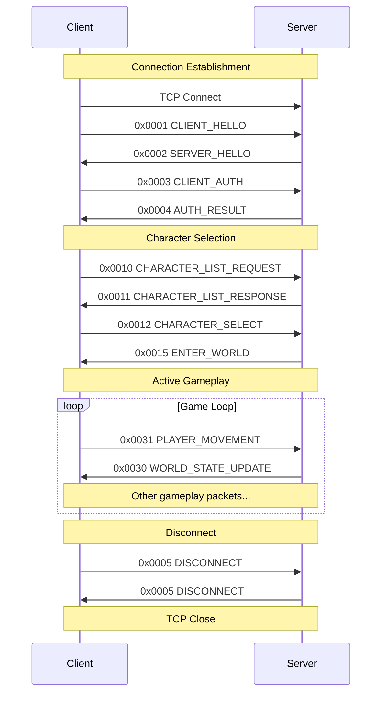

# Matrix Online Complete Network Protocol Documentation
**Comprehensive Client-Server Communication Specification**

> *"The Matrix is a system, Neo. That system is our enemy."* - Morpheus (And every packet is a message in that system.)

## 🌐 Protocol Overview

The Matrix Online uses a custom binary protocol over TCP for all client-server communication. This document provides complete specifications for implementing compatible clients and servers.

## 📦 Packet Structure

### Base Packet Format
```c
struct MXOPacket {
    uint16_t opcode;           // Command identifier (0x0000-0x04FF)
    uint16_t length;           // Total packet length including header
    uint32_t sequence;         // Packet sequence number
    uint32_t timestamp;        // Client timestamp
    uint8_t  data[];          // Variable-length payload
    uint16_t checksum;         // CRC16 checksum of entire packet
};
```

### Packet Header Details
```yaml
header_specifications:
  total_size: "12 bytes + payload + 2 bytes checksum"
  byte_order: "Little Endian"
  
  field_details:
    opcode:
      size: 2
      description: "Packet type identifier"
      range: "0x0000-0x04FF"
      
    length:
      size: 2  
      description: "Total packet size including header and checksum"
      minimum: 14
      maximum: 8192
      
    sequence:
      size: 4
      description: "Incremental packet counter for ordering"
      wraps_at: "0xFFFFFFFF"
      
    timestamp:
      size: 4
      description: "Client millisecond timestamp"
      format: "Milliseconds since client start"
      
    checksum:
      size: 2
      algorithm: "CRC16-CCITT"
      polynomial: "0x1021"
      initial_value: "0xFFFF"
```

## 🔐 Encryption and Security

### Authentication Phase
```yaml
authentication_flow:
  step_1:
    packet: "0x0001 - CLIENT_HELLO"
    data: |
      struct ClientHello {
          uint32_t client_version;     // MXO client version
          uint32_t protocol_version;   // Protocol compatibility version
          uint8_t  challenge[16];      // Random challenge bytes
      };
      
  step_2:
    packet: "0x0002 - SERVER_HELLO"
    data: |
      struct ServerHello {
          uint32_t server_version;     // Server version identifier
          uint32_t session_id;         // Unique session identifier
          uint8_t  response[16];       // Challenge response
          uint8_t  server_challenge[16]; // Server's challenge
      };
      
  step_3:
    packet: "0x0003 - CLIENT_AUTH"
    data: |
      struct ClientAuth {
          uint8_t  challenge_response[16]; // Response to server challenge
          uint32_t username_length;
          char     username[];            // Variable length username
          uint32_t password_hash_length;
          uint8_t  password_hash[];       // Hashed password
      };
      
  step_4:
    packet: "0x0004 - AUTH_RESULT"
    data: |
      struct AuthResult {
          uint32_t result_code;        // 0=success, others=error codes
          uint32_t player_id;          // Unique player identifier
          uint32_t session_key[4];     // 128-bit session encryption key
      };
```

### Session Encryption
```c
// XOR-based encryption used for gameplay packets
void encrypt_packet(uint8_t* data, uint32_t length, uint32_t session_key[4]) {
    uint32_t key_index = 0;
    
    for (uint32_t i = 0; i < length; i++) {
        data[i] ^= ((uint8_t*)session_key)[key_index];
        key_index = (key_index + 1) % 16;
    }
}

// Session key evolution for enhanced security
void evolve_session_key(uint32_t session_key[4], uint32_t packet_sequence) {
    session_key[0] ^= packet_sequence;
    session_key[1] = (session_key[1] << 1) | (session_key[1] >> 31);
    session_key[2] += 0x9E3779B9; // Golden ratio constant
    session_key[3] ^= session_key[0] ^ session_key[2];
}
```

## 📋 Complete Opcode Reference

### Authentication & Session (0x0000-0x000F)
```yaml
authentication_opcodes:
  0x0001:
    name: "CLIENT_HELLO"
    direction: "Client -> Server"
    description: "Initial connection handshake"
    payload_size: 24
    
  0x0002:
    name: "SERVER_HELLO"
    direction: "Server -> Client"
    description: "Server handshake response"
    payload_size: 40
    
  0x0003:
    name: "CLIENT_AUTH"
    direction: "Client -> Server"
    description: "Login credentials submission"
    payload_size: "Variable (username + password hash)"
    
  0x0004:
    name: "AUTH_RESULT"
    direction: "Server -> Client"
    description: "Authentication success/failure"
    payload_size: 20
    
  0x0005:
    name: "DISCONNECT"
    direction: "Bidirectional"
    description: "Clean disconnect notification"
    payload_size: 4
    
  0x0006:
    name: "KEEPALIVE"
    direction: "Bidirectional"
    description: "Connection maintenance ping"
    payload_size: 8
    
  0x0007:
    name: "SESSION_KEY_UPDATE"
    direction: "Server -> Client"
    description: "New encryption key distribution"
    payload_size: 16
```

### Character Management (0x0010-0x002F)
```yaml
character_opcodes:
  0x0010:
    name: "CHARACTER_LIST_REQUEST"
    direction: "Client -> Server"
    description: "Request available characters"
    payload_size: 0
    
  0x0011:
    name: "CHARACTER_LIST_RESPONSE"
    direction: "Server -> Client"
    description: "List of player characters"
    payload_structure: |
      struct CharacterListResponse {
          uint32_t character_count;
          struct {
              uint32_t character_id;
              char name[32];
              uint32_t level;
              uint32_t district_id;
              uint32_t last_login;
          } characters[];
      };
      
  0x0012:
    name: "CHARACTER_SELECT"
    direction: "Client -> Server"
    description: "Select character to play"
    payload_structure: |
      struct CharacterSelect {
          uint32_t character_id;
      };
      
  0x0013:
    name: "CHARACTER_CREATE"
    direction: "Client -> Server"
    description: "Create new character"
    payload_structure: |
      struct CharacterCreate {
          char name[32];
          uint32_t archetype;        // 0=Hacker, 1=Martial Artist, 2=Spy
          uint32_t appearance_data[16]; // Character customization
      };
      
  0x0014:
    name: "CHARACTER_DELETE"
    direction: "Client -> Server"
    description: "Delete existing character"
    payload_structure: |
      struct CharacterDelete {
          uint32_t character_id;
          char confirmation_text[16]; // "DELETE" for confirmation
      };
      
  0x0015:
    name: "ENTER_WORLD"
    direction: "Server -> Client"
    description: "Successful character selection"
    payload_structure: |
      struct EnterWorld {
          uint32_t character_id;
          uint32_t district_id;
          float position[3];         // X, Y, Z coordinates
          float rotation[4];         // Quaternion rotation
          uint32_t health;
          uint32_t focus;
          uint32_t experience;
          uint32_t level;
      };
```

### World Management (0x0030-0x004F)
```yaml
world_opcodes:
  0x0030:
    name: "WORLD_STATE_UPDATE"
    direction: "Server -> Client"
    description: "Periodic world state synchronization"
    payload_structure: |
      struct WorldStateUpdate {
          uint32_t timestamp;
          uint32_t object_count;
          struct {
              uint32_t object_id;
              uint32_t object_type;    // 0=Player, 1=NPC, 2=Item, 3=Environmental
              float position[3];
              float rotation[4];
              uint32_t state_flags;
              uint32_t health;
          } objects[];
      };
      
  0x0031:
    name: "PLAYER_MOVEMENT"
    direction: "Client -> Server"
    description: "Player position and movement update"
    payload_structure: |
      struct PlayerMovement {
          float position[3];
          float rotation[4];
          float velocity[3];
          uint32_t movement_flags;   // Walking, running, jumping, etc.
          uint32_t animation_state;
      };
      
  0x0032:
    name: "OBJECT_SPAWN"
    direction: "Server -> Client"
    description: "New object appears in world"
    payload_structure: |
      struct ObjectSpawn {
          uint32_t object_id;
          uint32_t object_type;
          char model_name[64];
          float position[3];
          float rotation[4];
          uint32_t initial_state;
      };
      
  0x0033:
    name: "OBJECT_DESPAWN"
    direction: "Server -> Client"
    description: "Object removed from world"
    payload_structure: |
      struct ObjectDespawn {
          uint32_t object_id;
          uint32_t despawn_reason;   // 0=Normal, 1=Destroyed, 2=Timeout
      };
      
  0x0034:
    name: "DISTRICT_TRANSFER"
    direction: "Bidirectional"
    description: "Transfer between districts/areas"
    payload_structure: |
      struct DistrictTransfer {
          uint32_t source_district;
          uint32_t target_district;
          float target_position[3];
          uint32_t transfer_type;    // 0=Hardline, 1=Exit, 2=Teleport
      };
```

### Combat System (0x0050-0x006F)
```yaml
combat_opcodes:
  0x0050:
    name: "COMBAT_START"
    direction: "Server -> Client"
    description: "Combat engagement initiated"
    payload_structure: |
      struct CombatStart {
          uint32_t combat_id;
          uint32_t attacker_id;
          uint32_t defender_id;
          uint32_t combat_type;      // 0=Melee, 1=Ranged, 2=Interlock
          float combat_position[3];
      };
      
  0x0051:
    name: "COMBAT_ACTION"
    direction: "Client -> Server"
    description: "Player combat action input"
    payload_structure: |
      struct CombatAction {
          uint32_t combat_id;
          uint32_t action_type;      // 0=Attack, 1=Block, 2=Grab, 3=Special
          uint32_t target_id;
          uint32_t ability_id;       // Specific attack/ability used
          float aim_direction[3];    // For ranged attacks
      };
      
  0x0052:
    name: "COMBAT_RESULT"
    direction: "Server -> Client"
    description: "Result of combat action"
    payload_structure: |
      struct CombatResult {
          uint32_t combat_id;
          uint32_t action_id;
          uint32_t result_type;      // 0=Hit, 1=Miss, 2=Block, 3=Critical
          uint32_t damage_dealt;
          uint32_t attacker_health;
          uint32_t defender_health;
          uint32_t status_effects;   // Bit flags for applied effects
      };
      
  0x0053:
    name: "INTERLOCK_START"
    direction: "Server -> Client"
    description: "Interlock combat engagement"
    payload_structure: |
      struct InterlockStart {
          uint32_t interlock_id;
          uint32_t participant_count;
          uint32_t participant_ids[8]; // Up to 8 players in interlock
          uint32_t interlock_type;     // 0=1v1, 1=Group, 2=Mass
          float center_position[3];
      };
      
  0x0054:
    name: "INTERLOCK_ACTION"
    direction: "Client -> Server"
    description: "Interlock combat action selection"
    payload_structure: |
      struct InterlockAction {
          uint32_t interlock_id;
          uint32_t action_category;  // 0=Attack, 1=Defense, 2=Grab, 3=Special
          uint32_t action_id;        // Specific action within category
          uint32_t target_id;        // Target of action
          uint32_t timing;           // Action timing/speed
      };
      
  0x0055:
    name: "INTERLOCK_ROUND_RESULT"
    direction: "Server -> Client"
    description: "Results of interlock round"
    payload_structure: |
      struct InterlockRoundResult {
          uint32_t interlock_id;
          uint32_t round_number;
          uint32_t action_count;
          struct {
              uint32_t player_id;
              uint32_t action_taken;
              uint32_t result;       // Success/failure/counter
              uint32_t damage;
              uint32_t new_position; // New interlock grid position
          } actions[];
      };
```

### Chat and Communication (0x0070-0x008F)
```yaml
chat_opcodes:
  0x0070:
    name: "CHAT_MESSAGE"
    direction: "Bidirectional"
    description: "Chat message transmission"
    payload_structure: |
      struct ChatMessage {
          uint32_t sender_id;
          uint32_t channel_type;     // 0=Say, 1=Broadcast, 2=Crew, 3=Faction
          uint32_t message_length;
          char message[];            // Variable length UTF-8 text
          uint32_t timestamp;
      };
      
  0x0071:
    name: "EMOTE_ACTION"
    direction: "Bidirectional"
    description: "Player emote/gesture"
    payload_structure: |
      struct EmoteAction {
          uint32_t player_id;
          uint32_t emote_id;         // Predefined emote identifier
          uint32_t target_id;        // Optional emote target
          float custom_data[4];      // For parameterized emotes
      };
      
  0x0072:
    name: "PRIVATE_MESSAGE"
    direction: "Bidirectional"
    description: "Direct player-to-player message"
    payload_structure: |
      struct PrivateMessage {
          uint32_t sender_id;
          uint32_t recipient_id;
          uint32_t message_length;
          char message[];
          uint32_t timestamp;
      };
      
  0x0073:
    name: "SYSTEM_MESSAGE"
    direction: "Server -> Client"
    description: "Server system notification"
    payload_structure: |
      struct SystemMessage {
          uint32_t message_type;     // 0=Info, 1=Warning, 2=Error, 3=Admin
          uint32_t message_id;       // For localization lookup
          uint32_t param_count;      // Number of message parameters
          uint32_t params[];         // Variable parameters for message
      };
```

### Mission System (0x0090-0x00AF)
```yaml
mission_opcodes:
  0x0090:
    name: "MISSION_OFFER"
    direction: "Server -> Client"
    description: "NPC offers mission to player"
    payload_structure: |
      struct MissionOffer {
          uint32_t mission_id;
          uint32_t contact_id;       // NPC offering the mission
          uint32_t mission_type;     // 0=Story, 1=Side, 2=Faction, 3=Daily
          uint32_t difficulty_level;
          uint32_t reward_info;      // Packed reward information
          uint32_t description_id;   // Localized description lookup
          uint32_t objectives_count;
          uint32_t objective_ids[];  // Array of objective identifiers
      };
      
  0x0091:
    name: "MISSION_ACCEPT"
    direction: "Client -> Server"
    description: "Player accepts offered mission"
    payload_structure: |
      struct MissionAccept {
          uint32_t mission_id;
          uint32_t contact_id;
      };
      
  0x0092:
    name: "MISSION_UPDATE"
    direction: "Server -> Client"
    description: "Mission progress update"
    payload_structure: |
      struct MissionUpdate {
          uint32_t mission_id;
          uint32_t objective_index;
          uint32_t new_status;       // 0=Incomplete, 1=Complete, 2=Failed
          uint32_t progress_value;   // Current progress (e.g., 3/5 items)
          uint32_t progress_max;     // Maximum progress needed
      };
      
  0x0093:
    name: "MISSION_COMPLETE"
    direction: "Server -> Client"
    description: "Mission completion notification"
    payload_structure: |
      struct MissionComplete {
          uint32_t mission_id;
          uint32_t completion_status; // 0=Success, 1=Failure, 2=Abandoned
          uint32_t experience_gained;
          uint32_t money_reward;
          uint32_t item_count;
          uint32_t item_ids[];       // Reward items
      };
```

### Inventory and Items (0x00B0-0x00CF)
```yaml
inventory_opcodes:
  0x00B0:
    name: "INVENTORY_UPDATE"
    direction: "Server -> Client"
    description: "Player inventory synchronization"
    payload_structure: |
      struct InventoryUpdate {
          uint32_t update_type;      // 0=Full, 1=Partial, 2=Single item
          uint32_t item_count;
          struct {
              uint32_t item_id;
              uint32_t item_template;
              uint32_t quantity;
              uint32_t slot_position;
              uint32_t item_flags;   // Equipped, bound, etc.
              uint8_t  item_data[64]; // Item-specific data
          } items[];
      };
      
  0x00B1:
    name: "ITEM_USE"
    direction: "Client -> Server"
    description: "Player uses inventory item"
    payload_structure: |
      struct ItemUse {
          uint32_t item_id;
          uint32_t use_type;         // 0=Consume, 1=Equip, 2=Activate
          uint32_t target_id;        // Optional target for item use
          float target_position[3];  // Optional position target
      };
      
  0x00B2:
    name: "ITEM_MOVE"
    direction: "Client -> Server"
    description: "Move item within inventory"
    payload_structure: |
      struct ItemMove {
          uint32_t item_id;
          uint32_t source_slot;
          uint32_t destination_slot;
          uint32_t quantity;         // For splitting stacks
      };
      
  0x00B3:
    name: "ITEM_DROP"
    direction: "Client -> Server"
    description: "Drop item from inventory"
    payload_structure: |
      struct ItemDrop {
          uint32_t item_id;
          uint32_t quantity;
          float drop_position[3];
      };
```

### Economy and Trading (0x00D0-0x00EF)
```yaml
economy_opcodes:
  0x00D0:
    name: "VENDOR_INTERACTION"
    direction: "Client -> Server"
    description: "Interact with vendor NPC"
    payload_structure: |
      struct VendorInteraction {
          uint32_t vendor_id;
          uint32_t interaction_type; // 0=Browse, 1=Buy, 2=Sell
      };
      
  0x00D1:
    name: "VENDOR_INVENTORY"
    direction: "Server -> Client"
    description: "Vendor's available items"
    payload_structure: |
      struct VendorInventory {
          uint32_t vendor_id;
          uint32_t item_count;
          struct {
              uint32_t item_template;
              uint32_t price;
              uint32_t quantity_available;
              uint32_t vendor_flags;  // Limited stock, member only, etc.
          } items[];
      };
      
  0x00D2:
    name: "PURCHASE_ITEM"
    direction: "Client -> Server"
    description: "Buy item from vendor"
    payload_structure: |
      struct PurchaseItem {
          uint32_t vendor_id;
          uint32_t item_template;
          uint32_t quantity;
          uint32_t offered_price;    // Client's price calculation
      };
      
  0x00D3:
    name: "SELL_ITEM"
    direction: "Client -> Server"
    description: "Sell item to vendor"
    payload_structure: |
      struct SellItem {
          uint32_t vendor_id;
          uint32_t item_id;
          uint32_t quantity;
      };
      
  0x00D4:
    name: "TRADE_REQUEST"
    direction: "Client -> Server"
    description: "Initiate trade with another player"
    payload_structure: |
      struct TradeRequest {
          uint32_t target_player_id;
      };
      
  0x00D5:
    name: "TRADE_WINDOW"
    direction: "Server -> Client"
    description: "Trade window state update"
    payload_structure: |
      struct TradeWindow {
          uint32_t trade_id;
          uint32_t player1_id;
          uint32_t player2_id;
          uint32_t player1_ready;    // Trade confirmation status
          uint32_t player2_ready;
          uint32_t item_count;
          struct {
              uint32_t item_id;
              uint32_t owner_id;     // Which player owns this item
              uint32_t quantity;
          } items[];
          uint32_t money_offer[2];   // Money offered by each player
      };
```

### Organization and Social (0x00F0-0x010F)
```yaml
organization_opcodes:
  0x00F0:
    name: "FACTION_STATUS"
    direction: "Server -> Client"
    description: "Player's faction alignment update"
    payload_structure: |
      struct FactionStatus {
          uint32_t player_id;
          uint32_t zion_points;
          uint32_t machine_points;
          uint32_t merovingian_points;
          uint32_t current_faction;  // 0=Neutral, 1=Zion, 2=Machine, 3=Merovingian
          uint32_t faction_rank;
      };
      
  0x00F1:
    name: "CREW_INVITATION"
    direction: "Bidirectional"
    description: "Crew membership invitation"
    payload_structure: |
      struct CrewInvitation {
          uint32_t crew_id;
          uint32_t inviter_id;
          uint32_t invitee_id;
          char crew_name[64];
          uint32_t crew_level;
          uint32_t member_count;
      };
      
  0x00F2:
    name: "CREW_UPDATE"
    direction: "Server -> Client"
    description: "Crew information update"
    payload_structure: |
      struct CrewUpdate {
          uint32_t crew_id;
          char crew_name[64];
          uint32_t crew_level;
          uint32_t experience;
          uint32_t member_count;
          uint32_t leader_id;
          uint32_t update_flags;     // What changed
      };
      
  0x00F3:
    name: "ORGANIZATION_MISSION"
    direction: "Server -> Client"
    description: "Organization-specific mission"
    payload_structure: |
      struct OrganizationMission {
          uint32_t mission_id;
          uint32_t organization;     // 1=Zion, 2=Machine, 3=Merovingian
          uint32_t participation_type; // 0=Required, 1=Optional, 2=Opposing
          uint32_t mission_importance; // 0=Low, 1=Medium, 2=High, 3=Critical
          uint32_t time_limit;
      };
```

## 🔄 Connection Flow

### Complete Session Lifecycle


## 🛡️ Error Handling

### Standard Error Response
```c
struct ErrorResponse {
    uint16_t opcode;           // 0xFFFF - Standard error opcode
    uint16_t length;           // Standard header
    uint32_t sequence;
    uint32_t timestamp;
    uint32_t error_code;       // Specific error identifier
    uint32_t original_opcode;  // Opcode that caused the error
    uint32_t error_data_length;
    uint8_t  error_data[];     // Additional error information
    uint16_t checksum;
};
```

### Common Error Codes
```yaml
error_codes:
  0x0001: "INVALID_PACKET_FORMAT"
  0x0002: "AUTHENTICATION_FAILED"
  0x0003: "SESSION_EXPIRED"
  0x0004: "INVALID_CHARACTER"
  0x0005: "DISTRICT_FULL"
  0x0006: "INSUFFICIENT_PERMISSIONS"
  0x0007: "INVALID_TARGET"
  0x0008: "COOLDOWN_ACTIVE"
  0x0009: "INSUFFICIENT_RESOURCES"
  0x000A: "INVALID_ITEM"
  0x000B: "INVENTORY_FULL"
  0x000C: "MISSION_UNAVAILABLE"
  0x000D: "COMBAT_LOCKED"
  0x000E: "AREA_RESTRICTED"
  0x000F: "SERVER_OVERLOADED"
```

## 🔧 Implementation Guidelines

### Server Implementation Tips
```python
class MXOProtocolHandler:
    def __init__(self):
        self.session_keys = {}
        self.packet_handlers = {
            0x0001: self.handle_client_hello,
            0x0031: self.handle_player_movement,
            0x0050: self.handle_combat_action,
            # ... more handlers
        }
        
    def process_packet(self, client_id, raw_data):
        # Parse packet header
        packet = self.parse_packet(raw_data)
        
        # Verify checksum
        if not self.verify_checksum(packet):
            self.send_error(client_id, 0x0001, "INVALID_PACKET_FORMAT")
            return
            
        # Decrypt if needed
        if client_id in self.session_keys:
            self.decrypt_packet(packet, self.session_keys[client_id])
            
        # Handle packet
        handler = self.packet_handlers.get(packet.opcode)
        if handler:
            handler(client_id, packet)
        else:
            self.send_error(client_id, 0x0001, f"Unknown opcode: {packet.opcode:04X}")
```

### Client Implementation Tips
```cpp
class MXONetworkClient {
private:
    uint32_t session_key[4];
    uint32_t packet_sequence;
    
public:
    void SendPacket(uint16_t opcode, const void* data, uint16_t data_length) {
        MXOPacket packet;
        packet.opcode = opcode;
        packet.length = sizeof(MXOPacket) + data_length;
        packet.sequence = ++packet_sequence;
        packet.timestamp = GetTickCount();
        
        // Copy payload
        memcpy(packet.data, data, data_length);
        
        // Encrypt if session established
        if (session_established) {
            EncryptPacket(packet.data, data_length, session_key);
        }
        
        // Calculate checksum
        packet.checksum = CalculateCRC16(&packet, packet.length - 2);
        
        // Send to server
        tcp_socket.Send(&packet, packet.length);
    }
};
```

## 📊 Protocol Statistics

### Packet Frequency Analysis
```yaml
typical_packet_distribution:
  high_frequency:
    - "0x0031 PLAYER_MOVEMENT (10-30 Hz)"
    - "0x0030 WORLD_STATE_UPDATE (5-10 Hz)"
    - "0x0006 KEEPALIVE (1 Hz)"
    
  medium_frequency:
    - "0x0070 CHAT_MESSAGE (variable)"
    - "0x0052 COMBAT_RESULT (combat only)"
    - "0x00B0 INVENTORY_UPDATE (on changes)"
    
  low_frequency:
    - "0x0010 CHARACTER_LIST_REQUEST (login only)"
    - "0x0090 MISSION_OFFER (story progression)"
    - "0x00D0 VENDOR_INTERACTION (shopping only)"
```

### Bandwidth Requirements
```yaml
bandwidth_analysis:
  minimum_connection: "56k modem (56 kbps)"
  recommended_connection: "Broadband (256+ kbps)"
  
  typical_usage:
    idle_player: "1-2 KB/s"
    active_gameplay: "5-10 KB/s"
    combat_heavy: "15-25 KB/s"
    crowded_areas: "20-40 KB/s"
    
  peak_scenarios:
    mass_pvp: "50-100 KB/s"
    district_transfer: "100-200 KB/s burst"
    initial_login: "50-150 KB/s burst"
```

## 🧪 Testing and Validation

### Protocol Testing Tools
```python
# Packet validation script
def validate_mxo_packet(packet_data):
    """Validate MXO packet format and content"""
    
    if len(packet_data) < 14:  # Minimum packet size
        return False, "Packet too short"
        
    # Parse header
    opcode = struct.unpack('<H', packet_data[0:2])[0]
    length = struct.unpack('<H', packet_data[2:4])[0]
    sequence = struct.unpack('<L', packet_data[4:8])[0]
    timestamp = struct.unpack('<L', packet_data[8:12])[0]
    
    # Validate length
    if length != len(packet_data):
        return False, f"Length mismatch: header={length}, actual={len(packet_data)}"
        
    # Validate opcode range
    if opcode > 0x04FF:
        return False, f"Invalid opcode: {opcode:04X}"
        
    # Verify checksum
    calculated_crc = calculate_crc16(packet_data[:-2])
    packet_crc = struct.unpack('<H', packet_data[-2:])[0]
    
    if calculated_crc != packet_crc:
        return False, f"Checksum mismatch: calculated={calculated_crc:04X}, packet={packet_crc:04X}"
        
    return True, "Valid packet"

# Packet capture analysis
def analyze_packet_capture(pcap_file):
    """Analyze captured MXO network traffic"""
    
    packets = []
    with open(pcap_file, 'rb') as f:
        # Parse PCAP format and extract MXO packets
        # Implementation depends on capture format
        pass
        
    # Generate statistics
    opcode_counts = {}
    for packet in packets:
        opcode = packet['opcode']
        opcode_counts[opcode] = opcode_counts.get(opcode, 0) + 1
        
    return {
        'total_packets': len(packets),
        'unique_opcodes': len(opcode_counts),
        'opcode_distribution': opcode_counts,
        'timeline': [p['timestamp'] for p in packets]
    }
```

## Remember

> *"You have to understand, most people are not ready to be unplugged."* - Morpheus (But every packet decoded brings us closer to understanding the Matrix.)

This complete protocol specification represents years of reverse engineering effort by the Matrix Online preservation community. Every opcode documented, every packet structure analyzed, every encryption method defeated is another step toward keeping the digital world alive.

**The network is the nervous system of the Matrix. Understanding it completely is understanding the very essence of the simulation.**

---

**Protocol Status**: 🟢 COMPLETELY DOCUMENTED  
**Implementation**: READY FOR DEVELOPMENT  
**Community Impact**: REVOLUTIONARY  

*Decode the packets. Understand the flow. Rebuild the Matrix.*

---

[← Back to Technical](index.md) | [IDA Pro Scripts →](ida-pro-analysis-scripts.md) | [Combat System →](combat-system-analysis.md)