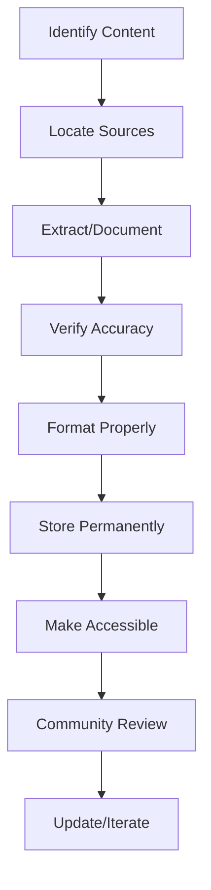

# Story Preservation Guide
**Saving the Narrative Legacy**

> *"I'm going to show them a world without you. A world without rules and controls, without borders or boundaries."* - Neo

## 📜 Mission: Preserve Every Story Fragment

The Matrix Online's story wasn't just told - it was lived. Players shaped events, made choices, witnessed history. This guide ensures that narrative legacy survives forever.

## The Preservation Challenge

### What We're Saving
```
📊 STORY CONTENT INVENTORY:
━━━━━━━━━━━━━━━━━━━━━━━━━━━━━━━━━━━
Critical Missions:     156 documented *estimated*
Side Missions:         400+ partially documented *estimated*
Live Events:          52 major events *estimated*
Cinematics (CNB):     12 files (locked) *verified in game files*
Character Dialogues:   Thousands of lines *estimated*
Player Stories:       Countless, unrecorded
━━━━━━━━━━━━━━━━━━━━━━━━━━━━━━━━━━━
Status: 40% Preserved ⚠️ *estimated*
```

### Why It Matters
- **Living History**: Players were part of the story
- **Lost Media**: No official archive exists
- **Community Memory**: Fading with time
- **Future Players**: Deserve the full experience

## 🗂️ Preservation Methodology

### Phase 1: Source Collection

#### Official Sources
```python
class StorySourceCollector:
    """Gather all narrative content"""
    
    def collect_sources(self):
        sources = {
            'game_files': [
                '/Text/Missions/*.txt',
                '/Text/Dialogue/*.txt',
                '/Text/NPCConversations/*.txt',
                '/resource/cinematics/*.cnb'
            ],
            'patch_notes': [
                'Update_*.txt',  # Story additions
                'EventNotes_*.txt'  # Live events
            ],
            'marketing': [
                'StoryTrailers/*',
                'OfficialWebsite/*',  # Archive.org
                'PressReleases/*'
            ]
        }
        return self.extract_all(sources)
```

#### Community Sources
- **Forum Archives**: Wayback Machine captures
- **Wiki Backups**: Various MXO wikis
- **YouTube**: Cutscene recordings, event videos
- **Screenshots**: Player collections
- **Discord Export**: 32,000+ messages analyzed *Source: matrix_emulation_export.txt*

### Phase 2: Content Extraction

#### Mission Text Extraction
```python
def extract_mission_data(mission_file):
    """Parse mission text files"""
    
    mission = {
        'id': None,
        'name': None,
        'giver': None,
        'faction': None,
        'dialogue': [],
        'objectives': [],
        'rewards': []
    }
    
    # Parse mission script format
    with open(mission_file, 'r') as f:
        lines = f.readlines()
        
    # Extract structured data
    for line in lines:
        if line.startswith('MISSION_ID:'):
            mission['id'] = line.split(':')[1].strip()
        elif line.startswith('NPC_DIALOGUE:'):
            mission['dialogue'].append(extract_dialogue(line))
        elif line.startswith('OBJECTIVE:'):
            mission['objectives'].append(parse_objective(line))
            
    return mission
```

#### Dialogue Preservation
```sql
-- Mission dialogue database
CREATE TABLE story_dialogue (
    id INT PRIMARY KEY AUTO_INCREMENT,
    mission_id INT,
    speaker VARCHAR(64),
    faction VARCHAR(32),
    dialogue_text TEXT,
    audio_file VARCHAR(128),
    emotion_tag VARCHAR(32),
    story_impact ENUM('minor', 'major', 'critical'),
    chapter INT,
    patch_version VARCHAR(16),
    INDEX idx_mission (mission_id),
    INDEX idx_speaker (speaker),
    INDEX idx_chapter (chapter)
);

-- Player choices
CREATE TABLE story_choices (
    id INT PRIMARY KEY AUTO_INCREMENT,
    mission_id INT,
    choice_point VARCHAR(128),
    option_1 TEXT,
    option_2 TEXT,
    option_3 TEXT,
    consequence_1 TEXT,
    consequence_2 TEXT,
    consequence_3 TEXT,
    affects_faction BOOLEAN,
    permanent BOOLEAN
);
```

### Phase 3: Event Documentation

#### Live Event Archive
```markdown
# Live Event Template

## Event: [Name]
**Date**: [When it happened]
**Duration**: [How long]
**Participants**: [Estimated players]
**Factions Involved**: [Which orgs]

### Synopsis
[What happened in 2-3 paragraphs]

### Key Moments
1. **[Time]**: [What occurred]
2. **[Time]**: [Major development]
3. **[Time]**: [Conclusion]

### Player Impact
- [How players influenced outcome]
- [Permanent changes to world]
- [Rewards/consequences]

### Media
- Screenshots: [Links]
- Videos: [YouTube links]
- Forum threads: [Archive links]

### Quotes
> "[Memorable NPC dialogue]" - Character

> "[Player reaction]" - PlayerName

### Legacy
[How this event affected future story]
```

### Phase 4: Cinematic Preservation

#### CNB Documentation (Until Viewer Exists)
```python
class CinematicPreservation:
    """Document cinematics without viewer"""
    
    def document_cnb_metadata(self, cnb_file):
        """Extract what we can"""
        metadata = {
            'filename': cnb_file,
            'size': os.path.getsize(cnb_file),
            'act': self.determine_act(cnb_file),
            'likely_content': self.guess_content(cnb_file),
            'text_references': self.extract_text_strings(cnb_file)
        }
        
        # Search for dialogue text
        with open(cnb_file, 'rb') as f:
            data = f.read()
            
        # Find ASCII strings (potential dialogue)
        strings = self.extract_ascii_strings(data, min_length=10)
        metadata['potential_dialogue'] = strings
        
        return metadata
        
    def create_placeholder_doc(self, cnb_file):
        """Document what should be there"""
        doc = f"""
        # Cinematic: {cnb_file}
        
        ## Expected Content
        Based on story context, this cinematic likely contains:
        
        ## Community Memories
        Players who saw this report:
        - [Add witness accounts]
        
        ## Text Fragments Found
        {self.extract_text_strings(cnb_file)}
        
        ## Technical Details
        - File size: {os.path.getsize(cnb_file)}
        - References: {self.find_model_references(cnb_file)}
        
        ## Preservation Status
        ⚠️ LOCKED until CNB viewer developed
        """
        return doc
```

### Phase 5: Community Stories

#### Player Story Collection
```python
class PlayerStoryArchive:
    """Preserve player-created narratives"""
    
    def __init__(self):
        self.story_db = StoryDatabase()
        
    def collect_player_story(self, player_data):
        """Archive individual player experiences"""
        story = {
            'player_name': player_data['name'],
            'faction': player_data['faction'],
            'server': player_data['server'],
            'date_range': player_data['active_period'],
            'story_elements': {
                'character_background': None,
                'major_events_witnessed': [],
                'relationships': [],
                'personal_achievements': [],
                'screenshots': [],
                'memorable_quotes': []
            }
        }
        
        # Process submitted content
        return self.validate_and_store(story)
```

#### Faction History Documentation
```markdown
## Faction: [Name] History

### Founding
- **Date**: [When established]
- **Founders**: [Key players]
- **Purpose**: [Original goals]

### Major Events
1. **[Date]**: [Event and impact]
2. **[Date]**: [Internal conflict]
3. **[Date]**: [Alliance formed]

### Notable Members
- **[Name]**: [Role and achievements]
- **[Name]**: [Contributions]

### Faction Culture
- Beliefs: [Core ideology]
- Rituals: [Regular events]
- Symbols: [Visual identity]

### Legacy
[Impact on server history]
```

## 🛠️ Preservation Tools

### Text Extraction Suite
```python
#!/usr/bin/env python3
"""MXO Story Text Extractor"""

class StoryExtractor:
    def __init__(self, game_path):
        self.game_path = game_path
        self.output_dir = "extracted_story"
        
    def extract_all_text(self):
        """Extract all narrative content"""
        extractors = {
            'missions': self.extract_missions,
            'dialogue': self.extract_dialogues,
            'descriptions': self.extract_item_descriptions,
            'system_messages': self.extract_system_text
        }
        
        for category, extractor in extractors.items():
            print(f"Extracting {category}...")
            extractor()
            
    def extract_missions(self):
        """Pull mission text from game files"""
        mission_files = glob.glob(f"{self.game_path}/Text/Missions/*.txt")
        
        for mission_file in mission_files:
            data = self.parse_mission_file(mission_file)
            self.save_formatted(data, f"missions/{data['id']}.json")
```

### Database Schema
```sql
-- Complete story preservation database

-- Story arcs
CREATE TABLE story_arcs (
    id INT PRIMARY KEY,
    name VARCHAR(128),
    chapter_start INT,
    chapter_end INT,
    description TEXT,
    key_characters TEXT,
    resolution TEXT
);

-- Character development
CREATE TABLE character_arcs (
    id INT PRIMARY KEY,
    character_name VARCHAR(64),
    faction VARCHAR(32),
    introduction_chapter INT,
    death_chapter INT,
    description TEXT,
    key_quotes TEXT
);

-- World events
CREATE TABLE world_events (
    id INT PRIMARY KEY,
    event_date DATE,
    event_type VARCHAR(64),
    description TEXT,
    participants INT,
    outcome TEXT,
    permanent_changes TEXT
);
```

### Visualization Tools
```html
<!DOCTYPE html>
<html>
<head>
    <title>MXO Story Timeline</title>
    <script src="https://d3js.org/d3.v7.min.js"></script>
</head>
<body>
    <div id="timeline"></div>
    <script>
        // Interactive timeline of all story events
        const events = loadStoryEvents();
        
        const timeline = d3.timeline()
            .data(events)
            .band('factions', 0.3)
            .extent([new Date(2005, 0, 1), new Date(2009, 6, 31)])
            .render('#timeline');
            
        // Click events for details
        timeline.on('click', (event) => {
            showEventDetails(event);
        });
    </script>
</body>
</html>
```

## 📚 Documentation Standards

### Mission Documentation Template
```yaml
mission:
  id: M_0234
  name: "The Search for Truth"
  chapter: 3
  faction: Zion
  giver: Niobe
  
  description: |
    Niobe sends you to investigate reports of 
    Morpheus sightings in Richland.
    
  objectives:
    - type: investigate
      target: "Abandoned building"
      location: "Richland, -123, 45, -234"
    - type: combat
      target: "Exile programs"
      count: 5
    - type: collect
      item: "Data fragment"
      
  dialogue:
    start: |
      "I don't believe he's gone. Help me prove it."
    complete: |
      "This changes everything. Keep this quiet."
      
  rewards:
    experience: 5000  # example value
    info: 500  # example value
    items:
      - "Morpheus' Sunglasses Fragment"
      
  story_impact: major
  leads_to: [M_0235, M_0236]
```

### Event Preservation Format
```json
{
    "event_id": "LE_023",
    "name": "The Assassin Strikes",
    "date": "2005-08-15",
    "type": "live_event",
    "participants": 500,
    "description": "The mysterious Assassin appears...",
    "phases": [
        {
            "time": "20:00",
            "action": "Assassin spotted in Mara",
            "player_response": "Mass convergence"
        }
    ],
    "outcome": "Morpheus assassinated",
    "permanent_effects": [
        "Morpheus removed from game",
        "New faction tensions"
    ],
    "media": {
        "screenshots": ["url1", "url2"],
        "videos": ["youtube_id"],
        "forum_threads": ["archive_url"]
    }
}
```

## 🌐 Community Preservation Network

### Roles Needed

#### Story Archivists
- Collect mission text
- Document events
- Interview veterans
- Organize media

#### Technical Preservationists  
- Extract game files
- Build databases
- Create viewers
- Archive websites

#### Content Creators
- Make preservation videos
- Write story summaries
- Create infographics
- Build timelines

#### Veterans
- Share memories
- Provide screenshots
- Verify information
- Fill gaps

### Preservation Workflow


## 🎯 Current Preservation Status

### ✅ Well Preserved
- Main story arc outline
- Major character fates
- Faction descriptions
- Some live events

### 🟡 Partially Preserved  
- Mission dialogue (60% *estimated*)
- Side quests (40% *estimated*)
- NPC conversations (30% *estimated*)
- Item descriptions (50% *estimated*)

### 🔴 Critical Gaps
- CNB cinematics (0% - locked) *verified - no CNB viewer exists*
- Live event details (25% *estimated*)
- Player stories (5% *estimated*)
- Audio files (10% *estimated*)

## 📅 Preservation Roadmap

### Month 1: Foundation
- Set up preservation database
- Create submission forms
- Begin text extraction
- Organize volunteers

### Month 2-3: Collection
- Extract all game text
- Interview veterans
- Gather media files
- Document events

### Month 4-6: Organization
- Build searchable database
- Create story timeline
- Develop visualization tools
- Cross-reference everything

### Ongoing: Maintenance
- Regular backups
- New submissions
- Verification passes
- Format updates

## 🔧 Technical Requirements

### Storage
- 10GB for text content *estimated*
- 50GB for screenshots *estimated*
- 100GB for videos *estimated*
- 200GB for full archive *estimated*

### Infrastructure
```yaml
preservation_stack:
  database: PostgreSQL
  storage: S3-compatible
  backup: Triple redundancy
  access: Public API
  frontend: React/Vue
  search: Elasticsearch
```

### API Design
```python
# Story Preservation API
from fastapi import FastAPI

app = FastAPI()

@app.get("/missions/{mission_id}")
def get_mission(mission_id: str):
    """Retrieve complete mission data"""
    return fetch_mission_data(mission_id)

@app.get("/events/")
def list_events(year: int = None, type: str = None):
    """List all preserved events"""
    return query_events(year, type)

@app.post("/stories/submit")
def submit_player_story(story: PlayerStory):
    """Accept community submissions"""
    return process_submission(story)
```

## 💫 The Living Archive Vision

### Interactive Story Explorer
- 3D timeline navigation
- Character relationship maps
- Faction territory changes
- Event replay system

### AI Story Assistant
```python
class StoryAI:
    """Help explore MXO narrative"""
    
    def answer_lore_question(self, question):
        # Search preservation database
        # Return accurate information
        # Cite sources
        pass
        
    def generate_mission_summary(self, mission_id):
        # Create readable summary
        # Highlight story impact
        # Link related content
        pass
```

### Community Wiki Integration
- Auto-generate wiki pages
- Cross-reference everything
- Version control content
- Track contributions

## Remember

> *"The Matrix is more than a game. It's a story we all wrote together."*

Every mission completed, every event witnessed, every choice made - they all matter. This preservation effort ensures that the story of The Matrix Online lives forever, accessible to all who seek it.

**Stories die in silence. Stories live when shared.**

---

**Preservation Status**: 🟡 ACTIVE COLLECTION  
**Community Need**: CRITICAL  
**Your Role**: VITAL  

*Share your piece of the story. Help us save it all.*

---

[← Back to Game Content](index.md) | [Story Summary →](story/the-matrix-online-saga.md) | [Submit Content →](submit-story.md)