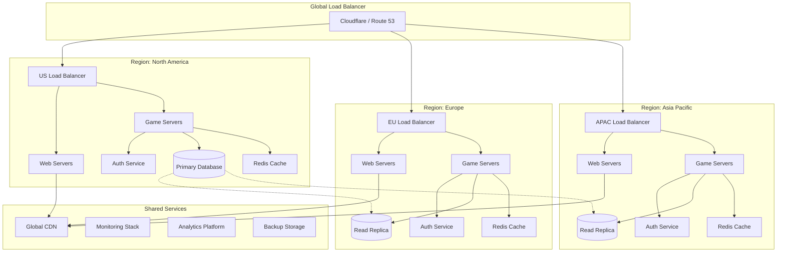

# Cloud Deployment Guides
**Scaling Matrix Online to Global Reach**

> *"Free your mind."* - Morpheus (And free your servers from physical constraints - the cloud offers infinite scalability for those who dare to embrace it.)

## 🌩️ **The Vision of Boundless Infrastructure**

The Matrix Online revival demands infrastructure that can scale dynamically, handle global player populations, and maintain the persistent world's integrity across continents. Cloud deployment transforms MXO from a single-server experience into a globally distributed, resilient, and scalable platform that honors the game's legacy while embracing modern infrastructure capabilities.

## 🏗️ **Cloud Architecture Overview**

### Multi-Cloud Strategy

```yaml
cloud_deployment_strategy:
  primary_providers:
    aws:
      strengths: ["Global reach", "Mature gaming services", "Advanced networking"]
      services: ["EC2", "RDS", "ElastiCache", "GameLift", "CloudFront"]
      regions: ["us-east-1", "eu-west-1", "ap-southeast-1"]
      
    azure:
      strengths: ["Windows ecosystem", "Active Directory integration", "PlayFab"]
      services: ["Virtual Machines", "SQL Database", "Redis Cache", "PlayFab"]
      regions: ["East US", "West Europe", "Southeast Asia"]
      
    gcp:
      strengths: ["Global network", "BigQuery analytics", "Kubernetes Engine"]
      services: ["Compute Engine", "Cloud SQL", "Memorystore", "GKE"]
      regions: ["us-central1", "europe-west1", "asia-southeast1"]
      
  hybrid_approach:
    edge_computing: "Cloudflare Workers for ultra-low latency"
    cdn_distribution: "Multi-CDN with AWS CloudFront, Azure CDN, and Cloudflare"
    database_distribution: "Read replicas across regions with master in primary zone"
    
  disaster_recovery:
    rpo_target: "15 minutes (Recovery Point Objective)"
    rto_target: "30 minutes (Recovery Time Objective)"
    backup_strategy: "Cross-region replication with automated failover"
```

### Architecture Diagram



## ☁️ **AWS Deployment Guide**

### Infrastructure as Code with Terraform

```hcl
# main.tf - AWS Matrix Online Infrastructure
terraform {
  required_version = ">= 1.0"
  required_providers {
    aws = {
      source  = "hashicorp/aws"
      version = "~> 5.0"
    }
  }
  
  backend "s3" {
    bucket = "mxo-terraform-state"
    key    = "production/terraform.tfstate"
    region = "us-east-1"
  }
}

provider "aws" {
  region = var.aws_region
  
  default_tags {
    tags = {
      Project     = "MatrixOnline"
      Environment = var.environment
      ManagedBy   = "Terraform"
    }
  }
}

# VPC and Networking
module "vpc" {
  source = "terraform-aws-modules/vpc/aws"
  
  name = "mxo-${var.environment}"
  cidr = var.vpc_cidr
  
  azs             = data.aws_availability_zones.available.names
  private_subnets = var.private_subnets
  public_subnets  = var.public_subnets
  
  enable_nat_gateway = true
  enable_vpn_gateway = false
  enable_dns_hostnames = true
  enable_dns_support = true
  
  tags = {
    Name = "MXO VPC ${var.environment}"
  }
}

# Application Load Balancer
resource "aws_lb" "mxo_alb" {
  name               = "mxo-alb-${var.environment}"
  internal           = false
  load_balancer_type = "application"
  security_groups    = [aws_security_group.alb.id]
  subnets           = module.vpc.public_subnets
  
  enable_deletion_protection = var.environment == "production"
  
  tags = {
    Name = "MXO ALB ${var.environment}"
  }
}

# Auto Scaling Group for Game Servers
resource "aws_launch_template" "game_server" {
  name_prefix   = "mxo-game-server-${var.environment}"
  image_id      = data.aws_ami.amazon_linux.id
  instance_type = var.game_server_instance_type
  
  vpc_security_group_ids = [aws_security_group.game_server.id]
  
  user_data = base64encode(templatefile("${path.module}/user_data/game_server.sh", {
    environment = var.environment
    region     = var.aws_region
    rds_endpoint = aws_db_instance.mxo_db.endpoint
    redis_endpoint = aws_elasticache_cluster.mxo_cache.cache_nodes[0].address
  }))
  
  tag_specifications {
    resource_type = "instance"
    tags = {
      Name = "MXO Game Server ${var.environment}"
      Type = "GameServer"
    }
  }
  
  lifecycle {
    create_before_destroy = true
  }
}

resource "aws_autoscaling_group" "game_servers" {
  name                = "mxo-game-servers-${var.environment}"
  vpc_zone_identifier = module.vpc.private_subnets
  target_group_arns   = [aws_lb_target_group.game_servers.arn]
  health_check_type   = "ELB"
  health_check_grace_period = 300
  
  min_size         = var.min_game_servers
  max_size         = var.max_game_servers
  desired_capacity = var.desired_game_servers
  
  launch_template {
    id      = aws_launch_template.game_server.id
    version = "$Latest"
  }
  
  # Auto scaling policies
  tag {
    key                 = "Name"
    value               = "MXO Game Server ASG ${var.environment}"
    propagate_at_launch = false
  }
}

# RDS Database
resource "aws_db_instance" "mxo_db" {
  identifier = "mxo-database-${var.environment}"
  
  engine         = "mysql"
  engine_version = "8.0"
  instance_class = var.db_instance_class
  
  allocated_storage     = var.db_allocated_storage
  max_allocated_storage = var.db_max_allocated_storage
  storage_type         = "gp3"
  storage_encrypted    = true
  
  db_name  = var.db_name
  username = var.db_username
  password = var.db_password
  
  vpc_security_group_ids = [aws_security_group.database.id]
  db_subnet_group_name   = aws_db_subnet_group.mxo.name
  
  backup_retention_period = var.environment == "production" ? 30 : 7
  backup_window          = "03:00-04:00"
  maintenance_window     = "sun:04:00-sun:05:00"
  
  skip_final_snapshot = var.environment != "production"
  deletion_protection = var.environment == "production"
  
  performance_insights_enabled = true
  monitoring_interval         = 60
  monitoring_role_arn        = aws_iam_role.rds_monitoring.arn
  
  tags = {
    Name = "MXO Database ${var.environment}"
  }
}

# ElastiCache Redis Cluster
resource "aws_elasticache_cluster" "mxo_cache" {
  cluster_id           = "mxo-cache-${var.environment}"
  engine               = "redis"
  node_type            = var.cache_node_type
  num_cache_nodes      = 1
  parameter_group_name = "default.redis7"
  port                 = 6379
  
  subnet_group_name  = aws_elasticache_subnet_group.mxo.name
  security_group_ids = [aws_security_group.cache.id]
  
  tags = {
    Name = "MXO Cache ${var.environment}"
  }
}

# CloudFront Distribution for Game Assets
resource "aws_cloudfront_distribution" "mxo_assets" {
  origin {
    domain_name = aws_s3_bucket.game_assets.bucket_regional_domain_name
    origin_id   = "S3-${aws_s3_bucket.game_assets.bucket}"
    
    s3_origin_config {
      origin_access_identity = aws_cloudfront_origin_access_identity.mxo.cloudfront_access_identity_path
    }
  }
  
  enabled             = true
  default_root_object = "index.html"
  
  default_cache_behavior {
    allowed_methods        = ["DELETE", "GET", "HEAD", "OPTIONS", "PATCH", "POST", "PUT"]
    cached_methods         = ["GET", "HEAD"]
    target_origin_id       = "S3-${aws_s3_bucket.game_assets.bucket}"
    compress               = true
    viewer_protocol_policy = "redirect-to-https"
    
    forwarded_values {
      query_string = false
      cookies {
        forward = "none"
      }
    }
    
    min_ttl     = 0
    default_ttl = 3600
    max_ttl     = 86400
  }
  
  restrictions {
    geo_restriction {
      restriction_type = "none"
    }
  }
  
  viewer_certificate {
    cloudfront_default_certificate = true
  }
  
  tags = {
    Name = "MXO Assets CDN ${var.environment}"
  }
}
```

### Auto Scaling Configuration

```bash
#!/bin/bash
# user_data/game_server.sh - Game Server Initialization Script

# Update system
yum update -y

# Install required packages
yum install -y docker htop aws-cli

# Start Docker service
systemctl start docker
systemctl enable docker

# Install Docker Compose
curl -L "https://github.com/docker/compose/releases/download/v2.20.0/docker-compose-$(uname -s)-$(uname -m)" -o /usr/local/bin/docker-compose
chmod +x /usr/local/bin/docker-compose

# Create application directory
mkdir -p /opt/mxo
cd /opt/mxo

# Download game server configuration
aws s3 cp s3://mxo-config-${environment}/game-server/ . --recursive

# Set up environment variables
cat > .env << EOF
ENVIRONMENT=${environment}
AWS_REGION=${region}
DB_HOST=${rds_endpoint}
REDIS_HOST=${redis_endpoint}
LOG_LEVEL=INFO
METRICS_ENABLED=true
EOF

# Create Docker Compose configuration
cat > docker-compose.yml << 'EOF'
version: '3.8'

services:
  game-server:
    image: mxo/game-server:latest
    ports:
      - "7000:7000"
      - "7001:7001"
    environment:
      - ENVIRONMENT=${ENVIRONMENT}
      - AWS_REGION=${AWS_REGION}
      - DB_HOST=${DB_HOST}
      - REDIS_HOST=${REDIS_HOST}
    volumes:
      - ./logs:/opt/mxo/logs
      - ./data:/opt/mxo/data
    restart: unless-stopped
    healthcheck:
      test: ["CMD", "curl", "-f", "http://localhost:7001/health"]
      interval: 30s
      timeout: 10s
      retries: 3
      start_period: 40s
  
  monitoring-agent:
    image: amazon/cloudwatch-agent:latest
    volumes:
      - ./cloudwatch-config.json:/opt/aws/amazon-cloudwatch-agent/etc/amazon-cloudwatch-agent.json
      - ./logs:/opt/mxo/logs:ro
    environment:
      - AWS_REGION=${AWS_REGION}
    restart: unless-stopped

  log-router:
    image: fluent/fluent-bit:latest
    volumes:
      - ./fluent-bit.conf:/fluent-bit/etc/fluent-bit.conf
      - ./logs:/opt/mxo/logs:ro
    environment:
      - AWS_REGION=${AWS_REGION}
    restart: unless-stopped
EOF

# Configure CloudWatch monitoring
cat > cloudwatch-config.json << 'EOF'
{
  "metrics": {
    "namespace": "MXO/GameServer",
    "metrics_collected": {
      "cpu": {
        "measurement": ["cpu_usage_idle", "cpu_usage_iowait", "cpu_usage_user", "cpu_usage_system"],
        "metrics_collection_interval": 60
      },
      "disk": {
        "measurement": ["used_percent"],
        "metrics_collection_interval": 60,
        "resources": ["*"]
      },
      "mem": {
        "measurement": ["mem_used_percent"],
        "metrics_collection_interval": 60
      },
      "netstat": {
        "measurement": ["tcp_established", "tcp_time_wait"],
        "metrics_collection_interval": 60
      }
    }
  },
  "logs": {
    "logs_collected": {
      "files": {
        "collect_list": [
          {
            "file_path": "/opt/mxo/logs/game-server.log",
            "log_group_name": "/aws/ec2/mxo/game-server",
            "log_stream_name": "{instance_id}",
            "timezone": "UTC"
          }
        ]
      }
    }
  }
}
EOF

# Start services
docker-compose up -d

# Configure auto-start on boot
cat > /etc/systemd/system/mxo-game-server.service << 'EOF'
[Unit]
Description=Matrix Online Game Server
Requires=docker.service
After=docker.service

[Service]
Type=oneshot
RemainAfterExit=yes
WorkingDirectory=/opt/mxo
ExecStart=/usr/local/bin/docker-compose up -d
ExecStop=/usr/local/bin/docker-compose down
TimeoutStartSec=0

[Install]
WantedBy=multi-user.target
EOF

systemctl enable mxo-game-server.service

# Signal Auto Scaling Group that instance is ready
INSTANCE_ID=$(curl -s http://169.254.169.254/latest/meta-data/instance-id)
aws autoscaling complete-lifecycle-action \
    --lifecycle-action-result CONTINUE \
    --instance-id $INSTANCE_ID \
    --lifecycle-hook-name game-server-launch-hook \
    --auto-scaling-group-name mxo-game-servers-${environment} \
    --region ${region}
```

## 🔄 **Containerization Strategy**

### Docker Configuration

```dockerfile
# Dockerfile.gameserver - Matrix Online Game Server
FROM ubuntu:22.04

# Install system dependencies
RUN apt-get update && apt-get install -y \
    build-essential \
    cmake \
    libssl-dev \
    libmysqlclient-dev \
    libredis-dev \
    libyaml-dev \
    curl \
    htop \
    && rm -rf /var/lib/apt/lists/*

# Create application user
RUN useradd -m -u 1000 mxo && \
    mkdir -p /opt/mxo && \
    chown -R mxo:mxo /opt/mxo

# Set working directory
WORKDIR /opt/mxo

# Copy application files
COPY --chown=mxo:mxo ./server /opt/mxo/server
COPY --chown=mxo:mxo ./config /opt/mxo/config
COPY --chown=mxo:mxo ./scripts /opt/mxo/scripts

# Build game server
RUN cd server && \
    mkdir build && \
    cd build && \
    cmake .. -DCMAKE_BUILD_TYPE=Release && \
    make -j$(nproc) && \
    chmod +x mxo-server

# Create required directories
RUN mkdir -p /opt/mxo/logs /opt/mxo/data /opt/mxo/backups && \
    chown -R mxo:mxo /opt/mxo

# Switch to application user
USER mxo

# Expose ports
EXPOSE 7000 7001 7777

# Health check
HEALTHCHECK --interval=30s --timeout=10s --start-period=60s --retries=3 \
    CMD curl -f http://localhost:7001/health || exit 1

# Start game server
CMD ["/opt/mxo/server/build/mxo-server", "--config", "/opt/mxo/config/production.yml"]
```

### Multi-Stage Build for Optimization

```dockerfile
# Dockerfile.optimized - Optimized multi-stage build
FROM ubuntu:22.04 AS builder

# Install build dependencies
RUN apt-get update && apt-get install -y \
    build-essential \
    cmake \
    git \
    libssl-dev \
    libmysqlclient-dev \
    libredis-dev \
    libyaml-dev \
    && rm -rf /var/lib/apt/lists/*

# Copy source code
COPY ./src /src
WORKDIR /src

# Build application with optimizations
RUN mkdir build && cd build && \
    cmake .. \
        -DCMAKE_BUILD_TYPE=Release \
        -DCMAKE_CXX_FLAGS="-O3 -march=native -DNDEBUG" \
        -DCMAKE_INTERPROCEDURAL_OPTIMIZATION=ON && \
    make -j$(nproc)

# Runtime stage
FROM ubuntu:22.04 AS runtime

# Install only runtime dependencies
RUN apt-get update && apt-get install -y \
    libssl3 \
    libmysqlclient21 \
    libhiredis0.14 \
    libyaml-0-2 \
    curl \
    ca-certificates \
    && rm -rf /var/lib/apt/lists/* \
    && apt-get clean

# Create non-root user
RUN useradd -m -u 1000 mxo

# Copy built application from builder stage
COPY --from=builder --chown=mxo:mxo /src/build/mxo-server /usr/local/bin/
COPY --from=builder --chown=mxo:mxo /src/config /opt/mxo/config

# Create required directories
RUN mkdir -p /opt/mxo/{logs,data,backups} && \
    chown -R mxo:mxo /opt/mxo

USER mxo

# Runtime configuration
EXPOSE 7000 7001 7777
WORKDIR /opt/mxo

HEALTHCHECK --interval=30s --timeout=10s --start-period=60s --retries=3 \
    CMD curl -f http://localhost:7001/health || exit 1

ENTRYPOINT ["/usr/local/bin/mxo-server"]
CMD ["--config", "/opt/mxo/config/production.yml"]
```

## 🌍 **Global Distribution Strategy**

### Geographic Load Balancing

```yaml
# cloudflare-config.yml - Global Load Balancing Configuration
global_load_balancing:
  pools:
    us_east_pool:
      name: "US East Game Servers"
      origins:
        - name: "aws-us-east-1a"
          address: "us-east-game-1.mxo.cloud"
          weight: 1.0
          health_check: true
        - name: "aws-us-east-1b"
          address: "us-east-game-2.mxo.cloud"
          weight: 1.0
          health_check: true
      health_check:
        type: "HTTPS"
        method: "GET"
        path: "/health"
        expected_codes: "200"
        interval: 30
        timeout: 5
        retries: 2
        
    eu_west_pool:
      name: "EU West Game Servers"
      origins:
        - name: "aws-eu-west-1a"
          address: "eu-west-game-1.mxo.cloud"
          weight: 1.0
          health_check: true
        - name: "azure-eu-west-1"
          address: "eu-west-game-2.mxo.cloud"
          weight: 1.0
          health_check: true
          
    asia_pool:
      name: "Asia Pacific Game Servers"
      origins:
        - name: "gcp-asia-southeast1"
          address: "asia-game-1.mxo.cloud"
          weight: 1.0
          health_check: true
        - name: "aws-ap-southeast-1"
          address: "asia-game-2.mxo.cloud"
          weight: 1.0
          health_check: true

  load_balancers:
    game_traffic:
      name: "MXO Game Traffic"
      fallback_pool: "us_east_pool"
      region_pools:
        - region: "WNAM"  # Western North America
          pool: "us_east_pool"
        - region: "ENAM"  # Eastern North America
          pool: "us_east_pool"
        - region: "WEU"   # Western Europe
          pool: "eu_west_pool"
        - region: "EEU"   # Eastern Europe
          pool: "eu_west_pool"
        - region: "SEAS"  # Southeast Asia
          pool: "asia_pool"
        - region: "NEAS"  # Northeast Asia
          pool: "asia_pool"
      
      steering_policy: "geo"
      proximity_bias: "optimal_latency"
      session_affinity: "cookie"
      session_affinity_ttl: 3600
```

### CDN Configuration

```javascript
// cloudflare-workers.js - Edge Computing for Game Assets
export default {
  async fetch(request, env) {
    const url = new URL(request.url);
    const cache = caches.default;
    
    // Check if this is a game asset request
    if (url.pathname.startsWith('/assets/')) {
      return handleAssetRequest(request, cache, env);
    }
    
    // Handle API requests
    if (url.pathname.startsWith('/api/')) {
      return handleAPIRequest(request, env);
    }
    
    // Default handling
    return fetch(request);
  }
};

async function handleAssetRequest(request, cache, env) {
  const cacheKey = new Request(request.url, request);
  let response = await cache.match(cacheKey);
  
  if (!response) {
    // Asset not in cache, fetch from origin
    response = await fetch(request);
    
    if (response.status === 200) {
      // Clone response for caching
      const responseToCache = response.clone();
      
      // Set cache headers based on asset type
      const headers = new Headers(responseToCache.headers);
      const url = new URL(request.url);
      const extension = url.pathname.split('.').pop().toLowerCase();
      
      switch (extension) {
        case 'jpg':
        case 'jpeg':
        case 'png':
        case 'webp':
          headers.set('Cache-Control', 'public, max-age=31536000'); // 1 year
          break;
        case 'js':
        case 'css':
          headers.set('Cache-Control', 'public, max-age=86400'); // 1 day
          break;
        case 'json':
        case 'xml':
          headers.set('Cache-Control', 'public, max-age=3600'); // 1 hour
          break;
        default:
          headers.set('Cache-Control', 'public, max-age=1800'); // 30 minutes
      }
      
      // Add CORS headers for game assets
      headers.set('Access-Control-Allow-Origin', '*');
      headers.set('Access-Control-Allow-Methods', 'GET, HEAD, OPTIONS');
      
      const cachedResponse = new Response(responseToCache.body, {
        status: responseToCache.status,
        statusText: responseToCache.statusText,
        headers: headers
      });
      
      // Cache the response
      await cache.put(cacheKey, cachedResponse.clone());
      return cachedResponse;
    }
  }
  
  return response;
}

async function handleAPIRequest(request, env) {
  const url = new URL(request.url);
  
  // Route to nearest game server based on CF-IPCountry header
  const country = request.headers.get('CF-IPCountry');
  const serverRegion = getOptimalServerRegion(country);
  
  // Modify request to point to optimal server
  const optimizedURL = new URL(request.url);
  optimizedURL.hostname = `${serverRegion}.mxo.cloud`;
  
  const optimizedRequest = new Request(optimizedURL, {
    method: request.method,
    headers: request.headers,
    body: request.body
  });
  
  // Add geolocation information
  optimizedRequest.headers.set('X-Original-Country', country);
  optimizedRequest.headers.set('X-Edge-Region', serverRegion);
  
  return fetch(optimizedRequest);
}

function getOptimalServerRegion(country) {
  const regionMapping = {
    'US': 'us-east',
    'CA': 'us-east',
    'MX': 'us-east',
    'GB': 'eu-west',
    'FR': 'eu-west',
    'DE': 'eu-west',
    'IT': 'eu-west',
    'ES': 'eu-west',
    'NL': 'eu-west',
    'JP': 'asia-northeast',
    'KR': 'asia-northeast',
    'CN': 'asia-northeast',
    'SG': 'asia-southeast',
    'AU': 'asia-southeast',
    'IN': 'asia-southeast'
  };
  
  return regionMapping[country] || 'us-east'; // Default fallback
}
```

## 📊 **Monitoring and Observability**

### Comprehensive Monitoring Stack

```yaml
# monitoring-stack.yml - Docker Compose for Monitoring
version: '3.8'

services:
  prometheus:
    image: prom/prometheus:latest
    container_name: prometheus
    ports:
      - "9090:9090"
    volumes:
      - ./prometheus.yml:/etc/prometheus/prometheus.yml
      - prometheus_data:/prometheus
    command:
      - '--config.file=/etc/prometheus/prometheus.yml'
      - '--storage.tsdb.path=/prometheus'
      - '--web.console.libraries=/etc/prometheus/console_libraries'
      - '--web.console.templates=/etc/prometheus/consoles'
      - '--storage.tsdb.retention.time=200h'
      - '--web.enable-lifecycle'
    restart: unless-stopped

  grafana:
    image: grafana/grafana:latest
    container_name: grafana
    ports:
      - "3000:3000"
    environment:
      - GF_SECURITY_ADMIN_PASSWORD=mxo_secure_password
      - GF_USERS_ALLOW_SIGN_UP=false
    volumes:
      - grafana_data:/var/lib/grafana
      - ./grafana/provisioning:/etc/grafana/provisioning
    restart: unless-stopped

  loki:
    image: grafana/loki:latest
    container_name: loki
    ports:
      - "3100:3100"
    volumes:
      - ./loki-config.yml:/etc/loki/local-config.yaml
      - loki_data:/loki
    command: -config.file=/etc/loki/local-config.yaml
    restart: unless-stopped

  promtail:
    image: grafana/promtail:latest
    container_name: promtail
    volumes:
      - ./promtail-config.yml:/etc/promtail/config.yml
      - /var/log:/var/log:ro
      - /opt/mxo/logs:/opt/mxo/logs:ro
    command: -config.file=/etc/promtail/config.yml
    restart: unless-stopped

  jaeger:
    image: jaegertracing/all-in-one:latest
    container_name: jaeger
    ports:
      - "16686:16686"
      - "14268:14268"
    environment:
      - COLLECTOR_OTLP_ENABLED=true
    restart: unless-stopped

  node-exporter:
    image: prom/node-exporter:latest
    container_name: node-exporter
    ports:
      - "9100:9100"
    volumes:
      - /proc:/host/proc:ro
      - /sys:/host/sys:ro
      - /:/rootfs:ro
    command:
      - '--path.procfs=/host/proc'
      - '--path.rootfs=/rootfs'
      - '--path.sysfs=/host/sys'
      - '--collector.filesystem.mount-points-exclude=^/(sys|proc|dev|host|etc)($$|/)'
    restart: unless-stopped

  alertmanager:
    image: prom/alertmanager:latest
    container_name: alertmanager
    ports:
      - "9093:9093"
    volumes:
      - ./alertmanager.yml:/etc/alertmanager/alertmanager.yml
      - alertmanager_data:/alertmanager
    restart: unless-stopped

volumes:
  prometheus_data:
  grafana_data:
  loki_data:
  alertmanager_data:
```

### Custom Game Metrics

```go
// metrics.go - Custom Prometheus Metrics for Matrix Online
package metrics

import (
    "github.com/prometheus/client_golang/prometheus"
    "github.com/prometheus/client_golang/prometheus/promauto"
)

var (
    // Player metrics
    PlayersOnline = promauto.NewGaugeVec(
        prometheus.GaugeOpts{
            Name: "mxo_players_online_total",
            Help: "Current number of players online",
        },
        []string{"region", "server", "district"},
    )
    
    PlayerConnections = promauto.NewCounterVec(
        prometheus.CounterOpts{
            Name: "mxo_player_connections_total",
            Help: "Total number of player connections",
        },
        []string{"region", "server", "result"},
    )
    
    PlayerLatency = promauto.NewHistogramVec(
        prometheus.HistogramOpts{
            Name:    "mxo_player_latency_seconds",
            Help:    "Player connection latency distribution",
            Buckets: []float64{0.001, 0.005, 0.01, 0.025, 0.05, 0.1, 0.25, 0.5, 1.0},
        },
        []string{"region", "server"},
    )
    
    // Game mechanics metrics
    CombatEvents = promauto.NewCounterVec(
        prometheus.CounterOpts{
            Name: "mxo_combat_events_total",
            Help: "Total number of combat events",
        },
        []string{"type", "outcome", "district"},
    )
    
    AbilityUsage = promauto.NewCounterVec(
        prometheus.CounterOpts{
            Name: "mxo_ability_usage_total",
            Help: "Total number of ability uses",
        },
        []string{"ability", "tree", "success"},
    )
    
    MissionCompletion = promauto.NewCounterVec(
        prometheus.CounterOpts{
            Name: "mxo_mission_completions_total",
            Help: "Total number of mission completions",
        },
        []string{"mission_type", "difficulty", "outcome"},
    )
    
    // Infrastructure metrics
    DatabaseQueries = promauto.NewCounterVec(
        prometheus.CounterOpts{
            Name: "mxo_database_queries_total",
            Help: "Total number of database queries",
        },
        []string{"operation", "table", "result"},
    )
    
    DatabaseLatency = promauto.NewHistogramVec(
        prometheus.HistogramOpts{
            Name:    "mxo_database_query_duration_seconds",
            Help:    "Database query duration distribution",
            Buckets: []float64{0.001, 0.005, 0.01, 0.025, 0.05, 0.1, 0.25, 0.5, 1.0, 2.5, 5.0},
        },
        []string{"operation", "table"},
    )
    
    CacheHitRate = promauto.NewGaugeVec(
        prometheus.GaugeOpts{
            Name: "mxo_cache_hit_rate",
            Help: "Cache hit rate percentage",
        },
        []string{"cache_type", "region"},
    )
    
    // Business metrics
    PlayerRetention = promauto.NewGaugeVec(
        prometheus.GaugeOpts{
            Name: "mxo_player_retention_rate",
            Help: "Player retention rate percentage",
        },
        []string{"timeframe", "cohort"},
    )
    
    RevenueMetrics = promauto.NewCounterVec(
        prometheus.CounterOpts{
            Name: "mxo_revenue_total",
            Help: "Total revenue generated",
        },
        []string{"source", "currency"},
    )
)

// Helper functions for updating metrics
func UpdatePlayersOnline(region, server, district string, count float64) {
    PlayersOnline.WithLabelValues(region, server, district).Set(count)
}

func RecordPlayerConnection(region, server, result string) {
    PlayerConnections.WithLabelValues(region, server, result).Inc()
}

func RecordPlayerLatency(region, server string, latency float64) {
    PlayerLatency.WithLabelValues(region, server).Observe(latency)
}

func RecordCombatEvent(eventType, outcome, district string) {
    CombatEvents.WithLabelValues(eventType, outcome, district).Inc()
}

func RecordAbilityUsage(ability, tree, success string) {
    AbilityUsage.WithLabelValues(ability, tree, success).Inc()
}

func RecordMissionCompletion(missionType, difficulty, outcome string) {
    MissionCompletion.WithLabelValues(missionType, difficulty, outcome).Inc()
}

func RecordDatabaseQuery(operation, table, result string, duration float64) {
    DatabaseQueries.WithLabelValues(operation, table, result).Inc()
    DatabaseLatency.WithLabelValues(operation, table).Observe(duration)
}

func UpdateCacheHitRate(cacheType, region string, hitRate float64) {
    CacheHitRate.WithLabelValues(cacheType, region).Set(hitRate)
}
```

## 🔒 **Security & Compliance**

### Infrastructure Security

```yaml
security_configurations:
  network_security:
    vpc_isolation: "Complete network isolation between environments"
    security_groups: "Principle of least privilege access"
    nacls: "Additional layer of network filtering"
    vpn_access: "Secure administrative access only"
    
  data_protection:
    encryption_at_rest: "AES-256 encryption for all storage"
    encryption_in_transit: "TLS 1.3 for all communications"
    key_management: "AWS KMS / Azure Key Vault rotation"
    backup_encryption: "Encrypted backup storage"
    
  access_control:
    iam_roles: "Role-based access with MFA requirement"
    service_accounts: "Dedicated service accounts per component"
    secrets_management: "HashiCorp Vault / AWS Secrets Manager"
    audit_logging: "Comprehensive access and action logging"
    
  compliance:
    gdpr_compliance: "Data protection and user rights management"
    coppa_compliance: "Child privacy protection measures"
    pci_compliance: "Payment card data security (if applicable)"
    regular_audits: "Quarterly security assessments"

  incident_response:
    monitoring: "24/7 security monitoring with SIEM"
    alerting: "Real-time security incident alerting"
    response_team: "Dedicated incident response procedures"
    forensics: "Log retention and forensic capabilities"
```

## Remember

> *"The Matrix is everywhere. It is all around us."* - Morpheus

Cloud deployment isn't just about moving servers online - it's about creating a Matrix that can scale infinitely, adapt to global demand, and provide a seamless experience regardless of where in the world players are jacking in. Every optimization brings us closer to a truly global, persistent virtual world.

The cloud gives us the power to create something that was impossible in 2005: a Matrix Online that can grow with its community, scale to meet demand, and evolve without the constraints of physical hardware.

**Deploy with vision. Scale with purpose. Build the infinite Matrix.**

---

**Guide Status**: 🟢 COMPREHENSIVE DEPLOYMENT  
**Scalability**: ☁️ INFINITE POTENTIAL  
**Liberation Impact**: ⭐⭐⭐⭐⭐  

*In the cloud we find freedom. In scalability we find growth. In global deployment we find the true Matrix - everywhere and nowhere.*

---

[← Development Hub](index.md) | [← Performance Optimization](performance-optimization-guide.md) | [→ Kubernetes Orchestration](kubernetes-orchestration-guide.md)