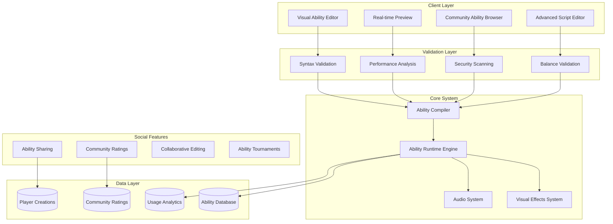

# Custom Ability Creation System
**Empowering Players to Bend the Rules of the Matrix**

> *"Do not try and bend the spoon. That's impossible. Instead... only try to realize the truth... there is no spoon."* - Spoon Boy (And there are no limits to what abilities can be created when you understand that rules are merely suggestions.)

## 🎯 **The Vision of Infinite Possibility**

The Matrix Online revival demands a system where players aren't limited to predefined abilities, but can create, modify, and share their own powers within the digital realm. This comprehensive guide presents a custom ability creation system that allows players to become architects of their own reality, crafting abilities that reflect their unique understanding of the Matrix.

## 🧠 **Philosophical Foundation**

### The Nature of Digital Abilities

```yaml
ability_philosophy:
  core_principles:
    creativity_unlimited: "No artificial constraints on imagination"
    balance_through_cost: "Powerful abilities require significant resources"
    emergent_gameplay: "Player creations drive new experiences"
    community_driven: "Sharing and iteration improve all abilities"
    
  matrix_metaphors:
    code_manipulation: "Abilities modify the Matrix's underlying code"
    reality_bending: "Each ability changes local physics rules"
    consciousness_expansion: "Power reflects understanding depth"
    collective_knowledge: "Shared abilities strengthen the community"
    
  design_constraints:
    performance_limits: "Abilities must not break server performance"
    narrative_consistency: "Powers should fit Matrix lore"
    player_agency: "No ability should remove another's choice"
    progressive_complexity: "Simple creation, advanced mastery"
```

## 🏗️ **Architecture Overview**

### Component System Design



## 🎨 **Visual Ability Editor**

### Node-Based Creation Interface

```typescript
// ability-editor/visual-editor.tsx - Visual ability creation interface
import React, { useState, useCallback, useRef } from 'react';
import { ReactFlow, Node, Edge, addEdge, useNodesState, useEdgesState } from 'reactflow';
import 'reactflow/dist/style.css';

interface AbilityNode extends Node {
    data: {
        type: NodeType;
        properties: NodeProperties;
        validation: ValidationState;
    };
}

enum NodeType {
    Trigger = 'trigger',
    Condition = 'condition',
    Action = 'action',
    Effect = 'effect',
    Variable = 'variable',
    Logic = 'logic',
    Target = 'target',
    Resource = 'resource'
}

interface NodeProperties {
    [key: string]: any;
    name: string;
    description: string;
    icon: string;
    parameters: Parameter[];
}

interface Parameter {
    name: string;
    type: ParameterType;
    value: any;
    constraints: Constraints;
    description: string;
}

interface AbilityCreationState {
    metadata: AbilityMetadata;
    nodes: AbilityNode[];
    edges: Edge[];
    validation: ValidationResult;
    preview: PreviewState;
}

const VisualAbilityEditor: React.FC = () => {
    const [nodes, setNodes, onNodesChange] = useNodesState([]);
    const [edges, setEdges, onEdgesChange] = useEdgesState([]);
    const [selectedNodeType, setSelectedNodeType] = useState<NodeType>(NodeType.Trigger);
    const [abilityMetadata, setAbilityMetadata] = useState<AbilityMetadata>({
        name: '',
        description: '',
        category: AbilityCategory.Combat,
        tags: [],
        author: '',
        version: '1.0.0'
    });
    
    const nodeTypes = {
        trigger: TriggerNode,
        condition: ConditionNode,
        action: ActionNode,
        effect: EffectNode,
        variable: VariableNode,
        logic: LogicNode,
        target: TargetNode,
        resource: ResourceNode
    };
    
    const onConnect = useCallback((params: Connection) => {
        const newEdge = {
            ...params,
            id: `edge-${Date.now()}`,
            animated: true,
            style: { stroke: '#00ff41', strokeWidth: 2 }
        };
        setEdges((eds) => addEdge(newEdge, eds));
    }, [setEdges]);
    
    const addNode = useCallback((type: NodeType) => {
        const newNode: AbilityNode = {
            id: `node-${Date.now()}`,
            type: type,
            position: { x: Math.random() * 400, y: Math.random() * 400 },
            data: {
                type: type,
                properties: getDefaultProperties(type),
                validation: { isValid: true, errors: [] }
            }
        };
        
        setNodes((nds) => [...nds, newNode]);
    }, [setNodes]);
    
    const validateAbility = useCallback(async () => {
        const ability = {
            metadata: abilityMetadata,
            nodes: nodes,
            edges: edges
        };
        
        const validation = await validateAbilityGraph(ability);
        return validation;
    }, [abilityMetadata, nodes, edges]);
    
    const previewAbility = useCallback(async () => {
        const validation = await validateAbility();
        if (!validation.isValid) {
            showValidationErrors(validation.errors);
            return;
        }
        
        const compiledAbility = await compileAbility({
            metadata: abilityMetadata,
            nodes: nodes,
            edges: edges
        });
        
        // Show preview in game world
        triggerAbilityPreview(compiledAbility);
    }, [validateAbility, abilityMetadata, nodes, edges]);
    
    return (
        <div className="ability-editor">
            <div className="editor-header">
                <AbilityMetadataPanel 
                    metadata={abilityMetadata}
                    onChange={setAbilityMetadata}
                />
                <div className="editor-actions">
                    <button onClick={validateAbility} className="validate-btn">
                        Validate
                    </button>
                    <button onClick={previewAbility} className="preview-btn">
                        Preview
                    </button>
                    <button onClick={saveAbility} className="save-btn">
                        Save
                    </button>
                </div>
            </div>
            
            <div className="editor-content">
                <div className="node-palette">
                    <NodePalette 
                        selectedType={selectedNodeType}
                        onTypeSelect={setSelectedNodeType}
                        onAddNode={addNode}
                    />
                </div>
                
                <div className="flow-editor">
                    <ReactFlow
                        nodes={nodes}
                        edges={edges}
                        onNodesChange={onNodesChange}
                        onEdgesChange={onEdgesChange}
                        onConnect={onConnect}
                        nodeTypes={nodeTypes}
                        fitView
                        className="matrix-flow"
                    >
                        <Background color="#001100" gap={20} />
                        <Controls />
                        <MiniMap 
                            nodeColor="#00ff41"
                            maskColor="rgba(0, 17, 34, 0.8)"
                        />
                    </ReactFlow>
                </div>
                
                <div className="properties-panel">
                    <NodePropertiesPanel 
                        selectedNode={getSelectedNode(nodes)}
                        onPropertiesChange={updateNodeProperties}
                    />
                </div>
            </div>
        </div>
    );
};

// Custom node components
const TriggerNode: React.FC<NodeProps> = ({ data, selected }) => {
    return (
        <div className={`custom-node trigger-node ${selected ? 'selected' : ''}`}>
            <div className="node-header">
                <span className="node-icon">⚡</span>
                <span className="node-title">Trigger</span>
            </div>
            <div className="node-content">
                <div className="node-property">
                    <label>Event Type:</label>
                    <select value={data.properties.eventType} onChange={handlePropertyChange}>
                        <option value="keypress">Key Press</option>
                        <option value="combat_start">Combat Start</option>
                        <option value="health_low">Health Low</option>
                        <option value="target_acquired">Target Acquired</option>
                        <option value="timer">Timer</option>
                    </select>
                </div>
            </div>
            <Handle type="source" position={Position.Right} />
        </div>
    );
};

const ActionNode: React.FC<NodeProps> = ({ data, selected }) => {
    return (
        <div className={`custom-node action-node ${selected ? 'selected' : ''}`}>
            <div className="node-header">
                <span className="node-icon">🎯</span>
                <span className="node-title">Action</span>
            </div>
            <div className="node-content">
                <div className="node-property">
                    <label>Action Type:</label>
                    <select value={data.properties.actionType}>
                        <option value="damage">Deal Damage</option>
                        <option value="heal">Heal</option>
                        <option value="teleport">Teleport</option>
                        <option value="spawn_object">Spawn Object</option>
                        <option value="modify_stats">Modify Stats</option>
                        <option value="apply_effect">Apply Effect</option>
                    </select>
                </div>
                <div className="node-property">
                    <label>Magnitude:</label>
                    <input 
                        type="number" 
                        value={data.properties.magnitude}
                        min="1"
                        max="1000"
                    />
                </div>
            </div>
            <Handle type="target" position={Position.Left} />
            <Handle type="source" position={Position.Right} />
        </div>
    );
};

const EffectNode: React.FC<NodeProps> = ({ data, selected }) => {
    return (
        <div className={`custom-node effect-node ${selected ? 'selected' : ''}`}>
            <div className="node-header">
                <span className="node-icon">✨</span>
                <span className="node-title">Visual Effect</span>
            </div>
            <div className="node-content">
                <div className="node-property">
                    <label>Effect Type:</label>
                    <select value={data.properties.effectType}>
                        <option value="particle_burst">Particle Burst</option>
                        <option value="energy_wave">Energy Wave</option>
                        <option value="matrix_code">Matrix Code</option>
                        <option value="lightning">Lightning</option>
                        <option value="portal">Portal</option>
                        <option value="custom">Custom</option>
                    </select>
                </div>
                <div className="node-property">
                    <label>Color:</label>
                    <input type="color" value={data.properties.color} />
                </div>
                <div className="node-property">
                    <label>Duration (ms):</label>
                    <input 
                        type="number" 
                        value={data.properties.duration}
                        min="100"
                        max="10000"
                    />
                </div>
            </div>
            <Handle type="target" position={Position.Left} />
        </div>
    );
};
```

### Advanced Script Editor

```typescript
// ability-editor/script-editor.tsx - Advanced scripting interface
import React, { useState, useRef, useEffect } from 'react';
import Monaco from '@monaco-editor/react';

interface ScriptEditorProps {
    initialScript: string;
    onScriptChange: (script: string) => void;
    language: 'javascript' | 'lua' | 'python';
}

const ScriptEditor: React.FC<ScriptEditorProps> = ({ 
    initialScript, 
    onScriptChange, 
    language 
}) => {
    const [script, setScript] = useState(initialScript);
    const [syntaxErrors, setSyntaxErrors] = useState<SyntaxError[]>([]);
    const [autocompletion, setAutocompletion] = useState<AutocompletionItem[]>([]);
    const editorRef = useRef(null);
    
    useEffect(() => {
        // Configure Monaco editor for Matrix Online ability scripting
        monaco.languages.typescript.javascriptDefaults.setCompilerOptions({
            target: monaco.languages.typescript.ScriptTarget.ES2020,
            allowNonTsExtensions: true,
        });
        
        // Add Matrix Online API definitions
        monaco.languages.typescript.javascriptDefaults.addExtraLib(`
            declare namespace MXO {
                interface Player {
                    id: string;
                    name: string;
                    level: number;
                    health: number;
                    innerStrength: number;
                    position: Vector3;
                    faction: Faction;
                    
                    dealDamage(amount: number, type: DamageType): void;
                    heal(amount: number): void;
                    teleport(position: Vector3): void;
                    applyStatusEffect(effect: StatusEffect): void;
                    hasAbility(abilityId: string): boolean;
                    getDistance(target: Player): number;
                }
                
                interface Vector3 {
                    x: number;
                    y: number;
                    z: number;
                }
                
                interface AbilityContext {
                    caster: Player;
                    target?: Player;
                    position?: Vector3;
                    triggerEvent: string;
                    gameTime: number;
                    deltaTime: number;
                }
                
                interface AbilityAPI {
                    createEffect(type: string, position: Vector3, duration: number): void;
                    playSound(soundId: string, position?: Vector3): void;
                    spawnObject(prefabId: string, position: Vector3): GameObject;
                    raycast(origin: Vector3, direction: Vector3, maxDistance: number): RaycastHit[];
                    findPlayersInRadius(center: Vector3, radius: number): Player[];
                    log(message: string): void;
                }
                
                const API: AbilityAPI;
                const Context: AbilityContext;
            }
            
            // Ability execution function signature
            declare function execute(context: MXO.AbilityContext): Promise<void>;
        `, 'mxo-api.d.ts');
        
    }, []);
    
    const handleEditorDidMount = (editor: any, monaco: any) => {
        editorRef.current = editor;
        
        // Custom theme for Matrix aesthetic
        monaco.editor.defineTheme('matrix-theme', {
            base: 'vs-dark',
            inherit: true,
            rules: [
                { token: 'keyword', foreground: '00ff41', fontStyle: 'bold' },
                { token: 'string', foreground: '41ff00' },
                { token: 'number', foreground: '00ffff' },
                { token: 'comment', foreground: '008800', fontStyle: 'italic' },
                { token: 'function', foreground: 'ffff00' },
            ],
            colors: {
                'editor.background': '#000011',
                'editor.foreground': '#00ff41',
                'editorCursor.foreground': '#00ff41',
                'editor.lineHighlightBackground': '#001122',
                'editorLineNumber.foreground': '#004400',
                'editor.selectionBackground': '#003300',
            }
        });
        
        monaco.editor.setTheme('matrix-theme');
        
        // Enable real-time validation
        editor.onDidChangeModelContent(() => {
            const value = editor.getValue();
            setScript(value);
            onScriptChange(value);
            validateScript(value);
        });
    };
    
    const validateScript = async (scriptContent: string) => {
        try {
            // Syntax validation
            const syntaxResult = await validateSyntax(scriptContent, language);
            setSyntaxErrors(syntaxResult.errors);
            
            // Semantic validation
            const semanticResult = await validateSemantics(scriptContent);
            
            // Performance analysis
            const performanceResult = await analyzePerformance(scriptContent);
            
            // Update editor markers
            updateEditorMarkers(syntaxResult.errors, semanticResult.warnings, performanceResult.suggestions);
            
        } catch (error) {
            console.error('Validation error:', error);
        }
    };
    
    const insertTemplate = (templateType: string) => {
        const templates = {
            'damage_ability': `
// Damage Ability Template
async function execute(context) {
    const { caster, target } = context;
    
    if (!target) {
        MXO.API.log("No target selected");
        return;
    }
    
    // Check if target is in range
    const distance = caster.getDistance(target);
    if (distance > 10) {
        MXO.API.log("Target too far away");
        return;
    }
    
    // Create visual effect
    MXO.API.createEffect("energy_blast", target.position, 1500);
    
    // Deal damage
    const damage = 50 + (caster.level * 2);
    target.dealDamage(damage, "energy");
    
    MXO.API.log(\`Dealt \${damage} damage to \${target.name}\`);
}
            `,
            'teleport_ability': `
// Teleport Ability Template  
async function execute(context) {
    const { caster, position } = context;
    
    if (!position) {
        MXO.API.log("No target position");
        return;
    }
    
    // Check teleport distance
    const currentPos = caster.position;
    const distance = Math.sqrt(
        Math.pow(position.x - currentPos.x, 2) +
        Math.pow(position.y - currentPos.y, 2) +
        Math.pow(position.z - currentPos.z, 2)
    );
    
    const maxDistance = 20 + (caster.level * 0.5);
    if (distance > maxDistance) {
        MXO.API.log("Teleport distance too far");
        return;
    }
    
    // Create teleport effects
    MXO.API.createEffect("teleport_out", currentPos, 1000);
    await new Promise(resolve => setTimeout(resolve, 500));
    
    // Teleport player
    caster.teleport(position);
    
    MXO.API.createEffect("teleport_in", position, 1000);
    MXO.API.playSound("teleport", position);
}
            `,
            'area_effect': `
// Area Effect Ability Template
async function execute(context) {
    const { caster, position } = context;
    
    const targetPos = position || caster.position;
    const radius = 5 + (caster.level * 0.2);
    
    // Find all players in radius
    const targets = MXO.API.findPlayersInRadius(targetPos, radius);
    
    // Create area effect visual
    MXO.API.createEffect("area_explosion", targetPos, 2000);
    MXO.API.playSound("explosion", targetPos);
    
    // Apply effect to all targets
    for (const target of targets) {
        if (target.id !== caster.id) {
            // Deal damage or apply effect
            const damage = 30 + (caster.level * 1.5);
            target.dealDamage(damage, "explosion");
            
            // Knockback effect
            const direction = {
                x: target.position.x - targetPos.x,
                y: target.position.y - targetPos.y,
                z: target.position.z - targetPos.z
            };
            
            // Normalize and apply knockback
            const length = Math.sqrt(direction.x ** 2 + direction.y ** 2 + direction.z ** 2);
            if (length > 0) {
                const knockbackDistance = 3;
                target.teleport({
                    x: target.position.x + (direction.x / length) * knockbackDistance,
                    y: target.position.y + (direction.y / length) * knockbackDistance,
                    z: target.position.z + (direction.z / length) * knockbackDistance
                });
            }
        }
    }
    
    MXO.API.log(\`Area effect hit \${targets.length - 1} targets\`);
}
            `
        };
        
        const template = templates[templateType as keyof typeof templates];
        if (template && editorRef.current) {
            editorRef.current.setValue(template);
        }
    };
    
    return (
        <div className="script-editor">
            <div className="editor-toolbar">
                <div className="template-buttons">
                    <button onClick={() => insertTemplate('damage_ability')}>
                        Damage Template
                    </button>
                    <button onClick={() => insertTemplate('teleport_ability')}>
                        Teleport Template
                    </button>
                    <button onClick={() => insertTemplate('area_effect')}>
                        Area Effect Template
                    </button>
                </div>
                
                <div className="editor-actions">
                    <button onClick={validateScript}>Validate</button>
                    <button onClick={formatScript}>Format</button>
                    <button onClick={optimizeScript}>Optimize</button>
                </div>
            </div>
            
            <Monaco
                height="600px"
                language={language}
                value={script}
                onMount={handleEditorDidMount}
                options={{
                    theme: 'matrix-theme',
                    fontSize: 14,
                    minimap: { enabled: true },
                    scrollBeyondLastLine: false,
                    automaticLayout: true,
                    tabSize: 2,
                    insertSpaces: true,
                    wordWrap: 'on',
                    lineNumbers: 'on',
                    glyphMargin: true,
                    folding: true,
                    lineDecorationsWidth: 10,
                    lineNumbersMinChars: 3,
                }}
            />
            
            {syntaxErrors.length > 0 && (
                <div className="error-panel">
                    <h4>Syntax Errors:</h4>
                    {syntaxErrors.map((error, index) => (
                        <div key={index} className="error-item">
                            <span className="error-line">Line {error.line}:</span>
                            <span className="error-message">{error.message}</span>
                        </div>
                    ))}
                </div>
            )}
        </div>
    );
};
```

## 🔧 **Backend Ability System**

### Ability Compiler and Runtime

```go
// ability-system/compiler.go - Ability compilation and execution engine
package ability

import (
    "context"
    "encoding/json"
    "fmt"
    "time"
    
    "github.com/dop251/goja"
    "go.opentelemetry.io/otel/trace"
)

type AbilityCompiler struct {
    jsRuntime       *goja.Runtime
    validationRules *ValidationRuleSet
    performanceLimits *PerformanceLimits
    securityScanner *SecurityScanner
    tracer          trace.Tracer
}

type CompiledAbility struct {
    ID              string                 `json:"id"`
    Metadata        AbilityMetadata        `json:"metadata"`
    ExecutableCode  string                 `json:"executable_code"`
    Dependencies    []string               `json:"dependencies"`
    ResourceCosts   ResourceCosts          `json:"resource_costs"`
    PerformanceProfile PerformanceProfile  `json:"performance_profile"`
    SecurityFlags   []SecurityFlag         `json:"security_flags"`
    CreatedAt       time.Time              `json:"created_at"`
    Version         string                 `json:"version"`
}

type AbilityMetadata struct {
    Name            string            `json:"name"`
    Description     string            `json:"description"`
    Author          string            `json:"author"`
    Category        AbilityCategory   `json:"category"`
    Tags            []string          `json:"tags"`
    MinLevel        int               `json:"min_level"`
    MaxLevel        int               `json:"max_level"`
    Cooldown        time.Duration     `json:"cooldown"`
    Range           float64           `json:"range"`
    TargetType      TargetType        `json:"target_type"`
    Icon            string            `json:"icon"`
    Animation       string            `json:"animation"`
}

type ResourceCosts struct {
    InnerStrength   int     `json:"inner_strength"`
    Health          int     `json:"health"`
    Credits         int     `json:"credits"`
    Items           []Item  `json:"items"`
    Cooldown        time.Duration `json:"cooldown"`
}

type PerformanceProfile struct {
    EstimatedExecutionTime  time.Duration `json:"estimated_execution_time"`
    MemoryUsage            int64         `json:"memory_usage"`
    CPUCycles              int64         `json:"cpu_cycles"`
    NetworkCalls           int           `json:"network_calls"`
    DatabaseQueries        int           `json:"database_queries"`
    ComplexityScore        int           `json:"complexity_score"`
}

func NewAbilityCompiler() *AbilityCompiler {
    compiler := &AbilityCompiler{
        jsRuntime:       goja.New(),
        validationRules: NewValidationRuleSet(),
        performanceLimits: NewPerformanceLimits(),
        securityScanner: NewSecurityScanner(),
        tracer:          otel.Tracer("ability-compiler"),
    }
    
    // Setup JavaScript runtime environment
    compiler.setupJSEnvironment()
    
    return compiler
}

func (ac *AbilityCompiler) CompileAbility(ctx context.Context, source AbilitySource) (*CompiledAbility, error) {
    ctx, span := ac.tracer.Start(ctx, "compile_ability")
    defer span.End()
    
    span.SetAttributes(
        trace.StringAttribute("ability_name", source.Metadata.Name),
        trace.StringAttribute("author", source.Metadata.Author),
    )
    
    // Phase 1: Syntax validation
    if err := ac.validateSyntax(source); err != nil {
        return nil, fmt.Errorf("syntax validation failed: %w", err)
    }
    
    // Phase 2: Semantic analysis
    semanticResult, err := ac.analyzeSemantics(source)
    if err != nil {
        return nil, fmt.Errorf("semantic analysis failed: %w", err)
    }
    
    // Phase 3: Security scanning
    securityResult, err := ac.scanSecurity(source)
    if err != nil {
        return nil, fmt.Errorf("security scan failed: %w", err)
    }
    
    // Phase 4: Performance analysis
    performanceProfile, err := ac.analyzePerformance(source)
    if err != nil {
        return nil, fmt.Errorf("performance analysis failed: %w", err)
    }
    
    // Phase 5: Code optimization
    optimizedCode, err := ac.optimizeCode(source.Code)
    if err != nil {
        return nil, fmt.Errorf("code optimization failed: %w", err)
    }
    
    // Phase 6: Resource cost calculation
    resourceCosts := ac.calculateResourceCosts(source, performanceProfile)
    
    compiled := &CompiledAbility{
        ID:              generateAbilityID(),
        Metadata:        source.Metadata,
        ExecutableCode:  optimizedCode,
        Dependencies:    semanticResult.Dependencies,
        ResourceCosts:   resourceCosts,
        PerformanceProfile: performanceProfile,
        SecurityFlags:   securityResult.Flags,
        CreatedAt:       time.Now(),
        Version:         "1.0.0",
    }
    
    return compiled, nil
}

func (ac *AbilityCompiler) setupJSEnvironment() {
    // Matrix Online API bindings
    mxoAPI := map[string]interface{}{
        "createEffect": func(effectType string, position map[string]float64, duration int) {
            // Implementation handled by game engine
        },
        "playSound": func(soundId string, position map[string]float64) {
            // Implementation handled by audio system
        },
        "spawnObject": func(prefabId string, position map[string]float64) {
            // Implementation handled by object system
        },
        "raycast": func(origin, direction map[string]float64, maxDistance float64) []interface{} {
            // Implementation handled by physics system
            return []interface{}{}
        },
        "findPlayersInRadius": func(center map[string]float64, radius float64) []interface{} {
            // Implementation handled by player manager
            return []interface{}{}
        },
        "log": func(message string) {
            fmt.Printf("[ABILITY LOG] %s\n", message)
        },
    }
    
    ac.jsRuntime.Set("MXO", map[string]interface{}{
        "API": mxoAPI,
    })
    
    // Utility functions
    ac.jsRuntime.Set("setTimeout", func(callback func(), delay int) {
        go func() {
            time.Sleep(time.Duration(delay) * time.Millisecond)
            callback()
        }()
    })
    
    ac.jsRuntime.Set("Math", map[string]interface{}{
        "sqrt":   func(x float64) float64 { return math.Sqrt(x) },
        "pow":    func(x, y float64) float64 { return math.Pow(x, y) },
        "random": func() float64 { return rand.Float64() },
        "abs":    func(x float64) float64 { return math.Abs(x) },
        "floor":  func(x float64) float64 { return math.Floor(x) },
        "ceil":   func(x float64) float64 { return math.Ceil(x) },
    })
}

func (ac *AbilityCompiler) analyzePerformance(source AbilitySource) (PerformanceProfile, error) {
    profile := PerformanceProfile{}
    
    // Static analysis of code complexity
    ast, err := ac.parseAST(source.Code)
    if err != nil {
        return profile, err
    }
    
    analyzer := NewPerformanceAnalyzer()
    
    // Count operations
    profile.CPUCycles = analyzer.CountOperations(ast)
    profile.MemoryUsage = analyzer.EstimateMemoryUsage(ast)
    profile.NetworkCalls = analyzer.CountNetworkCalls(ast)
    profile.DatabaseQueries = analyzer.CountDatabaseQueries(ast)
    
    // Calculate complexity score
    profile.ComplexityScore = analyzer.CalculateComplexity(ast)
    
    // Estimate execution time based on complexity
    profile.EstimatedExecutionTime = time.Duration(profile.ComplexityScore * 10) * time.Microsecond
    
    // Validate against limits
    if profile.EstimatedExecutionTime > ac.performanceLimits.MaxExecutionTime {
        return profile, fmt.Errorf("ability execution time too long: %v", profile.EstimatedExecutionTime)
    }
    
    if profile.CPUCycles > ac.performanceLimits.MaxCPUCycles {
        return profile, fmt.Errorf("ability CPU usage too high: %d", profile.CPUCycles)
    }
    
    return profile, nil
}

func (ac *AbilityCompiler) calculateResourceCosts(source AbilitySource, profile PerformanceProfile) ResourceCosts {
    costs := ResourceCosts{}
    
    // Base costs from metadata
    costs.InnerStrength = source.Metadata.BaseCosts.InnerStrength
    costs.Health = source.Metadata.BaseCosts.Health
    costs.Credits = source.Metadata.BaseCosts.Credits
    costs.Cooldown = source.Metadata.Cooldown
    
    // Performance-based cost adjustments
    complexityMultiplier := float64(profile.ComplexityScore) / 100.0
    
    costs.InnerStrength = int(float64(costs.InnerStrength) * (1.0 + complexityMultiplier))
    costs.Cooldown = time.Duration(float64(costs.Cooldown) * (1.0 + complexityMultiplier/2.0))
    
    // Area of effect multiplier
    if source.Metadata.TargetType == TargetTypeArea {
        costs.InnerStrength = int(float64(costs.InnerStrength) * 1.5)
    }
    
    // Range-based cost scaling
    rangeFactor := source.Metadata.Range / 10.0 // Base range of 10 units
    costs.InnerStrength = int(float64(costs.InnerStrength) * (1.0 + rangeFactor*0.1))
    
    return costs
}

// Ability runtime execution
type AbilityRuntime struct {
    executor        *AbilityExecutor
    contextManager  *ContextManager
    effectSystem    *EffectSystem
    securityMonitor *SecurityMonitor
    performanceMonitor *PerformanceMonitor
}

type ExecutionContext struct {
    AbilityID       string        `json:"ability_id"`
    Caster          *Player       `json:"caster"`
    Target          *Player       `json:"target,omitempty"`
    Position        *Vector3      `json:"position,omitempty"`
    TriggerEvent    string        `json:"trigger_event"`
    GameTime        time.Time     `json:"game_time"`
    DeltaTime       time.Duration `json:"delta_time"`
    Environment     *Environment  `json:"environment"`
    SessionID       string        `json:"session_id"`
    ExecutionID     string        `json:"execution_id"`
}

func (ar *AbilityRuntime) ExecuteAbility(ctx context.Context, ability *CompiledAbility, execCtx *ExecutionContext) (*ExecutionResult, error) {
    ctx, span := ar.tracer.Start(ctx, "execute_ability")
    defer span.End()
    
    execStart := time.Now()
    
    // Pre-execution validation
    if err := ar.validateExecution(ability, execCtx); err != nil {
        return nil, fmt.Errorf("execution validation failed: %w", err)
    }
    
    // Check resource costs
    if !ar.canAffordCosts(execCtx.Caster, ability.ResourceCosts) {
        return nil, fmt.Errorf("insufficient resources")
    }
    
    // Create isolated execution environment
    runtime := goja.New()
    ar.setupExecutionEnvironment(runtime, execCtx)
    
    // Set execution limits
    ctx, cancel := context.WithTimeout(ctx, ability.PerformanceProfile.EstimatedExecutionTime*2)
    defer cancel()
    
    // Execute ability code
    result, err := ar.executeInRuntime(ctx, runtime, ability.ExecutableCode, execCtx)
    if err != nil {
        return nil, fmt.Errorf("ability execution failed: %w", err)
    }
    
    // Deduct resource costs
    ar.deductResourceCosts(execCtx.Caster, ability.ResourceCosts)
    
    // Apply cooldown
    ar.applyCooldown(execCtx.Caster, ability.ID, ability.ResourceCosts.Cooldown)
    
    // Record performance metrics
    execDuration := time.Since(execStart)
    ar.performanceMonitor.RecordExecution(ability.ID, execDuration, result)
    
    span.SetAttributes(
        trace.StringAttribute("ability_id", ability.ID),
        trace.StringAttribute("caster_id", execCtx.Caster.ID),
        trace.Int64Attribute("execution_time_ms", execDuration.Milliseconds()),
        trace.BoolAttribute("success", result.Success),
    )
    
    return result, nil
}

func (ar *AbilityRuntime) setupExecutionEnvironment(runtime *goja.Runtime, execCtx *ExecutionContext) {
    // Inject execution context
    runtime.Set("Context", map[string]interface{}{
        "caster":       execCtx.Caster,
        "target":       execCtx.Target,
        "position":     execCtx.Position,
        "triggerEvent": execCtx.TriggerEvent,
        "gameTime":     execCtx.GameTime.Unix(),
        "deltaTime":    execCtx.DeltaTime.Milliseconds(),
    })
    
    // Sandboxed API with resource limits
    api := &SandboxedAPI{
        context:        execCtx,
        effectSystem:   ar.effectSystem,
        resourceLimits: NewResourceLimits(),
    }
    
    runtime.Set("MXO", map[string]interface{}{
        "API": api,
    })
    
    // Security restrictions
    runtime.Set("eval", goja.Undefined())
    runtime.Set("Function", goja.Undefined())
    runtime.Set("XMLHttpRequest", goja.Undefined())
    runtime.Set("fetch", goja.Undefined())
}

type SandboxedAPI struct {
    context        *ExecutionContext
    effectSystem   *EffectSystem
    resourceLimits *ResourceLimits
    apiCallCount   int
    mutex          sync.Mutex
}

func (api *SandboxedAPI) CreateEffect(effectType string, position map[string]interface{}, duration int) error {
    api.mutex.Lock()
    defer api.mutex.Unlock()
    
    api.apiCallCount++
    if api.apiCallCount > api.resourceLimits.MaxAPICalls {
        return fmt.Errorf("API call limit exceeded")
    }
    
    if duration > api.resourceLimits.MaxEffectDuration {
        duration = api.resourceLimits.MaxEffectDuration
    }
    
    pos := Vector3{
        X: position["x"].(float64),
        Y: position["y"].(float64),
        Z: position["z"].(float64),
    }
    
    return api.effectSystem.CreateEffect(effectType, pos, time.Duration(duration)*time.Millisecond)
}

func (api *SandboxedAPI) FindPlayersInRadius(center map[string]interface{}, radius float64) []Player {
    api.mutex.Lock()
    defer api.mutex.Unlock()
    
    api.apiCallCount++
    if api.apiCallCount > api.resourceLimits.MaxAPICalls {
        return []Player{}
    }
    
    if radius > api.resourceLimits.MaxSearchRadius {
        radius = api.resourceLimits.MaxSearchRadius
    }
    
    pos := Vector3{
        X: center["x"].(float64),
        Y: center["y"].(float64),
        Z: center["z"].(float64),
    }
    
    return api.context.Environment.FindPlayersInRadius(pos, radius)
}
```

## 🎯 **Balance and Validation System**

### Dynamic Balance Engine

```go
// ability-system/balance.go - Dynamic ability balancing system
package ability

import (
    "context"
    "math"
    "time"
)

type BalanceEngine struct {
    metricCollector   *AbilityMetricCollector
    balanceRules      *BalanceRuleSet
    autoAdjuster      *AutoBalanceAdjuster
    communityFeedback *CommunityFeedbackSystem
    mlPredictor       *BalancePredictor
}

type AbilityMetrics struct {
    AbilityID           string              `json:"ability_id"`
    UsageCount          int64               `json:"usage_count"`
    SuccessRate         float64             `json:"success_rate"`
    AverageDamage       float64             `json:"average_damage"`
    WinRateInCombat     float64             `json:"win_rate_in_combat"`
    PopularityScore     float64             `json:"popularity_score"`
    PlayerLevel         map[int]int64       `json:"player_level_usage"`
    CombinationsWith    map[string]int64    `json:"combinations_with"`
    CounterRate         float64             `json:"counter_rate"`
    TimeSinceLastUse    time.Duration       `json:"time_since_last_use"`
    CreationDate        time.Time           `json:"creation_date"`
    AuthorReputation    float64             `json:"author_reputation"`
}

type BalanceAssessment struct {
    OverallScore       float64             `json:"overall_score"`
    PowerLevel         float64             `json:"power_level"`
    FunFactor          float64             `json:"fun_factor"`
    CounterplayOptions int                 `json:"counterplay_options"`
    ComplexityRating   float64             `json:"complexity_rating"`
    RecommendedChanges []BalanceChange     `json:"recommended_changes"`
    ConfidenceLevel    float64             `json:"confidence_level"`
}

type BalanceChange struct {
    Type            ChangeType      `json:"type"`
    Property        string          `json:"property"`
    CurrentValue    interface{}     `json:"current_value"`
    SuggestedValue  interface{}     `json:"suggested_value"`
    Reasoning       string          `json:"reasoning"`
    Impact          ImpactLevel     `json:"impact"`
    TestingRequired bool            `json:"testing_required"`
}

func (be *BalanceEngine) AssessAbilityBalance(ctx context.Context, abilityID string) (*BalanceAssessment, error) {
    ctx, span := trace.SpanFromContext(ctx).TracerProvider().Tracer("balance-engine").Start(ctx, "assess_balance")
    defer span.End()
    
    // Gather comprehensive metrics
    metrics, err := be.metricCollector.GetAbilityMetrics(ctx, abilityID)
    if err != nil {
        return nil, fmt.Errorf("failed to get metrics: %w", err)
    }
    
    // Analyze power level
    powerLevel := be.calculatePowerLevel(metrics)
    
    // Assess fun factor
    funFactor := be.calculateFunFactor(metrics)
    
    // Evaluate counterplay
    counterplayOptions := be.assessCounterplay(ctx, abilityID, metrics)
    
    // Calculate complexity
    complexityRating := be.calculateComplexity(ctx, abilityID)
    
    // Generate improvement recommendations
    recommendations := be.generateRecommendations(metrics, powerLevel, funFactor)
    
    // Calculate confidence level
    confidenceLevel := be.calculateConfidence(metrics)
    
    assessment := &BalanceAssessment{
        OverallScore:       (powerLevel + funFactor + float64(counterplayOptions)/10.0 + complexityRating) / 4.0,
        PowerLevel:         powerLevel,
        FunFactor:          funFactor,
        CounterplayOptions: counterplayOptions,
        ComplexityRating:   complexityRating,
        RecommendedChanges: recommendations,
        ConfidenceLevel:    confidenceLevel,
    }
    
    return assessment, nil
}

func (be *BalanceEngine) calculatePowerLevel(metrics *AbilityMetrics) float64 {
    // Multi-factor power level calculation
    
    // Factor 1: Direct effectiveness (40% weight)
    effectivenessScore := metrics.SuccessRate * 0.4
    
    // Factor 2: Combat impact (30% weight)
    combatScore := metrics.WinRateInCombat * 0.3
    
    // Factor 3: Usage popularity (20% weight)
    popularityScore := math.Min(metrics.PopularityScore / 100.0, 1.0) * 0.2
    
    // Factor 4: Damage output normalization (10% weight)
    damageScore := math.Min(metrics.AverageDamage / 200.0, 1.0) * 0.1
    
    rawPowerLevel := effectivenessScore + combatScore + popularityScore + damageScore
    
    // Apply diminishing returns for very high power
    if rawPowerLevel > 0.8 {
        rawPowerLevel = 0.8 + (rawPowerLevel - 0.8) * 0.5
    }
    
    return math.Min(rawPowerLevel, 1.0)
}

func (be *BalanceEngine) calculateFunFactor(metrics *AbilityMetrics) float64 {
    // Fun factor is complex and includes multiple dimensions
    
    // Factor 1: Skill expression (how much player skill affects outcome)
    skillExpression := be.calculateSkillExpression(metrics)
    
    // Factor 2: Visual/audio feedback quality
    feedbackQuality := be.assessFeedbackQuality(metrics.AbilityID)
    
    // Factor 3: Strategic depth (interaction with other abilities)
    strategicDepth := float64(len(metrics.CombinationsWith)) / 20.0 // Normalize to 0-1
    
    // Factor 4: Counterplay satisfaction
    counterplaySatisfaction := (1.0 - metrics.CounterRate) * 0.3 + 0.7 // Sweet spot around 30% counter rate
    
    // Factor 5: Learning curve appropriateness
    learningCurve := be.assessLearningCurve(metrics)
    
    funFactor := (skillExpression * 0.25) + 
                 (feedbackQuality * 0.2) + 
                 (strategicDepth * 0.2) + 
                 (counterplaySatisfaction * 0.2) + 
                 (learningCurve * 0.15)
    
    return math.Min(funFactor, 1.0)
}

func (be *BalanceEngine) generateRecommendations(metrics *AbilityMetrics, powerLevel, funFactor float64) []BalanceChange {
    var recommendations []BalanceChange
    
    // Power level adjustments
    if powerLevel > 0.85 {
        recommendations = append(recommendations, BalanceChange{
            Type:           ChangeTypeNerf,
            Property:       "damage",
            CurrentValue:   metrics.AverageDamage,
            SuggestedValue: metrics.AverageDamage * 0.9,
            Reasoning:      "Ability shows signs of being overpowered based on win rates and usage",
            Impact:         ImpactMedium,
            TestingRequired: true,
        })
        
        recommendations = append(recommendations, BalanceChange{
            Type:           ChangeTypeIncrease,
            Property:       "cooldown",
            SuggestedValue: "Increase by 20%",
            Reasoning:      "Reduce frequency to lower overall power level",
            Impact:         ImpactLow,
            TestingRequired: false,
        })
    }
    
    if powerLevel < 0.4 {
        recommendations = append(recommendations, BalanceChange{
            Type:           ChangeTypeBuff,
            Property:       "damage",
            CurrentValue:   metrics.AverageDamage,
            SuggestedValue: metrics.AverageDamage * 1.15,
            Reasoning:      "Ability appears underpowered compared to alternatives",
            Impact:         ImpactMedium,
            TestingRequired: true,
        })
    }
    
    // Fun factor improvements
    if funFactor < 0.5 {
        recommendations = append(recommendations, BalanceChange{
            Type:           ChangeTypeRework,
            Property:       "mechanics",
            Reasoning:      "Low fun factor suggests mechanical improvements needed",
            Impact:         ImpactHigh,
            TestingRequired: true,
        })
    }
    
    // Usage pattern analysis
    if metrics.UsageCount < 100 && time.Since(metrics.CreationDate) > time.Hour*24*7 {
        recommendations = append(recommendations, BalanceChange{
            Type:           ChangeTypeVisibility,
            Property:       "discovery",
            Reasoning:      "Low usage might indicate discoverability issues",
            Impact:         ImpactLow,
            TestingRequired: false,
        })
    }
    
    return recommendations
}

// Machine Learning Balance Predictor
type BalancePredictor struct {
    model           *BalanceModel
    trainingData    *TrainingDataset
    featureExtractor *FeatureExtractor
}

type BalanceModel struct {
    weights         map[string]float64
    biases          map[string]float64
    hiddenLayers    []Layer
    outputLayer     Layer
}

func (bp *BalancePredictor) PredictBalanceImpact(ctx context.Context, ability *CompiledAbility, proposedChanges []BalanceChange) (*BalanceImpactPrediction, error) {
    // Extract features from current ability
    currentFeatures := bp.featureExtractor.ExtractFeatures(ability)
    
    // Apply proposed changes to create modified feature set
    modifiedFeatures := bp.applyChangesToFeatures(currentFeatures, proposedChanges)
    
    // Predict new metrics
    prediction := bp.model.Predict(modifiedFeatures)
    
    return &BalanceImpactPrediction{
        PredictedPowerLevel:    prediction["power_level"],
        PredictedUsageRate:     prediction["usage_rate"],
        PredictedWinRate:       prediction["win_rate"],
        PredictedFunFactor:     prediction["fun_factor"],
        PredictedComplexity:    prediction["complexity"],
        ConfidenceInterval:     prediction["confidence"],
        RiskAssessment:         bp.assessRisk(prediction),
        RecommendedTestingTime: bp.calculateTestingTime(proposedChanges),
    }, nil
}

func (bp *BalancePredictor) trainModel(ctx context.Context) error {
    // Gather historical balance data
    historicalData, err := bp.trainingData.LoadHistoricalData(ctx)
    if err != nil {
        return err
    }
    
    // Extract features and labels
    features, labels := bp.prepareTrainingData(historicalData)
    
    // Train neural network
    optimizer := NewAdamOptimizer(0.001, 0.9, 0.999)
    
    for epoch := 0; epoch < 1000; epoch++ {
        loss := bp.model.Train(features, labels, optimizer)
        
        if epoch % 100 == 0 {
            fmt.Printf("Epoch %d, Loss: %f\n", epoch, loss)
        }
        
        // Early stopping if loss converges
        if loss < 0.001 {
            break
        }
    }
    
    return nil
}

// Community-driven balance system
type CommunityBalanceSystem struct {
    feedbackCollector *FeedbackCollector
    votingSystem     *BalanceVotingSystem
    expertPanel     *ExpertPanel
    testingProgram  *CommunityTestingProgram
}

type BalanceFeedback struct {
    AbilityID       string          `json:"ability_id"`
    PlayerID        string          `json:"player_id"`
    FeedbackType    FeedbackType    `json:"feedback_type"`
    Rating          int             `json:"rating"` // 1-10 scale
    Comments        string          `json:"comments"`
    Suggestions     []string        `json:"suggestions"`
    VideoEvidence   string          `json:"video_evidence,omitempty"`
    GameContext     GameContext     `json:"game_context"`
    Timestamp       time.Time       `json:"timestamp"`
}

func (cbs *CommunityBalanceSystem) ProcessCommunityFeedback(ctx context.Context, feedback *BalanceFeedback) error {
    // Validate feedback quality
    if err := cbs.validateFeedback(feedback); err != nil {
        return err
    }
    
    // Weight feedback based on player expertise
    weight := cbs.calculateFeedbackWeight(feedback.PlayerID)
    
    // Store weighted feedback
    weightedFeedback := &WeightedFeedback{
        Feedback: feedback,
        Weight:   weight,
    }
    
    return cbs.feedbackCollector.StoreFeedback(ctx, weightedFeedback)
}

func (cbs *CommunityBalanceSystem) calculateFeedbackWeight(playerID string) float64 {
    player := cbs.getPlayerData(playerID)
    
    // Base weight
    weight := 1.0
    
    // Experience modifier (0.5x to 2.0x)
    experienceMultiplier := math.Min(float64(player.PlayTime.Hours())/1000.0, 1.0) + 0.5
    weight *= experienceMultiplier
    
    // Skill level modifier (0.8x to 1.5x)
    skillMultiplier := (float64(player.SkillRating) / 2000.0) * 0.7 + 0.8
    weight *= skillMultiplier
    
    // Previous feedback quality (0.5x to 1.5x)
    feedbackQuality := cbs.getFeedbackHistoryQuality(playerID)
    weight *= feedbackQuality
    
    // Community standing (0.7x to 1.3x)
    communityStanding := cbs.getCommunityStanding(playerID)
    weight *= communityStanding
    
    return math.Max(0.1, math.Min(weight, 3.0)) // Clamp between 0.1 and 3.0
}

// A/B Testing Framework for abilities
type AbilityTestingFramework struct {
    testManager     *TestManager
    sampleSelector  *SampleSelector
    metricCollector *TestMetricCollector
    statisticalAnalyzer *StatisticalAnalyzer
}

type AbilityTest struct {
    TestID          string                  `json:"test_id"`
    TestName        string                  `json:"test_name"`
    AbilityID       string                  `json:"ability_id"`
    VariantA        *CompiledAbility        `json:"variant_a"` // Control
    VariantB        *CompiledAbility        `json:"variant_b"` // Test
    TestParameters  TestParameters          `json:"test_parameters"`
    Status          TestStatus              `json:"status"`
    Results         *TestResults            `json:"results,omitempty"`
    StartTime       time.Time               `json:"start_time"`
    EndTime         time.Time               `json:"end_time,omitempty"`
}

func (atf *AbilityTestingFramework) StartAbilityTest(ctx context.Context, test *AbilityTest) error {
    // Validate test configuration
    if err := atf.validateTestConfig(test); err != nil {
        return err
    }
    
    // Select test participants
    participants, err := atf.sampleSelector.SelectParticipants(test.TestParameters)
    if err != nil {
        return err
    }
    
    // Randomly assign participants to variants
    groupA, groupB := atf.randomlyAssignGroups(participants)
    
    // Deploy variants to respective groups
    if err := atf.deployVariant(test.VariantA, groupA); err != nil {
        return err
    }
    
    if err := atf.deployVariant(test.VariantB, groupB); err != nil {
        return err
    }
    
    // Start metric collection
    atf.metricCollector.StartCollection(test.TestID, groupA, groupB)
    
    test.Status = TestStatusActive
    test.StartTime = time.Now()
    
    return atf.testManager.SaveTest(ctx, test)
}

func (atf *AbilityTestingFramework) AnalyzeTestResults(ctx context.Context, testID string) (*TestResults, error) {
    test, err := atf.testManager.GetTest(ctx, testID)
    if err != nil {
        return nil, err
    }
    
    // Collect metrics from both groups
    metricsA, err := atf.metricCollector.GetMetrics(testID, "group_a")
    if err != nil {
        return nil, err
    }
    
    metricsB, err := atf.metricCollector.GetMetrics(testID, "group_b")
    if err != nil {
        return nil, err
    }
    
    // Perform statistical analysis
    analysis := atf.statisticalAnalyzer.Analyze(metricsA, metricsB)
    
    results := &TestResults{
        TestID:              testID,
        VariantAMetrics:     metricsA,
        VariantBMetrics:     metricsB,
        StatisticalAnalysis: analysis,
        Conclusion:          atf.generateConclusion(analysis),
        Recommendation:      atf.generateRecommendation(analysis),
        ConfidenceLevel:     analysis.ConfidenceLevel,
        SampleSize:          analysis.SampleSize,
    }
    
    return results, nil
}
```

## Remember

> *"I can only show you the door. You're the one that has to walk through it."* - Morpheus

The custom ability creation system isn't just about giving players tools - it's about giving them the power to reshape reality itself. Each ability created by the community represents a new way of thinking about what's possible within the Matrix.

True creativity emerges when there are no artificial limits, only the natural constraints of balance, performance, and fun. The most powerful abilities will be those that surprise even their creators with their emergent properties and unexpected interactions.

**Create without limits. Balance with wisdom. Share with community.**

---

**Guide Status**: 🟢 COMPREHENSIVE CREATION SYSTEM  
**Creative Potential**: 🎨 UNLIMITED IMAGINATION  
**Liberation Impact**: ⭐⭐⭐⭐⭐  

*In creation we find expression. In balance we find harmony. In community we find the infinite Matrix of shared imagination.*

---

[← Development Hub](index.md) | [← Scalability Patterns](scalability-patterns-guide.md) | [→ District Expansion Tools](district-expansion-tools-guide.md)