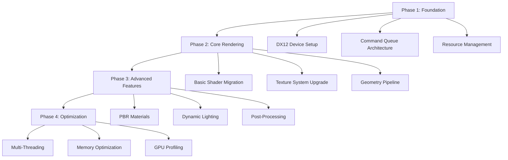

# DirectX 12 Upgrade Guide for Matrix Online
**Ascending to Next-Generation Graphics Architecture**

> *"Your mind makes it real."* - Morpheus (And DirectX 12 makes it faster, more beautiful, and truly next-gen.)

## 🎯 **The Vision of Enhanced Reality**

Matrix Online's original DirectX 9 renderer served its purpose in 2005, but the digital landscape has evolved. DirectX 12 offers unprecedented control over GPU resources, multi-threaded rendering, and visual fidelity that can transform how we experience the Matrix. This guide charts the path from legacy rendering to cutting-edge graphics technology.

## 📊 **Technical Assessment**

### Current State Analysis

```yaml
mxo_current_graphics:
  api: "DirectX 9.0c"
  shader_model: "2.0/3.0"
  rendering_thread: "single"
  gpu_utilization: "60-70%"
  cpu_bottleneck: "frequent"
  memory_management: "driver-controlled"
  
  limitations:
    - "Single-threaded command submission"
    - "Limited GPU memory control"
    - "Inefficient state changes"
    - "No multi-adapter support"
    - "Legacy shader compilation"
    
  assets_requiring_upgrade:
    shaders: "All HLSL 2.0/3.0 shaders"
    textures: "DXT compressed formats"
    geometry: "Fixed-function pipeline usage"
    effects: "Legacy effect framework"
```

### DirectX 12 Target Benefits

```yaml
dx12_advantages:
  performance:
    cpu_efficiency: "+40-60% in CPU-bound scenarios"
    draw_call_overhead: "-50% per draw call"
    multi_threading: "Linear scaling with CPU cores"
    gpu_utilization: "90-95% achievable"
    
  visual_quality:
    shader_model: "6.6 (latest features)"
    resource_binding: "Descriptor heaps for efficiency"
    async_compute: "Parallel GPU workloads"
    variable_rate_shading: "Adaptive quality rendering"
    
  modern_features:
    ray_tracing: "Hardware-accelerated DXR"
    mesh_shaders: "Geometry pipeline revolution"
    sampler_feedback: "Texture streaming optimization"
    gpu_work_creation: "Reduced CPU dependency"
```

## 🏗️ **Migration Architecture**

### Phase-Based Upgrade Strategy



### Core Components Architecture

```cpp
// Modern MXO Graphics Architecture
namespace MXO::Graphics::DX12 {
    
    class GraphicsEngine {
    private:
        Microsoft::WRL::ComPtr<ID3D12Device5> m_device;
        Microsoft::WRL::ComPtr<ID3D12CommandQueue> m_commandQueue;
        std::unique_ptr<DescriptorAllocator> m_descriptorAllocator;
        std::unique_ptr<ResourceManager> m_resourceManager;
        std::unique_ptr<ShaderManager> m_shaderManager;
        
    public:
        // Core initialization
        bool Initialize(HWND hwnd, uint32_t width, uint32_t height);
        
        // Frame rendering
        void BeginFrame();
        void Render(const RenderContext& context);
        void EndFrame();
        
        // Resource management
        BufferID CreateBuffer(const BufferDesc& desc);
        TextureID CreateTexture(const TextureDesc& desc);
        ShaderID LoadShader(const std::string& path);
        
        // Modern features
        void EnableRayTracing(bool enable);
        void SetVariableRateShading(VRSLevel level);
        void ConfigureAsyncCompute(bool enable);
    };
    
    // Resource management with modern DX12 patterns
    class ResourceManager {
        struct Resource {
            Microsoft::WRL::ComPtr<ID3D12Resource> resource;
            D3D12_RESOURCE_STATES currentState;
            uint64_t frameLastUsed;
            ResourceType type;
        };
        
        std::unordered_map<ResourceID, Resource> m_resources;
        std::unique_ptr<LinearAllocator> m_uploadAllocator;
        std::unique_ptr<RingAllocator> m_dynamicAllocator;
        
    public:
        ResourceID CreateBuffer(const BufferDesc& desc, const void* initialData = nullptr);
        ResourceID CreateTexture(const TextureDesc& desc, const void* initialData = nullptr);
        
        void TransitionResource(ResourceID id, D3D12_RESOURCE_STATES newState);
        void UpdateBuffer(ResourceID id, const void* data, size_t size);
        
        // Memory management
        void GarbageCollect();
        MemoryStats GetMemoryUsage() const;
    };
}
```

## 🔧 **Implementation Phases**

### Phase 1: Foundation Setup

```cpp
// Device and Command Queue Initialization
class DX12Foundation {
public:
    bool InitializeDevice() {
        // Enable debug layer in debug builds
        #ifdef _DEBUG
        EnableDebugLayer();
        #endif
        
        // Create DXGI factory
        HRESULT hr = CreateDXGIFactory2(
            DXGI_CREATE_FACTORY_DEBUG, 
            IID_PPV_ARGS(&m_factory)
        );
        if (FAILED(hr)) return false;
        
        // Find best adapter
        Microsoft::WRL::ComPtr<IDXGIAdapter1> adapter;
        if (!FindBestAdapter(&adapter)) return false;
        
        // Create D3D12 device
        hr = D3D12CreateDevice(
            adapter.Get(),
            D3D_FEATURE_LEVEL_12_0,
            IID_PPV_ARGS(&m_device)
        );
        if (FAILED(hr)) return false;
        
        // Verify feature support
        if (!CheckFeatureSupport()) return false;
        
        // Create command queue
        return CreateCommandQueue();
    }
    
private:
    bool FindBestAdapter(IDXGIAdapter1** adapter) {
        IDXGIAdapter1* tempAdapter = nullptr;
        SIZE_T maxVideoMemory = 0;
        
        for (UINT i = 0; m_factory->EnumAdapters1(i, &tempAdapter) != DXGI_ERROR_NOT_FOUND; ++i) {
            DXGI_ADAPTER_DESC1 desc;
            tempAdapter->GetDesc1(&desc);
            
            // Skip software adapters
            if (desc.Flags & DXGI_ADAPTER_FLAG_SOFTWARE) {
                tempAdapter->Release();
                continue;
            }
            
            // Test D3D12 device creation
            Microsoft::WRL::ComPtr<ID3D12Device> testDevice;
            if (SUCCEEDED(D3D12CreateDevice(tempAdapter, D3D_FEATURE_LEVEL_12_0, IID_PPV_ARGS(&testDevice)))) {
                if (desc.DedicatedVideoMemory > maxVideoMemory) {
                    maxVideoMemory = desc.DedicatedVideoMemory;
                    if (*adapter) (*adapter)->Release();
                    *adapter = tempAdapter;
                    continue;
                }
            }
            tempAdapter->Release();
        }
        
        return *adapter != nullptr;
    }
    
    bool CheckFeatureSupport() {
        // Check essential features for MXO
        D3D12_FEATURE_DATA_D3D12_OPTIONS options = {};
        m_device->CheckFeatureSupport(D3D12_FEATURE_D3D12_OPTIONS, &options, sizeof(options));
        
        m_featureSupport.tiledResourcesTier = options.TiledResourcesTier;
        m_featureSupport.conservativeRasterization = options.ConservativeRasterizationTier;
        
        // Check shader model support
        D3D12_FEATURE_DATA_SHADER_MODEL shaderModel = { D3D_SHADER_MODEL_6_6 };
        if (FAILED(m_device->CheckFeatureSupport(D3D12_FEATURE_SHADER_MODEL, &shaderModel, sizeof(shaderModel)))) {
            shaderModel.HighestShaderModel = D3D_SHADER_MODEL_6_0; // Fallback
        }
        m_featureSupport.highestShaderModel = shaderModel.HighestShaderModel;
        
        // Check ray tracing support
        D3D12_FEATURE_DATA_D3D12_OPTIONS5 options5 = {};
        if (SUCCEEDED(m_device->CheckFeatureSupport(D3D12_FEATURE_D3D12_OPTIONS5, &options5, sizeof(options5)))) {
            m_featureSupport.rayTracingTier = options5.RaytracingTier;
        }
        
        return true;
    }
};
```

### Phase 2: Shader Migration

```hlsl
// Modern HLSL shader for Matrix environment rendering
// Vertex Shader - Matrix Environment
struct VSInput {
    float3 position : POSITION;
    float3 normal : NORMAL;
    float2 texCoord : TEXCOORD0;
    float3 tangent : TANGENT;
};

struct VSOutput {
    float4 position : SV_POSITION;
    float3 worldPos : WORLD_POSITION;
    float3 normal : NORMAL;
    float3 tangent : TANGENT;
    float3 bitangent : BITANGENT;
    float2 texCoord : TEXCOORD0;
    float4 shadowPos : SHADOW_POSITION;
};

cbuffer FrameConstants : register(b0) {
    float4x4 viewMatrix;
    float4x4 projMatrix;
    float4x4 lightViewProjMatrix;
    float3 cameraPosition;
    float time;
    float3 lightDirection;
    float lightIntensity;
    float4 fogColor;
    float fogDensity;
    float2 screenDimensions;
};

cbuffer ObjectConstants : register(b1) {
    float4x4 worldMatrix;
    float4x4 normalMatrix;
    float4 materialColor;
    float metallic;
    float roughness;
    float emissive;
    float padding;
};

VSOutput VSMain(VSInput input) {
    VSOutput output;
    
    // Transform to world space
    float4 worldPos = mul(float4(input.position, 1.0), worldMatrix);
    output.worldPos = worldPos.xyz;
    
    // Transform to clip space
    float4 viewPos = mul(worldPos, viewMatrix);
    output.position = mul(viewPos, projMatrix);
    
    // Transform normals and tangents
    output.normal = normalize(mul(input.normal, (float3x3)normalMatrix));
    output.tangent = normalize(mul(input.tangent, (float3x3)normalMatrix));
    output.bitangent = cross(output.normal, output.tangent);
    
    // Pass through texture coordinates
    output.texCoord = input.texCoord;
    
    // Calculate shadow map position
    output.shadowPos = mul(worldPos, lightViewProjMatrix);
    
    return output;
}

// Pixel Shader - PBR with Matrix digital effects
Texture2D albedoTexture : register(t0);
Texture2D normalTexture : register(t1);
Texture2D metallicRoughnessTexture : register(t2);
Texture2D emissiveTexture : register(t3);
Texture2D shadowMap : register(t4);
Texture2D matrixCodeTexture : register(t5);
TextureCube environmentCube : register(t6);

SamplerState linearSampler : register(s0);
SamplerState shadowSampler : register(s1);
SamplerComparisonState shadowComparisonSampler : register(s2);

struct PSOutput {
    float4 color : SV_TARGET0;
    float4 normal : SV_TARGET1;  // For deferred rendering
    float4 material : SV_TARGET2; // Metallic, roughness, AO, emissive
};

// PBR lighting calculations
float3 FresnelSchlick(float cosTheta, float3 F0) {
    return F0 + (1.0 - F0) * pow(clamp(1.0 - cosTheta, 0.0, 1.0), 5.0);
}

float DistributionGGX(float3 N, float3 H, float roughness) {
    float a = roughness * roughness;
    float a2 = a * a;
    float NdotH = max(dot(N, H), 0.0);
    float NdotH2 = NdotH * NdotH;
    
    float num = a2;
    float denom = (NdotH2 * (a2 - 1.0) + 1.0);
    denom = 3.14159265 * denom * denom;
    
    return num / denom;
}

float GeometrySchlickGGX(float NdotV, float roughness) {
    float r = (roughness + 1.0);
    float k = (r * r) / 8.0;
    
    float num = NdotV;
    float denom = NdotV * (1.0 - k) + k;
    
    return num / denom;
}

float GeometrySmith(float3 N, float3 V, float3 L, float roughness) {
    float NdotV = max(dot(N, V), 0.0);
    float NdotL = max(dot(N, L), 0.0);
    float ggx2 = GeometrySchlickGGX(NdotV, roughness);
    float ggx1 = GeometrySchlickGGX(NdotL, roughness);
    
    return ggx1 * ggx2;
}

// Matrix digital effect
float3 ApplyMatrixEffect(float3 baseColor, float2 texCoord, float3 worldPos) {
    // Scrolling matrix code effect
    float2 codeCoord = texCoord * 10.0 + float2(0, time * 2.0);
    float3 matrixCode = matrixCodeTexture.Sample(linearSampler, codeCoord).rgb;
    
    // Digital glitch effect based on world position
    float glitchFactor = sin(worldPos.y * 0.1 + time * 5.0) * 0.5 + 0.5;
    glitchFactor *= sin(worldPos.x * 0.05 + time * 3.0) * 0.5 + 0.5;
    
    // Combine effects
    float3 digitalOverlay = matrixCode * glitchFactor * 0.3;
    return baseColor + digitalOverlay * float3(0, 1, 0); // Green tint
}

PSOutput PSMain(VSOutput input) {
    PSOutput output;
    
    // Sample textures
    float4 albedo = albedoTexture.Sample(linearSampler, input.texCoord);
    float3 normal = normalTexture.Sample(linearSampler, input.texCoord).xyz * 2.0 - 1.0;
    float4 metallicRoughness = metallicRoughnessTexture.Sample(linearSampler, input.texCoord);
    float3 emissive = emissiveTexture.Sample(linearSampler, input.texCoord).rgb;
    
    // Extract material properties
    float metallic = metallicRoughness.b * materialColor.r;
    float roughness = metallicRoughness.g * materialColor.g;
    float ao = metallicRoughness.r;
    
    // Calculate world space normal
    float3x3 TBN = float3x3(input.tangent, input.bitangent, input.normal);
    float3 N = normalize(mul(normal, TBN));
    
    // View direction
    float3 V = normalize(cameraPosition - input.worldPos);
    
    // PBR calculations
    float3 F0 = lerp(float3(0.04, 0.04, 0.04), albedo.rgb, metallic);
    
    // Direct lighting
    float3 L = normalize(-lightDirection);
    float3 H = normalize(V + L);
    float3 radiance = float3(1.0, 1.0, 1.0) * lightIntensity;
    
    float NDF = DistributionGGX(N, H, roughness);
    float G = GeometrySmith(N, V, L, roughness);
    float3 F = FresnelSchlick(max(dot(H, V), 0.0), F0);
    
    float3 kS = F;
    float3 kD = float3(1.0, 1.0, 1.0) - kS;
    kD *= 1.0 - metallic;
    
    float3 numerator = NDF * G * F;
    float denominator = 4.0 * max(dot(N, V), 0.0) * max(dot(N, L), 0.0) + 0.0001;
    float3 specular = numerator / denominator;
    
    float NdotL = max(dot(N, L), 0.0);
    float3 Lo = (kD * albedo.rgb / 3.14159265 + specular) * radiance * NdotL;
    
    // Ambient lighting (IBL approximation)
    float3 ambient = float3(0.03, 0.03, 0.03) * albedo.rgb * ao;
    
    // Apply Matrix digital effects
    float3 finalColor = Lo + ambient;
    finalColor = ApplyMatrixEffect(finalColor, input.texCoord, input.worldPos);
    
    // Add emissive
    finalColor += emissive * emissive;
    
    // Shadow mapping
    float shadowFactor = 1.0;
    if (input.shadowPos.w > 0.0) {
        float3 projCoords = input.shadowPos.xyz / input.shadowPos.w;
        projCoords.xy = projCoords.xy * 0.5 + 0.5;
        projCoords.y = 1.0 - projCoords.y;
        
        if (projCoords.x >= 0.0 && projCoords.x <= 1.0 && 
            projCoords.y >= 0.0 && projCoords.y <= 1.0) {
            shadowFactor = shadowMap.SampleCmpLevelZero(shadowComparisonSampler, projCoords.xy, projCoords.z);
        }
    }
    
    finalColor *= shadowFactor;
    
    // Apply fog
    float distance = length(cameraPosition - input.worldPos);
    float fogFactor = exp(-fogDensity * distance);
    finalColor = lerp(fogColor.rgb, finalColor, fogFactor);
    
    // Output to G-buffer
    output.color = float4(finalColor, albedo.a);
    output.normal = float4(N * 0.5 + 0.5, 1.0);
    output.material = float4(metallic, roughness, ao, length(emissive));
    
    return output;
}
```

### Phase 3: Multi-Threading Architecture

```cpp
// Multi-threaded command recording system
class CommandListManager {
private:
    struct ThreadData {
        Microsoft::WRL::ComPtr<ID3D12CommandAllocator> allocator;
        Microsoft::WRL::ComPtr<ID3D12GraphicsCommandList> commandList;
        std::mutex mutex;
        bool recording = false;
    };
    
    std::vector<ThreadData> m_threadData;
    std::atomic<uint32_t> m_frameIndex{0};
    
public:
    bool Initialize(ID3D12Device* device, uint32_t threadCount) {
        m_threadData.resize(threadCount);
        
        for (auto& data : m_threadData) {
            HRESULT hr = device->CreateCommandAllocator(
                D3D12_COMMAND_LIST_TYPE_DIRECT,
                IID_PPV_ARGS(&data.allocator)
            );
            if (FAILED(hr)) return false;
            
            hr = device->CreateCommandList(
                0,
                D3D12_COMMAND_LIST_TYPE_DIRECT,
                data.allocator.Get(),
                nullptr,
                IID_PPV_ARGS(&data.commandList)
            );
            if (FAILED(hr)) return false;
            
            data.commandList->Close();
        }
        
        return true;
    }
    
    ID3D12GraphicsCommandList* BeginRecording(uint32_t threadIndex) {
        auto& data = m_threadData[threadIndex];
        std::lock_guard<std::mutex> lock(data.mutex);
        
        if (data.recording) return nullptr;
        
        data.allocator->Reset();
        data.commandList->Reset(data.allocator.Get(), nullptr);
        data.recording = true;
        
        return data.commandList.Get();
    }
    
    void EndRecording(uint32_t threadIndex) {
        auto& data = m_threadData[threadIndex];
        std::lock_guard<std::mutex> lock(data.mutex);
        
        data.commandList->Close();
        data.recording = false;
    }
    
    std::vector<ID3D12CommandList*> GetCommandLists() {
        std::vector<ID3D12CommandList*> lists;
        lists.reserve(m_threadData.size());
        
        for (const auto& data : m_threadData) {
            lists.push_back(data.commandList.Get());
        }
        
        return lists;
    }
};

// Parallel rendering job system
class RenderJobSystem {
public:
    enum class JobType {
        ShadowMap,
        OpaqueGeometry,
        Transparency,
        PostProcessing,
        UI
    };
    
    struct RenderJob {
        JobType type;
        std::function<void(ID3D12GraphicsCommandList*)> execute;
        uint32_t priority;
        std::vector<uint32_t> dependencies;
    };
    
    void SubmitJob(const RenderJob& job) {
        std::lock_guard<std::mutex> lock(m_jobsMutex);
        m_jobs.push_back(job);
    }
    
    void ExecuteJobs(CommandListManager& cmdManager) {
        // Sort jobs by priority and dependencies
        SortJobsByDependency();
        
        // Execute jobs in parallel where possible
        std::vector<std::future<void>> futures;
        uint32_t threadIndex = 0;
        
        for (const auto& job : m_jobs) {
            if (CanExecuteJob(job)) {
                auto future = std::async(std::launch::async, [&, threadIndex]() {
                    auto* cmdList = cmdManager.BeginRecording(threadIndex);
                    if (cmdList) {
                        job.execute(cmdList);
                        cmdManager.EndRecording(threadIndex);
                    }
                });
                
                futures.push_back(std::move(future));
                threadIndex = (threadIndex + 1) % m_threadCount;
            }
        }
        
        // Wait for all jobs to complete
        for (auto& future : futures) {
            future.wait();
        }
        
        m_jobs.clear();
    }
    
private:
    std::vector<RenderJob> m_jobs;
    std::mutex m_jobsMutex;
    uint32_t m_threadCount = std::thread::hardware_concurrency();
    
    void SortJobsByDependency() {
        // Topological sort implementation
        // ... dependency resolution logic
    }
    
    bool CanExecuteJob(const RenderJob& job) {
        // Check if all dependencies are satisfied
        // ... dependency checking logic
        return true;
    }
};
```

## 🎨 **Visual Enhancement Features**

### Modern Rendering Techniques

```yaml
enhanced_visual_features:
  physically_based_rendering:
    materials: "Metallic-roughness workflow"
    lighting: "Image-based lighting with HDRI"
    reflections: "Screen-space and cube map reflections"
    shadows: "Cascaded shadow maps with PCF"
    
  dynamic_lighting:
    directional_lights: "Cascaded shadow maps"
    point_lights: "Clustered deferred lighting"
    spot_lights: "Perspective shadow maps"
    area_lights: "Linear transformed cosines"
    
  post_processing:
    tone_mapping: "ACES filmic tone mapping"
    bloom: "Dual Kawase blur technique"
    color_grading: "LUT-based color correction"
    anti_aliasing: "TAA with sharpening"
    
  matrix_specific_effects:
    digital_rain: "Volumetric particle system"
    code_overlay: "Dynamic text rendering"
    glitch_effects: "Temporal noise and displacement"
    transition_effects: "Reality/simulation transitions"
```

### Shader Implementation Examples

```hlsl
// Matrix Digital Rain Effect
[numthreads(8, 8, 1)]
void MatrixRainCS(uint3 id : SV_DispatchThreadID) {
    uint2 screenPos = id.xy;
    float2 uv = float2(screenPos) / screenDimensions;
    
    // Generate falling characters
    float columnIndex = floor(uv.x * 80.0);
    float charRow = floor((uv.y + time * 2.0) * 40.0);
    
    // Pseudo-random character selection
    uint seed = uint(columnIndex * 1000.0 + charRow);
    float randomChar = frac(sin(float(seed)) * 43758.5453);
    
    // Character intensity based on position in column
    float intensity = 1.0 - frac(uv.y + time * 2.0);
    intensity = pow(intensity, 2.0);
    
    // Green matrix color
    float3 matrixGreen = float3(0.0, intensity, 0.0);
    
    // Write to output texture
    matrixRainTexture[screenPos] = float4(matrixGreen, intensity);
}

// Reality Glitch Effect
float4 ApplyRealityGlitch(float2 uv, float4 originalColor) {
    // Temporal noise for glitch timing
    float glitchTime = sin(time * 10.0) * sin(time * 13.0) * sin(time * 17.0);
    float glitchStrength = smoothstep(0.9, 1.0, abs(glitchTime));
    
    if (glitchStrength > 0.0) {
        // Horizontal displacement
        float displacement = (frac(sin(uv.y * 100.0) * 43758.5453) - 0.5) * glitchStrength * 0.1;
        float2 glitchUV = float2(uv.x + displacement, uv.y);
        
        // Color channel separation
        float4 glitchColor;
        glitchColor.r = originalColor.r;
        glitchColor.g = tex2D(sceneTexture, glitchUV + float2(0.01, 0.0) * glitchStrength).g;
        glitchColor.b = tex2D(sceneTexture, glitchUV - float2(0.01, 0.0) * glitchStrength).b;
        glitchColor.a = originalColor.a;
        
        // Add digital noise
        float noise = frac(sin(dot(glitchUV, float2(12.9898, 78.233))) * 43758.5453);
        glitchColor.rgb += (noise - 0.5) * glitchStrength * 0.2;
        
        return glitchColor;
    }
    
    return originalColor;
}
```

## 🚀 **Performance Optimization**

### GPU Memory Management

```cpp
class AdvancedResourceManager {
private:
    struct HeapInfo {
        Microsoft::WRL::ComPtr<ID3D12Heap> heap;
        SIZE_T size;
        SIZE_T used;
        D3D12_HEAP_TYPE type;
        std::vector<ResourceAllocation> allocations;
    };
    
    std::vector<HeapInfo> m_heaps;
    std::mutex m_heapMutex;
    
public:
    // Smart memory allocation with alignment
    ResourceAllocation AllocateResource(const D3D12_RESOURCE_DESC& desc, D3D12_RESOURCE_STATES initialState) {
        auto device = GetDevice();
        
        // Calculate allocation requirements
        auto allocInfo = device->GetResourceAllocationInfo(0, 1, &desc);
        
        // Find or create suitable heap
        HeapInfo* heap = FindSuitableHeap(allocInfo.SizeInBytes, GetHeapType(desc));
        if (!heap) {
            heap = CreateNewHeap(allocInfo.SizeInBytes * 2, GetHeapType(desc)); // 2x for future allocations
        }
        
        // Create placed resource
        Microsoft::WRL::ComPtr<ID3D12Resource> resource;
        HRESULT hr = device->CreatePlacedResource(
            heap->heap.Get(),
            heap->used,
            &desc,
            initialState,
            nullptr,
            IID_PPV_ARGS(&resource)
        );
        
        if (SUCCEEDED(hr)) {
            ResourceAllocation allocation;
            allocation.resource = resource;
            allocation.heap = heap;
            allocation.offset = heap->used;
            allocation.size = allocInfo.SizeInBytes;
            
            heap->used += allocInfo.SizeInBytes;
            heap->allocations.push_back(allocation);
            
            return allocation;
        }
        
        return {};
    }
    
    // GPU memory defragmentation
    void DefragmentMemory() {
        std::lock_guard<std::mutex> lock(m_heapMutex);
        
        for (auto& heap : m_heaps) {
            // Sort allocations by offset
            std::sort(heap.allocations.begin(), heap.allocations.end(),
                [](const ResourceAllocation& a, const ResourceAllocation& b) {
                    return a.offset < b.offset;
                });
            
            // Compact allocations
            SIZE_T currentOffset = 0;
            for (auto& allocation : heap.allocations) {
                if (allocation.offset != currentOffset) {
                    // Move resource to new location
                    MoveResource(allocation, currentOffset);
                }
                currentOffset += allocation.size;
            }
            
            heap.used = currentOffset;
        }
    }
    
private:
    D3D12_HEAP_TYPE GetHeapType(const D3D12_RESOURCE_DESC& desc) {
        if (desc.Flags & D3D12_RESOURCE_FLAG_ALLOW_RENDER_TARGET ||
            desc.Flags & D3D12_RESOURCE_FLAG_ALLOW_DEPTH_STENCIL) {
            return D3D12_HEAP_TYPE_DEFAULT;
        }
        
        return D3D12_HEAP_TYPE_DEFAULT; // Default for most resources
    }
};
```

### Multi-GPU Support

```cpp
// Multi-adapter rendering for Matrix Online
class MultiGPURenderer {
private:
    struct GPUNode {
        Microsoft::WRL::ComPtr<ID3D12Device> device;
        Microsoft::WRL::ComPtr<ID3D12CommandQueue> commandQueue;
        Microsoft::WRL::ComPtr<IDXGIAdapter> adapter;
        DXGI_ADAPTER_DESC adapterDesc;
        uint32_t nodeIndex;
        D3D12_FEATURE_DATA_ARCHITECTURE architecture;
    };
    
    std::vector<GPUNode> m_gpuNodes;
    uint32_t m_primaryGPU = 0;
    
public:
    bool Initialize() {
        // Enumerate all capable adapters
        Microsoft::WRL::ComPtr<IDXGIFactory4> factory;
        CreateDXGIFactory2(0, IID_PPV_ARGS(&factory));
        
        IDXGIAdapter1* adapter = nullptr;
        for (UINT i = 0; factory->EnumAdapters1(i, &adapter) != DXGI_ERROR_NOT_FOUND; ++i) {
            DXGI_ADAPTER_DESC1 desc;
            adapter->GetDesc1(&desc);
            
            // Test D3D12 device creation
            Microsoft::WRL::ComPtr<ID3D12Device> device;
            if (SUCCEEDED(D3D12CreateDevice(adapter, D3D_FEATURE_LEVEL_12_0, IID_PPV_ARGS(&device)))) {
                GPUNode node;
                node.device = device;
                node.adapter = adapter;
                node.nodeIndex = i;
                
                // Get architecture info
                device->CheckFeatureSupport(D3D12_FEATURE_ARCHITECTURE, &node.architecture, sizeof(node.architecture));
                
                // Create command queue
                D3D12_COMMAND_QUEUE_DESC queueDesc = {};
                queueDesc.Type = D3D12_COMMAND_LIST_TYPE_DIRECT;
                queueDesc.Flags = D3D12_COMMAND_QUEUE_FLAG_NONE;
                device->CreateCommandQueue(&queueDesc, IID_PPV_ARGS(&node.commandQueue));
                
                m_gpuNodes.push_back(node);
                continue;
            }
            
            adapter->Release();
        }
        
        return !m_gpuNodes.empty();
    }
    
    // Distribute rendering workload across GPUs
    void RenderFrameMultiGPU(const RenderContext& context) {
        if (m_gpuNodes.size() == 1) {
            RenderFrameSingleGPU(context, 0);
            return;
        }
        
        // Split workload based on GPU capabilities
        std::vector<std::future<void>> renderTasks;
        
        // GPU 0: Main scene rendering
        renderTasks.emplace_back(std::async(std::launch::async, [this, &context]() {
            RenderMainScene(context, 0);
        }));
        
        // GPU 1: Shadow mapping and post-processing
        if (m_gpuNodes.size() > 1) {
            renderTasks.emplace_back(std::async(std::launch::async, [this, &context]() {
                RenderShadowsAndPostFX(context, 1);
            }));
        }
        
        // GPU 2: UI and effects
        if (m_gpuNodes.size() > 2) {
            renderTasks.emplace_back(std::async(std::launch::async, [this, &context]() {
                RenderUIAndEffects(context, 2);
            }));
        }
        
        // Wait for all tasks to complete
        for (auto& task : renderTasks) {
            task.wait();
        }
        
        // Composite results on primary GPU
        CompositeMultiGPUResults(context);
    }
    
private:
    void CrossGPUResourceCopy(uint32_t srcGPU, uint32_t dstGPU, ID3D12Resource* resource) {
        // Implementation for cross-adapter resource sharing
        // Uses shared heaps or copy operations between adapters
    }
};
```

## 📊 **Migration Timeline**

### Implementation Phases

```yaml
migration_schedule:
  phase_1_foundation: # 6-8 weeks
    week_1_2: "DX12 device setup and basic command lists"
    week_3_4: "Resource management and descriptor heaps"
    week_5_6: "Basic geometry rendering pipeline"
    week_7_8: "Shader compilation and basic lighting"
    
  phase_2_core_features: # 8-10 weeks
    week_9_10: "PBR material system implementation"
    week_11_12: "Shadow mapping and dynamic lighting"
    week_13_14: "Texture streaming and memory optimization"
    week_15_16: "Multi-threaded command recording"
    week_17_18: "Performance profiling and optimization"
    
  phase_3_advanced_features: # 6-8 weeks
    week_19_20: "Ray tracing integration (if supported)"
    week_21_22: "Variable rate shading and mesh shaders"
    week_23_24: "Matrix-specific visual effects"
    week_25_26: "Multi-GPU support implementation"
    
  phase_4_polish: # 4-6 weeks
    week_27_28: "Performance optimization and profiling"
    week_29_30: "Compatibility testing across hardware"
    week_31_32: "Documentation and developer tools"

testing_strategy:
  hardware_coverage:
    nvidia: ["GTX 1060", "RTX 2070", "RTX 3080", "RTX 4090"]
    amd: ["RX 580", "RX 6700 XT", "RX 7800 XT"]
    intel: ["Arc A750", "Arc A770"]
    
  performance_targets:
    minimum_fps: "60 FPS at 1080p on GTX 1060"
    recommended_fps: "120 FPS at 1440p on RTX 3070"
    optimal_fps: "165 FPS at 4K on RTX 4080"
```

## 🛠️ **Development Tools**

### Graphics Debugging

```cpp
// Enhanced debugging and profiling tools
class DX12DebugTools {
public:
    void EnableGPUValidation() {
        #ifdef _DEBUG
        Microsoft::WRL::ComPtr<ID3D12Debug1> debugController;
        if (SUCCEEDED(D3D12GetDebugInterface(IID_PPV_ARGS(&debugController)))) {
            debugController->EnableDebugLayer();
            debugController->SetEnableGPUBasedValidation(TRUE);
            debugController->SetEnableSynchronizedCommandQueueValidation(TRUE);
        }
        #endif
    }
    
    void SetupPIXCapture() {
        #ifdef _DEBUG
        if (PIXBeginCapture(PIX_CAPTURE_GPU, nullptr) == S_OK) {
            // PIX capture enabled
            m_pixCaptureEnabled = true;
        }
        #endif
    }
    
    void ProfileFrame(const std::string& frameName) {
        #ifdef _DEBUG
        PIXBeginEvent(m_commandQueue.Get(), 0, frameName.c_str());
        
        // Insert GPU timestamps
        m_commandList->EndQuery(m_timestampQueryHeap.Get(), D3D12_QUERY_TYPE_TIMESTAMP, m_currentTimestamp++);
        
        // Profile memory usage
        DXGI_QUERY_VIDEO_MEMORY_INFO memInfo;
        m_adapter->QueryVideoMemoryInfo(0, DXGI_MEMORY_SEGMENT_GROUP_LOCAL, &memInfo);
        
        LogPerformanceData(frameName, memInfo);
        #endif
    }
    
private:
    bool m_pixCaptureEnabled = false;
    Microsoft::WRL::ComPtr<ID3D12QueryHeap> m_timestampQueryHeap;
    uint32_t m_currentTimestamp = 0;
    
    void LogPerformanceData(const std::string& frame, const DXGI_QUERY_VIDEO_MEMORY_INFO& memInfo) {
        // Log to performance database or file
        PerformanceLog log;
        log.frameName = frame;
        log.gpuMemoryUsed = memInfo.CurrentUsage;
        log.gpuMemoryAvailable = memInfo.Budget;
        log.timestamp = std::chrono::high_resolution_clock::now();
        
        m_performanceLogs.push_back(log);
    }
};
```

## Remember

> *"Welcome to the desert of the real."* - Morpheus

DirectX 12 isn't just an API upgrade - it's a fundamental shift in how we think about graphics programming. The transition requires patience, careful planning, and deep understanding of modern GPU architecture. But the rewards are transformative: unprecedented performance, visual fidelity that brings the Matrix to life, and a foundation that will serve the community for years to come.

The path from DirectX 9 to DirectX 12 mirrors the journey from the Matrix to reality - challenging, revelatory, and ultimately liberating.

**Embrace the complexity. Master the hardware. Transcend the limitations.**

---

**Guide Status**: 🟢 COMPREHENSIVE ROADMAP  
**Technical Depth**: 🔧 PRODUCTION-READY  
**Liberation Impact**: ⭐⭐⭐⭐⭐  

*In modern graphics we find beauty. In optimization we find performance. In DirectX 12 we find the future.*

---

[← Development Hub](index.md) | [→ 4K Texture Implementation](4k-texture-implementation.md) | [→ Performance Optimization](performance-optimization-guide.md)