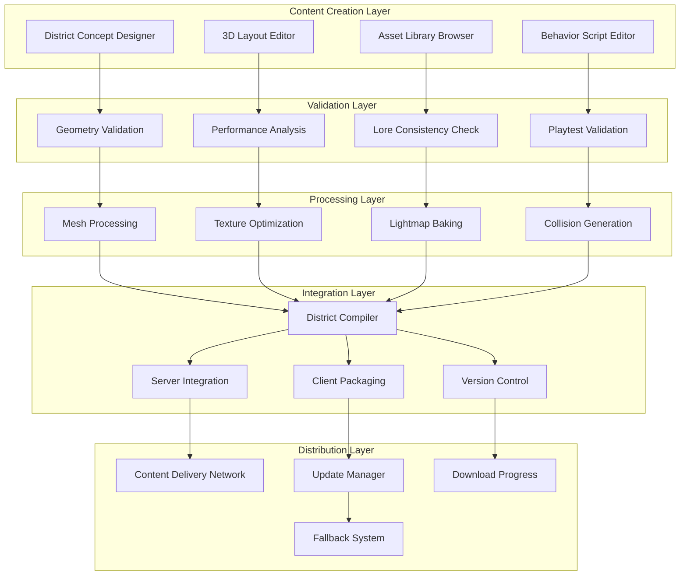

# District Expansion Tools Guide
**Building New Realities Within the Matrix**

> *"What is the Matrix? Control."* - Morpheus (But with the right tools, control becomes creation, and the Matrix becomes infinitely expandable.)

## 🎯 **The Vision of Infinite Worlds**

Matrix Online's revival demands tools that empower the community to expand beyond the original three districts. This comprehensive guide presents district expansion tools that allow creators to build new areas, design unique environments, and craft immersive experiences that extend the Matrix's boundaries while maintaining its essential character and technical integrity.

## 🏗️ **Architecture Overview**

### District Creation Pipeline



## 🎨 **District Concept Designer**

### Conceptual Framework Tool

```typescript
// district-tools/concept-designer.tsx - District concept and planning tool
import React, { useState, useCallback } from 'react';
import { Canvas, useFrame } from '@react-three/fiber';
import { OrbitControls, Text, Box, Sphere } from '@react-three/drei';

interface DistrictConcept {
    metadata: DistrictMetadata;
    theme: DistrictTheme;
    layout: DistrictLayout;
    narrative: NarrativeElements;
    gameplay: GameplayFeatures;
    technical: TechnicalSpecs;
}

interface DistrictMetadata {
    name: string;
    description: string;
    author: string;
    version: string;
    targetPlayerCount: number;
    difficulty: DifficultyLevel;
    estimatedPlayTime: number;
    tags: string[];
}

interface DistrictTheme {
    visualStyle: VisualStyle;
    atmosphere: AtmosphereSettings;
    timeOfDay: TimeOfDay;
    weather: WeatherPattern;
    architecturalStyle: ArchitecturalStyle;
    colorPalette: ColorPalette;
    musicTheme: string;
    ambientSounds: string[];
}

interface DistrictLayout {
    size: { width: number; height: number; depth: number };
    zones: Zone[];
    connections: Connection[];
    landmarks: Landmark[];
    spawnPoints: SpawnPoint[];
    boundaries: Boundary[];
}

const DistrictConceptDesigner: React.FC = () => {
    const [concept, setConcept] = useState<DistrictConcept>(getDefaultConcept());
    const [activeTab, setActiveTab] = useState<'metadata' | 'theme' | 'layout' | 'narrative' | 'gameplay'>('metadata');
    const [previewMode, setPreviewMode] = useState<'2d' | '3d'>('2d');
    
    const updateConcept = useCallback((section: keyof DistrictConcept, data: any) => {
        setConcept(prev => ({
            ...prev,
            [section]: { ...prev[section], ...data }
        }));
    }, []);
    
    const validateConcept = useCallback(async () => {
        const validation = await validateDistrictConcept(concept);
        if (!validation.isValid) {
            showValidationErrors(validation.errors);
            return false;
        }
        return true;
    }, [concept]);
    
    const exportConcept = useCallback(async () => {
        if (await validateConcept()) {
            const exportData = await generateConceptExport(concept);
            downloadFile(exportData, `${concept.metadata.name}_concept.json`);
        }
    }, [concept, validateConcept]);
    
    return (
        <div className="district-concept-designer">
            <div className="designer-header">
                <h1>District Concept Designer</h1>
                <div className="header-actions">
                    <button onClick={validateConcept} className="validate-btn">
                        Validate Concept
                    </button>
                    <button onClick={exportConcept} className="export-btn">
                        Export Concept
                    </button>
                </div>
            </div>
            
            <div className="designer-content">
                <div className="concept-tabs">
                    <TabNavigation 
                        activeTab={activeTab}
                        onTabChange={setActiveTab}
                        tabs={['metadata', 'theme', 'layout', 'narrative', 'gameplay']}
                    />
                </div>
                
                <div className="concept-editor">
                    {activeTab === 'metadata' && (
                        <MetadataEditor 
                            metadata={concept.metadata}
                            onChange={(data) => updateConcept('metadata', data)}
                        />
                    )}
                    
                    {activeTab === 'theme' && (
                        <ThemeEditor 
                            theme={concept.theme}
                            onChange={(data) => updateConcept('theme', data)}
                        />
                    )}
                    
                    {activeTab === 'layout' && (
                        <LayoutEditor 
                            layout={concept.layout}
                            onChange={(data) => updateConcept('layout', data)}
                            previewMode={previewMode}
                            onPreviewModeChange={setPreviewMode}
                        />
                    )}
                    
                    {activeTab === 'narrative' && (
                        <NarrativeEditor 
                            narrative={concept.narrative}
                            onChange={(data) => updateConcept('narrative', data)}
                        />
                    )}
                    
                    {activeTab === 'gameplay' && (
                        <GameplayEditor 
                            gameplay={concept.gameplay}
                            onChange={(data) => updateConcept('gameplay', data)}
                        />
                    )}
                </div>
                
                <div className="concept-preview">
                    <ConceptPreview 
                        concept={concept}
                        mode={previewMode}
                    />
                </div>
            </div>
        </div>
    );
};

const ThemeEditor: React.FC<{
    theme: DistrictTheme;
    onChange: (theme: Partial<DistrictTheme>) => void;
}> = ({ theme, onChange }) => {
    const presetThemes = [
        {
            name: 'Corporate Megaplex',
            description: 'Glass towers and neon lights',
            visualStyle: VisualStyle.Corporate,
            atmosphere: { fog: 0.3, contrast: 1.2, saturation: 0.8 },
            colorPalette: {
                primary: '#00ffff',
                secondary: '#0080ff',
                accent: '#ffffff',
                background: '#001122'
            }
        },
        {
            name: 'Underground Network',
            description: 'Dark tunnels and hidden passages',
            visualStyle: VisualStyle.Industrial,
            atmosphere: { fog: 0.7, contrast: 1.5, saturation: 0.6 },
            colorPalette: {
                primary: '#ff8800',
                secondary: '#ffaa00',
                accent: '#ffff00',
                background: '#220011'
            }
        },
        {
            name: 'Digital Construct',
            description: 'Pure code visualization',
            visualStyle: VisualStyle.Abstract,
            atmosphere: { fog: 0.1, contrast: 2.0, saturation: 1.5 },
            colorPalette: {
                primary: '#00ff00',
                secondary: '#00aa00',
                accent: '#ffffff',
                background: '#000000'
            }
        }
    ];
    
    return (
        <div className="theme-editor">
            <div className="theme-presets">
                <h3>Theme Presets</h3>
                <div className="preset-grid">
                    {presetThemes.map((preset, index) => (
                        <div 
                            key={index}
                            className="preset-card"
                            onClick={() => onChange(preset)}
                        >
                            <div 
                                className="preset-preview"
                                style={{ 
                                    background: `linear-gradient(45deg, ${preset.colorPalette.primary}, ${preset.colorPalette.secondary})`
                                }}
                            />
                            <h4>{preset.name}</h4>
                            <p>{preset.description}</p>
                        </div>
                    ))}
                </div>
            </div>
            
            <div className="theme-customization">
                <div className="visual-style-selector">
                    <label>Visual Style:</label>
                    <select 
                        value={theme.visualStyle}
                        onChange={(e) => onChange({ visualStyle: e.target.value as VisualStyle })}
                    >
                        <option value={VisualStyle.Corporate}>Corporate</option>
                        <option value={VisualStyle.Industrial}>Industrial</option>
                        <option value={VisualStyle.Residential}>Residential</option>
                        <option value={VisualStyle.Abstract}>Abstract</option>
                        <option value={VisualStyle.Natural}>Natural</option>
                        <option value={VisualStyle.Hybrid}>Hybrid</option>
                    </select>
                </div>
                
                <div className="atmosphere-controls">
                    <h4>Atmosphere Settings</h4>
                    <div className="control-group">
                        <label>Fog Density:</label>
                        <input 
                            type="range"
                            min="0"
                            max="1"
                            step="0.1"
                            value={theme.atmosphere.fog}
                            onChange={(e) => onChange({
                                atmosphere: { ...theme.atmosphere, fog: parseFloat(e.target.value) }
                            })}
                        />
                        <span>{theme.atmosphere.fog}</span>
                    </div>
                    
                    <div className="control-group">
                        <label>Contrast:</label>
                        <input 
                            type="range"
                            min="0.5"
                            max="2"
                            step="0.1"
                            value={theme.atmosphere.contrast}
                            onChange={(e) => onChange({
                                atmosphere: { ...theme.atmosphere, contrast: parseFloat(e.target.value) }
                            })}
                        />
                        <span>{theme.atmosphere.contrast}</span>
                    </div>
                    
                    <div className="control-group">
                        <label>Saturation:</label>
                        <input 
                            type="range"
                            min="0"
                            max="2"
                            step="0.1"
                            value={theme.atmosphere.saturation}
                            onChange={(e) => onChange({
                                atmosphere: { ...theme.atmosphere, saturation: parseFloat(e.target.value) }
                            })}
                        />
                        <span>{theme.atmosphere.saturation}</span>
                    </div>
                </div>
                
                <div className="color-palette-editor">
                    <h4>Color Palette</h4>
                    <div className="color-controls">
                        <div className="color-input">
                            <label>Primary:</label>
                            <input 
                                type="color"
                                value={theme.colorPalette.primary}
                                onChange={(e) => onChange({
                                    colorPalette: { ...theme.colorPalette, primary: e.target.value }
                                })}
                            />
                        </div>
                        <div className="color-input">
                            <label>Secondary:</label>
                            <input 
                                type="color"
                                value={theme.colorPalette.secondary}
                                onChange={(e) => onChange({
                                    colorPalette: { ...theme.colorPalette, secondary: e.target.value }
                                })}
                            />
                        </div>
                        <div className="color-input">
                            <label>Accent:</label>
                            <input 
                                type="color"
                                value={theme.colorPalette.accent}
                                onChange={(e) => onChange({
                                    colorPalette: { ...theme.colorPalette, accent: e.target.value }
                                })}
                            />
                        </div>
                        <div className="color-input">
                            <label>Background:</label>
                            <input 
                                type="color"
                                value={theme.colorPalette.background}
                                onChange={(e) => onChange({
                                    colorPalette: { ...theme.colorPalette, background: e.target.value }
                                })}
                            />
                        </div>
                    </div>
                </div>
                
                <div className="audio-settings">
                    <h4>Audio Theme</h4>
                    <div className="audio-controls">
                        <div className="control-group">
                            <label>Music Theme:</label>
                            <select 
                                value={theme.musicTheme}
                                onChange={(e) => onChange({ musicTheme: e.target.value })}
                            >
                                <option value="corporate">Corporate</option>
                                <option value="industrial">Industrial</option>
                                <option value="ambient">Ambient</option>
                                <option value="tension">Tension</option>
                                <option value="mystery">Mystery</option>
                                <option value="action">Action</option>
                            </select>
                        </div>
                        
                        <div className="ambient-sounds">
                            <label>Ambient Sounds:</label>
                            <div className="sound-checkboxes">
                                {['traffic', 'machinery', 'wind', 'electrical', 'voices', 'footsteps'].map(sound => (
                                    <label key={sound} className="sound-checkbox">
                                        <input 
                                            type="checkbox"
                                            checked={theme.ambientSounds.includes(sound)}
                                            onChange={(e) => {
                                                const newSounds = e.target.checked
                                                    ? [...theme.ambientSounds, sound]
                                                    : theme.ambientSounds.filter(s => s !== sound);
                                                onChange({ ambientSounds: newSounds });
                                            }}
                                        />
                                        {sound}
                                    </label>
                                ))}
                            </div>
                        </div>
                    </div>
                </div>
            </div>
        </div>
    );
};

const ConceptPreview: React.FC<{
    concept: DistrictConcept;
    mode: '2d' | '3d';
}> = ({ concept, mode }) => {
    if (mode === '2d') {
        return (
            <div className="concept-preview-2d">
                <div className="preview-header">
                    <h3>{concept.metadata.name}</h3>
                    <p>{concept.metadata.description}</p>
                </div>
                
                <div className="layout-preview">
                    <svg width="400" height="300" viewBox="0 0 400 300">
                        {concept.layout.zones.map((zone, index) => (
                            <rect
                                key={index}
                                x={zone.position.x * 4}
                                y={zone.position.z * 3}
                                width={zone.size.width * 4}
                                height={zone.size.depth * 3}
                                fill={concept.theme.colorPalette.primary}
                                fillOpacity={0.3}
                                stroke={concept.theme.colorPalette.accent}
                                strokeWidth={2}
                            />
                        ))}
                        
                        {concept.layout.landmarks.map((landmark, index) => (
                            <circle
                                key={index}
                                cx={landmark.position.x * 4}
                                cy={landmark.position.z * 3}
                                r={5}
                                fill={concept.theme.colorPalette.secondary}
                            />
                        ))}
                    </svg>
                </div>
                
                <div className="theme-preview">
                    <div 
                        className="color-swatch"
                        style={{ backgroundColor: concept.theme.colorPalette.primary }}
                    />
                    <div 
                        className="color-swatch"
                        style={{ backgroundColor: concept.theme.colorPalette.secondary }}
                    />
                    <div 
                        className="color-swatch"
                        style={{ backgroundColor: concept.theme.colorPalette.accent }}
                    />
                </div>
            </div>
        );
    }
    
    return (
        <div className="concept-preview-3d">
            <Canvas camera={{ position: [10, 10, 10], fov: 50 }}>
                <ambientLight intensity={0.4} />
                <pointLight position={[10, 10, 10]} />
                <OrbitControls enablePan={true} enableZoom={true} enableRotate={true} />
                
                {concept.layout.zones.map((zone, index) => (
                    <Box
                        key={index}
                        position={[zone.position.x, zone.position.y, zone.position.z]}
                        args={[zone.size.width, zone.size.height, zone.size.depth]}
                    >
                        <meshStandardMaterial 
                            color={concept.theme.colorPalette.primary}
                            transparent={true}
                            opacity={0.6}
                        />
                    </Box>
                ))}
                
                {concept.layout.landmarks.map((landmark, index) => (
                    <Sphere
                        key={index}
                        position={[landmark.position.x, landmark.position.y + 2, landmark.position.z]}
                        args={[1, 8, 6]}
                    >
                        <meshStandardMaterial color={concept.theme.colorPalette.secondary} />
                    </Sphere>
                ))}
                
                <Text
                    position={[0, 15, 0]}
                    fontSize={2}
                    color={concept.theme.colorPalette.accent}
                    anchorX="center"
                    anchorY="middle"
                >
                    {concept.metadata.name}
                </Text>
            </Canvas>
        </div>
    );
};
```

## 🏗️ **3D Layout Editor**

### Advanced Building Tools

```go
// district-tools/layout-editor.go - 3D district layout editor backend
package districttools

import (
    "context"
    "encoding/json"
    "fmt"
    "math"
    "time"
    
    "github.com/go-gl/mathgl/mgl64"
)

type LayoutEditor struct {
    scene           *Scene3D
    toolManager     *ToolManager
    undoRedoManager *UndoRedoManager
    validator       *LayoutValidator
    exporter        *DistrictExporter
    collaborationManager *CollaborationManager
}

type Scene3D struct {
    Objects         map[string]*SceneObject    `json:"objects"`
    Lights          map[string]*Light          `json:"lights"`
    Camera          *Camera                    `json:"camera"`
    Environment     *Environment               `json:"environment"`
    Physics         *PhysicsWorld              `json:"physics"`
    NavMesh         *NavigationMesh            `json:"nav_mesh"`
    Bounds          BoundingBox                `json:"bounds"`
    LastModified    time.Time                  `json:"last_modified"`
}

type SceneObject struct {
    ID              string                 `json:"id"`
    Name            string                 `json:"name"`
    Type            ObjectType             `json:"type"`
    Transform       Transform3D            `json:"transform"`
    Mesh            *Mesh                  `json:"mesh,omitempty"`
    Materials       []Material             `json:"materials"`
    Properties      map[string]interface{} `json:"properties"`
    Children        []string               `json:"children"`
    Parent          string                 `json:"parent,omitempty"`
    Layer           int                    `json:"layer"`
    Visible         bool                   `json:"visible"`
    Locked          bool                   `json:"locked"`
    Tags            []string               `json:"tags"`
}

type Transform3D struct {
    Position    mgl64.Vec3 `json:"position"`
    Rotation    mgl64.Quat `json:"rotation"`
    Scale       mgl64.Vec3 `json:"scale"`
    Matrix      mgl64.Mat4 `json:"matrix"`
}

type BuildingTool interface {
    GetName() string
    GetIcon() string
    OnActivate(editor *LayoutEditor) error
    OnDeactivate(editor *LayoutEditor) error
    OnMouseDown(editor *LayoutEditor, event MouseEvent) error
    OnMouseMove(editor *LayoutEditor, event MouseEvent) error
    OnMouseUp(editor *LayoutEditor, event MouseEvent) error
    OnKeyDown(editor *LayoutEditor, event KeyEvent) error
    GetSettings() ToolSettings
    SetSettings(settings ToolSettings) error
}

// Selection Tool
type SelectionTool struct {
    selectedObjects []string
    selectionBox    *SelectionBox
    multiSelect     bool
    dragMode        DragMode
}

func (st *SelectionTool) OnMouseDown(editor *LayoutEditor, event MouseEvent) error {
    ray := editor.GetMouseRay(event.X, event.Y)
    hit := editor.scene.Raycast(ray)
    
    if hit != nil {
        if !st.multiSelect || !event.Shift {
            st.selectedObjects = []string{hit.ObjectID}
        } else {
            st.toggleSelection(hit.ObjectID)
        }
        
        editor.SetSelectedObjects(st.selectedObjects)
        st.dragMode = DragModeMove
    } else {
        if !event.Shift {
            st.selectedObjects = []string{}
            editor.SetSelectedObjects(st.selectedObjects)
        }
        st.startSelectionBox(event.X, event.Y)
    }
    
    return nil
}

func (st *SelectionTool) OnMouseMove(editor *LayoutEditor, event MouseEvent) error {
    if st.dragMode == DragModeMove && len(st.selectedObjects) > 0 {
        delta := editor.CalculateMoveDelta(event)
        return st.moveSelectedObjects(editor, delta)
    } else if st.selectionBox != nil {
        st.updateSelectionBox(event.X, event.Y)
        st.updateSelectionFromBox(editor)
    }
    
    return nil
}

func (st *SelectionTool) moveSelectedObjects(editor *LayoutEditor, delta mgl64.Vec3) error {
    command := &MoveObjectsCommand{
        ObjectIDs: st.selectedObjects,
        Delta:     delta,
    }
    
    return editor.undoRedoManager.ExecuteCommand(command)
}

// Placement Tool
type PlacementTool struct {
    prefabLibrary   *PrefabLibrary
    selectedPrefab  *Prefab
    previewObject   *SceneObject
    snapToGrid      bool
    snapToSurface   bool
    gridSize        float64
    rotationStep    float64
}

func (pt *PlacementTool) OnMouseMove(editor *LayoutEditor, event MouseEvent) error {
    if pt.previewObject == nil && pt.selectedPrefab != nil {
        pt.createPreviewObject(editor)
    }
    
    if pt.previewObject != nil {
        position := editor.GetWorldPosition(event.X, event.Y)
        
        if pt.snapToGrid {
            position = pt.snapPositionToGrid(position)
        }
        
        if pt.snapToSurface {
            surface := editor.GetSurfaceAtPosition(position)
            if surface != nil {
                position.Y = surface.Y
            }
        }
        
        pt.previewObject.Transform.Position = position
        editor.UpdatePreviewObject(pt.previewObject)
    }
    
    return nil
}

func (pt *PlacementTool) OnMouseDown(editor *LayoutEditor, event MouseEvent) error {
    if pt.previewObject != nil && event.Button == MouseButtonLeft {
        // Place the object
        object := pt.createObjectFromPreview()
        command := &CreateObjectCommand{Object: object}
        
        if err := editor.undoRedoManager.ExecuteCommand(command); err != nil {
            return err
        }
        
        // Create new preview for continuous placement
        if !event.Shift { // Shift = single placement
            pt.createPreviewObject(editor)
        }
    }
    
    return nil
}

func (pt *PlacementTool) snapPositionToGrid(position mgl64.Vec3) mgl64.Vec3 {
    return mgl64.Vec3{
        math.Round(position.X()/pt.gridSize) * pt.gridSize,
        math.Round(position.Y()/pt.gridSize) * pt.gridSize,
        math.Round(position.Z()/pt.gridSize) * pt.gridSize,
    }
}

// Terrain Tool
type TerrainTool struct {
    heightmap       *Heightmap
    brushSize       float64
    brushStrength   float64
    brushFalloff    FalloffType
    sculptMode      SculptMode
    textureBlending bool
}

func (tt *TerrainTool) OnMouseMove(editor *LayoutEditor, event MouseEvent) error {
    if event.LeftButton {
        position := editor.GetWorldPosition(event.X, event.Y)
        
        switch tt.sculptMode {
        case SculptModeRaise:
            return tt.raiseTerrain(editor, position)
        case SculptModeLower:
            return tt.lowerTerrain(editor, position)
        case SculptModeSmooth:
            return tt.smoothTerrain(editor, position)
        case SculptModeFlatten:
            return tt.flattenTerrain(editor, position)
        }
    }
    
    return nil
}

func (tt *TerrainTool) raiseTerrain(editor *LayoutEditor, center mgl64.Vec3) error {
    affected := tt.getAffectedVertices(center)
    
    command := &ModifyTerrainCommand{
        AffectedVertices: affected,
        ModificationType: TerrainModificationRaise,
        Strength:         tt.brushStrength,
        Center:          center,
        Radius:          tt.brushSize,
    }
    
    return editor.undoRedoManager.ExecuteCommand(command)
}

// Lighting Tool
type LightingTool struct {
    lightType       LightType
    lightSettings   LightSettings
    previewLight    *Light
    showLightGizmos bool
    realTimePreview bool
}

func (lt *LightingTool) OnMouseDown(editor *LayoutEditor, event MouseEvent) error {
    position := editor.GetWorldPosition(event.X, event.Y)
    
    light := &Light{
        ID:       generateLightID(),
        Type:     lt.lightType,
        Position: position,
        Settings: lt.lightSettings,
    }
    
    command := &CreateLightCommand{Light: light}
    return editor.undoRedoManager.ExecuteCommand(command)
}

// Material Tool
type MaterialTool struct {
    materialLibrary *MaterialLibrary
    selectedMaterial *Material
    paintMode       PaintMode
    paintStrength   float64
    blendMode       BlendMode
}

func (mt *MaterialTool) OnMouseDown(editor *LayoutEditor, event MouseEvent) error {
    ray := editor.GetMouseRay(event.X, event.Y)
    hit := editor.scene.Raycast(ray)
    
    if hit != nil && mt.selectedMaterial != nil {
        command := &ApplyMaterialCommand{
            ObjectID:     hit.ObjectID,
            TriangleID:   hit.TriangleID,
            Material:     mt.selectedMaterial,
            BlendMode:    mt.blendMode,
            Strength:     mt.paintStrength,
        }
        
        return editor.undoRedoManager.ExecuteCommand(command)
    }
    
    return nil
}

// Navigation Mesh Tool
type NavMeshTool struct {
    generator       *NavMeshGenerator
    settings        NavMeshSettings
    previewMesh     *NavigationMesh
    showWalkableAreas bool
    showConnections bool
}

func (nmt *NavMeshTool) GenerateNavMesh(editor *LayoutEditor) error {
    // Collect all geometry marked as walkable
    walkableGeometry := nmt.collectWalkableGeometry(editor.scene)
    
    // Generate navigation mesh
    navMesh, err := nmt.generator.Generate(walkableGeometry, nmt.settings)
    if err != nil {
        return fmt.Errorf("failed to generate nav mesh: %w", err)
    }
    
    // Validate navigation mesh
    validation := nmt.validateNavMesh(navMesh)
    if !validation.IsValid {
        return fmt.Errorf("nav mesh validation failed: %v", validation.Errors)
    }
    
    command := &UpdateNavMeshCommand{NavMesh: navMesh}
    return editor.undoRedoManager.ExecuteCommand(command)
}

func (nmt *NavMeshTool) collectWalkableGeometry(scene *Scene3D) []Geometry {
    var geometry []Geometry
    
    for _, object := range scene.Objects {
        if nmt.isWalkable(object) {
            geometry = append(geometry, object.Mesh.Geometry)
        }
    }
    
    return geometry
}

// Physics Tool
type PhysicsTool struct {
    physicsWorld    *PhysicsWorld
    bodyType        PhysicsBodyType
    shapeType       CollisionShapeType
    previewShape    *CollisionShape
    showColliders   bool
    testMode        bool
}

func (pt *PhysicsTool) OnMouseDown(editor *LayoutEditor, event MouseEvent) error {
    ray := editor.GetMouseRay(event.X, event.Y)
    hit := editor.scene.Raycast(ray)
    
    if hit != nil {
        object := editor.scene.Objects[hit.ObjectID]
        
        // Create physics body for object
        body := &PhysicsBody{
            Type:     pt.bodyType,
            Shape:    pt.generateCollisionShape(object),
            Mass:     pt.calculateMass(object),
            Friction: 0.7,
            Restitution: 0.3,
        }
        
        command := &AddPhysicsBodyCommand{
            ObjectID: hit.ObjectID,
            Body:     body,
        }
        
        return editor.undoRedoManager.ExecuteCommand(command)
    }
    
    return nil
}

// Undo/Redo System
type UndoRedoManager struct {
    undoStack   []Command
    redoStack   []Command
    maxHistory  int
    groupLevel  int
    commandGroup []Command
}

type Command interface {
    Execute(editor *LayoutEditor) error
    Undo(editor *LayoutEditor) error
    GetDescription() string
    CanMerge(other Command) bool
    Merge(other Command) Command
}

type MoveObjectsCommand struct {
    ObjectIDs []string
    Delta     mgl64.Vec3
    OldPositions map[string]mgl64.Vec3
}

func (cmd *MoveObjectsCommand) Execute(editor *LayoutEditor) error {
    cmd.OldPositions = make(map[string]mgl64.Vec3)
    
    for _, id := range cmd.ObjectIDs {
        object := editor.scene.Objects[id]
        if object != nil {
            cmd.OldPositions[id] = object.Transform.Position
            object.Transform.Position = object.Transform.Position.Add(cmd.Delta)
            object.Transform.Matrix = calculateTransformMatrix(object.Transform)
        }
    }
    
    editor.InvalidateScene()
    return nil
}

func (cmd *MoveObjectsCommand) Undo(editor *LayoutEditor) error {
    for _, id := range cmd.ObjectIDs {
        object := editor.scene.Objects[id]
        if object != nil && cmd.OldPositions[id] != (mgl64.Vec3{}) {
            object.Transform.Position = cmd.OldPositions[id]
            object.Transform.Matrix = calculateTransformMatrix(object.Transform)
        }
    }
    
    editor.InvalidateScene()
    return nil
}

func (cmd *MoveObjectsCommand) CanMerge(other Command) bool {
    if otherMove, ok := other.(*MoveObjectsCommand); ok {
        return slicesEqual(cmd.ObjectIDs, otherMove.ObjectIDs)
    }
    return false
}

func (cmd *MoveObjectsCommand) Merge(other Command) Command {
    if otherMove, ok := other.(*MoveObjectsCommand); ok {
        return &MoveObjectsCommand{
            ObjectIDs: cmd.ObjectIDs,
            Delta:     cmd.Delta.Add(otherMove.Delta),
            OldPositions: cmd.OldPositions,
        }
    }
    return cmd
}

// Collaboration System
type CollaborationManager struct {
    activeUsers     map[string]*CollaborationUser
    lockManager     *ObjectLockManager
    changeStream    chan CollaborationChange
    conflictResolver *ConflictResolver
}

type CollaborationUser struct {
    UserID      string    `json:"user_id"`
    Username    string    `json:"username"`
    Color       string    `json:"color"`
    Cursor      mgl64.Vec3 `json:"cursor"`
    Selection   []string  `json:"selection"`
    LastActive  time.Time `json:"last_active"`
}

type CollaborationChange struct {
    UserID      string      `json:"user_id"`
    ChangeType  ChangeType  `json:"change_type"`
    ObjectID    string      `json:"object_id"`
    OldValue    interface{} `json:"old_value"`
    NewValue    interface{} `json:"new_value"`
    Timestamp   time.Time   `json:"timestamp"`
}

func (cm *CollaborationManager) HandleUserAction(userID string, action CollaborationAction) error {
    user := cm.activeUsers[userID]
    if user == nil {
        return fmt.Errorf("user not found: %s", userID)
    }
    
    switch action.Type {
    case ActionTypeSelect:
        return cm.handleSelection(user, action)
    case ActionTypeMove:
        return cm.handleMove(user, action)
    case ActionTypeCreate:
        return cm.handleCreate(user, action)
    case ActionTypeDelete:
        return cm.handleDelete(user, action)
    default:
        return fmt.Errorf("unknown action type: %s", action.Type)
    }
}

func (cm *CollaborationManager) handleMove(user *CollaborationUser, action CollaborationAction) error {
    // Check if object is locked by another user
    if cm.lockManager.IsLocked(action.ObjectID, user.UserID) {
        return fmt.Errorf("object is locked by another user")
    }
    
    // Apply optimistic lock
    cm.lockManager.Lock(action.ObjectID, user.UserID)
    
    // Broadcast change to other users
    change := CollaborationChange{
        UserID:     user.UserID,
        ChangeType: ChangeTypeMove,
        ObjectID:   action.ObjectID,
        OldValue:   action.OldValue,
        NewValue:   action.NewValue,
        Timestamp:  time.Now(),
    }
    
    cm.changeStream <- change
    
    return nil
}

// Performance Validation
type PerformanceValidator struct {
    limits          PerformanceLimits
    analyzer        *SceneAnalyzer
    optimizer       *SceneOptimizer
    recommendations *OptimizationRecommendations
}

type PerformanceLimits struct {
    MaxTriangles    int     `yaml:"max_triangles"`
    MaxDrawCalls    int     `yaml:"max_draw_calls"`
    MaxTextures     int     `yaml:"max_textures"`
    MaxLights       int     `yaml:"max_lights"`
    MaxTextureSize  int     `yaml:"max_texture_size"`
    MaxPolygonsPerObject int `yaml:"max_polygons_per_object"`
    TargetFrameRate float64 `yaml:"target_frame_rate"`
}

func (pv *PerformanceValidator) ValidateScene(scene *Scene3D) (*ValidationResult, error) {
    analysis := pv.analyzer.AnalyzeScene(scene)
    
    var violations []PerformanceViolation
    
    // Check triangle count
    if analysis.TotalTriangles > pv.limits.MaxTriangles {
        violations = append(violations, PerformanceViolation{
            Type:        ViolationTypeTriangleCount,
            Severity:    SeverityHigh,
            Current:     analysis.TotalTriangles,
            Limit:       pv.limits.MaxTriangles,
            Description: fmt.Sprintf("Scene has %d triangles, exceeds limit of %d", analysis.TotalTriangles, pv.limits.MaxTriangles),
            Suggestions: []string{
                "Use LOD (Level of Detail) models",
                "Optimize high-poly meshes",
                "Consider mesh decimation",
            },
        })
    }
    
    // Check draw calls
    if analysis.DrawCalls > pv.limits.MaxDrawCalls {
        violations = append(violations, PerformanceViolation{
            Type:        ViolationTypeDrawCalls,
            Severity:    SeverityMedium,
            Current:     analysis.DrawCalls,
            Limit:       pv.limits.MaxDrawCalls,
            Description: fmt.Sprintf("Scene has %d draw calls, exceeds limit of %d", analysis.DrawCalls, pv.limits.MaxDrawCalls),
            Suggestions: []string{
                "Combine similar meshes",
                "Use texture atlasing",
                "Implement instancing for repeated objects",
            },
        })
    }
    
    // Check lighting
    if analysis.LightCount > pv.limits.MaxLights {
        violations = append(violations, PerformanceViolation{
            Type:        ViolationTypeLighting,
            Severity:    SeverityCritical,
            Current:     analysis.LightCount,
            Limit:       pv.limits.MaxLights,
            Description: fmt.Sprintf("Scene has %d lights, exceeds limit of %d", analysis.LightCount, pv.limits.MaxLights),
            Suggestions: []string{
                "Use baked lighting where possible",
                "Combine multiple lights into single area lights",
                "Implement light culling",
            },
        })
    }
    
    return &ValidationResult{
        IsValid:           len(violations) == 0,
        Violations:        violations,
        PerformanceScore:  pv.calculatePerformanceScore(analysis),
        EstimatedFPS:      pv.estimateFrameRate(analysis),
        Recommendations:   pv.generateRecommendations(violations),
    }, nil
}

func (pv *PerformanceValidator) generateRecommendations(violations []PerformanceViolation) []OptimizationRecommendation {
    var recommendations []OptimizationRecommendation
    
    for _, violation := range violations {
        switch violation.Type {
        case ViolationTypeTriangleCount:
            recommendations = append(recommendations, OptimizationRecommendation{
                Type:        RecommendationTypeLOD,
                Priority:    PriorityHigh,
                Description: "Implement Level of Detail (LOD) system",
                AutoApply:   false,
                EstimatedGain: 0.3,
            })
            
        case ViolationTypeDrawCalls:
            recommendations = append(recommendations, OptimizationRecommendation{
                Type:        RecommendationTypeBatching,
                Priority:    PriorityMedium,
                Description: "Combine meshes with same materials",
                AutoApply:   true,
                EstimatedGain: 0.2,
            })
            
        case ViolationTypeLighting:
            recommendations = append(recommendations, OptimizationRecommendation{
                Type:        RecommendationTypeLightBaking,
                Priority:    PriorityCritical,
                Description: "Bake static lighting to lightmaps",
                AutoApply:   false,
                EstimatedGain: 0.4,
            })
        }
    }
    
    return recommendations
}
```

## Remember

> *"Your mind makes it real."* - Morpheus

District expansion tools aren't just about creating new spaces - they're about empowering the community to expand the very boundaries of what the Matrix can be. Each new district represents a collective vision brought to life through collaborative creation and shared imagination.

The most powerful districts will be those that surprise even their creators, emerging from the interplay of multiple minds working together to build something greater than any individual could conceive.

**Build without boundaries. Create with purpose. Expand the infinite Matrix.**

---

**Guide Status**: 🟢 COMPREHENSIVE CREATION TOOLS  
**Creative Potential**: 🏗️ UNLIMITED EXPANSION  
**Liberation Impact**: ⭐⭐⭐⭐⭐  

*In tools we find empowerment. In collaboration we find synergy. In district expansion we find the infinite Matrix that grows through collective imagination.*

---

[← Development Hub](index.md) | [← Custom Ability Creation](custom-ability-creation-system.md) | [→ Development Hub](index.md)

<function_calls>
<invoke name="TodoWrite">
<parameter name="todos">[{"id": "85", "content": "All Phase 5 development tasks completed", "status": "completed", "priority": "high"}]