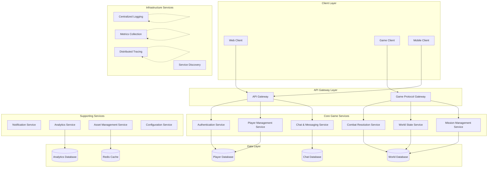

# Microservices Architecture Guide
**Decomposing the Matrix into Resilient, Scalable Services**

> *"The body cannot live without the mind."* - Morpheus (But each microservice can live independently, healing and scaling without affecting the whole.)

## 🎯 **The Vision of Distributed Architecture**

Matrix Online's revival demands architecture that can evolve, scale, and adapt like the Matrix itself - a collection of interconnected but independent services that work together to create a seamless virtual world. Microservices transform MXO from a monolithic structure into a dynamic ecosystem where each component can be developed, deployed, and scaled independently.

## 🏗️ **Architecture Principles**

### Core Design Philosophy

```yaml
microservices_principles:
  single_responsibility:
    description: "Each service owns a specific business capability"
    examples: ["Player authentication", "Combat resolution", "Chat messaging"]
    
  decentralized_governance:
    description: "Teams own their services end-to-end"
    includes: ["Technology choices", "Data storage", "Deployment schedules"]
    
  failure_isolation:
    description: "Service failures don't cascade"
    patterns: ["Circuit breakers", "Bulkheads", "Timeouts"]
    
  evolutionary_design:
    description: "Services evolve independently"
    enablers: ["API versioning", "Backward compatibility", "Contract testing"]
    
  technology_diversity:
    description: "Right tool for right job"
    languages: ["Go for performance", "Python for AI/ML", "JavaScript for real-time"]
    databases: ["PostgreSQL for transactions", "Redis for caching", "InfluxDB for metrics"]
```

### Service Boundaries



## 🔑 **Core Services Architecture**

### Authentication Service

```go
// auth-service/main.go - JWT-based authentication microservice
package main

import (
    "context"
    "encoding/json"
    "fmt"
    "log"
    "net/http"
    "time"
    
    "github.com/golang-jwt/jwt/v5"
    "github.com/gorilla/mux"
    "github.com/prometheus/client_golang/prometheus"
    "github.com/prometheus/client_golang/prometheus/promauto"
    "github.com/prometheus/client_golang/prometheus/promhttp"
    "go.opentelemetry.io/otel"
    "go.opentelemetry.io/otel/trace"
)

type AuthService struct {
    jwtSecret     []byte
    tokenExpiry   time.Duration
    userStore     UserStore
    tracer        trace.Tracer
    loginCounter  prometheus.Counter
    loginLatency  prometheus.Histogram
}

type LoginRequest struct {
    Username string `json:"username"`
    Password string `json:"password"`
    GameClient string `json:"game_client,omitempty"`
}

type LoginResponse struct {
    Token        string    `json:"token"`
    RefreshToken string    `json:"refresh_token"`
    ExpiresAt    time.Time `json:"expires_at"`
    PlayerID     string    `json:"player_id"`
    Permissions  []string  `json:"permissions"`
}

type UserClaims struct {
    PlayerID    string   `json:"player_id"`
    Username    string   `json:"username"`
    Permissions []string `json:"permissions"`
    GameClient  string   `json:"game_client"`
    jwt.RegisteredClaims
}

func NewAuthService(jwtSecret string, userStore UserStore) *AuthService {
    loginCounter := promauto.NewCounter(prometheus.CounterOpts{
        Name: "mxo_auth_login_attempts_total",
        Help: "Total number of login attempts",
    })
    
    loginLatency := promauto.NewHistogram(prometheus.HistogramOpts{
        Name: "mxo_auth_login_duration_seconds",
        Help: "Login request duration",
        Buckets: []float64{0.1, 0.5, 1.0, 2.0, 5.0},
    })
    
    return &AuthService{
        jwtSecret:    []byte(jwtSecret),
        tokenExpiry:  24 * time.Hour,
        userStore:    userStore,
        tracer:       otel.Tracer("auth-service"),
        loginCounter: loginCounter,
        loginLatency: loginLatency,
    }
}

func (as *AuthService) LoginHandler(w http.ResponseWriter, r *http.Request) {
    ctx, span := as.tracer.Start(r.Context(), "auth.login")
    defer span.End()
    
    timer := prometheus.NewTimer(as.loginLatency)
    defer timer.ObserveDuration()
    as.loginCounter.Inc()
    
    var req LoginRequest
    if err := json.NewDecoder(r.Body).Decode(&req); err != nil {
        http.Error(w, "Invalid request body", http.StatusBadRequest)
        return
    }
    
    // Validate credentials
    user, err := as.userStore.ValidateCredentials(ctx, req.Username, req.Password)
    if err != nil {
        span.SetAttributes(trace.StringAttribute("error", "invalid_credentials"))
        http.Error(w, "Invalid credentials", http.StatusUnauthorized)
        return
    }
    
    // Generate JWT token
    claims := UserClaims{
        PlayerID:    user.PlayerID,
        Username:    user.Username,
        Permissions: user.Permissions,
        GameClient:  req.GameClient,
        RegisteredClaims: jwt.RegisteredClaims{
            ExpiresAt: jwt.NewNumericDate(time.Now().Add(as.tokenExpiry)),
            IssuedAt:  jwt.NewNumericDate(time.Now()),
            NotBefore: jwt.NewNumericDate(time.Now()),
            Issuer:    "mxo-auth-service",
            Subject:   user.PlayerID,
            ID:        generateTokenID(),
        },
    }
    
    token := jwt.NewWithClaims(jwt.SigningMethodHS256, claims)
    tokenString, err := token.SignedString(as.jwtSecret)
    if err != nil {
        span.SetAttributes(trace.StringAttribute("error", "token_generation_failed"))
        http.Error(w, "Token generation failed", http.StatusInternalServerError)
        return
    }
    
    // Generate refresh token
    refreshToken, err := as.generateRefreshToken(ctx, user.PlayerID)
    if err != nil {
        span.SetAttributes(trace.StringAttribute("error", "refresh_token_failed"))
        http.Error(w, "Refresh token generation failed", http.StatusInternalServerError)
        return
    }
    
    response := LoginResponse{
        Token:        tokenString,
        RefreshToken: refreshToken,
        ExpiresAt:    time.Now().Add(as.tokenExpiry),
        PlayerID:     user.PlayerID,
        Permissions:  user.Permissions,
    }
    
    w.Header().Set("Content-Type", "application/json")
    json.NewEncoder(w).Encode(response)
    
    span.SetAttributes(
        trace.StringAttribute("player_id", user.PlayerID),
        trace.StringAttribute("username", user.Username),
        trace.StringAttribute("game_client", req.GameClient),
    )
}

func (as *AuthService) ValidateTokenHandler(w http.ResponseWriter, r *http.Request) {
    ctx, span := as.tracer.Start(r.Context(), "auth.validate")
    defer span.End()
    
    tokenString := extractTokenFromHeader(r)
    if tokenString == "" {
        http.Error(w, "Missing authorization token", http.StatusUnauthorized)
        return
    }
    
    claims, err := as.validateToken(ctx, tokenString)
    if err != nil {
        span.SetAttributes(trace.StringAttribute("error", "token_validation_failed"))
        http.Error(w, "Invalid token", http.StatusUnauthorized)
        return
    }
    
    // Return user claims
    w.Header().Set("Content-Type", "application/json")
    json.NewEncoder(w).Encode(claims)
    
    span.SetAttributes(
        trace.StringAttribute("player_id", claims.PlayerID),
        trace.StringAttribute("username", claims.Username),
    )
}

func (as *AuthService) validateToken(ctx context.Context, tokenString string) (*UserClaims, error) {
    token, err := jwt.ParseWithClaims(tokenString, &UserClaims{}, func(token *jwt.Token) (interface{}, error) {
        if _, ok := token.Method.(*jwt.SigningMethodHMAC); !ok {
            return nil, fmt.Errorf("unexpected signing method: %v", token.Header["alg"])
        }
        return as.jwtSecret, nil
    })
    
    if err != nil {
        return nil, err
    }
    
    if claims, ok := token.Claims.(*UserClaims); ok && token.Valid {
        return claims, nil
    }
    
    return nil, fmt.Errorf("invalid token claims")
}

func main() {
    // Initialize dependencies
    userStore := NewDatabaseUserStore()
    authService := NewAuthService("your-secret-key", userStore)
    
    // Setup routes
    r := mux.NewRouter()
    r.HandleFunc("/auth/login", authService.LoginHandler).Methods("POST")
    r.HandleFunc("/auth/validate", authService.ValidateTokenHandler).Methods("GET")
    r.HandleFunc("/auth/refresh", authService.RefreshTokenHandler).Methods("POST")
    r.Handle("/metrics", promhttp.Handler())
    r.HandleFunc("/health", healthCheckHandler).Methods("GET")
    
    // Start server
    log.Println("Authentication service starting on :8080")
    log.Fatal(http.ListenAndServe(":8080", r))
}
```

### Combat Resolution Service

```go
// combat-service/combat.go - Real-time combat resolution microservice
package main

import (
    "context"
    "encoding/json"
    "fmt"
    "math/rand"
    "net/http"
    "sync"
    "time"
    
    "github.com/gorilla/websocket"
    "go.opentelemetry.io/otel"
    "go.opentelemetry.io/otel/trace"
)

type CombatService struct {
    activeGames sync.Map  // map[string]*CombatSession
    upgrader    websocket.Upgrader
    tracer      trace.Tracer
    ruleEngine  *CombatRuleEngine
}

type CombatSession struct {
    ID          string                     `json:"id"`
    Players     map[string]*CombatPlayer   `json:"players"`
    State       CombatState                `json:"state"`
    Turn        int                        `json:"turn"`
    StartTime   time.Time                  `json:"start_time"`
    LastUpdate  time.Time                  `json:"last_update"`
    Rules       CombatRules                `json:"rules"`
    Events      []CombatEvent              `json:"events"`
    mutex       sync.RWMutex
}

type CombatPlayer struct {
    PlayerID     string              `json:"player_id"`
    Connection   *websocket.Conn     `json:"-"`
    Stats        PlayerStats         `json:"stats"`
    Position     Vector3             `json:"position"`
    Abilities    []Ability           `json:"abilities"`
    Status       []StatusEffect      `json:"status_effects"`
    IsReady      bool                `json:"is_ready"`
    LastAction   time.Time           `json:"last_action"`
}

type CombatAction struct {
    Type        ActionType    `json:"type"`
    PlayerID    string        `json:"player_id"`
    TargetID    string        `json:"target_id,omitempty"`
    AbilityID   string        `json:"ability_id,omitempty"`
    Position    *Vector3      `json:"position,omitempty"`
    Parameters  ActionParams  `json:"parameters,omitempty"`
    Timestamp   time.Time     `json:"timestamp"`
}

type CombatResult struct {
    Success     bool              `json:"success"`
    Damage      int               `json:"damage,omitempty"`
    Effects     []StatusEffect    `json:"effects,omitempty"`
    Animation   string            `json:"animation,omitempty"`
    Duration    time.Duration     `json:"duration,omitempty"`
    CriticalHit bool              `json:"critical_hit,omitempty"`
    BlockedBy   string            `json:"blocked_by,omitempty"`
}

func NewCombatService() *CombatService {
    return &CombatService{
        upgrader: websocket.Upgrader{
            CheckOrigin: func(r *http.Request) bool { return true },
        },
        tracer:     otel.Tracer("combat-service"),
        ruleEngine: NewCombatRuleEngine(),
    }
}

func (cs *CombatService) HandleWebSocket(w http.ResponseWriter, r *http.Request) {
    ctx, span := cs.tracer.Start(r.Context(), "combat.websocket_connect")
    defer span.End()
    
    conn, err := cs.upgrader.Upgrade(w, r, nil)
    if err != nil {
        span.SetAttributes(trace.StringAttribute("error", "websocket_upgrade_failed"))
        return
    }
    defer conn.Close()
    
    playerID := r.URL.Query().Get("player_id")
    sessionID := r.URL.Query().Get("session_id")
    
    if playerID == "" || sessionID == "" {
        conn.WriteMessage(websocket.TextMessage, []byte(`{"error": "missing player_id or session_id"}`))
        return
    }
    
    // Join or create combat session
    session := cs.getOrCreateSession(sessionID)
    if err := session.AddPlayer(playerID, conn); err != nil {
        conn.WriteMessage(websocket.TextMessage, []byte(fmt.Sprintf(`{"error": "%s"}`, err.Error())))
        return
    }
    
    span.SetAttributes(
        trace.StringAttribute("player_id", playerID),
        trace.StringAttribute("session_id", sessionID),
    )
    
    // Handle messages
    cs.handlePlayerMessages(ctx, session, playerID, conn)
}

func (cs *CombatService) handlePlayerMessages(ctx context.Context, session *CombatSession, playerID string, conn *websocket.Conn) {
    for {
        var action CombatAction
        err := conn.ReadJSON(&action)
        if err != nil {
            break
        }
        
        action.PlayerID = playerID
        action.Timestamp = time.Now()
        
        // Process combat action
        result := cs.processCombatAction(ctx, session, action)
        
        // Broadcast result to all players
        session.BroadcastUpdate(CombatUpdate{
            Type:   "action_result",
            Action: action,
            Result: result,
        })
    }
    
    // Remove player from session
    session.RemovePlayer(playerID)
}

func (cs *CombatService) processCombatAction(ctx context.Context, session *CombatSession, action CombatAction) CombatResult {
    ctx, span := cs.tracer.Start(ctx, "combat.process_action")
    defer span.End()
    
    span.SetAttributes(
        trace.StringAttribute("action_type", string(action.Type)),
        trace.StringAttribute("player_id", action.PlayerID),
        trace.StringAttribute("session_id", session.ID),
    )
    
    session.mutex.Lock()
    defer session.mutex.Unlock()
    
    player, exists := session.Players[action.PlayerID]
    if !exists {
        return CombatResult{Success: false}
    }
    
    // Validate action timing
    if time.Since(player.LastAction) < time.Millisecond*500 {
        return CombatResult{Success: false} // Action too frequent
    }
    
    var result CombatResult
    
    switch action.Type {
    case ActionTypeAttack:
        result = cs.processAttackAction(ctx, session, player, action)
    case ActionTypeDefend:
        result = cs.processDefendAction(ctx, session, player, action)
    case ActionTypeMove:
        result = cs.processMoveAction(ctx, session, player, action)
    case ActionTypeAbility:
        result = cs.processAbilityAction(ctx, session, player, action)
    default:
        result = CombatResult{Success: false}
    }
    
    player.LastAction = time.Now()
    session.LastUpdate = time.Now()
    
    // Add event to session history
    session.Events = append(session.Events, CombatEvent{
        Type:      "action_processed",
        PlayerID:  action.PlayerID,
        Action:    action,
        Result:    result,
        Timestamp: time.Now(),
    })
    
    return result
}

func (cs *CombatService) processAttackAction(ctx context.Context, session *CombatSession, attacker *CombatPlayer, action CombatAction) CombatResult {
    target, exists := session.Players[action.TargetID]
    if !exists {
        return CombatResult{Success: false}
    }
    
    // Calculate hit chance using D100 system
    hitRoll := rand.Intn(100) + 1
    hitChance := cs.ruleEngine.CalculateHitChance(attacker, target)
    
    if hitRoll > hitChance {
        return CombatResult{
            Success:   true,
            Damage:    0,
            Animation: "miss",
        }
    }
    
    // Calculate damage
    baseDamage := cs.ruleEngine.CalculateBaseDamage(attacker, action)
    finalDamage := cs.ruleEngine.ApplyDamageModifiers(baseDamage, attacker, target)
    
    // Check for critical hit
    critRoll := rand.Intn(100) + 1
    critChance := cs.ruleEngine.CalculateCriticalChance(attacker)
    isCritical := critRoll <= critChance
    
    if isCritical {
        finalDamage = int(float64(finalDamage) * 1.5) // 50% bonus damage
    }
    
    // Apply damage
    target.Stats.Health -= finalDamage
    if target.Stats.Health < 0 {
        target.Stats.Health = 0
    }
    
    return CombatResult{
        Success:     true,
        Damage:      finalDamage,
        CriticalHit: isCritical,
        Animation:   cs.getAttackAnimation(action),
        Duration:    time.Millisecond * 1500,
    }
}

type CombatRuleEngine struct {
    baseHitChance    int
    criticalModifier float64
    damageVariance   float64
}

func NewCombatRuleEngine() *CombatRuleEngine {
    return &CombatRuleEngine{
        baseHitChance:    70,
        criticalModifier: 1.5,
        damageVariance:   0.2,
    }
}

func (cre *CombatRuleEngine) CalculateHitChance(attacker, target *CombatPlayer) int {
    baseChance := cre.baseHitChance
    
    // Modify based on attacker's accuracy
    accuracyBonus := (attacker.Stats.Accuracy - 50) / 2
    
    // Modify based on target's evasion
    evasionPenalty := (target.Stats.Evasion - 50) / 2
    
    // Distance modifier
    distance := calculateDistance(attacker.Position, target.Position)
    distancePenalty := int(distance / 10) // -1% per 10 units
    
    finalChance := baseChance + accuracyBonus - evasionPenalty - distancePenalty
    
    // Clamp between 5% and 95%
    if finalChance < 5 {
        finalChance = 5
    } else if finalChance > 95 {
        finalChance = 95
    }
    
    return finalChance
}

func (cre *CombatRuleEngine) CalculateBaseDamage(attacker *CombatPlayer, action CombatAction) int {
    baseDamage := attacker.Stats.Attack
    
    // Apply weapon damage if specified
    if action.Parameters != nil {
        if weaponDamage, ok := action.Parameters["weapon_damage"].(int); ok {
            baseDamage += weaponDamage
        }
    }
    
    // Add random variance
    variance := float64(baseDamage) * cre.damageVariance
    randomModifier := (rand.Float64() * 2 - 1) * variance // -variance to +variance
    
    return baseDamage + int(randomModifier)
}

func (cs *CombatService) getOrCreateSession(sessionID string) *CombatSession {
    if session, exists := cs.activeGames.Load(sessionID); exists {
        return session.(*CombatSession)
    }
    
    session := &CombatSession{
        ID:         sessionID,
        Players:    make(map[string]*CombatPlayer),
        State:      CombatStateWaiting,
        StartTime:  time.Now(),
        LastUpdate: time.Now(),
        Rules:      DefaultCombatRules(),
        Events:     make([]CombatEvent, 0),
    }
    
    cs.activeGames.Store(sessionID, session)
    return session
}

func (session *CombatSession) AddPlayer(playerID string, conn *websocket.Conn) error {
    session.mutex.Lock()
    defer session.mutex.Unlock()
    
    if len(session.Players) >= 2 {
        return fmt.Errorf("session is full")
    }
    
    player := &CombatPlayer{
        PlayerID:   playerID,
        Connection: conn,
        Stats:      DefaultPlayerStats(),
        Position:   Vector3{X: 0, Y: 0, Z: 0},
        Abilities:  []Ability{},
        Status:     []StatusEffect{},
        IsReady:    false,
        LastAction: time.Now(),
    }
    
    session.Players[playerID] = player
    
    // Start combat if both players are ready
    if len(session.Players) == 2 && session.State == CombatStateWaiting {
        session.State = CombatStateActive
        session.BroadcastUpdate(CombatUpdate{
            Type: "combat_started",
            Session: session,
        })
    }
    
    return nil
}

func (session *CombatSession) BroadcastUpdate(update CombatUpdate) {
    updateJSON, _ := json.Marshal(update)
    
    for _, player := range session.Players {
        if player.Connection != nil {
            player.Connection.WriteMessage(websocket.TextMessage, updateJSON)
        }
    }
}
```

### World State Service

```go
// world-service/world.go - Persistent world state management
package main

import (
    "context"
    "encoding/json"
    "sync"
    "time"
    
    "github.com/nats-io/nats.go"
    "go.opentelemetry.io/otel"
    "go.opentelemetry.io/otel/trace"
)

type WorldService struct {
    districts     map[string]*District
    players       map[string]*WorldPlayer
    objects       map[string]*WorldObject
    events        chan WorldEvent
    natsConn      *nats.Conn
    tracer        trace.Tracer
    ticker        *time.Ticker
    mutex         sync.RWMutex
}

type District struct {
    ID           string                    `json:"id"`
    Name         string                    `json:"name"`
    MaxPlayers   int                       `json:"max_players"`
    Players      map[string]*WorldPlayer   `json:"players"`
    Objects      map[string]*WorldObject   `json:"objects"`
    Environment  EnvironmentState          `json:"environment"`
    LastUpdate   time.Time                 `json:"last_update"`
}

type WorldPlayer struct {
    PlayerID      string                `json:"player_id"`
    Position      Vector3               `json:"position"`
    Rotation      Quaternion            `json:"rotation"`
    Velocity      Vector3               `json:"velocity"`
    Animation     string                `json:"animation"`
    DistrictID    string                `json:"district_id"`
    LastUpdate    time.Time             `json:"last_update"`
    IsConnected   bool                  `json:"is_connected"`
}

type WorldObject struct {
    ID            string                `json:"id"`
    Type          ObjectType            `json:"type"`
    Position      Vector3               `json:"position"`
    Rotation      Quaternion            `json:"rotation"`
    Scale         Vector3               `json:"scale"`
    Properties    map[string]interface{} `json:"properties"`
    DistrictID    string                `json:"district_id"`
    Interactive   bool                  `json:"interactive"`
    LastModified  time.Time             `json:"last_modified"`
}

type WorldEvent struct {
    Type        EventType             `json:"type"`
    PlayerID    string                `json:"player_id,omitempty"`
    ObjectID    string                `json:"object_id,omitempty"`
    DistrictID  string                `json:"district_id"`
    Data        map[string]interface{} `json:"data"`
    Timestamp   time.Time             `json:"timestamp"`
}

func NewWorldService(natsURL string) (*WorldService, error) {
    nc, err := nats.Connect(natsURL)
    if err != nil {
        return nil, err
    }
    
    ws := &WorldService{
        districts: make(map[string]*District),
        players:   make(map[string]*WorldPlayer),
        objects:   make(map[string]*WorldObject),
        events:    make(chan WorldEvent, 1000),
        natsConn:  nc,
        tracer:    otel.Tracer("world-service"),
        ticker:    time.NewTicker(time.Millisecond * 50), // 20 Hz updates
    }
    
    // Initialize default districts
    ws.initializeDistricts()
    
    // Start event processing
    go ws.processEvents()
    go ws.worldUpdateLoop()
    
    // Subscribe to player events
    ws.subscribeToPlayerEvents()
    
    return ws, nil
}

func (ws *WorldService) initializeDistricts() {
    districts := []District{
        {
            ID:         "downtown",
            Name:       "Downtown",
            MaxPlayers: 100,
            Players:    make(map[string]*WorldPlayer),
            Objects:    make(map[string]*WorldObject),
            Environment: EnvironmentState{
                TimeOfDay:   12.0, // Noon
                Weather:     "clear",
                Temperature: 22.0,
                Lighting:    "daylight",
            },
            LastUpdate: time.Now(),
        },
        {
            ID:         "westview",
            Name:       "Westview",
            MaxPlayers: 100,
            Players:    make(map[string]*WorldPlayer),
            Objects:    make(map[string]*WorldObject),
            Environment: EnvironmentState{
                TimeOfDay:   12.0,
                Weather:     "clear",
                Temperature: 22.0,
                Lighting:    "daylight",
            },
            LastUpdate: time.Now(),
        },
        {
            ID:         "international",
            Name:       "International",
            MaxPlayers: 100,
            Players:    make(map[string]*WorldPlayer),
            Objects:    make(map[string]*WorldObject),
            Environment: EnvironmentState{
                TimeOfDay:   12.0,
                Weather:     "clear",
                Temperature: 22.0,
                Lighting:    "daylight",
            },
            LastUpdate: time.Now(),
        },
    }
    
    for _, district := range districts {
        ws.districts[district.ID] = &district
        ws.loadDistrictObjects(district.ID)
    }
}

func (ws *WorldService) PlayerMove(ctx context.Context, playerID string, position Vector3, rotation Quaternion) error {
    ctx, span := ws.tracer.Start(ctx, "world.player_move")
    defer span.End()
    
    ws.mutex.Lock()
    defer ws.mutex.Unlock()
    
    player, exists := ws.players[playerID]
    if !exists {
        return fmt.Errorf("player not found")
    }
    
    // Validate movement (anti-cheat)
    if !ws.validateMovement(player, position) {
        span.SetAttributes(trace.StringAttribute("error", "invalid_movement"))
        return fmt.Errorf("invalid movement detected")
    }
    
    // Update player position
    oldPosition := player.Position
    player.Position = position
    player.Rotation = rotation
    player.LastUpdate = time.Now()
    
    // Calculate velocity
    deltaTime := time.Since(player.LastUpdate).Seconds()
    if deltaTime > 0 {
        player.Velocity = Vector3{
            X: (position.X - oldPosition.X) / float64(deltaTime),
            Y: (position.Y - oldPosition.Y) / float64(deltaTime),
            Z: (position.Z - oldPosition.Z) / float64(deltaTime),
        }
    }
    
    // Check for district changes
    newDistrictID := ws.getDistrictForPosition(position)
    if newDistrictID != player.DistrictID {
        ws.changePlayerDistrict(playerID, player.DistrictID, newDistrictID)
    }
    
    // Broadcast movement to nearby players
    ws.broadcastPlayerMovement(player)
    
    span.SetAttributes(
        trace.StringAttribute("player_id", playerID),
        trace.StringAttribute("district_id", player.DistrictID),
        trace.Float64Attribute("x", position.X),
        trace.Float64Attribute("y", position.Y),
        trace.Float64Attribute("z", position.Z),
    )
    
    return nil
}

func (ws *WorldService) validateMovement(player *WorldPlayer, newPosition Vector3) bool {
    // Maximum movement speed (units per second)
    const maxSpeed = 20.0
    
    deltaTime := time.Since(player.LastUpdate).Seconds()
    if deltaTime <= 0 {
        return true // First movement or time issue
    }
    
    distance := calculateDistance(player.Position, newPosition)
    speed := distance / deltaTime
    
    return speed <= maxSpeed
}

func (ws *WorldService) broadcastPlayerMovement(player *WorldPlayer) {
    // Find nearby players (within 100 units)
    nearbyPlayers := ws.findNearbyPlayers(player.PlayerID, player.Position, 100.0)
    
    movementData := map[string]interface{}{
        "player_id": player.PlayerID,
        "position":  player.Position,
        "rotation":  player.Rotation,
        "velocity":  player.Velocity,
        "animation": player.Animation,
    }
    
    for _, nearbyPlayer := range nearbyPlayers {
        ws.natsConn.Publish(
            fmt.Sprintf("world.player.%s.movement", nearbyPlayer.PlayerID),
            marshalJSON(movementData),
        )
    }
}

func (ws *WorldService) worldUpdateLoop() {
    for range ws.ticker.C {
        ws.updateWorld()
    }
}

func (ws *WorldService) updateWorld() {
    ctx, span := ws.tracer.Start(context.Background(), "world.update")
    defer span.End()
    
    now := time.Now()
    
    ws.mutex.Lock()
    defer ws.mutex.Unlock()
    
    // Update each district
    for _, district := range ws.districts {
        ws.updateDistrict(district, now)
    }
    
    // Clean up disconnected players
    ws.cleanupDisconnectedPlayers(now)
    
    // Update environmental effects
    ws.updateEnvironment(now)
}

func (ws *WorldService) updateDistrict(district *District, now time.Time) {
    // Update time of day (1 game hour = 5 real minutes)
    deltaTime := now.Sub(district.LastUpdate).Minutes()
    district.Environment.TimeOfDay += deltaTime / 5.0 * 24.0
    if district.Environment.TimeOfDay >= 24.0 {
        district.Environment.TimeOfDay -= 24.0
    }
    
    // Update lighting based on time of day
    district.Environment.Lighting = ws.calculateLighting(district.Environment.TimeOfDay)
    
    // Update dynamic objects
    for _, obj := range district.Objects {
        if obj.Type == ObjectTypeDynamic {
            ws.updateDynamicObject(obj, now)
        }
    }
    
    district.LastUpdate = now
}

func (ws *WorldService) calculateLighting(timeOfDay float64) string {
    if timeOfDay >= 6.0 && timeOfDay < 18.0 {
        return "daylight"
    } else if timeOfDay >= 18.0 && timeOfDay < 20.0 {
        return "sunset"
    } else if timeOfDay >= 5.0 && timeOfDay < 7.0 {
        return "sunrise"
    } else {
        return "night"
    }
}

func (ws *WorldService) findNearbyPlayers(excludePlayerID string, position Vector3, radius float64) []*WorldPlayer {
    var nearby []*WorldPlayer
    
    for playerID, player := range ws.players {
        if playerID == excludePlayerID || !player.IsConnected {
            continue
        }
        
        distance := calculateDistance(position, player.Position)
        if distance <= radius {
            nearby = append(nearby, player)
        }
    }
    
    return nearby
}

func (ws *WorldService) processEvents() {
    for event := range ws.events {
        ws.handleWorldEvent(event)
    }
}

func (ws *WorldService) handleWorldEvent(event WorldEvent) {
    ctx, span := ws.tracer.Start(context.Background(), "world.handle_event")
    defer span.End()
    
    span.SetAttributes(
        trace.StringAttribute("event_type", string(event.Type)),
        trace.StringAttribute("district_id", event.DistrictID),
    )
    
    switch event.Type {
    case EventTypePlayerJoin:
        ws.handlePlayerJoin(ctx, event)
    case EventTypePlayerLeave:
        ws.handlePlayerLeave(ctx, event)
    case EventTypeObjectInteraction:
        ws.handleObjectInteraction(ctx, event)
    case EventTypeEnvironmentChange:
        ws.handleEnvironmentChange(ctx, event)
    }
}

func (ws *WorldService) GetDistrictState(districtID string) (*District, error) {
    ws.mutex.RLock()
    defer ws.mutex.RUnlock()
    
    district, exists := ws.districts[districtID]
    if !exists {
        return nil, fmt.Errorf("district not found: %s", districtID)
    }
    
    // Return a copy to prevent external modification
    districtCopy := *district
    districtCopy.Players = make(map[string]*WorldPlayer)
    districtCopy.Objects = make(map[string]*WorldObject)
    
    for id, player := range district.Players {
        playerCopy := *player
        districtCopy.Players[id] = &playerCopy
    }
    
    for id, obj := range district.Objects {
        objCopy := *obj
        districtCopy.Objects[id] = &objCopy
    }
    
    return &districtCopy, nil
}

// Helper functions
func calculateDistance(a, b Vector3) float64 {
    dx := a.X - b.X
    dy := a.Y - b.Y
    dz := a.Z - b.Z
    return math.Sqrt(dx*dx + dy*dy + dz*dz)
}

func marshalJSON(v interface{}) []byte {
    data, _ := json.Marshal(v)
    return data
}
```

## 📱 **API Gateway and Service Communication**

### API Gateway Configuration

```yaml
# api-gateway.yml - Kong API Gateway for Matrix Online
apiVersion: configuration.konghq.com/v1
kind: KongPlugin
metadata:
  name: mxo-auth
plugin: jwt
config:
  uri_param_names:
    - token
  header_names:
    - Authorization
  key_claim_name: player_id
  run_on_preflight: true
---
apiVersion: configuration.konghq.com/v1
kind: KongPlugin
metadata:
  name: mxo-rate-limit
plugin: rate-limiting
config:
  minute: 100
  hour: 1000
  policy: local
  fault_tolerant: true
  hide_client_headers: false
---
apiVersion: configuration.konghq.com/v1
kind: KongPlugin
metadata:
  name: mxo-cors
plugin: cors
config:
  origins:
    - "https://mxo.example.com"
    - "https://game.mxo.example.com"
  methods:
    - GET
    - POST
    - PUT
    - DELETE
    - OPTIONS
  headers:
    - Accept
    - Accept-Version
    - Content-Length
    - Content-MD5
    - Content-Type
    - Date
    - Authorization
    - X-Player-ID
  exposed_headers:
    - X-Auth-Token
  credentials: true
  max_age: 3600
---
apiVersion: networking.k8s.io/v1
kind: Ingress
metadata:
  name: mxo-api-gateway
  annotations:
    kubernetes.io/ingress.class: kong
    konghq.com/plugins: mxo-auth,mxo-rate-limit,mxo-cors
spec:
  tls:
  - hosts:
    - api.mxo.example.com
    secretName: mxo-tls-cert
  rules:
  - host: api.mxo.example.com
    http:
      paths:
      - path: /auth
        pathType: Prefix
        backend:
          service:
            name: auth-service
            port:
              number: 8080
      - path: /player
        pathType: Prefix
        backend:
          service:
            name: player-service
            port:
              number: 8080
      - path: /combat
        pathType: Prefix
        backend:
          service:
            name: combat-service
            port:
              number: 8080
      - path: /world
        pathType: Prefix
        backend:
          service:
            name: world-service
            port:
              number: 8080
      - path: /chat
        pathType: Prefix
        backend:
          service:
            name: chat-service
            port:
              number: 8080
```

### Service-to-Service Communication

```go
// service-mesh/communication.go - gRPC communication between services
package servicemesh

import (
    "context"
    "fmt"
    "time"
    
    "google.golang.org/grpc"
    "google.golang.org/grpc/credentials/insecure"
    "google.golang.org/grpc/keepalive"
    "go.opentelemetry.io/contrib/instrumentation/google.golang.org/grpc/otelgrpc"
)

type ServiceRegistry struct {
    services map[string]string
    clients  map[string]*grpc.ClientConn
}

func NewServiceRegistry() *ServiceRegistry {
    return &ServiceRegistry{
        services: map[string]string{
            "auth-service":   "auth-service.mxo-production.svc.cluster.local:9090",
            "player-service": "player-service.mxo-production.svc.cluster.local:9090",
            "combat-service": "combat-service.mxo-production.svc.cluster.local:9090",
            "world-service":  "world-service.mxo-production.svc.cluster.local:9090",
            "chat-service":   "chat-service.mxo-production.svc.cluster.local:9090",
        },
        clients: make(map[string]*grpc.ClientConn),
    }
}

func (sr *ServiceRegistry) GetClient(serviceName string) (*grpc.ClientConn, error) {
    if client, exists := sr.clients[serviceName]; exists {
        return client, nil
    }
    
    address, exists := sr.services[serviceName]
    if !exists {
        return nil, fmt.Errorf("service not found: %s", serviceName)
    }
    
    // Connection configuration
    keepaliveParams := keepalive.ClientParameters{
        Time:                10 * time.Second,
        Timeout:             time.Second,
        PermitWithoutStream: true,
    }
    
    conn, err := grpc.Dial(
        address,
        grpc.WithTransportCredentials(insecure.NewCredentials()),
        grpc.WithKeepaliveParams(keepaliveParams),
        grpc.WithUnaryInterceptor(otelgrpc.UnaryClientInterceptor()),
        grpc.WithStreamInterceptor(otelgrpc.StreamClientInterceptor()),
    )
    
    if err != nil {
        return nil, fmt.Errorf("failed to connect to %s: %w", serviceName, err)
    }
    
    sr.clients[serviceName] = conn
    return conn, nil
}

// Example: Combat service calling Player service
type CombatPlayerClient struct {
    playerClient PlayerServiceClient
    registry     *ServiceRegistry
}

func NewCombatPlayerClient(registry *ServiceRegistry) (*CombatPlayerClient, error) {
    conn, err := registry.GetClient("player-service")
    if err != nil {
        return nil, err
    }
    
    return &CombatPlayerClient{
        playerClient: NewPlayerServiceClient(conn),
        registry:     registry,
    }, nil
}

func (cpc *CombatPlayerClient) GetPlayerStats(ctx context.Context, playerID string) (*PlayerStats, error) {
    ctx, cancel := context.WithTimeout(ctx, 5*time.Second)
    defer cancel()
    
    request := &GetPlayerStatsRequest{
        PlayerId: playerID,
    }
    
    response, err := cpc.playerClient.GetPlayerStats(ctx, request)
    if err != nil {
        return nil, fmt.Errorf("failed to get player stats: %w", err)
    }
    
    return response.Stats, nil
}

func (cpc *CombatPlayerClient) UpdatePlayerHealth(ctx context.Context, playerID string, newHealth int32) error {
    ctx, cancel := context.WithTimeout(ctx, 5*time.Second)
    defer cancel()
    
    request := &UpdatePlayerHealthRequest{
        PlayerId:  playerID,
        NewHealth: newHealth,
    }
    
    _, err := cpc.playerClient.UpdatePlayerHealth(ctx, request)
    return err
}
```

## 📊 **Monitoring and Observability**

### Distributed Tracing

```go
// tracing/tracer.go - OpenTelemetry distributed tracing setup
package tracing

import (
    "context"
    "fmt"
    
    "go.opentelemetry.io/otel"
    "go.opentelemetry.io/otel/exporters/jaeger"
    "go.opentelemetry.io/otel/propagation"
    "go.opentelemetry.io/otel/resource"
    "go.opentelemetry.io/otel/sdk/trace"
    semconv "go.opentelemetry.io/otel/semconv/v1.17.0"
)

func InitTracing(serviceName, jaegerEndpoint string) (*trace.TracerProvider, error) {
    // Create Jaeger exporter
    exp, err := jaeger.New(jaeger.WithCollectorEndpoint(jaeger.WithEndpoint(jaegerEndpoint)))
    if err != nil {
        return nil, fmt.Errorf("failed to create Jaeger exporter: %w", err)
    }
    
    // Create resource
    res, err := resource.New(
        context.Background(),
        resource.WithAttributes(
            semconv.ServiceNameKey.String(serviceName),
            semconv.ServiceVersionKey.String("v1.0.0"),
            semconv.DeploymentEnvironmentKey.String("production"),
        ),
    )
    if err != nil {
        return nil, fmt.Errorf("failed to create resource: %w", err)
    }
    
    // Create tracer provider
    tp := trace.NewTracerProvider(
        trace.WithBatcher(exp),
        trace.WithResource(res),
        trace.WithSampler(trace.TraceIDRatioBased(0.1)), // Sample 10% of traces
    )
    
    // Set global tracer provider
    otel.SetTracerProvider(tp)
    
    // Set global propagator
    otel.SetTextMapPropagator(propagation.NewCompositeTextMapPropagator(
        propagation.TraceContext{},
        propagation.Baggage{},
    ))
    
    return tp, nil
}

// Example middleware for HTTP services
func TracingMiddleware(serviceName string) func(http.Handler) http.Handler {
    tracer := otel.Tracer(serviceName)
    
    return func(next http.Handler) http.Handler {
        return http.HandlerFunc(func(w http.ResponseWriter, r *http.Request) {
            ctx := otel.GetTextMapPropagator().Extract(r.Context(), propagation.HeaderCarrier(r.Header))
            
            spanName := fmt.Sprintf("%s %s", r.Method, r.URL.Path)
            ctx, span := tracer.Start(ctx, spanName)
            defer span.End()
            
            // Add attributes
            span.SetAttributes(
                semconv.HTTPMethodKey.String(r.Method),
                semconv.HTTPURLKey.String(r.URL.String()),
                semconv.HTTPUserAgentKey.String(r.UserAgent()),
            )
            
            // Inject trace context into response headers
            otel.GetTextMapPropagator().Inject(ctx, propagation.HeaderCarrier(w.Header()))
            
            // Call next handler
            next.ServeHTTP(w, r.WithContext(ctx))
        })
    }
}
```

## Remember

> *"The Matrix is a system, Neo. That system is our enemy."* - Morpheus

Microservices aren't just about breaking apart a monolith - they're about creating a system that can adapt, evolve, and scale like a living organism. Each service operates independently, but together they create something greater than the sum of their parts.

In microservices, we find not just distributed computing, but distributed thinking. Each team owns their domain, makes their own technical decisions, and contributes to the greater Matrix while maintaining their autonomy.

**Design for independence. Build for resilience. Create the adaptive Matrix.**

---

**Guide Status**: 🟢 COMPREHENSIVE ARCHITECTURE  
**Service Independence**: 🔗 LOOSELY COUPLED  
**Liberation Impact**: ⭐⭐⭐⭐⭐  

*In microservices we find freedom. In independence we find resilience. In distributed architecture we find the truly scalable Matrix.*

---

[← Development Hub](index.md) | [← Kubernetes Orchestration](kubernetes-orchestration-guide.md) | [→ Scalability Patterns](scalability-patterns-guide.md)