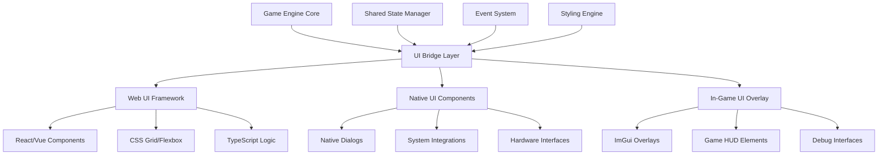

# Modern UI Frameworks Integration Guide
**Bringing Contemporary User Experience to the Matrix**

> *"There is no spoon."* - Spoon Boy (There is also no excuse for outdated UI when modern frameworks can bend reality to our will.)

## 🎯 **The Evolution of Interface**

Matrix Online's original 2005 UI served its time, but the digital landscape has transformed. Modern UI frameworks offer reactive interfaces, responsive design, accessibility features, and visual fidelity that can make the difference between a functional tool and an immersive experience. This guide charts the path from legacy Win32 dialogs to cutting-edge web-based and native UI frameworks.

## 🏗️ **Architecture Overview**

### Hybrid UI Architecture



### Framework Selection Matrix

```yaml
ui_framework_options:
  web_based:
    electron_react:
      pros: ["Modern web tech", "Rich ecosystem", "Hot reload", "Cross-platform"]
      cons: ["Memory overhead", "Startup time", "Native feel"]
      best_for: ["Configuration tools", "Admin interfaces", "Content browsers"]
      
    chromium_embedded:
      pros: ["Lightweight", "Direct integration", "Custom protocols"]
      cons: ["Complex setup", "Limited debugging", "Version management"]
      best_for: ["In-game overlays", "HUD elements", "Settings panels"]
      
    tauri_rust:
      pros: ["Small bundle", "Security focused", "Rust performance"]
      cons: ["Newer ecosystem", "Learning curve", "Limited Windows legacy"]
      best_for: ["Security-critical tools", "Performance-sensitive UIs"]
      
  native_frameworks:
    qt6:
      pros: ["Native performance", "Rich widgets", "Mature ecosystem"]
      cons: ["Large runtime", "Licensing costs", "C++ complexity"]
      best_for: ["Professional tools", "Complex dialogs", "System integration"]
      
    flutter_desktop:
      pros: ["Single codebase", "Smooth animations", "Growing ecosystem"]
      cons: ["Large runtime", "Limited native integration"]
      best_for: ["Cross-platform tools", "Animated interfaces"]
      
    dear_imgui:
      pros: ["Immediate mode", "Game integration", "Lightweight"]
      cons: ["Programming-heavy", "Limited styling", "Retention model"]
      best_for: ["Debug tools", "Developer interfaces", "In-game overlays"]

recommended_stack:
  primary: "Chromium Embedded Framework + React"
  secondary: "Dear ImGui for debug/dev tools"
  tertiary: "Native Qt6 for system-critical dialogs"
```

## 🌐 **Web-Based UI Implementation**

### Chromium Embedded Framework Setup

```cpp
// CEF integration for Matrix Online UI
#include "include/cef_app.h"
#include "include/cef_browser.h"
#include "include/cef_client.h"

namespace MXO::UI {
    
    class MatrixUIApplication : public CefApp, public CefRenderProcessHandler {
    private:
        IMPLEMENT_REFCOUNTING(MatrixUIApplication);
        
    public:
        virtual CefRefPtr<CefRenderProcessHandler> GetRenderProcessHandler() override {
            return this;
        }
        
        virtual void OnContextCreated(CefRefPtr<CefBrowser> browser,
                                    CefRefPtr<CefFrame> frame,
                                    CefRefPtr<CefV8Context> context) override {
            // Inject Matrix Online API into JavaScript context
            auto global = context->GetGlobal();
            
            // Create MXO namespace
            auto mxoObject = CefV8Value::CreateObject(nullptr, nullptr);
            global->SetValue("MXO", mxoObject, V8_PROPERTY_ATTRIBUTE_NONE);
            
            // Game state access
            auto gameStateFunc = CefV8Value::CreateFunction("getGameState", new GameStateHandler());
            mxoObject->SetValue("getGameState", gameStateFunc, V8_PROPERTY_ATTRIBUTE_NONE);
            
            // Character management
            auto characterFunc = CefV8Value::CreateFunction("getCharacter", new CharacterHandler());
            mxoObject->SetValue("getCharacter", characterFunc, V8_PROPERTY_ATTRIBUTE_NONE);
            
            // Server communication
            auto serverFunc = CefV8Value::CreateFunction("sendCommand", new ServerCommandHandler());
            mxoObject->SetValue("sendCommand", serverFunc, V8_PROPERTY_ATTRIBUTE_NONE);
            
            // UI events
            auto eventFunc = CefV8Value::CreateFunction("addEventListener", new UIEventHandler());
            mxoObject->SetValue("addEventListener", eventFunc, V8_PROPERTY_ATTRIBUTE_NONE);
        }
    };
    
    class MatrixUIClient : public CefClient, 
                          public CefDisplayHandler,
                          public CefLoadHandler,
                          public CefRequestHandler {
    private:
        CefRefPtr<CefBrowser> m_browser;
        std::unique_ptr<UIMessageRouter> m_messageRouter;
        
        IMPLEMENT_REFCOUNTING(MatrixUIClient);
        
    public:
        MatrixUIClient() {
            m_messageRouter = std::make_unique<UIMessageRouter>();
        }
        
        // CefClient methods
        virtual CefRefPtr<CefDisplayHandler> GetDisplayHandler() override { return this; }
        virtual CefRefPtr<CefLoadHandler> GetLoadHandler() override { return this; }
        virtual CefRefPtr<CefRequestHandler> GetRequestHandler() override { return this; }
        
        // Custom resource handling for Matrix assets
        virtual CefRefPtr<CefResourceRequestHandler> GetResourceRequestHandler(
            CefRefPtr<CefBrowser> browser,
            CefRefPtr<CefFrame> frame,
            CefRefPtr<CefRequest> request,
            bool is_navigation,
            bool is_download,
            const CefString& request_initiator,
            bool& disable_default_handling) override {
            
            std::string url = request->GetURL();
            
            // Handle matrix:// protocol for accessing game assets
            if (url.find("matrix://") == 0) {
                return new MatrixResourceHandler();
            }
            
            return nullptr;
        }
        
        virtual void OnLoadEnd(CefRefPtr<CefBrowser> browser,
                              CefRefPtr<CefFrame> frame,
                              int httpStatusCode) override {
            if (frame->IsMain()) {
                // Initialize UI after page load
                InitializeMatrixUI(browser);
            }
        }
        
    private:
        void InitializeMatrixUI(CefRefPtr<CefBrowser> browser) {
            // Send initial game state to UI
            auto frame = browser->GetMainFrame();
            
            // Get current game state
            auto gameState = GetCurrentGameState();
            std::string initScript = 
                "window.MXO.initialize(" + SerializeGameState(gameState) + ");";
            
            frame->ExecuteJavaScript(initScript, "", 0);
        }
    };
    
    // High-level UI Manager
    class ModernUIManager {
    private:
        CefRefPtr<CefBrowser> m_mainBrowser;
        std::vector<CefRefPtr<CefBrowser>> m_overlayBrowsers;
        std::unique_ptr<UIEventDispatcher> m_eventDispatcher;
        bool m_initialized = false;
        
    public:
        bool Initialize(HWND parentWindow, const UIConfig& config) {
            // Initialize CEF
            CefMainArgs mainArgs(GetModuleHandle(nullptr));
            
            CefSettings settings;
            settings.no_sandbox = true;
            settings.multi_threaded_message_loop = false;
            settings.windowless_rendering_enabled = true;
            
            // Set custom schemes
            CefSchemeRegistrarRef schemes;
            schemes->AddCustomScheme("matrix", 
                                   CEF_SCHEME_OPTION_STANDARD | 
                                   CEF_SCHEME_OPTION_CORS_ENABLED);
            
            if (!CefInitialize(mainArgs, settings, new MatrixUIApplication(), nullptr)) {
                return false;
            }
            
            // Create main UI browser
            CreateMainInterface(parentWindow, config);
            
            // Setup event system
            m_eventDispatcher = std::make_unique<UIEventDispatcher>();
            m_eventDispatcher->Initialize();
            
            m_initialized = true;
            return true;
        }
        
        void CreateMainInterface(HWND parent, const UIConfig& config) {
            CefWindowInfo windowInfo;
            windowInfo.SetAsChild(parent, 
                                {0, 0, config.width, config.height});
            
            CefBrowserSettings browserSettings;
            browserSettings.web_security = STATE_DISABLED; // Allow local resources
            
            CefRefPtr<MatrixUIClient> client = new MatrixUIClient();
            
            m_mainBrowser = CefBrowserHost::CreateBrowserSync(
                windowInfo,
                client,
                "matrix://ui/main/index.html",
                browserSettings,
                nullptr,
                nullptr
            );
        }
        
        void CreateOverlay(const std::string& overlayId, const OverlayConfig& config) {
            CefWindowInfo windowInfo;
            windowInfo.SetAsWindowless(nullptr); // Transparent overlay
            
            CefBrowserSettings browserSettings;
            browserSettings.background_color = 0x00000000; // Transparent background
            
            CefRefPtr<MatrixUIClient> client = new MatrixUIClient();
            
            auto overlay = CefBrowserHost::CreateBrowserSync(
                windowInfo,
                client,
                "matrix://ui/overlay/" + overlayId + "/index.html",
                browserSettings,
                nullptr,
                nullptr
            );
            
            m_overlayBrowsers.push_back(overlay);
        }
        
        void UpdateGameState(const GameState& state) {
            if (!m_mainBrowser) return;
            
            std::string updateScript = 
                "window.MXO.updateGameState(" + SerializeGameState(state) + ");";
            
            m_mainBrowser->GetMainFrame()->ExecuteJavaScript(updateScript, "", 0);
            
            // Update overlays
            for (auto& overlay : m_overlayBrowsers) {
                overlay->GetMainFrame()->ExecuteJavaScript(updateScript, "", 0);
            }
        }
        
        void ProcessMessages() {
            if (m_initialized) {
                CefDoMessageLoopWork();
            }
        }
    };
}
```

### React Component Architecture

```typescript
// TypeScript interfaces for Matrix Online UI
interface GameState {
  character: {
    name: string;
    level: number;
    faction: 'zion' | 'machines' | 'merovingian';
    location: {
      district: string;
      coordinates: { x: number; y: number; z: number };
    };
    stats: {
      health: number;
      innerStrength: number;
      focus: number;
    };
    abilities: Ability[];
  };
  server: {
    name: string;
    population: number;
    status: 'online' | 'offline' | 'maintenance';
  };
  world: {
    timeOfDay: number;
    weather: string;
    events: WorldEvent[];
  };
}

interface MXOUIProps {
  gameState: GameState;
  onCommand: (command: string, params: any) => void;
  theme: 'matrix' | 'reality' | 'noir';
}

// Main UI Component
import React, { useState, useEffect, useCallback } from 'react';
import { ThemeProvider } from 'styled-components';
import { CharacterPanel } from './components/CharacterPanel';
import { WorldMap } from './components/WorldMap';
import { ChatInterface } from './components/ChatInterface';
import { SettingsPanel } from './components/SettingsPanel';
import { matrixTheme, realityTheme, noirTheme } from './themes';

const MatrixUI: React.FC<MXOUIProps> = ({ gameState, onCommand, theme }) => {
  const [activePanel, setActivePanel] = useState<string>('character');
  const [notifications, setNotifications] = useState<Notification[]>([]);
  const [isConnected, setIsConnected] = useState<boolean>(false);
  
  // Theme selection
  const getTheme = useCallback(() => {
    switch (theme) {
      case 'reality': return realityTheme;
      case 'noir': return noirTheme;
      default: return matrixTheme;
    }
  }, [theme]);
  
  // Game state updates
  useEffect(() => {
    // Listen for game state changes from C++ backend
    window.MXO?.addEventListener('stateChange', (newState: GameState) => {
      // Handle state updates
      console.log('Game state updated:', newState);
    });
    
    window.MXO?.addEventListener('notification', (notification: Notification) => {
      setNotifications(prev => [...prev, notification]);
    });
    
    window.MXO?.addEventListener('connection', (connected: boolean) => {
      setIsConnected(connected);
    });
    
    return () => {
      // Cleanup listeners
      window.MXO?.removeEventListener('stateChange');
      window.MXO?.removeEventListener('notification');
      window.MXO?.removeEventListener('connection');
    };
  }, []);
  
  // Command handlers
  const handleCharacterAction = useCallback((action: string, params: any) => {
    onCommand('character.' + action, params);
  }, [onCommand]);
  
  const handleWorldAction = useCallback((action: string, params: any) => {
    onCommand('world.' + action, params);
  }, [onCommand]);
  
  const handleChatMessage = useCallback((message: string, channel: string) => {
    onCommand('chat.send', { message, channel });
  }, [onCommand]);
  
  return (
    <ThemeProvider theme={getTheme()}>
      <div className="matrix-ui">
        <MainContainer>
          <Header>
            <ConnectionStatus connected={isConnected} />
            <ServerInfo server={gameState.server} />
            <NavigationTabs 
              activePanel={activePanel} 
              onPanelChange={setActivePanel} 
            />
          </Header>
          
          <ContentArea>
            <LeftPanel>
              <CharacterPanel 
                character={gameState.character}
                onAction={handleCharacterAction}
              />
            </LeftPanel>
            
            <MainPanel>
              {activePanel === 'world' && (
                <WorldMap 
                  world={gameState.world}
                  character={gameState.character}
                  onAction={handleWorldAction}
                />
              )}
              {activePanel === 'character' && (
                <CharacterDetailView 
                  character={gameState.character}
                  onAction={handleCharacterAction}
                />
              )}
              {activePanel === 'settings' && (
                <SettingsPanel onCommand={onCommand} />
              )}
            </MainPanel>
            
            <RightPanel>
              <ChatInterface 
                onMessage={handleChatMessage}
                notifications={notifications}
              />
            </RightPanel>
          </ContentArea>
          
          <Footer>
            <MatrixEffects theme={theme} />
            <StatusBar character={gameState.character} />
          </Footer>
        </MainContainer>
        
        <NotificationOverlay 
          notifications={notifications}
          onDismiss={(id) => setNotifications(prev => prev.filter(n => n.id !== id))}
        />
      </div>
    </ThemeProvider>
  );
};

export default MatrixUI;
```

### Advanced Styled Components

```typescript
// Advanced styling system with Matrix themes
import styled, { keyframes, css } from 'styled-components';

// Matrix digital rain animation
const digitalRain = keyframes`
  0% { transform: translateY(-100px); opacity: 0; }
  10% { opacity: 1; }
  90% { opacity: 1; }
  100% { transform: translateY(calc(100vh + 100px)); opacity: 0; }
`;

const matrixGlow = keyframes`
  0%, 100% { text-shadow: 0 0 5px #00ff00, 0 0 10px #00ff00; }
  50% { text-shadow: 0 0 20px #00ff00, 0 0 30px #00ff00; }
`;

const glitchEffect = keyframes`
  0% { transform: translate(0); }
  20% { transform: translate(-2px, 2px); }
  40% { transform: translate(-2px, -2px); }
  60% { transform: translate(2px, 2px); }
  80% { transform: translate(2px, -2px); }
  100% { transform: translate(0); }
`;

// Theme definitions
export const matrixTheme = {
  colors: {
    primary: '#00ff00',
    secondary: '#003300',
    background: '#000011',
    surface: '#001122',
    text: '#00ff00',
    textSecondary: '#008800',
    accent: '#00ffff',
    warning: '#ffff00',
    error: '#ff0000',
    success: '#00ff00'
  },
  fonts: {
    monospace: '"Courier New", "Consolas", "Monaco", monospace',
    matrix: '"Matrix Code NFI", "Courier New", monospace'
  },
  effects: {
    glow: '0 0 10px currentColor',
    strongGlow: '0 0 20px currentColor, 0 0 30px currentColor',
    digitalScan: 'linear-gradient(90deg, transparent 0%, rgba(0,255,0,0.1) 50%, transparent 100%)'
  }
};

export const realityTheme = {
  colors: {
    primary: '#ffffff',
    secondary: '#cccccc',
    background: '#1a1a1a',
    surface: '#333333',
    text: '#ffffff',
    textSecondary: '#cccccc',
    accent: '#4CAF50',
    warning: '#ff9800',
    error: '#f44336',
    success: '#4CAF50'
  },
  fonts: {
    monospace: '"Roboto Mono", "Consolas", monospace',
    matrix: '"Roboto", "Arial", sans-serif'
  },
  effects: {
    glow: '0 2px 4px rgba(0,0,0,0.3)',
    strongGlow: '0 4px 8px rgba(0,0,0,0.5)',
    digitalScan: 'none'
  }
};

// Advanced component styling
export const MainContainer = styled.div`
  width: 100vw;
  height: 100vh;
  background: ${props => props.theme.colors.background};
  color: ${props => props.theme.colors.text};
  font-family: ${props => props.theme.fonts.monospace};
  display: flex;
  flex-direction: column;
  overflow: hidden;
  position: relative;
  
  &::before {
    content: '';
    position: absolute;
    top: 0;
    left: 0;
    right: 0;
    bottom: 0;
    background: ${props => props.theme.effects.digitalScan};
    pointer-events: none;
    z-index: 1;
    animation: ${css`
      ${digitalScan} 3s infinite linear;
    `};
  }
`;

const digitalScan = keyframes`
  0% { transform: translateX(-100%); }
  100% { transform: translateX(100vw); }
`;

export const GlitchText = styled.span<{ intensity?: number }>`
  display: inline-block;
  position: relative;
  
  &::before,
  &::after {
    content: attr(data-text);
    position: absolute;
    top: 0;
    left: 0;
    width: 100%;
    height: 100%;
  }
  
  &::before {
    animation: ${glitchEffect} 0.3s infinite;
    color: #ff0000;
    z-index: -1;
    clip-path: polygon(0 0, 100% 0, 100% 45%, 0 45%);
  }
  
  &::after {
    animation: ${glitchEffect} 0.3s infinite reverse;
    color: #00ffff;
    z-index: -2;
    clip-path: polygon(0 55%, 100% 55%, 100% 100%, 0 100%);
  }
  
  ${props => props.intensity && props.intensity > 0.5 && css`
    animation: ${glitchEffect} 0.2s infinite;
  `}
`;

export const MatrixButton = styled.button<{ variant?: 'primary' | 'secondary' | 'danger' }>`
  background: transparent;
  border: 1px solid ${props => {
    switch (props.variant) {
      case 'danger': return props.theme.colors.error;
      case 'secondary': return props.theme.colors.textSecondary;
      default: return props.theme.colors.primary;
    }
  }};
  color: ${props => {
    switch (props.variant) {
      case 'danger': return props.theme.colors.error;
      case 'secondary': return props.theme.colors.textSecondary;
      default: return props.theme.colors.primary;
    }
  }};
  padding: 8px 16px;
  font-family: ${props => props.theme.fonts.monospace};
  font-size: 14px;
  cursor: pointer;
  position: relative;
  transition: all 0.3s ease;
  text-transform: uppercase;
  letter-spacing: 1px;
  
  &:hover {
    background: ${props => {
      switch (props.variant) {
        case 'danger': return props.theme.colors.error + '20';
        case 'secondary': return props.theme.colors.textSecondary + '20';
        default: return props.theme.colors.primary + '20';
      }
    }};
    box-shadow: ${props => props.theme.effects.glow};
    animation: ${matrixGlow} 1s infinite;
  }
  
  &:active {
    transform: scale(0.95);
  }
  
  &:disabled {
    opacity: 0.5;
    cursor: not-allowed;
    animation: none;
  }
  
  &::before {
    content: '';
    position: absolute;
    top: 0;
    left: -100%;
    width: 100%;
    height: 100%;
    background: linear-gradient(90deg, transparent, rgba(255,255,255,0.1), transparent);
    transition: left 0.5s;
  }
  
  &:hover::before {
    left: 100%;
  }
`;

export const DataPanel = styled.div<{ transparent?: boolean }>`
  background: ${props => props.transparent ? 'rgba(0, 17, 34, 0.8)' : props.theme.colors.surface};
  border: 1px solid ${props => props.theme.colors.primary};
  padding: 16px;
  margin: 8px;
  position: relative;
  backdrop-filter: blur(10px);
  
  &::before {
    content: '';
    position: absolute;
    top: -1px;
    left: -1px;
    right: -1px;
    bottom: -1px;
    background: linear-gradient(45deg, 
      ${props => props.theme.colors.primary}00,
      ${props => props.theme.colors.primary}40,
      ${props => props.theme.colors.primary}00
    );
    z-index: -1;
    border-radius: inherit;
  }
  
  h3 {
    color: ${props => props.theme.colors.primary};
    font-family: ${props => props.theme.fonts.matrix};
    text-transform: uppercase;
    letter-spacing: 2px;
    margin-top: 0;
    animation: ${matrixGlow} 2s infinite ease-in-out;
  }
`;

export const ProgressBar = styled.div<{ value: number; max: number; variant?: string }>`
  width: 100%;
  height: 20px;
  background: ${props => props.theme.colors.background};
  border: 1px solid ${props => props.theme.colors.primary};
  position: relative;
  overflow: hidden;
  
  &::after {
    content: '';
    position: absolute;
    left: 0;
    top: 0;
    height: 100%;
    width: ${props => (props.value / props.max) * 100}%;
    background: ${props => {
      switch (props.variant) {
        case 'health': return '#ff0000';
        case 'energy': return '#00ffff';
        case 'focus': return '#ffff00';
        default: return props.theme.colors.primary;
      }
    }};
    transition: width 0.3s ease;
    box-shadow: 0 0 10px currentColor;
  }
  
  span {
    position: absolute;
    top: 50%;
    left: 50%;
    transform: translate(-50%, -50%);
    font-size: 12px;
    font-weight: bold;
    text-shadow: 1px 1px 2px rgba(0,0,0,0.8);
    z-index: 1;
  }
`;
```

## 🎮 **In-Game Overlay System**

### ImGui Integration for Developer Tools

```cpp
// Dear ImGui integration for development and debug interfaces
#include "imgui.h"
#include "imgui_impl_dx12.h"
#include "imgui_impl_win32.h"

namespace MXO::Debug {
    
    class ImGuiDevTools {
    private:
        bool m_initialized = false;
        bool m_showDemo = false;
        bool m_showMetrics = false;
        bool m_showGameState = true;
        bool m_showPerformance = true;
        
        // Tool windows
        std::unique_ptr<ConsoleWindow> m_console;
        std::unique_ptr<EntityInspector> m_entityInspector;
        std::unique_ptr<AssetViewer> m_assetViewer;
        std::unique_ptr<NetworkMonitor> m_networkMonitor;
        
    public:
        bool Initialize(ID3D12Device* device, HWND hwnd) {
            // Setup Dear ImGui context
            IMGUI_CHECKVERSION();
            ImGui::CreateContext();
            ImGuiIO& io = ImGui::GetIO();
            
            // Enable docking and viewports
            io.ConfigFlags |= ImGuiConfigFlags_NavEnableKeyboard;
            io.ConfigFlags |= ImGuiConfigFlags_DockingEnable;
            io.ConfigFlags |= ImGuiConfigFlags_ViewportsEnable;
            
            // Setup Matrix-inspired style
            SetupMatrixStyle();
            
            // Platform/Renderer backends
            ImGui_ImplWin32_Init(hwnd);
            ImGui_ImplDX12_Init(device, 3, DXGI_FORMAT_R8G8B8A8_UNORM,
                              GetSRVDescriptorHeap(),
                              GetSRVDescriptorHeap()->GetCPUDescriptorHandleForHeapStart(),
                              GetSRVDescriptorHeap()->GetGPUDescriptorHandleForHeapStart());
            
            // Initialize tool windows
            m_console = std::make_unique<ConsoleWindow>();
            m_entityInspector = std::make_unique<EntityInspector>();
            m_assetViewer = std::make_unique<AssetViewer>();
            m_networkMonitor = std::make_unique<NetworkMonitor>();
            
            m_initialized = true;
            return true;
        }
        
        void Render() {
            if (!m_initialized) return;
            
            // Start the Dear ImGui frame
            ImGui_ImplDX12_NewFrame();
            ImGui_ImplWin32_NewFrame();
            ImGui::NewFrame();
            
            // Create main docking space
            CreateDockSpace();
            
            // Main menu bar
            if (ImGui::BeginMainMenuBar()) {
                if (ImGui::BeginMenu("Windows")) {
                    ImGui::MenuItem("Game State", nullptr, &m_showGameState);
                    ImGui::MenuItem("Performance", nullptr, &m_showPerformance);
                    ImGui::MenuItem("Console", nullptr, &m_console->IsVisible());
                    ImGui::MenuItem("Entity Inspector", nullptr, &m_entityInspector->IsVisible());
                    ImGui::MenuItem("Asset Viewer", nullptr, &m_assetViewer->IsVisible());
                    ImGui::MenuItem("Network Monitor", nullptr, &m_networkMonitor->IsVisible());
                    ImGui::Separator();
                    ImGui::MenuItem("ImGui Demo", nullptr, &m_showDemo);
                    ImGui::MenuItem("ImGui Metrics", nullptr, &m_showMetrics);
                    ImGui::EndMenu();
                }
                ImGui::EndMainMenuBar();
            }
            
            // Render tool windows
            if (m_showGameState) RenderGameStateWindow();
            if (m_showPerformance) RenderPerformanceWindow();
            if (m_showDemo) ImGui::ShowDemoWindow(&m_showDemo);
            if (m_showMetrics) ImGui::ShowMetricsWindow(&m_showMetrics);
            
            // Tool windows
            m_console->Render();
            m_entityInspector->Render();
            m_assetViewer->Render();
            m_networkMonitor->Render();
            
            // Render
            ImGui::Render();
            ImGui_ImplDX12_RenderDrawData(ImGui::GetDrawData(), GetCommandList());
            
            // Update and Render additional Platform Windows
            ImGuiIO& io = ImGui::GetIO();
            if (io.ConfigFlags & ImGuiConfigFlags_ViewportsEnable) {
                ImGui::UpdatePlatformWindows();
                ImGui::RenderPlatformWindowsDefault(nullptr, GetCommandList());
            }
        }
        
    private:
        void SetupMatrixStyle() {
            ImGuiStyle& style = ImGui::GetStyle();
            
            // Matrix color scheme
            ImVec4* colors = style.Colors;
            colors[ImGuiCol_Text]                   = ImVec4(0.00f, 1.00f, 0.00f, 1.00f);
            colors[ImGuiCol_TextDisabled]           = ImVec4(0.00f, 0.50f, 0.00f, 1.00f);
            colors[ImGuiCol_WindowBg]               = ImVec4(0.00f, 0.00f, 0.06f, 0.90f);
            colors[ImGuiCol_ChildBg]                = ImVec4(0.00f, 0.00f, 0.00f, 0.00f);
            colors[ImGuiCol_PopupBg]                = ImVec4(0.00f, 0.06f, 0.12f, 0.94f);
            colors[ImGuiCol_Border]                 = ImVec4(0.00f, 1.00f, 0.00f, 0.50f);
            colors[ImGuiCol_BorderShadow]           = ImVec4(0.00f, 0.00f, 0.00f, 0.00f);
            colors[ImGuiCol_FrameBg]                = ImVec4(0.00f, 0.20f, 0.00f, 0.54f);
            colors[ImGuiCol_FrameBgHovered]         = ImVec4(0.00f, 0.40f, 0.00f, 0.40f);
            colors[ImGuiCol_FrameBgActive]          = ImVec4(0.00f, 0.60f, 0.00f, 0.67f);
            colors[ImGuiCol_TitleBg]                = ImVec4(0.00f, 0.20f, 0.00f, 1.00f);
            colors[ImGuiCol_TitleBgActive]          = ImVec4(0.00f, 0.40f, 0.00f, 1.00f);
            colors[ImGuiCol_TitleBgCollapsed]       = ImVec4(0.00f, 0.10f, 0.00f, 0.51f);
            colors[ImGuiCol_MenuBarBg]              = ImVec4(0.00f, 0.15f, 0.00f, 1.00f);
            colors[ImGuiCol_ScrollbarBg]            = ImVec4(0.00f, 0.05f, 0.00f, 0.53f);
            colors[ImGuiCol_ScrollbarGrab]          = ImVec4(0.00f, 0.30f, 0.00f, 1.00f);
            colors[ImGuiCol_ScrollbarGrabHovered]   = ImVec4(0.00f, 0.50f, 0.00f, 1.00f);
            colors[ImGuiCol_ScrollbarGrabActive]    = ImVec4(0.00f, 0.70f, 0.00f, 1.00f);
            colors[ImGuiCol_CheckMark]              = ImVec4(0.00f, 1.00f, 0.00f, 1.00f);
            colors[ImGuiCol_SliderGrab]             = ImVec4(0.00f, 0.80f, 0.00f, 1.00f);
            colors[ImGuiCol_SliderGrabActive]       = ImVec4(0.00f, 1.00f, 0.00f, 1.00f);
            colors[ImGuiCol_Button]                 = ImVec4(0.00f, 0.40f, 0.00f, 0.40f);
            colors[ImGuiCol_ButtonHovered]          = ImVec4(0.00f, 0.60f, 0.00f, 1.00f);
            colors[ImGuiCol_ButtonActive]           = ImVec4(0.00f, 0.80f, 0.00f, 1.00f);
            colors[ImGuiCol_Header]                 = ImVec4(0.00f, 0.50f, 0.00f, 0.31f);
            colors[ImGuiCol_HeaderHovered]          = ImVec4(0.00f, 0.70f, 0.00f, 0.80f);
            colors[ImGuiCol_HeaderActive]           = ImVec4(0.00f, 0.90f, 0.00f, 1.00f);
            
            // Styling
            style.WindowRounding = 5.0f;
            style.FrameRounding = 3.0f;
            style.GrabRounding = 3.0f;
            style.ScrollbarRounding = 5.0f;
            style.WindowBorderSize = 1.0f;
            style.FrameBorderSize = 1.0f;
        }
        
        void CreateDockSpace() {
            static bool dockspaceOpen = true;
            static ImGuiDockNodeFlags dockspace_flags = ImGuiDockNodeFlags_None;
            
            ImGuiWindowFlags window_flags = ImGuiWindowFlags_MenuBar | ImGuiWindowFlags_NoDocking;
            const ImGuiViewport* viewport = ImGui::GetMainViewport();
            ImGui::SetNextWindowPos(viewport->WorkPos);
            ImGui::SetNextWindowSize(viewport->WorkSize);
            ImGui::SetNextWindowViewport(viewport->ID);
            
            window_flags |= ImGuiWindowFlags_NoTitleBar | ImGuiWindowFlags_NoCollapse;
            window_flags |= ImGuiWindowFlags_NoResize | ImGuiWindowFlags_NoMove;
            window_flags |= ImGuiWindowFlags_NoBringToFrontOnFocus | ImGuiWindowFlags_NoNavFocus;
            
            if (dockspace_flags & ImGuiDockNodeFlags_PassthruCentralNode)
                window_flags |= ImGuiWindowFlags_NoBackground;
            
            ImGui::PushStyleVar(ImGuiStyleVar_WindowRounding, 0.0f);
            ImGui::PushStyleVar(ImGuiStyleVar_WindowBorderSize, 0.0f);
            ImGui::PushStyleVar(ImGuiStyleVar_WindowPadding, ImVec2(0.0f, 0.0f));
            
            ImGui::Begin("DockSpace Demo", &dockspaceOpen, window_flags);
            ImGui::PopStyleVar(3);
            
            // DockSpace
            ImGuiIO& io = ImGui::GetIO();
            if (io.ConfigFlags & ImGuiConfigFlags_DockingEnable) {
                ImGuiID dockspace_id = ImGui::GetID("MyDockSpace");
                ImGui::DockSpace(dockspace_id, ImVec2(0.0f, 0.0f), dockspace_flags);
            }
            
            ImGui::End();
        }
        
        void RenderGameStateWindow() {
            if (!ImGui::Begin("Game State", &m_showGameState)) {
                ImGui::End();
                return;
            }
            
            auto gameState = GetCurrentGameState();
            
            if (ImGui::CollapsingHeader("Character", ImGuiTreeNodeFlags_DefaultOpen)) {
                ImGui::Text("Name: %s", gameState.character.name.c_str());
                ImGui::Text("Level: %d", gameState.character.level);
                ImGui::Text("Faction: %s", gameState.character.faction.c_str());
                
                ImGui::Separator();
                
                // Health bar
                float health = gameState.character.health / 100.0f;
                ImGui::ProgressBar(health, ImVec2(-1.0f, 0.0f), 
                                 (std::to_string((int)gameState.character.health) + " HP").c_str());
                
                // Inner Strength bar
                float is = gameState.character.innerStrength / 100.0f;
                ImGui::ProgressBar(is, ImVec2(-1.0f, 0.0f), 
                                 (std::to_string((int)gameState.character.innerStrength) + " IS").c_str());
            }
            
            if (ImGui::CollapsingHeader("Location")) {
                ImGui::Text("District: %s", gameState.location.district.c_str());
                ImGui::Text("Coordinates: %.2f, %.2f, %.2f", 
                          gameState.location.x, gameState.location.y, gameState.location.z);
            }
            
            if (ImGui::CollapsingHeader("Server")) {
                ImGui::Text("Server: %s", gameState.server.name.c_str());
                ImGui::Text("Population: %d", gameState.server.population);
                ImGui::TextColored(gameState.server.online ? ImVec4(0,1,0,1) : ImVec4(1,0,0,1), 
                                 gameState.server.online ? "ONLINE" : "OFFLINE");
            }
            
            ImGui::End();
        }
        
        void RenderPerformanceWindow() {
            if (!ImGui::Begin("Performance", &m_showPerformance)) {
                ImGui::End();
                return;
            }
            
            auto& perfData = GetPerformanceData();
            
            // FPS graph
            static float fps_history[90] = {};
            static int fps_history_offset = 0;
            fps_history[fps_history_offset] = perfData.fps;
            fps_history_offset = (fps_history_offset + 1) % IM_ARRAYSIZE(fps_history);
            
            ImGui::PlotLines("FPS", fps_history, IM_ARRAYSIZE(fps_history), 
                           fps_history_offset, nullptr, 0.0f, 165.0f, ImVec2(0, 80));
            
            ImGui::Text("Current FPS: %.1f", perfData.fps);
            ImGui::Text("Frame Time: %.3f ms", perfData.frameTime * 1000.0f);
            
            ImGui::Separator();
            
            // Memory usage
            ImGui::Text("System RAM: %.1f / %.1f MB", 
                      perfData.systemMemoryUsed / 1024.0f / 1024.0f,
                      perfData.systemMemoryTotal / 1024.0f / 1024.0f);
            ImGui::Text("GPU VRAM: %.1f / %.1f MB", 
                      perfData.gpuMemoryUsed / 1024.0f / 1024.0f,
                      perfData.gpuMemoryTotal / 1024.0f / 1024.0f);
            
            // GPU usage bars
            ImGui::ProgressBar(perfData.gpuUsage / 100.0f, ImVec2(-1.0f, 0.0f), 
                             ("GPU: " + std::to_string((int)perfData.gpuUsage) + "%").c_str());
            ImGui::ProgressBar(perfData.cpuUsage / 100.0f, ImVec2(-1.0f, 0.0f), 
                             ("CPU: " + std::to_string((int)perfData.cpuUsage) + "%").c_str());
            
            ImGui::End();
        }
    };
}
```

## 🎨 **Responsive Design System**

### CSS Grid and Flexbox Layout

```css
/* Advanced CSS for Matrix Online UI */
:root {
  /* Matrix color palette */
  --matrix-green: #00ff00;
  --matrix-dark-green: #008800;
  --matrix-bg: #000011;
  --matrix-surface: #001122;
  --matrix-accent: #00ffff;
  
  /* Typography */
  --font-mono: 'Courier New', 'Consolas', 'Monaco', monospace;
  --font-matrix: 'Matrix Code NFI', 'Courier New', monospace;
  
  /* Effects */
  --glow: 0 0 10px currentColor;
  --strong-glow: 0 0 20px currentColor, 0 0 30px currentColor;
  
  /* Layout */
  --header-height: 60px;
  --sidebar-width: 300px;
  --footer-height: 40px;
}

/* Modern CSS Grid Layout */
.matrix-ui {
  display: grid;
  grid-template-areas: 
    "header header header"
    "sidebar main chat"
    "footer footer footer";
  grid-template-rows: var(--header-height) 1fr var(--footer-height);
  grid-template-columns: var(--sidebar-width) 1fr 300px;
  height: 100vh;
  font-family: var(--font-mono);
  background: var(--matrix-bg);
  color: var(--matrix-green);
  overflow: hidden;
}

.header {
  grid-area: header;
  display: flex;
  align-items: center;
  justify-content: space-between;
  padding: 0 20px;
  background: linear-gradient(90deg, var(--matrix-surface), var(--matrix-bg));
  border-bottom: 1px solid var(--matrix-green);
  box-shadow: var(--glow);
}

.sidebar {
  grid-area: sidebar;
  padding: 20px;
  background: rgba(0, 17, 34, 0.8);
  border-right: 1px solid var(--matrix-green);
  overflow-y: auto;
  backdrop-filter: blur(10px);
}

.main-content {
  grid-area: main;
  padding: 20px;
  overflow-y: auto;
  position: relative;
}

.chat-panel {
  grid-area: chat;
  display: flex;
  flex-direction: column;
  background: rgba(0, 17, 34, 0.8);
  border-left: 1px solid var(--matrix-green);
  backdrop-filter: blur(10px);
}

.footer {
  grid-area: footer;
  display: flex;
  align-items: center;
  justify-content: space-between;
  padding: 0 20px;
  background: var(--matrix-surface);
  border-top: 1px solid var(--matrix-green);
  font-size: 12px;
}

/* Responsive breakpoints */
@media (max-width: 1200px) {
  .matrix-ui {
    grid-template-areas: 
      "header header"
      "main chat"
      "footer footer";
    grid-template-columns: 1fr 300px;
  }
  
  .sidebar {
    position: fixed;
    left: -300px;
    top: var(--header-height);
    height: calc(100vh - var(--header-height) - var(--footer-height));
    width: var(--sidebar-width);
    z-index: 1000;
    transition: left 0.3s ease;
  }
  
  .sidebar.open {
    left: 0;
  }
}

@media (max-width: 768px) {
  .matrix-ui {
    grid-template-areas: 
      "header"
      "main"
      "footer";
    grid-template-columns: 1fr;
  }
  
  .chat-panel {
    position: fixed;
    right: -300px;
    top: var(--header-height);
    height: calc(100vh - var(--header-height) - var(--footer-height));
    width: 300px;
    z-index: 1000;
    transition: right 0.3s ease;
  }
  
  .chat-panel.open {
    right: 0;
  }
}

/* Matrix digital effects */
@keyframes matrix-rain {
  0% { transform: translateY(-100px); opacity: 0; }
  10% { opacity: 1; }
  90% { opacity: 1; }
  100% { transform: translateY(calc(100vh + 100px)); opacity: 0; }
}

@keyframes matrix-glow {
  0%, 100% { text-shadow: var(--glow); }
  50% { text-shadow: var(--strong-glow); }
}

@keyframes glitch {
  0% { transform: translate(0); }
  20% { transform: translate(-2px, 2px); }
  40% { transform: translate(-2px, -2px); }
  60% { transform: translate(2px, 2px); }
  80% { transform: translate(2px, -2px); }
  100% { transform: translate(0); }
}

.matrix-rain-effect {
  position: fixed;
  top: 0;
  left: 0;
  width: 100%;
  height: 100%;
  pointer-events: none;
  z-index: -1;
}

.rain-column {
  position: absolute;
  top: -100px;
  width: 20px;
  font-family: var(--font-matrix);
  font-size: 14px;
  color: var(--matrix-green);
  animation: matrix-rain 3s linear infinite;
  opacity: 0.7;
}

.glitch-text {
  position: relative;
  display: inline-block;
}

.glitch-text::before,
.glitch-text::after {
  content: attr(data-text);
  position: absolute;
  top: 0;
  left: 0;
  width: 100%;
  height: 100%;
}

.glitch-text::before {
  animation: glitch 0.3s infinite;
  color: #ff0000;
  z-index: -1;
  clip-path: polygon(0 0, 100% 0, 100% 45%, 0 45%);
}

.glitch-text::after {
  animation: glitch 0.3s infinite reverse;
  color: #00ffff;
  z-index: -2;
  clip-path: polygon(0 55%, 100% 55%, 100% 100%, 0 100%);
}

/* Advanced button styles */
.matrix-button {
  background: transparent;
  border: 1px solid var(--matrix-green);
  color: var(--matrix-green);
  padding: 10px 20px;
  font-family: var(--font-mono);
  font-size: 14px;
  cursor: pointer;
  position: relative;
  overflow: hidden;
  text-transform: uppercase;
  letter-spacing: 1px;
  transition: all 0.3s ease;
}

.matrix-button::before {
  content: '';
  position: absolute;
  top: 0;
  left: -100%;
  width: 100%;
  height: 100%;
  background: linear-gradient(90deg, transparent, rgba(0,255,0,0.1), transparent);
  transition: left 0.5s ease;
}

.matrix-button:hover {
  box-shadow: var(--glow);
  animation: matrix-glow 1s infinite;
}

.matrix-button:hover::before {
  left: 100%;
}

.matrix-button:active {
  transform: scale(0.95);
}

/* Data visualization components */
.data-grid {
  display: grid;
  gap: 1px;
  background: var(--matrix-green);
  border: 1px solid var(--matrix-green);
}

.data-cell {
  background: var(--matrix-bg);
  padding: 8px 12px;
  font-family: var(--font-mono);
  font-size: 12px;
}

.data-cell.header {
  background: var(--matrix-surface);
  font-weight: bold;
  text-align: center;
}

.progress-bar {
  width: 100%;
  height: 20px;
  background: var(--matrix-bg);
  border: 1px solid var(--matrix-green);
  position: relative;
  overflow: hidden;
}

.progress-fill {
  height: 100%;
  background: linear-gradient(90deg, var(--matrix-green), var(--matrix-accent));
  transition: width 0.3s ease;
  box-shadow: var(--glow);
}

.progress-text {
  position: absolute;
  top: 50%;
  left: 50%;
  transform: translate(-50%, -50%);
  font-size: 12px;
  font-weight: bold;
  text-shadow: 1px 1px 2px rgba(0,0,0,0.8);
}

/* Accessibility improvements */
@media (prefers-reduced-motion: reduce) {
  .rain-column,
  .glitch-text::before,
  .glitch-text::after,
  .matrix-button:hover {
    animation: none;
  }
}

@media (prefers-high-contrast: high) {
  :root {
    --matrix-green: #ffffff;
    --matrix-bg: #000000;
    --matrix-surface: #333333;
  }
}

/* Focus management for keyboard navigation */
.matrix-button:focus,
.data-cell:focus,
input:focus,
select:focus,
textarea:focus {
  outline: 2px solid var(--matrix-accent);
  outline-offset: 2px;
}

/* Screen reader support */
.sr-only {
  position: absolute;
  width: 1px;
  height: 1px;
  padding: 0;
  margin: -1px;
  overflow: hidden;
  clip: rect(0, 0, 0, 0);
  white-space: nowrap;
  border: 0;
}
```

## 📱 **Cross-Platform Considerations**

### Platform-Specific UI Adaptations

```yaml
platform_adaptations:
  windows:
    native_features:
      - "Windows 11 taskbar integration"
      - "Jump lists for quick actions"
      - "Toast notifications"
      - "System tray icon with context menu"
    ui_guidelines:
      - "Follow Windows 11 design language"
      - "Support Windows themes (light/dark)"
      - "Proper DPI scaling"
      - "Touch-friendly for tablets"
      
  macos:
    native_features:
      - "Menu bar integration"
      - "Dock icon with badges"
      - "Notification Center support"
      - "Touch Bar support (legacy)"
    ui_guidelines:
      - "Follow macOS Human Interface Guidelines"
      - "Support Big Sur+ design language"
      - "Proper retina display scaling"
      - "Keyboard shortcuts using Cmd key"
      
  linux:
    desktop_environments:
      - "GNOME integration with libadwaita"
      - "KDE Plasma with Kirigami"
      - "XFCE lightweight adaptation"
      - "Generic GTK/Qt fallback"
    features:
      - "Desktop file integration"
      - "System tray (where available)"
      - "D-Bus notifications"
      - "Package manager integration"

accessibility_features:
  visual:
    - "High contrast mode support"
    - "Custom color schemes"
    - "Font size scaling"
    - "Screen reader compatibility"
    
  motor:
    - "Keyboard-only navigation"
    - "Customizable keyboard shortcuts"
    - "Voice control integration"
    - "Eye tracking support"
    
  cognitive:
    - "Simplified UI mode"
    - "Progress indicators"
    - "Clear error messages"
    - "Consistent navigation patterns"
```

## Remember

> *"Your mind makes it real."* - Morpheus

Modern UI frameworks don't just change how applications look - they transform how users think, feel, and interact with digital environments. In the Matrix Online revival, the interface becomes an extension of consciousness itself, a bridge between the user's intent and the digital reality they inhabit.

The choice between web-based and native frameworks isn't just technical - it's philosophical. Web technologies embrace the fluid, interconnected nature of the Matrix, while native frameworks honor the raw power and directness of code execution. The wisest approach combines both, creating interfaces that are as adaptable as they are powerful.

**Design with empathy. Code with purpose. Interface with the future.**

---

**Guide Status**: 🟢 COMPREHENSIVE FRAMEWORK  
**UI Modernity**: 💻 CUTTING-EDGE  
**Liberation Impact**: ⭐⭐⭐⭐⭐  

*In modern interfaces we find fluidity. In frameworks we find structure. In user experience we find humanity.*

---

[← Development Hub](index.md) | [← 4K Texture Implementation](4k-texture-implementation.md) | [→ Performance Optimization](performance-optimization-guide.md)