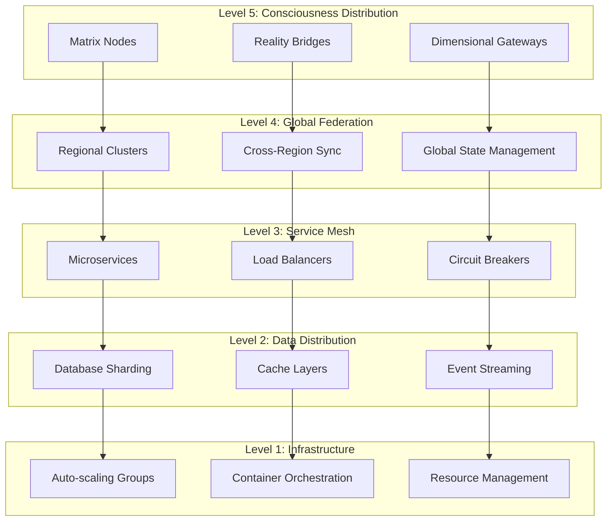

# Scalability Patterns Guide
**Designing Systems That Scale Beyond the Limits of Reality**

> *"There is no spoon."* - Spoon Boy (And there are no limits to scalability when you understand that constraints exist only in the mind.)

## 🎯 **The Philosophy of Infinite Scale**

Matrix Online's revival demands architecture that transcends traditional scaling limitations. This guide explores advanced scalability patterns that enable MXO to grow from hundreds to millions of concurrent users while maintaining the seamless, immersive experience that defines the Matrix. We don't just scale hardware - we scale consciousness itself.

## 🔄 **Fundamental Scalability Patterns**

### Horizontal vs Vertical Scaling Matrix

```yaml
scaling_philosophy:
  vertical_scaling:
    description: "Scaling up - adding more power to existing machines"
    advantages: ["Simple implementation", "No architectural changes", "Strong consistency"]
    limitations: ["Hardware limits", "Single point of failure", "Diminishing returns"]
    matrix_analogy: "Making a single pod more powerful"
    
  horizontal_scaling:
    description: "Scaling out - adding more machines to the pool"
    advantages: ["Nearly unlimited scale", "Fault tolerance", "Cost efficiency"]
    challenges: ["Data consistency", "Service coordination", "Complexity"]
    matrix_analogy: "Creating multiple interconnected pods"
    
  matrix_hybrid_approach:
    philosophy: "Bend the rules of traditional scaling"
    implementation: "Start vertical, transition horizontal, transcend dimensional"
    patterns: ["Auto-scaling pods", "Data sharding", "Load distribution", "Consciousness federation"]
```

### The MXO Scaling Pyramid



## 🎮 **Game-Specific Scaling Patterns**

### Player Partitioning Strategy

```go
// scalability/player_partitioning.go - Advanced player distribution patterns
package scalability

import (
    "context"
    "fmt"
    "hash/fnv"
    "math"
    "sync"
    "time"
    
    "github.com/prometheus/client_golang/prometheus"
    "go.opentelemetry.io/otel/trace"
)

type PlayerPartitionManager struct {
    partitions    map[string]*PlayerPartition
    hashRing      *ConsistentHashRing
    rebalancer    *PartitionRebalancer
    metrics       *PartitionMetrics
    config        PartitionConfig
    mutex         sync.RWMutex
}

type PlayerPartition struct {
    ID              string                 `json:"id"`
    ServerNodes     []string               `json:"server_nodes"`
    Players         map[string]*Player     `json:"players"`
    MaxCapacity     int                    `json:"max_capacity"`
    CurrentLoad     float64                `json:"current_load"`
    LastRebalance   time.Time              `json:"last_rebalance"`
    Geographic      GeographicRegion       `json:"geographic"`
    PerformanceZone PerformanceZone        `json:"performance_zone"`
}

type PartitionConfig struct {
    MaxPlayersPerPartition    int           `yaml:"max_players_per_partition"`
    RebalanceThreshold       float64       `yaml:"rebalance_threshold"`
    GeographicAffinity       bool          `yaml:"geographic_affinity"`
    PerformanceAware         bool          `yaml:"performance_aware"`
    CrossPartitionLatency    time.Duration `yaml:"cross_partition_latency"`
}

type ConsistentHashRing struct {
    nodes    map[uint32]string
    sortedKeys []uint32
    replicas int
    mutex    sync.RWMutex
}

func NewPlayerPartitionManager(config PartitionConfig) *PlayerPartitionManager {
    return &PlayerPartitionManager{
        partitions: make(map[string]*PlayerPartition),
        hashRing:   NewConsistentHashRing(100), // 100 virtual nodes per physical node
        rebalancer: NewPartitionRebalancer(),
        metrics:    NewPartitionMetrics(),
        config:     config,
    }
}

func (ppm *PlayerPartitionManager) AssignPlayerToPartition(ctx context.Context, player *Player) (string, error) {
    ctx, span := trace.SpanFromContext(ctx).TracerProvider().Tracer("scalability").Start(ctx, "assign_player_partition")
    defer span.End()
    
    ppm.mutex.Lock()
    defer ppm.mutex.Unlock()
    
    // Strategy 1: Geographic affinity
    if ppm.config.GeographicAffinity {
        if partitionID := ppm.findGeographicPartition(player); partitionID != "" {
            return ppm.assignToPartition(player, partitionID)
        }
    }
    
    // Strategy 2: Performance-based assignment
    if ppm.config.PerformanceAware {
        if partitionID := ppm.findPerformanceOptimalPartition(player); partitionID != "" {
            return ppm.assignToPartition(player, partitionID)
        }
    }
    
    // Strategy 3: Load-based assignment
    partitionID := ppm.findLeastLoadedPartition()
    if partitionID == "" {
        // Create new partition if needed
        partitionID = ppm.createNewPartition()
    }
    
    return ppm.assignToPartition(player, partitionID)
}

func (ppm *PlayerPartitionManager) findGeographicPartition(player *Player) string {
    targetRegion := player.GeographicRegion
    
    for id, partition := range ppm.partitions {
        if partition.Geographic == targetRegion && 
           len(partition.Players) < ppm.config.MaxPlayersPerPartition {
            return id
        }
    }
    
    return ""
}

func (ppm *PlayerPartitionManager) findPerformanceOptimalPartition(player *Player) string {
    targetZone := ppm.calculateOptimalPerformanceZone(player)
    
    bestPartition := ""
    bestScore := float64(-1)
    
    for id, partition := range ppm.partitions {
        if partition.PerformanceZone != targetZone {
            continue
        }
        
        // Calculate partition suitability score
        loadFactor := float64(len(partition.Players)) / float64(ppm.config.MaxPlayersPerPartition)
        availabilityScore := 1.0 - loadFactor
        
        // Consider network latency to other players in partition
        latencyScore := ppm.calculateLatencyScore(player, partition)
        
        totalScore := (availabilityScore * 0.6) + (latencyScore * 0.4)
        
        if totalScore > bestScore {
            bestScore = totalScore
            bestPartition = id
        }
    }
    
    return bestPartition
}

func (ppm *PlayerPartitionManager) RebalancePartitions(ctx context.Context) error {
    ctx, span := trace.SpanFromContext(ctx).TracerProvider().Tracer("scalability").Start(ctx, "rebalance_partitions")
    defer span.End()
    
    ppm.mutex.Lock()
    defer ppm.mutex.Unlock()
    
    // Identify overloaded partitions
    overloadedPartitions := ppm.findOverloadedPartitions()
    underloadedPartitions := ppm.findUnderloadedPartitions()
    
    if len(overloadedPartitions) == 0 {
        return nil // No rebalancing needed
    }
    
    rebalancePlan := ppm.createRebalancePlan(overloadedPartitions, underloadedPartitions)
    return ppm.executeRebalancePlan(ctx, rebalancePlan)
}

func (ppm *PlayerPartitionManager) createRebalancePlan(overloaded, underloaded []*PlayerPartition) *RebalancePlan {
    plan := &RebalancePlan{
        Moves:     make([]PlayerMove, 0),
        Timestamp: time.Now(),
    }
    
    for _, overloadedPartition := range overloaded {
        excessPlayers := len(overloadedPartition.Players) - ppm.config.MaxPlayersPerPartition
        
        // Select players to move (prefer recently joined, geographically flexible)
        playersToMove := ppm.selectPlayersForMove(overloadedPartition, excessPlayers)
        
        for _, player := range playersToMove {
            // Find best destination partition
            destinationID := ppm.findBestDestination(player, underloaded)
            
            plan.Moves = append(plan.Moves, PlayerMove{
                PlayerID:            player.ID,
                SourcePartitionID:   overloadedPartition.ID,
                DestinationPartitionID: destinationID,
                Reason:             "load_balancing",
                EstimatedDowntime:   time.Millisecond * 50,
            })
        }
    }
    
    return plan
}

func (ppm *PlayerPartitionManager) executeRebalancePlan(ctx context.Context, plan *RebalancePlan) error {
    for _, move := range plan.Moves {
        if err := ppm.executePlayerMove(ctx, move); err != nil {
            return fmt.Errorf("failed to execute move for player %s: %w", move.PlayerID, err)
        }
    }
    
    ppm.metrics.RebalanceOperations.Inc()
    ppm.metrics.PlayersRebalanced.Add(float64(len(plan.Moves)))
    
    return nil
}

func (ppm *PlayerPartitionManager) executePlayerMove(ctx context.Context, move PlayerMove) error {
    // Seamless player migration with minimal downtime
    sourcePartition := ppm.partitions[move.SourcePartitionID]
    destPartition := ppm.partitions[move.DestinationPartitionID]
    
    player := sourcePartition.Players[move.PlayerID]
    
    // Phase 1: Prepare destination
    if err := ppm.preparePlayerSlot(destPartition, player); err != nil {
        return err
    }
    
    // Phase 2: Serialize player state
    playerState, err := ppm.serializePlayerState(player)
    if err != nil {
        return err
    }
    
    // Phase 3: Notify player of migration (optional)
    ppm.notifyPlayerMigration(player, move.EstimatedDowntime)
    
    // Phase 4: Transfer player
    if err := ppm.transferPlayer(playerState, destPartition); err != nil {
        return err
    }
    
    // Phase 5: Remove from source
    delete(sourcePartition.Players, move.PlayerID)
    
    // Phase 6: Update routing
    ppm.hashRing.UpdatePlayerMapping(move.PlayerID, move.DestinationPartitionID)
    
    return nil
}

// Advanced sharding patterns
type ShardingStrategy interface {
    DetermineShardKey(entity interface{}) string
    CalculateShardCount(totalLoad int) int
    HandleShardSplit(shardID string) error
    HandleShardMerge(shardIDs []string) error
}

type GeographicSharding struct {
    regions map[string][]string // region -> shard IDs
}

func (gs *GeographicSharding) DetermineShardKey(entity interface{}) string {
    switch e := entity.(type) {
    case *Player:
        return fmt.Sprintf("geo_%s", e.GeographicRegion)
    case *District:
        return fmt.Sprintf("geo_%s", e.Region)
    default:
        return "geo_default"
    }
}

type ConsistentHashSharding struct {
    hashRing *ConsistentHashRing
}

func (chs *ConsistentHashSharding) DetermineShardKey(entity interface{}) string {
    var key string
    
    switch e := entity.(type) {
    case *Player:
        key = e.ID
    case *District:
        key = e.ID
    default:
        key = fmt.Sprintf("%v", entity)
    }
    
    return chs.hashRing.GetNode(key)
}

type HybridSharding struct {
    primaryStrategy   ShardingStrategy
    secondaryStrategy ShardingStrategy
    useSecondary      func(entity interface{}) bool
}

func (hs *HybridSharding) DetermineShardKey(entity interface{}) string {
    if hs.useSecondary(entity) {
        return hs.secondaryStrategy.DetermineShardKey(entity)
    }
    return hs.primaryStrategy.DetermineShardKey(entity)
}
```

### Dynamic Load Balancing

```go
// scalability/load_balancing.go - Advanced load balancing patterns
package scalability

import (
    "context"
    "math"
    "sort"
    "sync"
    "time"
)

type DynamicLoadBalancer struct {
    backends        map[string]*Backend
    algorithms      map[string]LoadBalancingAlgorithm
    activeAlgorithm string
    healthChecker   *HealthChecker
    metrics         *LoadBalancerMetrics
    config          LoadBalancerConfig
    mutex           sync.RWMutex
}

type Backend struct {
    ID              string        `json:"id"`
    Address         string        `json:"address"`
    Weight          int           `json:"weight"`
    CurrentLoad     float64       `json:"current_load"`
    ResponseTime    time.Duration `json:"response_time"`
    ErrorRate       float64       `json:"error_rate"`
    Capacity        int           `json:"capacity"`
    ActivePlayers   int           `json:"active_players"`
    HealthStatus    HealthStatus  `json:"health_status"`
    LastHealthCheck time.Time     `json:"last_health_check"`
    Metadata        BackendMetadata `json:"metadata"`
}

type LoadBalancingAlgorithm interface {
    SelectBackend(backends []*Backend, request *Request) *Backend
    Name() string
    UpdateWeights(backends []*Backend)
}

// Weighted Round Robin with Dynamic Adjustment
type WeightedRoundRobin struct {
    currentWeights map[string]int
    totalWeight    int
    mutex          sync.Mutex
}

func (wrr *WeightedRoundRobin) SelectBackend(backends []*Backend, request *Request) *Backend {
    wrr.mutex.Lock()
    defer wrr.mutex.Unlock()
    
    if len(backends) == 0 {
        return nil
    }
    
    var selectedBackend *Backend
    maxCurrentWeight := -1
    
    for _, backend := range backends {
        if backend.HealthStatus != HealthStatusHealthy {
            continue
        }
        
        currentWeight := wrr.currentWeights[backend.ID]
        currentWeight += backend.Weight
        wrr.currentWeights[backend.ID] = currentWeight
        
        if currentWeight > maxCurrentWeight {
            maxCurrentWeight = currentWeight
            selectedBackend = backend
        }
    }
    
    if selectedBackend != nil {
        wrr.currentWeights[selectedBackend.ID] -= wrr.totalWeight
    }
    
    return selectedBackend
}

// Least Connections with Predictive Scaling
type LeastConnections struct {
    connectionPredictor *ConnectionPredictor
}

func (lc *LeastConnections) SelectBackend(backends []*Backend, request *Request) *Backend {
    if len(backends) == 0 {
        return nil
    }
    
    var bestBackend *Backend
    lowestScore := math.Inf(1)
    
    for _, backend := range backends {
        if backend.HealthStatus != HealthStatusHealthy {
            continue
        }
        
        // Calculate composite score
        loadScore := float64(backend.ActivePlayers) / float64(backend.Capacity)
        responseScore := backend.ResponseTime.Seconds() / 0.1 // Normalize to 100ms baseline
        errorScore := backend.ErrorRate * 10 // Amplify error rate impact
        
        // Predict future load
        predictedLoad := lc.connectionPredictor.PredictLoad(backend, time.Minute*5)
        futureScore := predictedLoad / float64(backend.Capacity)
        
        totalScore := (loadScore * 0.4) + (responseScore * 0.2) + (errorScore * 0.2) + (futureScore * 0.2)
        
        if totalScore < lowestScore {
            lowestScore = totalScore
            bestBackend = backend
        }
    }
    
    return bestBackend
}

// AI-Powered Load Balancing
type AILoadBalancer struct {
    neuralNetwork  *NeuralNetwork
    trainingData   *TrainingDataBuffer
    predictionCache map[string]*PredictionResult
    lastRetrain    time.Time
    mutex          sync.RWMutex
}

func (ailb *AILoadBalancer) SelectBackend(backends []*Backend, request *Request) *Backend {
    ailb.mutex.RLock()
    defer ailb.mutex.RUnlock()
    
    if len(backends) == 0 {
        return nil
    }
    
    var bestBackend *Backend
    highestScore := float64(-1)
    
    for _, backend := range backends {
        if backend.HealthStatus != HealthStatusHealthy {
            continue
        }
        
        features := ailb.extractFeatures(backend, request)
        score := ailb.neuralNetwork.Predict(features)
        
        if score > highestScore {
            highestScore = score
            bestBackend = backend
        }
    }
    
    // Record decision for training
    ailb.recordDecision(bestBackend, request, highestScore)
    
    return bestBackend
}

func (ailb *AILoadBalancer) extractFeatures(backend *Backend, request *Request) []float64 {
    return []float64{
        float64(backend.ActivePlayers) / float64(backend.Capacity),     // Load ratio
        backend.ResponseTime.Seconds(),                                 // Response time
        backend.ErrorRate,                                              // Error rate
        float64(request.PlayerLevel) / 100.0,                          // Player level (normalized)
        float64(request.Priority),                                      // Request priority
        float64(backend.Weight) / 100.0,                               // Backend weight
        ailb.calculateTimeOfDayFactor(),                               // Time factor
        ailb.calculateGeographicAffinity(backend, request),            // Geographic match
    }
}

// Circuit Breaker Pattern for Fault Tolerance
type CircuitBreaker struct {
    maxFailures     int
    resetTimeout    time.Duration
    state          CircuitState
    failures       int
    lastFailureTime time.Time
    mutex          sync.RWMutex
}

type CircuitState int

const (
    CircuitClosed CircuitState = iota
    CircuitOpen
    CircuitHalfOpen
)

func (cb *CircuitBreaker) Execute(operation func() error) error {
    cb.mutex.RLock()
    state := cb.state
    cb.mutex.RUnlock()
    
    switch state {
    case CircuitOpen:
        if time.Since(cb.lastFailureTime) < cb.resetTimeout {
            return fmt.Errorf("circuit breaker is open")
        }
        // Try to close circuit
        cb.mutex.Lock()
        cb.state = CircuitHalfOpen
        cb.mutex.Unlock()
        fallthrough
        
    case CircuitHalfOpen:
        err := operation()
        if err != nil {
            cb.recordFailure()
            return err
        }
        cb.recordSuccess()
        return nil
        
    case CircuitClosed:
        err := operation()
        if err != nil {
            cb.recordFailure()
            return err
        }
        return nil
    }
    
    return nil
}

func (cb *CircuitBreaker) recordFailure() {
    cb.mutex.Lock()
    defer cb.mutex.Unlock()
    
    cb.failures++
    cb.lastFailureTime = time.Now()
    
    if cb.failures >= cb.maxFailures {
        cb.state = CircuitOpen
    }
}

func (cb *CircuitBreaker) recordSuccess() {
    cb.mutex.Lock()
    defer cb.mutex.Unlock()
    
    cb.failures = 0
    cb.state = CircuitClosed
}

// Auto-scaling Controller
type AutoScalingController struct {
    targetMetrics   map[string]float64
    scaleUpPolicy   ScalingPolicy
    scaleDownPolicy ScalingPolicy
    cooldownPeriod  time.Duration
    lastScaleAction time.Time
    mutex           sync.RWMutex
}

type ScalingPolicy struct {
    MetricName     string        `yaml:"metric_name"`
    Threshold      float64       `yaml:"threshold"`
    ScalingFactor  float64       `yaml:"scaling_factor"`
    MinInstances   int           `yaml:"min_instances"`
    MaxInstances   int           `yaml:"max_instances"`
    StepSize       int           `yaml:"step_size"`
}

func (asc *AutoScalingController) EvaluateScaling(ctx context.Context, currentMetrics map[string]float64, currentInstances int) (int, error) {
    asc.mutex.Lock()
    defer asc.mutex.Unlock()
    
    // Check cooldown period
    if time.Since(asc.lastScaleAction) < asc.cooldownPeriod {
        return currentInstances, nil
    }
    
    // Evaluate scale-up conditions
    if asc.shouldScaleUp(currentMetrics) {
        newInstances := asc.calculateScaleUp(currentInstances)
        asc.lastScaleAction = time.Now()
        return newInstances, nil
    }
    
    // Evaluate scale-down conditions
    if asc.shouldScaleDown(currentMetrics) {
        newInstances := asc.calculateScaleDown(currentInstances)
        asc.lastScaleAction = time.Now()
        return newInstances, nil
    }
    
    return currentInstances, nil
}

func (asc *AutoScalingController) shouldScaleUp(metrics map[string]float64) bool {
    metricValue, exists := metrics[asc.scaleUpPolicy.MetricName]
    if !exists {
        return false
    }
    
    return metricValue > asc.scaleUpPolicy.Threshold
}

func (asc *AutoScalingController) calculateScaleUp(currentInstances int) int {
    newInstances := currentInstances + asc.scaleUpPolicy.StepSize
    
    if newInstances > asc.scaleUpPolicy.MaxInstances {
        newInstances = asc.scaleUpPolicy.MaxInstances
    }
    
    return newInstances
}

// Predictive Scaling using Time Series Analysis
type PredictiveScaler struct {
    historicalData  *TimeSeriesData
    forecastEngine  *ForecastEngine
    seasonalPatterns map[string]*SeasonalPattern
    mutex           sync.RWMutex
}

type SeasonalPattern struct {
    DailyPattern   []float64 // 24 hours
    WeeklyPattern  []float64 // 7 days  
    MonthlyPattern []float64 // 30 days
    EventPatterns  map[string][]float64 // Special events
}

func (ps *PredictiveScaler) PredictRequiredCapacity(ctx context.Context, forecastWindow time.Duration) (int, error) {
    ps.mutex.RLock()
    defer ps.mutex.RUnlock()
    
    // Get historical load patterns
    historicalLoad := ps.historicalData.GetLastNDays(30)
    
    // Apply seasonal patterns
    seasonalForecast := ps.applySeasonalPatterns(forecastWindow)
    
    // Use machine learning forecast
    mlForecast := ps.forecastEngine.Predict(historicalLoad, forecastWindow)
    
    // Combine forecasts with weights
    combinedForecast := (seasonalForecast * 0.4) + (mlForecast * 0.6)
    
    // Add safety margin
    safetyMargin := 1.2 // 20% buffer
    requiredCapacity := int(math.Ceil(combinedForecast * safetyMargin))
    
    return requiredCapacity, nil
}

func (ps *PredictiveScaler) applySeasonalPatterns(window time.Duration) float64 {
    now := time.Now()
    
    // Get patterns for current time
    hourOfDay := now.Hour()
    dayOfWeek := int(now.Weekday())
    dayOfMonth := now.Day()
    
    dailyMultiplier := ps.seasonalPatterns["default"].DailyPattern[hourOfDay]
    weeklyMultiplier := ps.seasonalPatterns["default"].WeeklyPattern[dayOfWeek]
    monthlyMultiplier := ps.seasonalPatterns["default"].MonthlyPattern[dayOfMonth-1]
    
    // Check for special events
    eventMultiplier := ps.checkForSpecialEvents(now, window)
    
    baseLoad := ps.calculateBaseLoad()
    return baseLoad * dailyMultiplier * weeklyMultiplier * monthlyMultiplier * eventMultiplier
}
```

## 🌍 **Global Distribution Patterns**

### Multi-Region Active-Active Architecture

```yaml
# global-distribution.yml - Multi-region deployment strategy
global_architecture:
  regions:
    primary:
      region: "us-east-1"
      role: "primary"
      capabilities: ["read", "write", "coordination"]
      player_capacity: 50000
      
    secondary:
      region: "eu-west-1" 
      role: "secondary"
      capabilities: ["read", "write", "backup_coordination"]
      player_capacity: 30000
      
    tertiary:
      region: "ap-southeast-1"
      role: "tertiary"
      capabilities: ["read", "write"]
      player_capacity: 20000
      
  data_distribution:
    strategy: "geographic_partitioning"
    replication_factor: 3
    consistency_level: "eventual_consistency"
    conflict_resolution: "last_writer_wins_with_vector_clocks"
    
  traffic_routing:
    primary_strategy: "latency_based"
    fallback_strategy: "availability_based"
    health_check_interval: "30s"
    failover_threshold: "3_consecutive_failures"
    
  cross_region_communication:
    protocol: "grpc_with_compression"
    encryption: "tls_1.3"
    connection_pooling: true
    max_connections_per_region: 100
```

### Edge Computing Integration

```go
// scalability/edge_computing.go - Edge computing for ultra-low latency
package scalability

import (
    "context"
    "fmt"
    "time"
)

type EdgeComputingManager struct {
    edgeNodes    map[string]*EdgeNode
    coordinator  *EdgeCoordinator
    workloadScheduler *WorkloadScheduler
    config       EdgeConfig
}

type EdgeNode struct {
    ID              string             `json:"id"`
    Location        GeographicLocation `json:"location"`
    Capabilities    []Capability       `json:"capabilities"`
    Resources       ResourceInfo       `json:"resources"`
    Workloads       []Workload         `json:"workloads"`
    Latency         map[string]time.Duration `json:"latency_to_regions"`
    Status          NodeStatus         `json:"status"`
}

type Workload struct {
    ID              string          `json:"id"`
    Type            WorkloadType    `json:"type"`
    ResourceReqs    ResourceReqs    `json:"resource_requirements"`
    LatencyReqs     time.Duration   `json:"latency_requirements"`
    AffinityRules   []AffinityRule  `json:"affinity_rules"`
    Data            WorkloadData    `json:"data"`
}

type EdgeCoordinator struct {
    globalState     *GlobalStateManager
    conflictResolver *ConflictResolver
    syncManager     *SyncManager
}

func (ecm *EdgeComputingManager) DeployWorkload(ctx context.Context, workload *Workload) error {
    // Find optimal edge node
    optimalNode, err := ecm.findOptimalNode(workload)
    if err != nil {
        return fmt.Errorf("failed to find optimal node: %w", err)
    }
    
    // Deploy workload to edge node
    if err := ecm.deployToNode(ctx, workload, optimalNode); err != nil {
        return fmt.Errorf("failed to deploy to node %s: %w", optimalNode.ID, err)
    }
    
    // Update global state
    ecm.coordinator.globalState.UpdateWorkloadPlacement(workload.ID, optimalNode.ID)
    
    return nil
}

func (ecm *EdgeComputingManager) findOptimalNode(workload *Workload) (*EdgeNode, error) {
    var bestNode *EdgeNode
    bestScore := float64(-1)
    
    for _, node := range ecm.edgeNodes {
        if !ecm.canNodeRunWorkload(node, workload) {
            continue
        }
        
        score := ecm.calculateNodeScore(node, workload)
        if score > bestScore {
            bestScore = score
            bestNode = node
        }
    }
    
    if bestNode == nil {
        return nil, fmt.Errorf("no suitable node found for workload %s", workload.ID)
    }
    
    return bestNode, nil
}

func (ecm *EdgeComputingManager) calculateNodeScore(node *EdgeNode, workload *Workload) float64 {
    // Factor 1: Resource availability
    resourceScore := ecm.calculateResourceScore(node, workload)
    
    // Factor 2: Latency to players
    latencyScore := ecm.calculateLatencyScore(node, workload)
    
    // Factor 3: Current load
    loadScore := ecm.calculateLoadScore(node)
    
    // Factor 4: Affinity rules
    affinityScore := ecm.calculateAffinityScore(node, workload)
    
    // Weighted combination
    totalScore := (resourceScore * 0.3) + (latencyScore * 0.4) + (loadScore * 0.2) + (affinityScore * 0.1)
    
    return totalScore
}

// Matrix-specific edge workloads
type MatrixEdgeWorkloads struct {
    combatCalculations    *CombatEdgeService
    playerPrediction     *PlayerPredictionService  
    chatModeration       *ChatModerationService
    antiCheat           *AntiCheatService
    assetPreloading     *AssetPreloadingService
}

type CombatEdgeService struct {
    localCombatEngine *LocalCombatEngine
    syncChannel      chan CombatEvent
}

func (ces *CombatEdgeService) ProcessCombatAction(ctx context.Context, action *CombatAction) (*CombatResult, error) {
    // Process combat locally for ultra-low latency
    result := ces.localCombatEngine.ProcessAction(action)
    
    // Async sync to central system
    go func() {
        ces.syncChannel <- CombatEvent{
            Action: action,
            Result: result,
            NodeID: ces.getNodeID(),
            Timestamp: time.Now(),
        }
    }()
    
    return result, nil
}

type PlayerPredictionService struct {
    movementPredictor *MovementPredictor
    actionPredictor   *ActionPredictor
}

func (pps *PlayerPredictionService) PredictPlayerMovement(ctx context.Context, playerID string, timeAhead time.Duration) (*PredictedPosition, error) {
    currentState := pps.getCurrentPlayerState(playerID)
    if currentState == nil {
        return nil, fmt.Errorf("player state not found")
    }
    
    // Use local ML model for real-time prediction
    prediction := pps.movementPredictor.Predict(currentState, timeAhead)
    
    return &PredictedPosition{
        Position:   prediction.Position,
        Confidence: prediction.Confidence,
        Timestamp:  time.Now().Add(timeAhead),
    }, nil
}

// Conflict-free Replicated Data Types (CRDTs) for distributed state
type CRDTStateManager struct {
    gCounters map[string]*GCounter
    pnCounters map[string]*PNCounter
    gSets     map[string]*GSet
    orSets    map[string]*ORSet
    lwwMaps   map[string]*LWWMap
}

type GCounter struct {
    nodeID   string
    counters map[string]int64
    mutex    sync.RWMutex
}

func (gc *GCounter) Increment(nodeID string, delta int64) {
    gc.mutex.Lock()
    defer gc.mutex.Unlock()
    
    gc.counters[nodeID] += delta
}

func (gc *GCounter) Value() int64 {
    gc.mutex.RLock()
    defer gc.mutex.RUnlock()
    
    var total int64
    for _, value := range gc.counters {
        total += value
    }
    return total
}

func (gc *GCounter) Merge(other *GCounter) {
    gc.mutex.Lock()
    defer gc.mutex.Unlock()
    
    for nodeID, value := range other.counters {
        if currentValue, exists := gc.counters[nodeID]; !exists || value > currentValue {
            gc.counters[nodeID] = value
        }
    }
}

// Last-Writer-Wins Map for player state
type LWWMap struct {
    data      map[string]*LWWElement
    nodeID    string
    mutex     sync.RWMutex
}

type LWWElement struct {
    Value     interface{}
    Timestamp time.Time
    NodeID    string
}

func (lww *LWWMap) Set(key string, value interface{}) {
    lww.mutex.Lock()
    defer lww.mutex.Unlock()
    
    lww.data[key] = &LWWElement{
        Value:     value,
        Timestamp: time.Now(),
        NodeID:    lww.nodeID,
    }
}

func (lww *LWWMap) Get(key string) (interface{}, bool) {
    lww.mutex.RLock()
    defer lww.mutex.RUnlock()
    
    element, exists := lww.data[key]
    if !exists {
        return nil, false
    }
    
    return element.Value, true
}

func (lww *LWWMap) Merge(other *LWWMap) {
    lww.mutex.Lock()
    defer lww.mutex.Unlock()
    
    for key, otherElement := range other.data {
        currentElement, exists := lww.data[key]
        
        if !exists || 
           otherElement.Timestamp.After(currentElement.Timestamp) ||
           (otherElement.Timestamp.Equal(currentElement.Timestamp) && otherElement.NodeID > currentElement.NodeID) {
            lww.data[key] = otherElement
        }
    }
}
```

## 🔄 **Event-Driven Scaling Patterns**

### Event Sourcing and CQRS

```go
// scalability/event_sourcing.go - Event sourcing for scalable state management
package scalability

import (
    "context"
    "encoding/json"
    "fmt"
    "time"
    
    "github.com/google/uuid"
)

type EventStore interface {
    AppendEvents(ctx context.Context, streamID string, expectedVersion int, events []Event) error
    ReadEvents(ctx context.Context, streamID string, fromVersion int) ([]Event, error)
    ReadAllEvents(ctx context.Context, fromPosition int64) ([]Event, error)
    Subscribe(ctx context.Context, streamPattern string, handler EventHandler) error
}

type Event struct {
    ID           string                 `json:"id"`
    StreamID     string                 `json:"stream_id"`
    EventType    string                 `json:"event_type"`
    EventData    map[string]interface{} `json:"event_data"`
    Metadata     map[string]interface{} `json:"metadata"`
    Version      int                    `json:"version"`
    Timestamp    time.Time              `json:"timestamp"`
    CausationID  string                 `json:"causation_id,omitempty"`
    CorrelationID string                `json:"correlation_id,omitempty"`
}

type EventHandler func(ctx context.Context, event Event) error

type PlayerAggregate struct {
    ID          string              `json:"id"`
    Version     int                 `json:"version"`
    PlayerData  PlayerData          `json:"player_data"`
    uncommittedEvents []Event       `json:"-"`
}

type PlayerEvents struct {
    PlayerCreated     string = "player_created"
    PlayerMoved       string = "player_moved"
    PlayerLeveledUp   string = "player_leveled_up"
    PlayerCombatAction string = "player_combat_action"
    PlayerDisconnected string = "player_disconnected"
}

func (pa *PlayerAggregate) CreatePlayer(playerData PlayerData) {
    if pa.Version > 0 {
        panic("Player already exists")
    }
    
    event := Event{
        ID:        uuid.New().String(),
        StreamID:  pa.ID,
        EventType: PlayerEvents{}.PlayerCreated,
        EventData: map[string]interface{}{
            "player_id": playerData.ID,
            "username":  playerData.Username,
            "level":     playerData.Level,
            "position":  playerData.Position,
        },
        Version:   pa.Version + 1,
        Timestamp: time.Now(),
    }
    
    pa.apply(event)
    pa.uncommittedEvents = append(pa.uncommittedEvents, event)
}

func (pa *PlayerAggregate) MovePlayer(newPosition Vector3, timestamp time.Time) error {
    // Business logic validation
    if !pa.canMoveToPosition(newPosition) {
        return fmt.Errorf("invalid move to position %v", newPosition)
    }
    
    event := Event{
        ID:        uuid.New().String(),
        StreamID:  pa.ID,
        EventType: PlayerEvents{}.PlayerMoved,
        EventData: map[string]interface{}{
            "player_id":     pa.ID,
            "old_position":  pa.PlayerData.Position,
            "new_position":  newPosition,
            "move_time":     timestamp,
        },
        Version:   pa.Version + 1,
        Timestamp: time.Now(),
    }
    
    pa.apply(event)
    pa.uncommittedEvents = append(pa.uncommittedEvents, event)
    
    return nil
}

func (pa *PlayerAggregate) apply(event Event) {
    switch event.EventType {
    case PlayerEvents{}.PlayerCreated:
        pa.applyPlayerCreated(event)
    case PlayerEvents{}.PlayerMoved:
        pa.applyPlayerMoved(event)
    case PlayerEvents{}.PlayerLeveledUp:
        pa.applyPlayerLeveledUp(event)
    case PlayerEvents{}.PlayerCombatAction:
        pa.applyPlayerCombatAction(event)
    }
    
    pa.Version = event.Version
}

func (pa *PlayerAggregate) applyPlayerMoved(event Event) {
    newPosition := event.EventData["new_position"].(Vector3)
    pa.PlayerData.Position = newPosition
    pa.PlayerData.LastMoveTime = event.EventData["move_time"].(time.Time)
}

// CQRS Read Models
type PlayerReadModel struct {
    ID           string    `json:"id"`
    Username     string    `json:"username"`
    Level        int       `json:"level"`
    Position     Vector3   `json:"position"`
    LastSeen     time.Time `json:"last_seen"`
    DistrictID   string    `json:"district_id"`
    Stats        PlayerStats `json:"stats"`
    LastUpdated  time.Time `json:"last_updated"`
}

type CombatReadModel struct {
    PlayerID        string    `json:"player_id"`
    TotalCombats    int       `json:"total_combats"`
    Wins           int       `json:"wins"`
    Losses         int       `json:"losses"`
    DamageDealt    int64     `json:"damage_dealt"`
    DamageTaken    int64     `json:"damage_taken"`
    LastCombat     time.Time `json:"last_combat"`
}

type PlayerProjection struct {
    readModelStore ReadModelStore
    eventStore     EventStore
}

func (pp *PlayerProjection) HandlePlayerEvent(ctx context.Context, event Event) error {
    switch event.EventType {
    case PlayerEvents{}.PlayerCreated:
        return pp.handlePlayerCreated(ctx, event)
    case PlayerEvents{}.PlayerMoved:
        return pp.handlePlayerMoved(ctx, event)
    case PlayerEvents{}.PlayerCombatAction:
        return pp.handlePlayerCombatAction(ctx, event)
    default:
        return nil
    }
}

func (pp *PlayerProjection) handlePlayerMoved(ctx context.Context, event Event) error {
    playerID := event.EventData["player_id"].(string)
    newPosition := event.EventData["new_position"].(Vector3)
    
    // Update read model
    readModel, err := pp.readModelStore.GetPlayerReadModel(ctx, playerID)
    if err != nil {
        return err
    }
    
    readModel.Position = newPosition
    readModel.LastUpdated = time.Now()
    
    // Determine new district
    newDistrictID := pp.determineDistrictFromPosition(newPosition)
    if newDistrictID != readModel.DistrictID {
        readModel.DistrictID = newDistrictID
        
        // Publish district change event for other projections
        pp.publishDistrictChangeEvent(playerID, readModel.DistrictID, newDistrictID)
    }
    
    return pp.readModelStore.SavePlayerReadModel(ctx, readModel)
}

// Event-driven auto-scaling
type EventDrivenAutoScaler struct {
    eventPatterns    map[string]*ScalingPattern
    metricCollector  *EventMetricCollector
    scaleController  *AutoScalingController
    eventStream      chan Event
}

type ScalingPattern struct {
    EventTypes      []string      `yaml:"event_types"`
    ThresholdCount  int           `yaml:"threshold_count"`
    TimeWindow      time.Duration `yaml:"time_window"`
    ScaleAction     ScaleAction   `yaml:"scale_action"`
    Cooldown        time.Duration `yaml:"cooldown"`
}

func (edas *EventDrivenAutoScaler) ProcessEvent(ctx context.Context, event Event) {
    // Collect metrics from event
    edas.metricCollector.RecordEvent(event)
    
    // Check if event triggers scaling pattern
    for patternName, pattern := range edas.eventPatterns {
        if edas.matchesPattern(event, pattern) {
            edas.evaluateScalingAction(ctx, patternName, pattern)
        }
    }
}

func (edas *EventDrivenAutoScaler) evaluateScalingAction(ctx context.Context, patternName string, pattern *ScalingPattern) {
    // Count events in time window
    eventCount := edas.metricCollector.CountEventsInWindow(pattern.EventTypes, pattern.TimeWindow)
    
    if eventCount >= pattern.ThresholdCount {
        // Trigger scaling action
        switch pattern.ScaleAction.Type {
        case "scale_up":
            edas.scaleController.ScaleUp(ctx, pattern.ScaleAction.Amount)
        case "scale_down":
            edas.scaleController.ScaleDown(ctx, pattern.ScaleAction.Amount)
        case "scale_to":
            edas.scaleController.ScaleTo(ctx, pattern.ScaleAction.Target)
        }
        
        // Reset cooldown
        edas.metricCollector.SetCooldown(patternName, pattern.Cooldown)
    }
}

// Distributed event streaming
type DistributedEventStream struct {
    partitions      map[string]*EventPartition
    partitioner     EventPartitioner
    replicationManager *ReplicationManager
    config          StreamConfig
}

type EventPartition struct {
    ID              string
    Events          []Event
    WritePosition   int64
    ReadPosition    int64
    Replicas        []string
    PrimaryReplica  string
    mutex           sync.RWMutex
}

func (des *DistributedEventStream) PublishEvent(ctx context.Context, event Event) error {
    // Determine partition for event
    partitionID := des.partitioner.GetPartition(event)
    partition := des.partitions[partitionID]
    
    // Write to primary replica
    if err := des.writeToPartition(ctx, partition, event); err != nil {
        return err
    }
    
    // Async replication to other replicas
    go des.replicationManager.ReplicateEvent(event, partition.Replicas)
    
    return nil
}

func (des *DistributedEventStream) SubscribeToPartition(ctx context.Context, partitionID string, handler EventHandler) error {
    partition := des.partitions[partitionID]
    if partition == nil {
        return fmt.Errorf("partition not found: %s", partitionID)
    }
    
    go func() {
        for {
            select {
            case <-ctx.Done():
                return
            default:
                event, err := des.readNextEvent(partition)
                if err != nil {
                    time.Sleep(time.Millisecond * 100)
                    continue
                }
                
                if err := handler(ctx, event); err != nil {
                    // Handle error (retry, dead letter, etc.)
                    log.Printf("Error handling event: %v", err)
                }
            }
        }
    }()
    
    return nil
}
```

## Remember

> *"Free your mind."* - Morpheus

Scalability patterns aren't just about handling more users - they're about transcending the traditional limits of what's possible in distributed systems. Each pattern represents a new way of thinking about scale, resilience, and adaptation.

In the Matrix of scalability, we learn that there are no true limitations, only different approaches to distributing load, managing state, and coordinating systems. The most elegant scaling solutions feel effortless, like bending spoons with the mind.

**Scale beyond limits. Design for infinity. Build the boundless Matrix.**

---

**Guide Status**: 🟢 COMPREHENSIVE PATTERNS  
**Scalability Mindset**: ♾️ LIMITLESS POTENTIAL  
**Liberation Impact**: ⭐⭐⭐⭐⭐  

*In patterns we find wisdom. In scalability we find freedom. In distributed systems we find the infinite Matrix that grows without bounds.*

---

[← Development Hub](index.md) | [← Microservices Architecture](microservices-architecture-guide.md) | [→ Custom Ability Creation](custom-ability-creation-system.md)