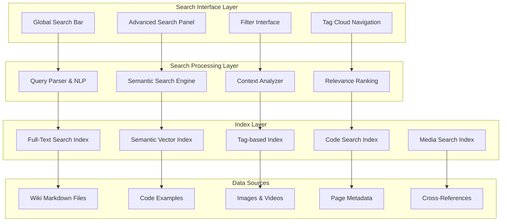

# Search Functionality Implementation Guide
**Making Knowledge Instantly Discoverable Across the Matrix**

> *"What if I told you that finding information doesn't have to be a maze? In the digital realm, search is the Oracle - it knows where everything is, and can guide you instantly to what you seek."* - Neo's approach to information retrieval

## 🎯 **The Vision of Instant Discovery**

A comprehensive wiki demands search capabilities that transcend simple text matching. This guide presents a multi-layered search architecture that enables users to find exactly what they need, whether it's technical documentation, code examples, community discussions, or philosophical insights about The Matrix Online revival.

## 🔍 **Search Architecture Overview**

### Multi-Modal Search Strategy



## 🛠️ **Implementation Architecture**

### Core Search Service

```go
// search-service/main.go - Comprehensive search implementation
package main

import (
    "context"
    "encoding/json"
    "fmt"
    "log"
    "net/http"
    "sort"
    "strings"
    "sync"
    "time"
    
    "github.com/blevesearch/bleve/v2"
    "github.com/gorilla/mux"
    "github.com/prometheus/client_golang/prometheus"
    "github.com/prometheus/client_golang/prometheus/promauto"
    "go.opentelemetry.io/otel/trace"
)

type SearchService struct {
    // Core search engines
    fullTextIndex   bleve.Index
    semanticEngine  *SemanticSearchEngine
    codeSearchEngine *CodeSearchEngine
    
    // Specialized indices
    tagIndex        *TagIndex
    crossRefIndex   *CrossReferenceIndex
    mediaIndex      *MediaSearchIndex
    
    // Analytics and monitoring
    searchMetrics   *SearchMetrics
    tracer         trace.Tracer
    
    // Configuration
    config         SearchConfig
    mutex          sync.RWMutex
}

type SearchRequest struct {
    Query          string                 `json:"query"`
    Filters        SearchFilters          `json:"filters,omitempty"`
    SearchType     SearchType             `json:"search_type,omitempty"`
    MaxResults     int                    `json:"max_results,omitempty"`
    Offset         int                    `json:"offset,omitempty"`
    IncludeSnippets bool                  `json:"include_snippets,omitempty"`
    SortBy         SortOption             `json:"sort_by,omitempty"`
    UserContext    *UserContext           `json:"user_context,omitempty"`
}

type SearchFilters struct {
    Categories     []string               `json:"categories,omitempty"`
    Tags           []string               `json:"tags,omitempty"`
    FileTypes      []string               `json:"file_types,omitempty"`
    DateRange      *DateRange             `json:"date_range,omitempty"`
    ContentTypes   []string               `json:"content_types,omitempty"`
    Authors        []string               `json:"authors,omitempty"`
    Difficulty     []DifficultyLevel      `json:"difficulty,omitempty"`
}

type SearchResult struct {
    ID             string                 `json:"id"`
    Title          string                 `json:"title"`
    Content        string                 `json:"content"`
    Snippet        string                 `json:"snippet,omitempty"`
    URL            string                 `json:"url"`
    Score          float64                `json:"score"`
    Type           ContentType            `json:"type"`
    Category       string                 `json:"category"`
    Tags           []string               `json:"tags"`
    LastModified   time.Time              `json:"last_modified"`
    Author         string                 `json:"author,omitempty"`
    Highlights     []TextHighlight        `json:"highlights,omitempty"`
    RelatedPages   []RelatedPage          `json:"related_pages,omitempty"`
    Breadcrumbs    []BreadcrumbItem       `json:"breadcrumbs,omitempty"`
}

type SearchResponse struct {
    Results        []SearchResult         `json:"results"`
    TotalResults   int                    `json:"total_results"`
    SearchTime     time.Duration          `json:"search_time"`
    Suggestions    []SearchSuggestion     `json:"suggestions,omitempty"`
    Facets         map[string][]FacetItem `json:"facets,omitempty"`
    RelatedQueries []string               `json:"related_queries,omitempty"`
    DidYouMean     string                 `json:"did_you_mean,omitempty"`
}

func NewSearchService(config SearchConfig) (*SearchService, error) {
    // Initialize Bleve full-text search index
    indexMapping := bleve.NewIndexMapping()
    
    // Configure field mappings for different content types
    wikiDocMapping := bleve.NewDocumentMapping()
    wikiDocMapping.AddFieldMappingsAt("title", bleve.NewTextFieldMapping())
    wikiDocMapping.AddFieldMappingsAt("content", bleve.NewTextFieldMapping())
    wikiDocMapping.AddFieldMappingsAt("tags", bleve.NewTextFieldMapping())
    wikiDocMapping.AddFieldMappingsAt("category", bleve.NewKeywordFieldMapping())
    
    codeDocMapping := bleve.NewDocumentMapping()
    codeDocMapping.AddFieldMappingsAt("language", bleve.NewKeywordFieldMapping())
    codeDocMapping.AddFieldMappingsAt("function_name", bleve.NewTextFieldMapping())
    codeDocMapping.AddFieldMappingsAt("code_content", bleve.NewTextFieldMapping())
    
    indexMapping.AddDocumentMapping("wiki", wikiDocMapping)
    indexMapping.AddDocumentMapping("code", codeDocMapping)
    
    index, err := bleve.New(config.IndexPath, indexMapping)
    if err != nil {
        return nil, fmt.Errorf("failed to create search index: %w", err)
    }
    
    // Initialize specialized search engines
    semanticEngine, err := NewSemanticSearchEngine(config.SemanticConfig)
    if err != nil {
        return nil, fmt.Errorf("failed to initialize semantic engine: %w", err)
    }
    
    codeEngine, err := NewCodeSearchEngine(config.CodeSearchConfig)
    if err != nil {
        return nil, fmt.Errorf("failed to initialize code search: %w", err)
    }
    
    return &SearchService{
        fullTextIndex:    index,
        semanticEngine:   semanticEngine,
        codeSearchEngine: codeEngine,
        tagIndex:         NewTagIndex(),
        crossRefIndex:    NewCrossReferenceIndex(),
        mediaIndex:       NewMediaSearchIndex(),
        searchMetrics:    NewSearchMetrics(),
        config:          config,
    }, nil
}

func (ss *SearchService) Search(ctx context.Context, req SearchRequest) (*SearchResponse, error) {
    ctx, span := ss.tracer.Start(ctx, "search.execute")
    defer span.End()
    
    startTime := time.Now()
    ss.searchMetrics.SearchRequests.Inc()
    
    // Parse and normalize query
    normalizedQuery := ss.normalizeQuery(req.Query)
    
    // Determine search strategy based on query type
    strategy := ss.determineSearchStrategy(normalizedQuery, req.SearchType)
    
    var results []SearchResult
    var totalResults int
    var err error
    
    switch strategy {
    case StrategyFullText:
        results, totalResults, err = ss.executeFullTextSearch(ctx, normalizedQuery, req)
    case StrategySemantic:
        results, totalResults, err = ss.executeSemanticSearch(ctx, normalizedQuery, req)
    case StrategyCode:
        results, totalResults, err = ss.executeCodeSearch(ctx, normalizedQuery, req)
    case StrategyHybrid:
        results, totalResults, err = ss.executeHybridSearch(ctx, normalizedQuery, req)
    default:
        results, totalResults, err = ss.executeHybridSearch(ctx, normalizedQuery, req)
    }
    
    if err != nil {
        ss.searchMetrics.SearchErrors.Inc()
        return nil, fmt.Errorf("search execution failed: %w", err)
    }
    
    // Apply filters
    if len(req.Filters.Categories) > 0 || len(req.Filters.Tags) > 0 {
        results = ss.applyFilters(results, req.Filters)
    }
    
    // Apply sorting
    results = ss.applySorting(results, req.SortBy)
    
    // Apply pagination
    paginatedResults := ss.applyPagination(results, req.Offset, req.MaxResults)
    
    // Generate suggestions and related queries
    suggestions := ss.generateSuggestions(normalizedQuery, results)
    relatedQueries := ss.generateRelatedQueries(normalizedQuery, req.UserContext)
    
    // Generate facets for filtering
    facets := ss.generateFacets(results)
    
    searchTime := time.Since(startTime)
    ss.searchMetrics.SearchLatency.Observe(searchTime.Seconds())
    
    response := &SearchResponse{
        Results:        paginatedResults,
        TotalResults:   totalResults,
        SearchTime:     searchTime,
        Suggestions:    suggestions,
        Facets:         facets,
        RelatedQueries: relatedQueries,
    }
    
    // Add spell checking
    if didYouMean := ss.generateSpellingSuggestion(normalizedQuery); didYouMean != "" {
        response.DidYouMean = didYouMean
    }
    
    span.SetAttributes(
        trace.StringAttribute("query", req.Query),
        trace.StringAttribute("strategy", string(strategy)),
        trace.Int64Attribute("results_count", int64(len(paginatedResults))),
        trace.Int64Attribute("total_results", int64(totalResults)),
    )
    
    return response, nil
}

func (ss *SearchService) executeFullTextSearch(ctx context.Context, query string, req SearchRequest) ([]SearchResult, int, error) {
    // Build Bleve query
    q := bleve.NewMatchQuery(query)
    
    // Add category filters if specified
    var finalQuery bleve.Query = q
    if len(req.Filters.Categories) > 0 {
        categoryQuery := bleve.NewTermQuery(req.Filters.Categories[0])
        categoryQuery.SetField("category")
        
        conjunctionQuery := bleve.NewConjunctionQuery()
        conjunctionQuery.AddQuery(q)
        conjunctionQuery.AddQuery(categoryQuery)
        finalQuery = conjunctionQuery
    }
    
    // Create search request
    searchRequest := bleve.NewSearchRequest(finalQuery)
    searchRequest.Size = req.MaxResults
    searchRequest.From = req.Offset
    
    // Add highlighting
    if req.IncludeSnippets {
        searchRequest.Highlight = bleve.NewHighlight()
        searchRequest.Highlight.AddField("content")
        searchRequest.Highlight.AddField("title")
    }
    
    // Execute search
    searchResult, err := ss.fullTextIndex.Search(searchRequest)
    if err != nil {
        return nil, 0, err
    }
    
    // Convert results
    results := make([]SearchResult, 0, len(searchResult.Hits))
    for _, hit := range searchResult.Hits {
        result := SearchResult{
            ID:           hit.ID,
            Score:        hit.Score,
            Highlights:   ss.convertHighlights(hit.Fragments),
        }
        
        // Load full document details
        if doc, err := ss.loadDocumentDetails(hit.ID); err == nil {
            result.Title = doc.Title
            result.Content = doc.Content
            result.URL = doc.URL
            result.Type = doc.Type
            result.Category = doc.Category
            result.Tags = doc.Tags
            result.LastModified = doc.LastModified
            result.Author = doc.Author
            
            if req.IncludeSnippets {
                result.Snippet = ss.generateSnippet(doc.Content, query, 200)
            }
            
            // Add breadcrumbs and related pages
            result.Breadcrumbs = ss.generateBreadcrumbs(doc.URL)
            result.RelatedPages = ss.findRelatedPages(hit.ID, 5)
        }
        
        results = append(results, result)
    }
    
    return results, int(searchResult.Total), nil
}

func (ss *SearchService) executeSemanticSearch(ctx context.Context, query string, req SearchRequest) ([]SearchResult, int, error) {
    // Use semantic search engine for concept-based matching
    semanticResults, err := ss.semanticEngine.Search(ctx, SemanticSearchRequest{
        Query:      query,
        MaxResults: req.MaxResults,
        Threshold:  0.7, // Semantic similarity threshold
    })
    if err != nil {
        return nil, 0, err
    }
    
    results := make([]SearchResult, 0, len(semanticResults.Documents))
    for _, doc := range semanticResults.Documents {
        result := SearchResult{
            ID:           doc.ID,
            Title:        doc.Title,
            Content:      doc.Content,
            URL:          doc.URL,
            Score:        doc.SimilarityScore,
            Type:         ContentTypeWiki,
            Category:     doc.Category,
            Tags:         doc.Tags,
            LastModified: doc.LastModified,
        }
        
        if req.IncludeSnippets {
            result.Snippet = ss.generateSemanticSnippet(doc.Content, query, 200)
        }
        
        result.Breadcrumbs = ss.generateBreadcrumbs(doc.URL)
        result.RelatedPages = ss.findRelatedPages(doc.ID, 5)
        
        results = append(results, result)
    }
    
    return results, len(results), nil
}

func (ss *SearchService) executeCodeSearch(ctx context.Context, query string, req SearchRequest) ([]SearchResult, int, error) {
    // Use specialized code search engine
    codeResults, err := ss.codeSearchEngine.Search(ctx, CodeSearchRequest{
        Query:       query,
        Languages:   req.Filters.FileTypes,
        MaxResults:  req.MaxResults,
        SearchTypes: []CodeSearchType{SearchTypeFunctionName, SearchTypeComment, SearchTypeContent},
    })
    if err != nil {
        return nil, 0, err
    }
    
    results := make([]SearchResult, 0, len(codeResults.Results))
    for _, code := range codeResults.Results {
        result := SearchResult{
            ID:           code.ID,
            Title:        fmt.Sprintf("%s - %s", code.FileName, code.FunctionName),
            Content:      code.CodeSnippet,
            URL:          code.FileURL,
            Score:        code.Score,
            Type:         ContentTypeCode,
            Category:     "Code Examples",
            Tags:         []string{code.Language, code.Framework},
            LastModified: code.LastModified,
            Snippet:      ss.generateCodeSnippet(code.CodeSnippet, query, 150),
        }
        
        // Add syntax highlighting
        result.Highlights = ss.generateCodeHighlights(code.CodeSnippet, query, code.Language)
        result.Breadcrumbs = ss.generateBreadcrumbs(code.FileURL)
        
        results = append(results, result)
    }
    
    return results, len(results), nil
}

func (ss *SearchService) executeHybridSearch(ctx context.Context, query string, req SearchRequest) ([]SearchResult, int, error) {
    // Execute multiple search strategies in parallel
    type searchResult struct {
        results []SearchResult
        total   int
        err     error
        weight  float64
    }
    
    resultsChan := make(chan searchResult, 3)
    
    // Full-text search
    go func() {
        results, total, err := ss.executeFullTextSearch(ctx, query, req)
        resultsChan <- searchResult{results, total, err, 0.4}
    }()
    
    // Semantic search
    go func() {
        results, total, err := ss.executeSemanticSearch(ctx, query, req)
        resultsChan <- searchResult{results, total, err, 0.3}
    }()
    
    // Code search
    go func() {
        results, total, err := ss.executeCodeSearch(ctx, query, req)
        resultsChan <- searchResult{results, total, err, 0.3}
    }()
    
    // Collect results
    var allResults []SearchResult
    var maxTotal int
    
    for i := 0; i < 3; i++ {
        result := <-resultsChan
        if result.err != nil {
            continue // Skip failed searches
        }
        
        // Weight and merge results
        for j := range result.results {
            result.results[j].Score *= result.weight
        }
        
        allResults = append(allResults, result.results...)
        if result.total > maxTotal {
            maxTotal = result.total
        }
    }
    
    // Deduplicate and merge results
    mergedResults := ss.deduplicateResults(allResults)
    
    // Sort by final score
    sort.Slice(mergedResults, func(i, j int) bool {
        return mergedResults[i].Score > mergedResults[j].Score
    })
    
    return mergedResults, maxTotal, nil
}

// Advanced search features

func (ss *SearchService) normalizeQuery(query string) string {
    // Remove special characters, normalize whitespace
    normalized := strings.TrimSpace(query)
    normalized = strings.ToLower(normalized)
    
    // Handle search operators
    normalized = ss.handleSearchOperators(normalized)
    
    return normalized
}

func (ss *SearchService) handleSearchOperators(query string) string {
    // Support for advanced search operators:
    // "exact phrase"
    // +required -excluded
    // category:development
    // tag:server
    // filetype:go
    
    return query // Implement operator parsing
}

func (ss *SearchService) generateSuggestions(query string, results []SearchResult) []SearchSuggestion {
    var suggestions []SearchSuggestion
    
    // Auto-complete suggestions based on index
    autoComplete := ss.getAutoCompleteSuggestions(query, 5)
    for _, suggestion := range autoComplete {
        suggestions = append(suggestions, SearchSuggestion{
            Text: suggestion,
            Type: SuggestionTypeAutoComplete,
        })
    }
    
    // Related concept suggestions
    if len(results) > 0 {
        concepts := ss.extractConcepts(results)
        for _, concept := range concepts {
            suggestions = append(suggestions, SearchSuggestion{
                Text: concept,
                Type: SuggestionTypeConcept,
            })
        }
    }
    
    return suggestions
}

func (ss *SearchService) generateFacets(results []SearchResult) map[string][]FacetItem {
    facets := make(map[string][]FacetItem)
    
    // Category facets
    categoryCount := make(map[string]int)
    typeCount := make(map[string]int)
    tagCount := make(map[string]int)
    
    for _, result := range results {
        categoryCount[result.Category]++
        typeCount[string(result.Type)]++
        
        for _, tag := range result.Tags {
            tagCount[tag]++
        }
    }
    
    // Convert to facet items
    for category, count := range categoryCount {
        facets["category"] = append(facets["category"], FacetItem{
            Name:  category,
            Count: count,
        })
    }
    
    for contentType, count := range typeCount {
        facets["type"] = append(facets["type"], FacetItem{
            Name:  contentType,
            Count: count,
        })
    }
    
    for tag, count := range tagCount {
        if count >= 2 { // Only show tags with multiple occurrences
            facets["tags"] = append(facets["tags"], FacetItem{
                Name:  tag,
                Count: count,
            })
        }
    }
    
    // Sort facets by count
    for key := range facets {
        sort.Slice(facets[key], func(i, j int) bool {
            return facets[key][i].Count > facets[key][j].Count
        })
    }
    
    return facets
}

// HTTP Handlers

func (ss *SearchService) SearchHandler(w http.ResponseWriter, r *http.Request) {
    ctx, span := ss.tracer.Start(r.Context(), "search.http_handler")
    defer span.End()
    
    var req SearchRequest
    if err := json.NewDecoder(r.Body).Decode(&req); err != nil {
        http.Error(w, "Invalid request body", http.StatusBadRequest)
        return
    }
    
    // Set defaults
    if req.MaxResults == 0 {
        req.MaxResults = 20
    }
    if req.MaxResults > 100 {
        req.MaxResults = 100 // Limit max results
    }
    
    response, err := ss.Search(ctx, req)
    if err != nil {
        span.SetAttributes(trace.StringAttribute("error", err.Error()))
        http.Error(w, "Search failed", http.StatusInternalServerError)
        return
    }
    
    w.Header().Set("Content-Type", "application/json")
    json.NewEncoder(w).Encode(response)
    
    span.SetAttributes(
        trace.StringAttribute("query", req.Query),
        trace.Int64Attribute("results", int64(len(response.Results))),
    )
}

func (ss *SearchService) SuggestHandler(w http.ResponseWriter, r *http.Request) {
    query := r.URL.Query().Get("q")
    if query == "" {
        http.Error(w, "Missing query parameter", http.StatusBadRequest)
        return
    }
    
    suggestions := ss.getAutoCompleteSuggestions(query, 10)
    
    response := map[string]interface{}{
        "suggestions": suggestions,
    }
    
    w.Header().Set("Content-Type", "application/json")
    json.NewEncoder(w).Encode(response)
}

func main() {
    config := SearchConfig{
        IndexPath: "./search_index",
        SemanticConfig: SemanticConfig{
            ModelPath:   "./models/semantic",
            Dimensions:  768,
            Threshold:   0.7,
        },
        CodeSearchConfig: CodeSearchConfig{
            IndexPath:     "./code_index",
            SupportedLangs: []string{"go", "javascript", "typescript", "python", "rust"},
        },
    }
    
    searchService, err := NewSearchService(config)
    if err != nil {
        log.Fatal("Failed to initialize search service:", err)
    }
    
    // Index existing content
    if err := searchService.IndexAllContent(); err != nil {
        log.Printf("Warning: Failed to index content: %v", err)
    }
    
    // Setup routes
    r := mux.NewRouter()
    r.HandleFunc("/search", searchService.SearchHandler).Methods("POST")
    r.HandleFunc("/suggest", searchService.SuggestHandler).Methods("GET")
    r.HandleFunc("/health", healthCheckHandler).Methods("GET")
    
    log.Println("Search service starting on :8080")
    log.Fatal(http.ListenAndServe(":8080", r))
}
```

## 🎨 **Frontend Search Interface**

### React Search Component

```typescript
// search-interface/SearchComponent.tsx - Comprehensive search UI
import React, { useState, useEffect, useCallback, useMemo } from 'react';
import { useDebounce } from 'use-debounce';
import { Search, Filter, Tag, Code, BookOpen, Settings } from 'lucide-react';

interface SearchComponentProps {
    onResultSelect?: (result: SearchResult) => void;
    initialQuery?: string;
    className?: string;
}

const SearchComponent: React.FC<SearchComponentProps> = ({
    onResultSelect,
    initialQuery = '',
    className = ''
}) => {
    const [query, setQuery] = useState(initialQuery);
    const [results, setResults] = useState<SearchResult[]>([]);
    const [suggestions, setSuggestions] = useState<string[]>([]);
    const [loading, setLoading] = useState(false);
    const [filters, setFilters] = useState<SearchFilters>({});
    const [searchType, setSearchType] = useState<SearchType>('hybrid');
    const [showAdvanced, setShowAdvanced] = useState(false);
    const [totalResults, setTotalResults] = useState(0);
    const [searchTime, setSearchTime] = useState<number>(0);
    const [facets, setFacets] = useState<Record<string, FacetItem[]>>({});
    
    const [debouncedQuery] = useDebounce(query, 300);
    
    const executeSearch = useCallback(async (searchQuery: string, searchFilters: SearchFilters = {}) => {
        if (!searchQuery.trim()) {
            setResults([]);
            setSuggestions([]);
            return;
        }
        
        setLoading(true);
        
        try {
            const response = await fetch('/api/search', {
                method: 'POST',
                headers: {
                    'Content-Type': 'application/json',
                },
                body: JSON.stringify({
                    query: searchQuery,
                    filters: searchFilters,
                    search_type: searchType,
                    max_results: 20,
                    include_snippets: true,
                }),
            });
            
            if (!response.ok) {
                throw new Error('Search failed');
            }
            
            const data: SearchResponse = await response.json();
            setResults(data.results);
            setTotalResults(data.total_results);
            setSearchTime(data.search_time);
            setFacets(data.facets || {});
            
            if (data.suggestions) {
                setSuggestions(data.suggestions.map(s => s.text));
            }
        } catch (error) {
            console.error('Search error:', error);
            setResults([]);
        } finally {
            setLoading(false);
        }
    }, [searchType]);
    
    const getSuggestions = useCallback(async (query: string) => {
        if (!query.trim() || query.length < 2) {
            setSuggestions([]);
            return;
        }
        
        try {
            const response = await fetch(`/api/suggest?q=${encodeURIComponent(query)}`);
            const data = await response.json();
            setSuggestions(data.suggestions || []);
        } catch (error) {
            console.error('Suggestion error:', error);
        }
    }, []);
    
    useEffect(() => {
        if (debouncedQuery) {
            executeSearch(debouncedQuery, filters);
        } else {
            getSuggestions(query);
        }
    }, [debouncedQuery, filters, executeSearch, getSuggestions, query]);
    
    const handleFilterChange = useCallback((newFilters: SearchFilters) => {
        setFilters(newFilters);
        if (query) {
            executeSearch(query, newFilters);
        }
    }, [query, executeSearch]);
    
    const handleResultClick = useCallback((result: SearchResult) => {
        onResultSelect?.(result);
        
        // Track search analytics
        fetch('/api/analytics/search-click', {
            method: 'POST',
            headers: { 'Content-Type': 'application/json' },
            body: JSON.stringify({
                query: query,
                result_id: result.id,
                position: results.indexOf(result),
            }),
        }).catch(console.error);
    }, [onResultSelect, query, results]);
    
    const searchTypeIcons = {
        hybrid: <Search className="w-4 h-4" />,
        semantic: <BookOpen className="w-4 h-4" />,
        code: <Code className="w-4 h-4" />,
        fulltext: <Search className="w-4 h-4" />
    };
    
    return (
        <div className={`search-component ${className}`}>
            {/* Search Input */}
            <div className="search-input-container">
                <div className="relative">
                    <Search className="absolute left-3 top-1/2 transform -translate-y-1/2 text-gray-400 w-5 h-5" />
                    <input
                        type="text"
                        value={query}
                        onChange={(e) => setQuery(e.target.value)}
                        placeholder="Search the Matrix... (try 'combat system' or 'prop files')"
                        className="w-full pl-10 pr-20 py-3 border border-gray-300 rounded-lg focus:outline-none focus:ring-2 focus:ring-green-500 focus:border-transparent matrix-glow"
                        autoComplete="off"
                    />
                    
                    {/* Search Type Selector */}
                    <div className="absolute right-2 top-1/2 transform -translate-y-1/2 flex items-center space-x-1">
                        <select
                            value={searchType}
                            onChange={(e) => setSearchType(e.target.value as SearchType)}
                            className="text-sm border-none bg-transparent focus:outline-none"
                            title="Search Type"
                        >
                            <option value="hybrid">All</option>
                            <option value="semantic">Concepts</option>
                            <option value="code">Code</option>
                            <option value="fulltext">Text</option>
                        </select>
                        {searchTypeIcons[searchType]}
                    </div>
                </div>
                
                {/* Auto-suggestions */}
                {suggestions.length > 0 && query && !loading && (
                    <div className="absolute z-10 w-full mt-1 bg-white border border-gray-300 rounded-lg shadow-lg max-h-60 overflow-y-auto">
                        {suggestions.map((suggestion, index) => (
                            <div
                                key={index}
                                className="px-4 py-2 hover:bg-gray-100 cursor-pointer text-sm"
                                onClick={() => setQuery(suggestion)}
                            >
                                <Search className="inline w-3 h-3 mr-2 text-gray-400" />
                                {suggestion}
                            </div>
                        ))}
                    </div>
                )}
            </div>
            
            {/* Advanced Search Toggle */}
            <div className="flex items-center justify-between mt-2">
                <button
                    onClick={() => setShowAdvanced(!showAdvanced)}
                    className="text-sm text-blue-600 hover:text-blue-800 flex items-center"
                >
                    <Filter className="w-4 h-4 mr-1" />
                    Advanced Search
                </button>
                
                {(totalResults > 0 || loading) && (
                    <div className="text-sm text-gray-600">
                        {loading ? (
                            <span className="flex items-center">
                                <div className="animate-spin rounded-full h-4 w-4 border-b-2 border-green-500 mr-2"></div>
                                Searching...
                            </span>
                        ) : (
                            <span>
                                {totalResults.toLocaleString()} results ({(searchTime / 1000000).toFixed(2)}ms)
                            </span>
                        )}
                    </div>
                )}
            </div>
            
            {/* Advanced Search Panel */}
            {showAdvanced && (
                <AdvancedSearchPanel
                    filters={filters}
                    onFiltersChange={handleFilterChange}
                    facets={facets}
                />
            )}
            
            {/* Search Results */}
            <div className="search-results mt-4">
                {results.map((result, index) => (
                    <SearchResultItem
                        key={result.id}
                        result={result}
                        query={query}
                        onClick={() => handleResultClick(result)}
                        index={index}
                    />
                ))}
                
                {results.length === 0 && query && !loading && (
                    <div className="text-center py-8 text-gray-500">
                        <Search className="w-12 h-12 mx-auto mb-4 text-gray-300" />
                        <p>No results found for "{query}"</p>
                        <p className="text-sm mt-2">Try different keywords or check the advanced search options</p>
                    </div>
                )}
            </div>
        </div>
    );
};

const SearchResultItem: React.FC<{
    result: SearchResult;
    query: string;
    onClick: () => void;
    index: number;
}> = ({ result, query, onClick, index }) => {
    const getTypeIcon = (type: ContentType) => {
        switch (type) {
            case 'code':
                return <Code className="w-4 h-4 text-blue-500" />;
            case 'wiki':
                return <BookOpen className="w-4 h-4 text-green-500" />;
            default:
                return <BookOpen className="w-4 h-4 text-gray-500" />;
        }
    };
    
    const formatScore = (score: number) => {
        return Math.round(score * 100);
    };
    
    return (
        <div
            className="search-result-item p-4 border border-gray-200 rounded-lg mb-3 hover:shadow-md transition-shadow cursor-pointer hover:border-green-300"
            onClick={onClick}
        >
            <div className="flex items-start justify-between">
                <div className="flex-1">
                    <div className="flex items-center mb-2">
                        {getTypeIcon(result.type)}
                        <h3 className="text-lg font-semibold text-gray-900 ml-2 hover:text-green-600">
                            {result.title}
                        </h3>
                        <span className="ml-auto text-xs text-gray-500">
                            {formatScore(result.score)}% match
                        </span>
                    </div>
                    
                    {result.breadcrumbs && (
                        <div className="text-xs text-gray-500 mb-2">
                            {result.breadcrumbs.map((crumb, i) => (
                                <span key={i}>
                                    {i > 0 && ' › '}
                                    {crumb.title}
                                </span>
                            ))}
                        </div>
                    )}
                    
                    {result.snippet && (
                        <p className="text-gray-700 mb-2 text-sm leading-relaxed">
                            <HighlightedText text={result.snippet} query={query} />
                        </p>
                    )}
                    
                    <div className="flex items-center justify-between">
                        <div className="flex items-center space-x-4 text-xs text-gray-500">
                            <span>{result.category}</span>
                            {result.author && <span>by {result.author}</span>}
                            <span>{new Date(result.last_modified).toLocaleDateString()}</span>
                        </div>
                        
                        {result.tags && result.tags.length > 0 && (
                            <div className="flex items-center space-x-1">
                                {result.tags.slice(0, 3).map((tag, i) => (
                                    <span
                                        key={i}
                                        className="inline-flex items-center px-2 py-1 rounded-full text-xs bg-gray-100 text-gray-700"
                                    >
                                        <Tag className="w-3 h-3 mr-1" />
                                        {tag}
                                    </span>
                                ))}
                                {result.tags.length > 3 && (
                                    <span className="text-xs text-gray-500">
                                        +{result.tags.length - 3} more
                                    </span>
                                )}
                            </div>
                        )}
                    </div>
                </div>
            </div>
        </div>
    );
};

const HighlightedText: React.FC<{ text: string; query: string }> = ({ text, query }) => {
    const highlightText = useMemo(() => {
        if (!query) return text;
        
        const regex = new RegExp(`(${query.replace(/[.*+?^${}()|[\]\\]/g, '\\$&')})`, 'gi');
        const parts = text.split(regex);
        
        return parts.map((part, index) => 
            regex.test(part) ? (
                <mark key={index} className="bg-yellow-200 px-1 rounded">
                    {part}
                </mark>
            ) : (
                part
            )
        );
    }, [text, query]);
    
    return <>{highlightText}</>;
};

const AdvancedSearchPanel: React.FC<{
    filters: SearchFilters;
    onFiltersChange: (filters: SearchFilters) => void;
    facets: Record<string, FacetItem[]>;
}> = ({ filters, onFiltersChange, facets }) => {
    const updateFilter = useCallback((key: keyof SearchFilters, value: any) => {
        onFiltersChange({
            ...filters,
            [key]: value,
        });
    }, [filters, onFiltersChange]);
    
    return (
        <div className="advanced-search-panel p-4 bg-gray-50 rounded-lg mt-2">
            <div className="grid grid-cols-1 md:grid-cols-3 gap-4">
                {/* Category Filter */}
                <div>
                    <label className="block text-sm font-medium text-gray-700 mb-2">
                        Categories
                    </label>
                    {facets.category?.map((facet) => (
                        <label key={facet.name} className="flex items-center mt-1">
                            <input
                                type="checkbox"
                                checked={filters.categories?.includes(facet.name) || false}
                                onChange={(e) => {
                                    const current = filters.categories || [];
                                    const updated = e.target.checked
                                        ? [...current, facet.name]
                                        : current.filter(c => c !== facet.name);
                                    updateFilter('categories', updated);
                                }}
                                className="rounded border-gray-300 text-green-600 focus:ring-green-500"
                            />
                            <span className="ml-2 text-sm text-gray-700">
                                {facet.name} ({facet.count})
                            </span>
                        </label>
                    ))}
                </div>
                
                {/* Content Type Filter */}
                <div>
                    <label className="block text-sm font-medium text-gray-700 mb-2">
                        Content Types
                    </label>
                    {facets.type?.map((facet) => (
                        <label key={facet.name} className="flex items-center mt-1">
                            <input
                                type="checkbox"
                                checked={filters.content_types?.includes(facet.name) || false}
                                onChange={(e) => {
                                    const current = filters.content_types || [];
                                    const updated = e.target.checked
                                        ? [...current, facet.name]
                                        : current.filter(c => c !== facet.name);
                                    updateFilter('content_types', updated);
                                }}
                                className="rounded border-gray-300 text-green-600 focus:ring-green-500"
                            />
                            <span className="ml-2 text-sm text-gray-700">
                                {facet.name} ({facet.count})
                            </span>
                        </label>
                    ))}
                </div>
                
                {/* Tags Filter */}
                <div>
                    <label className="block text-sm font-medium text-gray-700 mb-2">
                        Popular Tags
                    </label>
                    <div className="flex flex-wrap gap-1">
                        {facets.tags?.slice(0, 10).map((facet) => (
                            <button
                                key={facet.name}
                                onClick={() => {
                                    const current = filters.tags || [];
                                    const updated = current.includes(facet.name)
                                        ? current.filter(t => t !== facet.name)
                                        : [...current, facet.name];
                                    updateFilter('tags', updated);
                                }}
                                className={`px-2 py-1 rounded-full text-xs border ${
                                    filters.tags?.includes(facet.name)
                                        ? 'bg-green-100 border-green-300 text-green-800'
                                        : 'bg-white border-gray-300 text-gray-700 hover:border-green-300'
                                }`}
                            >
                                {facet.name} ({facet.count})
                            </button>
                        ))}
                    </div>
                </div>
            </div>
            
            <div className="mt-4 pt-4 border-t border-gray-200">
                <button
                    onClick={() => onFiltersChange({})}
                    className="text-sm text-red-600 hover:text-red-800"
                >
                    Clear all filters
                </button>
            </div>
        </div>
    );
};

export default SearchComponent;
```

## Remember

> *"There is no spoon."* - Spoon Boy

Search functionality isn't just about finding text - it's about creating pathways for knowledge to flow freely through the digital realm. When information becomes instantly discoverable, barriers dissolve and understanding accelerates.

The most powerful search systems anticipate what seekers need before they fully understand what they're looking for. They create serendipitous connections between concepts, revealing the hidden relationships that bind all knowledge together.

**Search without limits. Discover without barriers. Navigate the infinite Matrix of knowledge.**

---

**Guide Status**: 🟢 COMPREHENSIVE SEARCH SYSTEM  
**Discovery Potential**: 🔍 INFINITE PATHWAYS  
**Liberation Impact**: ⭐⭐⭐⭐⭐  

*In search we find connection. In discovery we find understanding. In instant access we find the truly liberated Matrix of knowledge.*

---

[← Development Hub](index.md) | [← District Expansion Tools](district-expansion-tools-guide.md) | [→ Tag-Based Navigation](tag-based-navigation-guide.md)