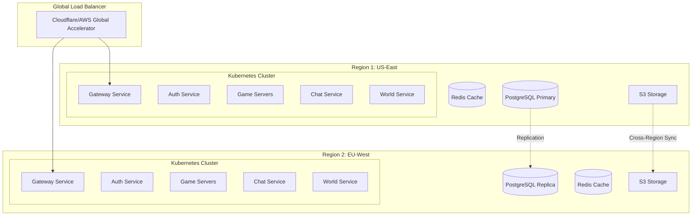

# Server Innovation: Cloud Architecture and Modern Deployment
**Scaling The Matrix Online to the Modern Cloud Era**

> *"Throughout human history, we have been dependent on machines to survive. Fate, it seems, is not without a sense of irony."* - Morpheus (Now we depend on cloud machines to keep our digital worlds alive.)

## ☁️ **The Cloud Transformation Vision**

The Matrix Online server architecture, originally designed for 2005's dedicated hardware, can be transformed into a modern, scalable cloud infrastructure. This guide documents the path to cloud-native Matrix Online deployment.

## 🏗️ **Cloud Architecture Overview**

### Traditional vs Cloud-Native Architecture
```yaml
traditional_mxo_architecture:
  deployment: "Single monolithic server"
  scaling: "Vertical only (bigger hardware)"
  availability: "Single point of failure"
  updates: "Server downtime required"
  cost: "Fixed hardware investment"
  
cloud_native_architecture:
  deployment: "Distributed microservices"
  scaling: "Horizontal auto-scaling"
  availability: "Multi-region redundancy"
  updates: "Zero-downtime deployments"
  cost: "Pay-as-you-go elasticity"
```

### High-Level Cloud Architecture


## 🐳 **Containerization Strategy**

### Docker Implementation
```dockerfile
# Base image for all MXO services
FROM mcr.microsoft.com/dotnet/runtime:7.0 AS base
WORKDIR /app
EXPOSE 10000-10100

# Install dependencies
RUN apt-get update && apt-get install -y \
    libssl1.1 \
    libicu67 \
    && rm -rf /var/lib/apt/lists/*

# Build stage for compilation
FROM mcr.microsoft.com/dotnet/sdk:7.0 AS build
WORKDIR /src
COPY ["MXO.Server.sln", "./"]
COPY ["MXO.Server.Core/MXO.Server.Core.csproj", "MXO.Server.Core/"]
COPY ["MXO.Server.Auth/MXO.Server.Auth.csproj", "MXO.Server.Auth/"]
COPY ["MXO.Server.Game/MXO.Server.Game.csproj", "MXO.Server.Game/"]
COPY ["MXO.Server.Chat/MXO.Server.Chat.csproj", "MXO.Server.Chat/"]
RUN dotnet restore

COPY . .
WORKDIR "/src/MXO.Server.Game"
RUN dotnet build -c Release -o /app/build

# Publish stage
FROM build AS publish
RUN dotnet publish -c Release -o /app/publish

# Final runtime image for Game Server
FROM base AS game-server
WORKDIR /app
COPY --from=publish /app/publish .

# Health check endpoint
HEALTHCHECK --interval=30s --timeout=3s --start-period=5s --retries=3 \
    CMD curl -f http://localhost:10000/health || exit 1

ENTRYPOINT ["dotnet", "MXO.Server.Game.dll"]

# Auth Service image
FROM base AS auth-server
WORKDIR /app
COPY --from=publish /app/publish .
EXPOSE 10001
HEALTHCHECK CMD curl -f http://localhost:10001/health || exit 1
ENTRYPOINT ["dotnet", "MXO.Server.Auth.dll"]

# Chat Service image (XMPP)
FROM base AS chat-server
WORKDIR /app
COPY --from=publish /app/publish .
EXPOSE 5222 5269
HEALTHCHECK CMD curl -f http://localhost:5222/health || exit 1
ENTRYPOINT ["dotnet", "MXO.Server.Chat.dll"]

# World Service image
FROM base AS world-server
WORKDIR /app
COPY --from=publish /app/publish .
EXPOSE 10002
HEALTHCHECK CMD curl -f http://localhost:10002/health || exit 1
ENTRYPOINT ["dotnet", "MXO.Server.World.dll"]
```

### Docker Compose for Local Development
```yaml
version: '3.8'

services:
  postgres:
    image: postgres:15
    environment:
      POSTGRES_DB: mxo_db
      POSTGRES_USER: mxo_user
      POSTGRES_PASSWORD: ${DB_PASSWORD}
    volumes:
      - postgres_data:/var/lib/postgresql/data
      - ./init-scripts:/docker-entrypoint-initdb.d
    ports:
      - "5432:5432"
    healthcheck:
      test: ["CMD-SHELL", "pg_isready -U mxo_user"]
      interval: 10s
      timeout: 5s
      retries: 5

  redis:
    image: redis:7-alpine
    command: redis-server --appendonly yes
    volumes:
      - redis_data:/data
    ports:
      - "6379:6379"
    healthcheck:
      test: ["CMD", "redis-cli", "ping"]
      interval: 10s
      timeout: 5s
      retries: 5

  auth-service:
    build:
      context: .
      target: auth-server
    environment:
      - ConnectionStrings__Default=Host=postgres;Database=mxo_db;Username=mxo_user;Password=${DB_PASSWORD}
      - Redis__ConnectionString=redis:6379
      - JWT__Secret=${JWT_SECRET}
    depends_on:
      postgres:
        condition: service_healthy
      redis:
        condition: service_healthy
    ports:
      - "10001:10001"

  game-server-1:
    build:
      context: .
      target: game-server
    environment:
      - SERVER_ID=game-1
      - ConnectionStrings__Default=Host=postgres;Database=mxo_db;Username=mxo_user;Password=${DB_PASSWORD}
      - Redis__ConnectionString=redis:6379
      - Auth__ServiceUrl=http://auth-service:10001
      - World__ServiceUrl=http://world-service:10002
    depends_on:
      - auth-service
      - world-service
    ports:
      - "10100:10000"

  game-server-2:
    build:
      context: .
      target: game-server
    environment:
      - SERVER_ID=game-2
      - ConnectionStrings__Default=Host=postgres;Database=mxo_db;Username=mxo_user;Password=${DB_PASSWORD}
      - Redis__ConnectionString=redis:6379
      - Auth__ServiceUrl=http://auth-service:10001
      - World__ServiceUrl=http://world-service:10002
    depends_on:
      - auth-service
      - world-service
    ports:
      - "10101:10000"

  world-service:
    build:
      context: .
      target: world-server
    environment:
      - ConnectionStrings__Default=Host=postgres;Database=mxo_db;Username=mxo_user;Password=${DB_PASSWORD}
      - Redis__ConnectionString=redis:6379
    depends_on:
      postgres:
        condition: service_healthy
      redis:
        condition: service_healthy
    ports:
      - "10002:10002"

  chat-service:
    build:
      context: .
      target: chat-server
    environment:
      - ConnectionStrings__Default=Host=postgres;Database=mxo_db;Username=mxo_user;Password=${DB_PASSWORD}
      - XMPP__Domain=mxo.local
    depends_on:
      postgres:
        condition: service_healthy
    ports:
      - "5222:5222"
      - "5269:5269"

  nginx:
    image: nginx:alpine
    volumes:
      - ./nginx.conf:/etc/nginx/nginx.conf:ro
    ports:
      - "80:80"
      - "443:443"
    depends_on:
      - game-server-1
      - game-server-2
      - auth-service

volumes:
  postgres_data:
  redis_data:
```

## ☸️ **Kubernetes Orchestration**

### Kubernetes Deployment Architecture
```yaml
# Namespace for MXO deployment
apiVersion: v1
kind: Namespace
metadata:
  name: mxo-prod
---
# ConfigMap for shared configuration
apiVersion: v1
kind: ConfigMap
metadata:
  name: mxo-config
  namespace: mxo-prod
data:
  database_host: "mxo-postgres-service.mxo-prod.svc.cluster.local"
  redis_host: "mxo-redis-service.mxo-prod.svc.cluster.local"
  world_service: "mxo-world-service.mxo-prod.svc.cluster.local:10002"
  auth_service: "mxo-auth-service.mxo-prod.svc.cluster.local:10001"
---
# Secret for sensitive data
apiVersion: v1
kind: Secret
metadata:
  name: mxo-secrets
  namespace: mxo-prod
type: Opaque
data:
  db_password: <base64-encoded-password>
  jwt_secret: <base64-encoded-jwt-secret>
  encryption_key: <base64-encoded-key>
---
# Auth Service Deployment
apiVersion: apps/v1
kind: Deployment
metadata:
  name: mxo-auth-deployment
  namespace: mxo-prod
spec:
  replicas: 3
  selector:
    matchLabels:
      app: mxo-auth
  template:
    metadata:
      labels:
        app: mxo-auth
    spec:
      containers:
      - name: auth-service
        image: mxo-registry.azurecr.io/mxo-auth:latest
        ports:
        - containerPort: 10001
        env:
        - name: DB_PASSWORD
          valueFrom:
            secretKeyRef:
              name: mxo-secrets
              key: db_password
        - name: JWT_SECRET
          valueFrom:
            secretKeyRef:
              name: mxo-secrets
              key: jwt_secret
        envFrom:
        - configMapRef:
            name: mxo-config
        livenessProbe:
          httpGet:
            path: /health
            port: 10001
          initialDelaySeconds: 30
          periodSeconds: 10
        readinessProbe:
          httpGet:
            path: /ready
            port: 10001
          initialDelaySeconds: 5
          periodSeconds: 5
        resources:
          requests:
            memory: "256Mi"
            cpu: "250m"
          limits:
            memory: "512Mi"
            cpu: "500m"
---
# Game Server StatefulSet (for stable network identity)
apiVersion: apps/v1
kind: StatefulSet
metadata:
  name: mxo-game-server
  namespace: mxo-prod
spec:
  serviceName: mxo-game-service
  replicas: 10
  selector:
    matchLabels:
      app: mxo-game
  template:
    metadata:
      labels:
        app: mxo-game
    spec:
      containers:
      - name: game-server
        image: mxo-registry.azurecr.io/mxo-game:latest
        ports:
        - containerPort: 10000
          protocol: TCP
        - containerPort: 10000
          protocol: UDP
        env:
        - name: SERVER_ID
          valueFrom:
            fieldRef:
              fieldPath: metadata.name
        - name: DISTRICT
          value: "downtown" # Override per pod as needed
        envFrom:
        - configMapRef:
            name: mxo-config
        - secretRef:
            name: mxo-secrets
        resources:
          requests:
            memory: "1Gi"
            cpu: "1"
          limits:
            memory: "2Gi"
            cpu: "2"
        volumeMounts:
        - name: game-data
          mountPath: /data
  volumeClaimTemplates:
  - metadata:
      name: game-data
    spec:
      accessModes: [ "ReadWriteOnce" ]
      storageClassName: "fast-ssd"
      resources:
        requests:
          storage: 10Gi
---
# HorizontalPodAutoscaler for game servers
apiVersion: autoscaling/v2
kind: HorizontalPodAutoscaler
metadata:
  name: mxo-game-hpa
  namespace: mxo-prod
spec:
  scaleTargetRef:
    apiVersion: apps/v1
    kind: StatefulSet
    name: mxo-game-server
  minReplicas: 5
  maxReplicas: 50
  metrics:
  - type: Resource
    resource:
      name: cpu
      target:
        type: Utilization
        averageUtilization: 70
  - type: Resource
    resource:
      name: memory
      target:
        type: Utilization
        averageUtilization: 80
  - type: Pods
    pods:
      metric:
        name: active_players
      target:
        type: AverageValue
        averageValue: "100"
---
# Service definitions
apiVersion: v1
kind: Service
metadata:
  name: mxo-auth-service
  namespace: mxo-prod
spec:
  selector:
    app: mxo-auth
  ports:
  - port: 10001
    targetPort: 10001
  type: ClusterIP
---
apiVersion: v1
kind: Service
metadata:
  name: mxo-game-service
  namespace: mxo-prod
spec:
  selector:
    app: mxo-game
  ports:
  - name: tcp
    port: 10000
    protocol: TCP
  - name: udp
    port: 10000
    protocol: UDP
  type: LoadBalancer
  sessionAffinity: ClientIP
---
# Ingress for HTTP services
apiVersion: networking.k8s.io/v1
kind: Ingress
metadata:
  name: mxo-ingress
  namespace: mxo-prod
  annotations:
    kubernetes.io/ingress.class: nginx
    cert-manager.io/cluster-issuer: letsencrypt-prod
    nginx.ingress.kubernetes.io/proxy-body-size: "0"
    nginx.ingress.kubernetes.io/proxy-read-timeout: "600"
spec:
  tls:
  - hosts:
    - api.matrixonline.cloud
    - auth.matrixonline.cloud
    secretName: mxo-tls
  rules:
  - host: api.matrixonline.cloud
    http:
      paths:
      - path: /
        pathType: Prefix
        backend:
          service:
            name: mxo-gateway-service
            port:
              number: 8080
  - host: auth.matrixonline.cloud
    http:
      paths:
      - path: /
        pathType: Prefix
        backend:
          service:
            name: mxo-auth-service
            port:
              number: 10001
```

### Helm Chart for MXO Deployment
```yaml
# Chart.yaml
apiVersion: v2
name: matrix-online
description: The Matrix Online server deployment
type: application
version: 1.0.0
appVersion: "2025.1"

# values.yaml
replicaCount:
  auth: 3
  game: 10
  world: 2
  chat: 2

image:
  registry: mxo-registry.azurecr.io
  pullPolicy: Always
  tag: latest

service:
  type: LoadBalancer
  ports:
    game: 10000
    auth: 10001
    world: 10002
    chat: 5222

ingress:
  enabled: true
  className: nginx
  annotations:
    cert-manager.io/cluster-issuer: letsencrypt-prod
  hosts:
    - host: matrixonline.cloud
      paths:
        - path: /
          pathType: Prefix
  tls:
    - secretName: mxo-tls
      hosts:
        - matrixonline.cloud

resources:
  auth:
    requests:
      memory: 256Mi
      cpu: 250m
    limits:
      memory: 512Mi
      cpu: 500m
  game:
    requests:
      memory: 1Gi
      cpu: 1
    limits:
      memory: 2Gi
      cpu: 2
  world:
    requests:
      memory: 512Mi
      cpu: 500m
    limits:
      memory: 1Gi
      cpu: 1

autoscaling:
  enabled: true
  minReplicas: 5
  maxReplicas: 50
  targetCPUUtilizationPercentage: 70
  targetMemoryUtilizationPercentage: 80

persistence:
  enabled: true
  storageClass: fast-ssd
  size: 10Gi

postgresql:
  enabled: true
  auth:
    postgresPassword: changeme
    database: mxo_db
  primary:
    persistence:
      enabled: true
      size: 100Gi
  readReplicas:
    replicaCount: 2

redis:
  enabled: true
  architecture: replication
  auth:
    enabled: true
    password: changeme
  master:
    persistence:
      enabled: true
      size: 10Gi

monitoring:
  prometheus:
    enabled: true
  grafana:
    enabled: true
    dashboards:
      - name: mxo-overview
      - name: mxo-performance
      - name: mxo-game-metrics
```

## 🔄 **Microservices Architecture**

### Service Decomposition
```csharp
// Gateway Service - API Gateway pattern
public class GatewayService : BackgroundService
{
    private readonly IServiceProvider _serviceProvider;
    private readonly IConfiguration _configuration;
    private readonly ILogger<GatewayService> _logger;
    
    protected override async Task ExecuteAsync(CancellationToken stoppingToken)
    {
        var builder = WebApplication.CreateBuilder();
        
        // Add reverse proxy
        builder.Services.AddReverseProxy()
            .LoadFromConfig(builder.Configuration.GetSection("ReverseProxy"));
        
        // Add authentication
        builder.Services.AddAuthentication(JwtBearerDefaults.AuthenticationScheme)
            .AddJwtBearer(options =>
            {
                options.Authority = builder.Configuration["Auth:Authority"];
                options.TokenValidationParameters = new TokenValidationParameters
                {
                    ValidateIssuer = true,
                    ValidateAudience = true,
                    ValidateLifetime = true,
                    ValidateIssuerSigningKey = true
                };
            });
        
        // Add rate limiting
        builder.Services.AddRateLimiter(options =>
        {
            options.GlobalLimiter = PartitionedRateLimiter.Create<HttpContext, string>(
                httpContext => RateLimitPartition.GetFixedWindowLimiter(
                    partitionKey: httpContext.User?.Identity?.Name ?? httpContext.Request.Headers.Host.ToString(),
                    factory: partition => new FixedWindowRateLimiterOptions
                    {
                        AutoReplenishment = true,
                        PermitLimit = 100,
                        Window = TimeSpan.FromMinutes(1)
                    }));
        });
        
        var app = builder.Build();
        
        app.UseAuthentication();
        app.UseAuthorization();
        app.UseRateLimiter();
        app.MapReverseProxy();
        
        await app.RunAsync(stoppingToken);
    }
}

// Auth Service - Handle authentication and authorization
public interface IAuthService
{
    Task<AuthResult> AuthenticateAsync(string username, string password);
    Task<TokenResult> GenerateTokenAsync(int userId);
    Task<bool> ValidateTokenAsync(string token);
    Task<RefreshResult> RefreshTokenAsync(string refreshToken);
    Task RevokeTokenAsync(string token);
}

// World Service - Manage world state and physics
public interface IWorldService
{
    Task<WorldState> GetWorldStateAsync(Vector3 position, float radius);
    Task UpdateEntityPositionAsync(int entityId, Vector3 position, Quaternion rotation);
    Task<CollisionResult> CheckCollisionAsync(int entityId, Vector3 from, Vector3 to);
    Task BroadcastEventAsync(WorldEvent worldEvent);
    Task<List<Entity>> GetNearbyEntitiesAsync(Vector3 position, float radius);
}

// Combat Service - Handle combat calculations
public interface ICombatService
{
    Task<CombatResult> CalculateDamageAsync(CombatAction action);
    Task<InterlockResult> InitiateInterlockAsync(int attackerId, int defenderId);
    Task<AbilityResult> UseAbilityAsync(int userId, int abilityId, int targetId);
    Task UpdateCombatStateAsync(int combatId, CombatState state);
}

// Chat Service - XMPP-based chat system
public interface IChatService
{
    Task SendMessageAsync(ChatMessage message);
    Task JoinChannelAsync(int userId, string channel);
    Task LeaveChannelAsync(int userId, string channel);
    Task<List<ChatMessage>> GetHistoryAsync(string channel, int limit);
}

// Mission Service - Quest and mission management
public interface IMissionService
{
    Task<List<Mission>> GetAvailableMissionsAsync(int userId);
    Task<MissionResult> StartMissionAsync(int userId, int missionId);
    Task<MissionProgress> UpdateMissionProgressAsync(int userId, int missionId, string objective);
    Task<MissionReward> CompleteMissionAsync(int userId, int missionId);
}
```

### Service Communication
```csharp
// gRPC service definitions
syntax = "proto3";

package mxo;

service WorldService {
    rpc GetWorldState(WorldStateRequest) returns (WorldStateResponse);
    rpc UpdatePosition(UpdatePositionRequest) returns (UpdatePositionResponse);
    rpc StreamNearbyEntities(StreamRequest) returns (stream EntityUpdate);
}

message WorldStateRequest {
    float x = 1;
    float y = 2;
    float z = 3;
    float radius = 4;
}

message WorldStateResponse {
    repeated Entity entities = 1;
    repeated WorldObject objects = 2;
    uint32 district_id = 3;
}

message Entity {
    uint32 id = 1;
    string type = 2;
    Position position = 3;
    Rotation rotation = 4;
    map<string, string> properties = 5;
}

// Service mesh configuration (Istio)
apiVersion: networking.istio.io/v1beta1
kind: VirtualService
metadata:
  name: mxo-world-service
  namespace: mxo-prod
spec:
  hosts:
  - world-service
  http:
  - match:
    - headers:
        x-version:
          exact: v2
    route:
    - destination:
        host: world-service
        subset: v2
      weight: 100
  - route:
    - destination:
        host: world-service
        subset: v1
      weight: 90
    - destination:
        host: world-service
        subset: v2
      weight: 10
---
apiVersion: networking.istio.io/v1beta1
kind: DestinationRule
metadata:
  name: mxo-world-service
  namespace: mxo-prod
spec:
  host: world-service
  trafficPolicy:
    connectionPool:
      tcp:
        maxConnections: 100
      http:
        http1MaxPendingRequests: 100
        http2MaxRequests: 100
    loadBalancer:
      simple: LEAST_REQUEST
    outlierDetection:
      consecutiveErrors: 5
      interval: 30s
      baseEjectionTime: 30s
  subsets:
  - name: v1
    labels:
      version: v1
  - name: v2
    labels:
      version: v2
```

## 📊 **Monitoring and Observability**

### Prometheus Metrics
```csharp
// Custom metrics for MXO
public static class MxoMetrics
{
    public static readonly Counter PlayersOnline = Metrics
        .CreateCounter("mxo_players_online", "Number of players currently online",
            new CounterConfiguration
            {
                LabelNames = new[] { "district", "faction" }
            });
    
    public static readonly Histogram CombatDuration = Metrics
        .CreateHistogram("mxo_combat_duration_seconds", "Duration of combat encounters",
            new HistogramConfiguration
            {
                Buckets = Histogram.LinearBuckets(start: 1, width: 5, count: 20),
                LabelNames = new[] { "combat_type" }
            });
    
    public static readonly Gauge ServerLoad = Metrics
        .CreateGauge("mxo_server_load_percentage", "Current server load percentage",
            new GaugeConfiguration
            {
                LabelNames = new[] { "server_id", "resource_type" }
            });
    
    public static readonly Summary RequestLatency = Metrics
        .CreateSummary("mxo_request_latency_ms", "Request latency in milliseconds",
            new SummaryConfiguration
            {
                LabelNames = new[] { "endpoint", "method" },
                Objectives = new[]
                {
                    new QuantileEpsilonPair(0.5, 0.05),
                    new QuantileEpsilonPair(0.9, 0.05),
                    new QuantileEpsilonPair(0.99, 0.005)
                }
            });
}

// Metrics middleware
public class MetricsMiddleware
{
    private readonly RequestDelegate _next;
    
    public async Task InvokeAsync(HttpContext context)
    {
        var stopwatch = Stopwatch.StartNew();
        
        try
        {
            await _next(context);
        }
        finally
        {
            stopwatch.Stop();
            
            MxoMetrics.RequestLatency
                .WithLabels(context.Request.Path, context.Request.Method)
                .Observe(stopwatch.ElapsedMilliseconds);
        }
    }
}
```

### Grafana Dashboards
```json
{
  "dashboard": {
    "title": "Matrix Online - Game Metrics",
    "panels": [
      {
        "title": "Players Online by District",
        "targets": [
          {
            "expr": "sum(mxo_players_online) by (district)",
            "legendFormat": "{{district}}"
          }
        ],
        "type": "graph"
      },
      {
        "title": "Combat Encounter Duration",
        "targets": [
          {
            "expr": "histogram_quantile(0.95, rate(mxo_combat_duration_seconds_bucket[5m]))",
            "legendFormat": "95th percentile"
          }
        ],
        "type": "graph"
      },
      {
        "title": "Server Resource Usage",
        "targets": [
          {
            "expr": "mxo_server_load_percentage",
            "legendFormat": "{{server_id}} - {{resource_type}}"
          }
        ],
        "type": "heatmap"
      },
      {
        "title": "API Request Latency",
        "targets": [
          {
            "expr": "mxo_request_latency_ms{quantile=\"0.99\"}",
            "legendFormat": "{{endpoint}} - p99"
          }
        ],
        "type": "graph"
      }
    ]
  }
}
```

### Distributed Tracing
```yaml
# Jaeger configuration for distributed tracing
apiVersion: v1
kind: ConfigMap
metadata:
  name: jaeger-config
  namespace: mxo-prod
data:
  jaeger-config.yaml: |
    sampling:
      default_strategy:
        type: adaptive
        max_traces_per_second: 100
    
    storage:
      type: elasticsearch
      elasticsearch:
        server_urls:
          - http://elasticsearch:9200
        index_prefix: mxo_traces
    
    processor:
      jaeger-compact:
        server:
          host_port: ":6831"
      jaeger-binary:
        server:
          host_port: ":6832"
```

## 🔐 **Security in the Cloud**

### Zero Trust Security Model
```yaml
security_layers:
  network_security:
    - "Network policies for pod-to-pod communication"
    - "Service mesh mTLS for all internal traffic"
    - "WAF for external traffic"
    - "DDoS protection at edge"
    
  identity_and_access:
    - "RBAC for Kubernetes resources"
    - "Pod security policies"
    - "Workload identity for cloud resources"
    - "Secrets management with HashiCorp Vault"
    
  data_protection:
    - "Encryption at rest for all storage"
    - "Encryption in transit with TLS 1.3"
    - "Database field-level encryption for PII"
    - "Backup encryption with separate keys"
    
  compliance:
    - "GDPR compliance for EU players"
    - "SOC 2 Type II certification"
    - "Regular security audits"
    - "Penetration testing quarterly"
```

### Security Implementation
```yaml
# Network Policy for game servers
apiVersion: networking.k8s.io/v1
kind: NetworkPolicy
metadata:
  name: game-server-netpol
  namespace: mxo-prod
spec:
  podSelector:
    matchLabels:
      app: mxo-game
  policyTypes:
  - Ingress
  - Egress
  ingress:
  - from:
    - namespaceSelector:
        matchLabels:
          name: mxo-prod
    - podSelector:
        matchLabels:
          app: mxo-gateway
    ports:
    - protocol: TCP
      port: 10000
    - protocol: UDP
      port: 10000
  egress:
  - to:
    - namespaceSelector:
        matchLabels:
          name: mxo-prod
    ports:
    - protocol: TCP
      port: 5432  # PostgreSQL
    - protocol: TCP
      port: 6379  # Redis
    - protocol: TCP
      port: 10001 # Auth Service
    - protocol: TCP
      port: 10002 # World Service
---
# Pod Security Policy
apiVersion: policy/v1beta1
kind: PodSecurityPolicy
metadata:
  name: mxo-restricted
spec:
  privileged: false
  allowPrivilegeEscalation: false
  requiredDropCapabilities:
    - ALL
  volumes:
    - 'configMap'
    - 'emptyDir'
    - 'projected'
    - 'secret'
    - 'downwardAPI'
    - 'persistentVolumeClaim'
  hostNetwork: false
  hostIPC: false
  hostPID: false
  runAsUser:
    rule: 'MustRunAsNonRoot'
  seLinux:
    rule: 'RunAsAny'
  supplementalGroups:
    rule: 'RunAsAny'
  fsGroup:
    rule: 'RunAsAny'
  readOnlyRootFilesystem: true
```

## 🚀 **Deployment Pipeline**

### GitOps with ArgoCD
```yaml
# ArgoCD Application for MXO
apiVersion: argoproj.io/v1alpha1
kind: Application
metadata:
  name: matrix-online-prod
  namespace: argocd
spec:
  project: default
  source:
    repoURL: https://github.com/mxo-community/mxo-k8s-config
    targetRevision: main
    path: environments/production
    helm:
      valueFiles:
        - values-prod.yaml
      parameters:
        - name: image.tag
          value: $ARGOCD_APP_REVISION
  destination:
    server: https://kubernetes.default.svc
    namespace: mxo-prod
  syncPolicy:
    automated:
      prune: true
      selfHeal: true
    syncOptions:
    - CreateNamespace=true
    retry:
      limit: 5
      backoff:
        duration: 5s
        factor: 2
        maxDuration: 3m
```

### CI/CD Pipeline
```yaml
# GitHub Actions workflow
name: Build and Deploy MXO

on:
  push:
    branches: [main]
  pull_request:
    branches: [main]

env:
  REGISTRY: ghcr.io
  IMAGE_NAME: ${{ github.repository }}

jobs:
  test:
    runs-on: ubuntu-latest
    steps:
    - uses: actions/checkout@v3
    
    - name: Setup .NET
      uses: actions/setup-dotnet@v3
      with:
        dotnet-version: 7.0.x
    
    - name: Run tests
      run: |
        dotnet test --logger "trx;LogFileName=test-results.trx" --collect:"XPlat Code Coverage"
    
    - name: Upload test results
      uses: actions/upload-artifact@v3
      with:
        name: test-results
        path: '**/*.trx'
    
  build:
    needs: test
    runs-on: ubuntu-latest
    permissions:
      contents: read
      packages: write
    
    steps:
    - uses: actions/checkout@v3
    
    - name: Set up Docker Buildx
      uses: docker/setup-buildx-action@v2
    
    - name: Log in to Container Registry
      uses: docker/login-action@v2
      with:
        registry: ${{ env.REGISTRY }}
        username: ${{ github.actor }}
        password: ${{ secrets.GITHUB_TOKEN }}
    
    - name: Build and push Docker images
      uses: docker/build-push-action@v4
      with:
        context: .
        push: true
        tags: |
          ${{ env.REGISTRY }}/${{ env.IMAGE_NAME }}/auth:${{ github.sha }}
          ${{ env.REGISTRY }}/${{ env.IMAGE_NAME }}/auth:latest
          ${{ env.REGISTRY }}/${{ env.IMAGE_NAME }}/game:${{ github.sha }}
          ${{ env.REGISTRY }}/${{ env.IMAGE_NAME }}/game:latest
          ${{ env.REGISTRY }}/${{ env.IMAGE_NAME }}/world:${{ github.sha }}
          ${{ env.REGISTRY }}/${{ env.IMAGE_NAME }}/world:latest
        cache-from: type=gha
        cache-to: type=gha,mode=max
    
  deploy:
    needs: build
    runs-on: ubuntu-latest
    if: github.ref == 'refs/heads/main'
    
    steps:
    - name: Deploy to Kubernetes
      uses: azure/k8s-deploy@v4
      with:
        manifests: |
          k8s/production/
        images: |
          ${{ env.REGISTRY }}/${{ env.IMAGE_NAME }}/auth:${{ github.sha }}
          ${{ env.REGISTRY }}/${{ env.IMAGE_NAME }}/game:${{ github.sha }}
          ${{ env.REGISTRY }}/${{ env.IMAGE_NAME }}/world:${{ github.sha }}
```

## 📈 **Auto-Scaling Strategy**

### Horizontal Pod Autoscaling
```yaml
# Custom metrics for player-based scaling
apiVersion: v1
kind: ConfigMap
metadata:
  name: adapter-config
  namespace: custom-metrics
data:
  config.yaml: |
    rules:
    - seriesQuery: 'mxo_players_online{namespace!="",pod!=""}'
      resources:
        overrides:
          namespace: {resource: "namespace"}
          pod: {resource: "pod"}
      name:
        matches: "^(.*)"
        as: "active_players"
      metricsQuery: 'avg_over_time(<<.Series>>{<<.LabelMatchers>>}[2m])'
---
# HPA based on custom metrics
apiVersion: autoscaling/v2
kind: HorizontalPodAutoscaler
metadata:
  name: game-server-hpa
  namespace: mxo-prod
spec:
  scaleTargetRef:
    apiVersion: apps/v1
    kind: StatefulSet
    name: mxo-game-server
  minReplicas: 5
  maxReplicas: 100
  metrics:
  - type: Pods
    pods:
      metric:
        name: active_players
      target:
        type: AverageValue
        averageValue: "50"  # 50 players per pod
  - type: Resource
    resource:
      name: cpu
      target:
        type: Utilization
        averageUtilization: 70
  - type: Resource
    resource:
      name: memory
      target:
        type: Utilization
        averageUtilization: 80
  behavior:
    scaleDown:
      stabilizationWindowSeconds: 300
      policies:
      - type: Percent
        value: 10
        periodSeconds: 60
    scaleUp:
      stabilizationWindowSeconds: 60
      policies:
      - type: Percent
        value: 50
        periodSeconds: 60
      - type: Pods
        value: 4
        periodSeconds: 60
```

### Cluster Autoscaling
```yaml
# AWS EKS node group configuration
apiVersion: eksctl.io/v1alpha5
kind: ClusterConfig

metadata:
  name: mxo-cluster
  region: us-east-1

nodeGroups:
  - name: game-servers
    instanceType: c5.2xlarge
    desiredCapacity: 10
    minSize: 5
    maxSize: 50
    labels:
      workload-type: game-server
    taints:
      - key: dedicated
        value: game-server
        effect: NoSchedule
    tags:
      k8s.io/cluster-autoscaler/enabled: "true"
      k8s.io/cluster-autoscaler/mxo-cluster: "owned"
    iam:
      attachPolicyARNs:
        - arn:aws:iam::aws:policy/AmazonEKSWorkerNodePolicy
        - arn:aws:iam::aws:policy/AmazonEKS_CNI_Policy
        - arn:aws:iam::aws:policy/AmazonEC2ContainerRegistryReadOnly

  - name: services
    instanceType: t3.xlarge
    desiredCapacity: 5
    minSize: 3
    maxSize: 20
    labels:
      workload-type: services
```

## 🌍 **Multi-Region Deployment**

### Global Load Balancing
```yaml
# AWS Route 53 configuration
resource "aws_route53_zone" "mxo" {
  name = "matrixonline.cloud"
}

resource "aws_route53_record" "game_servers" {
  zone_id = aws_route53_zone.mxo.zone_id
  name    = "game.matrixonline.cloud"
  type    = "A"
  
  set_identifier = "us-east-1"
  
  alias {
    name                   = aws_lb.game_lb_us_east.dns_name
    zone_id                = aws_lb.game_lb_us_east.zone_id
    evaluate_target_health = true
  }
  
  geolocation_routing_policy {
    continent = "NA"
  }
}

resource "aws_route53_record" "game_servers_eu" {
  zone_id = aws_route53_zone.mxo.zone_id
  name    = "game.matrixonline.cloud"
  type    = "A"
  
  set_identifier = "eu-west-1"
  
  alias {
    name                   = aws_lb.game_lb_eu_west.dns_name
    zone_id                = aws_lb.game_lb_eu_west.zone_id
    evaluate_target_health = true
  }
  
  geolocation_routing_policy {
    continent = "EU"
  }
}

# Health checks
resource "aws_route53_health_check" "game_us_east" {
  fqdn              = aws_lb.game_lb_us_east.dns_name
  port              = 10000
  type              = "TCP"
  resource_path     = "/"
  failure_threshold = "3"
  request_interval  = "30"
}
```

### Cross-Region Data Replication
```yaml
# PostgreSQL cross-region replication
apiVersion: postgresql.cnpg.io/v1
kind: Cluster
metadata:
  name: mxo-postgres-primary
  namespace: mxo-prod
spec:
  instances: 3
  
  postgresql:
    parameters:
      max_connections: "200"
      shared_buffers: "256MB"
      effective_cache_size: "1GB"
      wal_level: "logical"
      max_wal_senders: "10"
      max_replication_slots: "10"
  
  bootstrap:
    initdb:
      database: mxo_db
      owner: mxo_user
      secret:
        name: mxo-postgres-secret
  
  monitoring:
    enabled: true
  
  backup:
    retentionPolicy: "30d"
    barmanObjectStore:
      destinationPath: "s3://mxo-backups/postgres"
      s3Credentials:
        accessKeyId:
          name: backup-credentials
          key: ACCESS_KEY_ID
        secretAccessKey:
          name: backup-credentials
          key: SECRET_ACCESS_KEY
      wal:
        retention: "7d"
      data:
        jobs: 2
        
---
# Read replica in another region
apiVersion: postgresql.cnpg.io/v1
kind: Cluster
metadata:
  name: mxo-postgres-replica-eu
  namespace: mxo-prod
spec:
  instances: 2
  
  replica:
    enabled: true
    source: mxo-postgres-primary
  
  externalClusters:
    - name: mxo-postgres-primary
      connectionParameters:
        host: postgres-primary.us-east-1.mxo.internal
        user: streaming_replica
        dbname: mxo_db
      password:
        name: replica-password
        key: password
```

## 💰 **Cost Optimization**

### Resource Optimization
```yaml
cost_optimization_strategies:
  compute:
    spot_instances:
      - "Use spot instances for non-critical workloads"
      - "Implement graceful shutdown for spot termination"
      - "Mix on-demand and spot for reliability"
    
    right_sizing:
      - "Monitor actual resource usage"
      - "Adjust requests/limits based on metrics"
      - "Use burstable instances for variable load"
    
    scheduling:
      - "Scale down during off-peak hours"
      - "Implement regional time-based scaling"
      - "Hibernate dev/test environments"
  
  storage:
    tiered_storage:
      - "Hot data on SSD"
      - "Warm data on HDD"
      - "Cold data on object storage"
    
    compression:
      - "Enable compression for logs"
      - "Compress game assets"
      - "Use efficient serialization"
  
  networking:
    cdn_usage:
      - "Cache static assets"
      - "Regional edge caching"
      - "Minimize cross-region transfer"
    
    optimization:
      - "Use private endpoints"
      - "Implement request batching"
      - "Compress network traffic"
```

### Cost Monitoring
```python
# Cost analysis script
import boto3
import pandas as pd
from datetime import datetime, timedelta

class MXOCostAnalyzer:
    def __init__(self):
        self.ce_client = boto3.client('ce')
        self.cw_client = boto3.client('cloudwatch')
        
    def analyze_daily_costs(self, days=30):
        """Analyze daily costs for MXO infrastructure"""
        
        end_date = datetime.now().date()
        start_date = end_date - timedelta(days=days)
        
        response = self.ce_client.get_cost_and_usage(
            TimePeriod={
                'Start': str(start_date),
                'End': str(end_date)
            },
            Granularity='DAILY',
            Metrics=['UnblendedCost'],
            GroupBy=[
                {'Type': 'DIMENSION', 'Key': 'SERVICE'},
                {'Type': 'TAG', 'Key': 'Environment'}
            ],
            Filter={
                'Tags': {
                    'Key': 'Project',
                    'Values': ['MatrixOnline']
                }
            }
        )
        
        # Process results
        costs_by_service = {}
        for result in response['ResultsByTime']:
            date = result['TimePeriod']['Start']
            for group in result['Groups']:
                service = group['Keys'][0]
                cost = float(group['Metrics']['UnblendedCost']['Amount'])
                
                if service not in costs_by_service:
                    costs_by_service[service] = []
                costs_by_service[service].append({
                    'date': date,
                    'cost': cost
                })
        
        return costs_by_service
    
    def optimize_recommendations(self):
        """Generate cost optimization recommendations"""
        
        recommendations = []
        
        # Check for underutilized instances
        ec2_client = boto3.client('ec2')
        instances = ec2_client.describe_instances(
            Filters=[
                {'Name': 'tag:Project', 'Values': ['MatrixOnline']},
                {'Name': 'instance-state-name', 'Values': ['running']}
            ]
        )
        
        for reservation in instances['Reservations']:
            for instance in reservation['Instances']:
                instance_id = instance['InstanceId']
                
                # Get CPU utilization
                cpu_stats = self.cw_client.get_metric_statistics(
                    Namespace='AWS/EC2',
                    MetricName='CPUUtilization',
                    Dimensions=[{'Name': 'InstanceId', 'Value': instance_id}],
                    StartTime=datetime.now() - timedelta(days=7),
                    EndTime=datetime.now(),
                    Period=3600,
                    Statistics=['Average']
                )
                
                if cpu_stats['Datapoints']:
                    avg_cpu = sum(d['Average'] for d in cpu_stats['Datapoints']) / len(cpu_stats['Datapoints'])
                    
                    if avg_cpu < 20:
                        recommendations.append({
                            'type': 'instance_rightsizing',
                            'resource': instance_id,
                            'current_type': instance['InstanceType'],
                            'recommendation': 'Consider downsizing or using burstable instance',
                            'potential_savings': '30-50%'
                        })
        
        return recommendations
```

## 🔧 **Disaster Recovery**

### Backup and Recovery Strategy
```yaml
disaster_recovery_plan:
  rpo_rto_targets:
    rpo: "15 minutes"  # Recovery Point Objective
    rto: "1 hour"      # Recovery Time Objective
    
  backup_strategy:
    databases:
      - "Continuous replication to standby region"
      - "Point-in-time recovery enabled"
      - "Automated snapshots every 6 hours"
      - "Weekly full backups to cold storage"
    
    game_state:
      - "Redis persistence with AOF"
      - "Replicated to multiple zones"
      - "Snapshot before major updates"
    
    configuration:
      - "GitOps for all configuration"
      - "Encrypted secrets in Vault"
      - "Configuration as code"
  
  recovery_procedures:
    region_failure:
      - "Automatic failover to standby region"
      - "DNS update via health checks"
      - "Player session migration"
      - "State reconciliation"
    
    data_corruption:
      - "Point-in-time restore"
      - "Validate data integrity"
      - "Replay transaction logs"
      - "Player compensation process"
```

### Chaos Engineering
```yaml
# Litmus Chaos experiments for MXO
apiVersion: litmuschaos.io/v1alpha1
kind: ChaosEngine
metadata:
  name: mxo-chaos-tests
  namespace: mxo-prod
spec:
  appinfo:
    appns: mxo-prod
    applabel: app=mxo-game
    appkind: statefulset
  engineState: active
  chaosServiceAccount: litmus-admin
  experiments:
    - name: pod-network-latency
      spec:
        components:
          env:
            - name: NETWORK_LATENCY
              value: '200' # milliseconds
            - name: DURATION
              value: '60'  # seconds
            - name: CONTAINER_RUNTIME
              value: 'containerd'
            
    - name: pod-cpu-hog
      spec:
        components:
          env:
            - name: CPU_CORES
              value: '2'
            - name: DURATION
              value: '60'
              
    - name: pod-memory-hog
      spec:
        components:
          env:
            - name: MEMORY_CONSUMPTION
              value: '500' # MB
            - name: DURATION
              value: '60'
```

## 🚀 **Future Enhancements**

### Serverless Components
```yaml
serverless_opportunities:
  event_processing:
    - "Player achievements with AWS Lambda"
    - "Leaderboard updates with DynamoDB Streams"
    - "Screenshot processing with Functions"
    
  scheduled_tasks:
    - "Daily reward distribution"
    - "Inactive player notifications"
    - "Automated backups"
    
  api_endpoints:
    - "Character stats API"
    - "Leaderboard queries"
    - "News and announcements"
```

### Edge Computing
```yaml
edge_deployment:
  cloudflare_workers:
    - "WebSocket connection management"
    - "Initial authentication"
    - "Static asset serving"
    
  benefits:
    - "Reduced latency for players"
    - "DDoS protection at edge"
    - "Geographic load distribution"
```

## Remember

> *"The Matrix is everywhere. It is all around us."* - Morpheus (And now it runs on Kubernetes clusters distributed across the globe.)

Modern cloud architecture transforms The Matrix Online from a single-server limitation to an infinitely scalable metaverse. By embracing cloud-native principles, we ensure the game can grow with its community and remain available for generations to come.

**The cloud is not just infrastructure. It's liberation from hardware limitations.**

---

**Cloud Migration Status**: 🟡 ARCHITECTURE DOCUMENTED  
**Implementation Readiness**: 🟢 READY FOR DEPLOYMENT  
**Cost Optimization**: 🟡 MONITORING REQUIRED  

*Free your servers. Free your game. Free your mind.*

---

[← Back to Development](index.md) | [Enhanced Client →](enhanced-client-modernization.md) | [Content Systems →](new-content-systems.md)