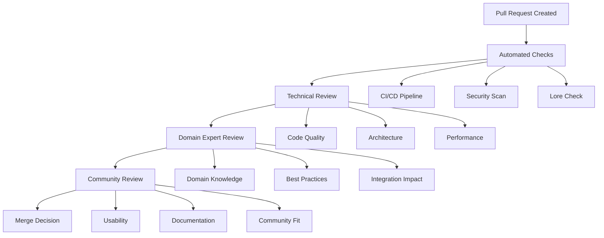

# Code Review Standards for MXO Development
**Elevating Quality Through Collaborative Excellence**

> *"You have to let it all go, Neo. Fear, doubt, and disbelief."* - Morpheus (And trust the process of collaborative improvement.)

## 🎯 **The Philosophy of Code Review**

Code review isn't about finding fault - it's about collective elevation. In the Matrix Online revival, every line of code is an act of digital liberation, and code review ensures that liberation is accessible, secure, and sustainable.

## 🔍 **Review Principles**

### Core Values

```yaml
review_values:
  constructive: "Build up, don't tear down"
  educational: "Every review is a learning opportunity"
  respectful: "Critique code, not character"
  thorough: "Quality over speed"
  inclusive: "Welcome all skill levels"
  matrix_authentic: "Maintain universe integrity"
```

### The Three-Level Review System



## 📋 **Technical Review Standards**

### Code Quality Checklist

```markdown
## 🔧 Technical Review Checklist

### Functionality ✅
- [ ] **Code Works**: Functionality matches requirements
- [ ] **Edge Cases**: Handles invalid input gracefully
- [ ] **Error Handling**: Proper exception handling and logging
- [ ] **Resource Management**: Memory leaks and resource cleanup
- [ ] **Thread Safety**: Concurrent access handled properly

### Code Design ✅
- [ ] **Single Responsibility**: Functions/classes have clear purpose
- [ ] **DRY Principle**: No unnecessary code duplication
- [ ] **SOLID Principles**: Well-structured, extensible design
- [ ] **Naming Conventions**: Clear, consistent, meaningful names
- [ ] **Function Size**: Functions are reasonably sized (<50 lines)

### Performance ✅
- [ ] **Algorithmic Efficiency**: Optimal time/space complexity
- [ ] **Database Queries**: Efficient queries, proper indexing
- [ ] **Memory Usage**: No unnecessary memory allocation
- [ ] **Network Efficiency**: Minimal network calls, proper caching
- [ ] **Scalability**: Code scales with user/data growth

### Security ✅
- [ ] **Input Validation**: All user input sanitized
- [ ] **SQL Injection**: Parameterized queries used
- [ ] **XSS Prevention**: Output properly escaped
- [ ] **Authentication**: Proper auth checks in place
- [ ] **Authorization**: Role-based access controls
- [ ] **Cryptography**: Secure random numbers, proper hashing
- [ ] **Secrets**: No hardcoded passwords/keys

### Testing ✅
- [ ] **Unit Tests**: Core logic has unit test coverage
- [ ] **Integration Tests**: Component interactions tested
- [ ] **Test Quality**: Tests are clear and maintainable
- [ ] **Coverage**: Adequate test coverage (>80% for critical paths)
- [ ] **Test Data**: Tests use realistic data scenarios
```

### Matrix Online Specific Standards

```markdown
## 🕶️ Matrix Online Specific Review

### Lore Authenticity ✅
- [ ] **Canon Compliance**: Adheres to established Matrix lore
- [ ] **Faction Representation**: Balanced faction portrayal
- [ ] **Terminology**: Uses correct Matrix universe terms
- [ ] **Timeline Consistency**: Events align with established timeline
- [ ] **Character Voices**: NPCs speak authentically

### Game Mechanics ✅
- [ ] **Balance**: Changes don't break game balance
- [ ] **Combat System**: Follows D100 mechanics correctly
- [ ] **Ability System**: Powers feel authentic to source
- [ ] **World Consistency**: Changes fit existing world
- [ ] **Player Agency**: Preserves meaningful player choice

### Server Compatibility ✅
- [ ] **Protocol Compliance**: Follows MXO network protocol
- [ ] **Cross-Server**: Works with multiple server implementations
- [ ] **Version Support**: Backward compatibility maintained
- [ ] **Performance Impact**: Doesn't degrade server performance
- [ ] **Database Schema**: Compatible with existing schemas

### Client Integration ✅
- [ ] **UI Consistency**: Matches existing interface patterns
- [ ] **Accessibility**: Supports various user needs
- [ ] **Performance**: Doesn't impact client framerate
- [ ] **Controls**: Intuitive and consistent controls
- [ ] **Visual Quality**: Maintains art style consistency
```

## 🎨 **Review Communication Standards**

### Comment Types and Templates

#### Suggesting Improvements

```markdown
## 💡 Suggestion Template

**File**: `src/combat/ability_system.py`
**Line**: 42
**Type**: Performance Optimization

**Current approach:**
```python
for ability in all_abilities:
    if ability.name == target_name:
        return ability
```

**Suggested improvement:**
```python
# Use dictionary lookup for O(1) performance
ability_lookup = {ability.name: ability for ability in all_abilities}
return ability_lookup.get(target_name)
```

**Rationale**: Linear search becomes expensive with many abilities. Dictionary lookup provides constant-time access.

**Impact**: High - This function is called frequently during combat
```

#### Requesting Clarification

```markdown
## ❓ Clarification Request Template

**File**: `src/networking/packet_handler.py`
**Line**: 156
**Type**: Logic Question

**Question**: I'm not clear on the purpose of the `mystery_flag` variable. Could you explain:

1. What conditions cause it to be set to `True`?
2. How does it affect the packet processing flow?
3. Is this related to a specific MXO protocol feature?

**Context**: Understanding this will help me review the error handling logic below.
```

#### Identifying Issues

```markdown
## ⚠️ Issue Identification Template

**File**: `src/database/character_manager.py`
**Line**: 73
**Type**: Security Vulnerability
**Severity**: High

**Issue**: SQL injection vulnerability in character lookup
```sql
query = f"SELECT * FROM characters WHERE name = '{player_name}'"
```

**Problem**: User input directly concatenated into SQL query

**Solution**: Use parameterized queries
```python
query = "SELECT * FROM characters WHERE name = %s"
cursor.execute(query, (player_name,))
```

**Resources**: [OWASP SQL Injection Prevention](https://owasp.org/www-community/attacks/SQL_Injection)
```

#### Acknowledging Good Work

```markdown
## 🌟 Positive Feedback Template

**File**: `src/ai/mission_generator.py`
**Lines**: 120-145
**Type**: Excellent Implementation

**What's Great**: 
- Clean separation of concerns between story generation and mission mechanics
- Comprehensive error handling for AI API failures
- Excellent documentation with clear examples
- Smart fallback to template-based generation when AI is unavailable

**Impact**: This design makes the system both reliable and extensible. Great work!
```

### Review Tone Guidelines

```yaml
communication_guidelines:
  be_specific:
    good: "Line 42: Consider using a try/except block here to handle file not found errors"
    bad: "Add error handling"
    
  explain_why:
    good: "This approach uses O(n) lookup time. Dictionary lookup would be O(1) and more efficient for large datasets"
    bad: "This is slow"
    
  offer_solutions:
    good: "Consider using dataclasses here for better type hints and automatic __init__ generation"
    bad: "This class structure is bad"
    
  acknowledge_tradeoffs:
    good: "While this adds complexity, it significantly improves performance for large player counts"
    bad: "This is too complex"
    
  be_encouraging:
    good: "Great start! With a few small improvements this will be ready to merge"
    bad: "Needs work"
```

## 🎭 **Review Roles & Responsibilities**

### Reviewer Types

```yaml
reviewer_types:
  technical_reviewer:
    focus: ["code-quality", "architecture", "performance", "testing"]
    qualifications: ["experienced-developer", "area-expertise"]
    responsibility: "Ensure technical excellence"
    
  domain_expert:
    focus: ["game-mechanics", "lore-accuracy", "user-experience"]
    qualifications: ["matrix-knowledge", "game-design-experience"]
    responsibility: "Maintain authenticity and balance"
    
  security_reviewer:
    focus: ["vulnerabilities", "encryption", "authentication", "input-validation"]
    qualifications: ["security-experience", "penetration-testing"]
    responsibility: "Protect community and players"
    
  community_reviewer:
    focus: ["documentation", "usability", "accessibility", "onboarding"]
    qualifications: ["community-involvement", "teaching-experience"]
    responsibility: "Ensure community accessibility"
    
  maintainer:
    focus: ["integration", "breaking-changes", "release-impact", "strategic-alignment"]
    qualifications: ["project-ownership", "long-term-involvement"]
    responsibility: "Overall project health"
```

### Review Assignment Strategy

```python
# review_assignment.py
class ReviewAssignmentSystem:
    def __init__(self):
        self.load_reviewer_expertise()
        self.load_workload_balancing()
        
    def assign_reviewers(self, pull_request):
        """Intelligently assign reviewers based on PR content"""
        # Analyze PR content
        analysis = self.analyze_pr_content(pull_request)
        
        # Determine required reviewer types
        required_reviewers = self.determine_reviewer_needs(analysis)
        
        # Find available reviewers
        candidates = self.find_available_reviewers(required_reviewers)
        
        # Balance workload
        selected = self.balance_reviewer_workload(candidates)
        
        # Assign with clear expectations
        return self.create_assignments(selected, analysis)
        
    def analyze_pr_content(self, pr):
        """Analyze PR to understand review requirements"""
        return {
            'file_types': self.categorize_files(pr.files),
            'complexity': self.estimate_complexity(pr.diff),
            'risk_level': self.assess_risk(pr.files, pr.diff),
            'domain_areas': self.identify_domains(pr.files),
            'breaking_changes': self.detect_breaking_changes(pr.diff),
            'security_impact': self.assess_security_impact(pr.files)
        }
        
    def determine_reviewer_needs(self, analysis):
        """Determine what types of reviewers are needed"""
        needed = ['technical_reviewer']  # Always need technical review
        
        if analysis['security_impact'] > 0.3:
            needed.append('security_reviewer')
            
        if 'game_mechanics' in analysis['domain_areas']:
            needed.append('domain_expert')
            
        if analysis['breaking_changes']:
            needed.append('maintainer')
            
        if 'documentation' in analysis['file_types']:
            needed.append('community_reviewer')
            
        return needed
```

## 📊 **Review Quality Metrics**

### Measuring Review Effectiveness

```python
# review_metrics.py
class ReviewQualityMetrics:
    def __init__(self):
        self.metrics_collector = MetricsCollector()
        
    def track_review_quality(self, pr_id, review_data):
        """Track various quality metrics for reviews"""
        metrics = {
            'review_time': self.calculate_review_time(review_data),
            'feedback_quality': self.assess_feedback_quality(review_data),
            'defect_prevention': self.measure_defect_prevention(pr_id),
            'learning_facilitation': self.measure_learning_value(review_data),
            'code_improvement': self.measure_code_improvement(pr_id),
            'collaboration_health': self.assess_collaboration(review_data)
        }
        
        self.metrics_collector.record(pr_id, metrics)
        return metrics
        
    def assess_feedback_quality(self, review_data):
        """Assess the quality of review feedback"""
        quality_indicators = {
            'specificity': self.check_specific_feedback(review_data),
            'constructiveness': self.check_constructive_tone(review_data),
            'actionability': self.check_actionable_suggestions(review_data),
            'educational_value': self.check_learning_opportunities(review_data),
            'code_references': self.check_code_examples(review_data)
        }
        
        # Weight and combine indicators
        weights = {
            'specificity': 0.25,
            'constructiveness': 0.20,
            'actionability': 0.25,
            'educational_value': 0.15,
            'code_references': 0.15
        }
        
        score = sum(
            quality_indicators[key] * weights[key] 
            for key in quality_indicators
        )
        
        return score
        
    def generate_review_insights(self, time_period='month'):
        """Generate insights about review process health"""
        data = self.metrics_collector.get_data(time_period)
        
        insights = {
            'review_velocity': self.analyze_review_speed(data),
            'quality_trends': self.analyze_quality_trends(data),
            'reviewer_performance': self.analyze_reviewer_metrics(data),
            'bottlenecks': self.identify_bottlenecks(data),
            'improvement_areas': self.suggest_improvements(data)
        }
        
        return insights
```

### Review Performance Dashboard

```python
# review_dashboard.py
class ReviewDashboard:
    def generate_reviewer_report(self, reviewer_id):
        """Generate performance report for individual reviewer"""
        return {
            'reviews_completed': self.count_reviews(reviewer_id),
            'average_response_time': self.calculate_avg_response(reviewer_id),
            'feedback_quality_score': self.calculate_quality_score(reviewer_id),
            'areas_of_expertise': self.identify_expertise_areas(reviewer_id),
            'mentorship_impact': self.measure_mentoring(reviewer_id),
            'community_appreciation': self.gather_appreciation_metrics(reviewer_id),
            'growth_areas': self.identify_improvement_opportunities(reviewer_id)
        }
        
    def generate_team_health_report(self):
        """Generate overall review process health report"""
        return {
            'review_coverage': self.calculate_coverage_metrics(),
            'speed_metrics': self.calculate_speed_metrics(),
            'quality_metrics': self.calculate_quality_metrics(),
            'workload_distribution': self.analyze_workload_balance(),
            'reviewer_satisfaction': self.measure_reviewer_satisfaction(),
            'author_satisfaction': self.measure_author_satisfaction(),
            'knowledge_sharing': self.measure_knowledge_transfer()
        }
```

## 🎓 **Reviewer Training & Development**

### New Reviewer Onboarding

```markdown
## 📚 New Reviewer Training Program

### Phase 1: Understanding (Week 1)
- [ ] **Review Philosophy**: Read and understand review principles
- [ ] **Code Standards**: Learn project coding standards
- [ ] **Matrix Lore**: Study universe lore for authenticity checks
- [ ] **Shadow Reviews**: Observe experienced reviewers
- [ ] **Tools Training**: Learn review tools and automation

### Phase 2: Practice (Week 2-3)
- [ ] **Guided Reviews**: Conduct reviews with mentor oversight
- [ ] **Feedback Calibration**: Compare your feedback with experienced reviewers
- [ ] **Tone Practice**: Practice constructive communication
- [ ] **Domain Learning**: Deep dive into your expertise area
- [ ] **Community Interaction**: Engage with other reviewers

### Phase 3: Independence (Week 4)
- [ ] **Solo Reviews**: Conduct independent reviews
- [ ] **Mentoring Others**: Help train newer reviewers
- [ ] **Process Improvement**: Suggest review process improvements
- [ ] **Specialization**: Develop deeper expertise
- [ ] **Leadership Preparation**: Prepare for advanced reviewer roles
```

### Continuous Learning Resources

```yaml
learning_resources:
  technical_skills:
    - title: "Secure Coding Practices"
      url: "https://owasp.org/www-project-secure-coding-practices-quick-reference-guide/"
      area: "security"
      
    - title: "Clean Code Principles"
      url: "https://blog.cleancoder.com/"
      area: "code-quality"
      
    - title: "Performance Optimization Techniques"
      url: "internal://performance-guide"
      area: "performance"
      
  matrix_knowledge:
    - title: "Matrix Online Lore Compendium"
      url: "internal://lore-guide"
      area: "authenticity"
      
    - title: "Game Balance Principles"
      url: "internal://balance-guide"
      area: "game-design"
      
    - title: "MXO Technical Architecture"
      url: "internal://architecture-docs"
      area: "technical-context"
      
  communication_skills:
    - title: "Constructive Code Review"
      url: "https://conventionalcomments.org/"
      area: "feedback"
      
    - title: "Inclusive Review Practices"
      url: "internal://inclusion-guide"
      area: "community"
```

## 🔄 **Review Process Automation**

### Automated Pre-Review Checks

```yaml
# .github/workflows/pre-review-automation.yml
name: Pre-Review Automation

on:
  pull_request:
    types: [opened, synchronize]

jobs:
  automated-review-prep:
    runs-on: ubuntu-latest
    steps:
    
    - name: Code Quality Analysis
      uses: github/super-linter@v4
      env:
        DEFAULT_BRANCH: main
        GITHUB_TOKEN: ${{ secrets.GITHUB_TOKEN }}
        
    - name: Security Scan
      uses: securecodewarrior/github-action-add-sarif@v1
      with:
        sarif-file: 'security-scan-results.sarif'
        
    - name: Matrix Lore Check
      run: |
        python scripts/lore_consistency_check.py
        
    - name: Performance Impact Analysis
      run: |
        python scripts/performance_impact_analyzer.py
        
    - name: Generate Review Focus Areas
      run: |
        python scripts/generate_review_focus.py > review_focus.md
        
    - name: Post Review Guidance
      uses: actions/github-script@v6
      with:
        script: |
          const fs = require('fs');
          const focusAreas = fs.readFileSync('review_focus.md', 'utf8');
          
          github.rest.issues.createComment({
            issue_number: context.issue.number,
            owner: context.repo.owner,
            repo: context.repo.repo,
            body: `## 🔍 Automated Review Guidance\n\n${focusAreas}`
          });
```

### Review Assistance Bot

```python
# bot/review_assistant.py
class ReviewAssistantBot:
    def __init__(self):
        self.code_analyzer = CodeAnalyzer()
        self.lore_checker = LoreChecker()
        self.security_scanner = SecurityScanner()
        
    async def analyze_pr(self, pr_data):
        """Provide automated review assistance"""
        analysis = {
            'complexity_report': self.analyze_complexity(pr_data),
            'security_findings': self.scan_security_issues(pr_data),
            'lore_compliance': self.check_lore_compliance(pr_data),
            'suggested_reviewers': self.suggest_reviewers(pr_data),
            'review_checklist': self.generate_checklist(pr_data),
            'testing_suggestions': self.suggest_tests(pr_data)
        }
        
        return self.format_review_comment(analysis)
        
    def format_review_comment(self, analysis):
        """Format analysis into helpful review comment"""
        comment = """
## 🤖 Automated Review Assistant

### 📊 Code Analysis
{complexity_summary}

### 🔒 Security Check
{security_summary}

### 🕶️ Matrix Authenticity
{lore_summary}

### 👥 Suggested Reviewers
{reviewer_suggestions}

### ✅ Review Focus Areas
{focus_checklist}

### 🧪 Testing Recommendations
{testing_suggestions}

---
*This analysis is generated automatically. Human reviewers should verify all findings.*
        """.format(**analysis)
        
        return comment
```

## 🏆 **Review Excellence Recognition**

### Review Quality Awards

```yaml
excellence_recognition:
  review_awards:
    most_helpful_review:
      criteria: "Review that most helped improve code quality"
      frequency: "monthly"
      recognition: "Featured in newsletter + quality badge"
      
    best_learning_experience:
      criteria: "Review that created best learning opportunity"
      frequency: "monthly"
      recognition: "Mentorship program leadership invitation"
      
    security_guardian:
      criteria: "Review that prevented security vulnerability"
      frequency: "as_needed"
      recognition: "Security team recognition + special privileges"
      
    lore_keeper:
      criteria: "Review that maintained Matrix authenticity"
      frequency: "monthly"
      recognition: "Lore team recognition + consulting role"
      
  reviewer_levels:
    apprentice:
      requirements: ["10+ reviews", "positive_feedback"]
      privileges: ["basic_review_tools"]
      
    journeyman:
      requirements: ["50+ reviews", "quality_score > 8.0"]
      privileges: ["advanced_tools", "mentor_assignment"]
      
    expert:
      requirements: ["200+ reviews", "specialization_recognized"]
      privileges: ["review_process_input", "training_leadership"]
      
    master:
      requirements: ["500+ reviews", "community_recognition"]
      privileges: ["process_governance", "quality_standards_input"]
```

## Remember

> *"You take the red pill, you stay in Wonderland, and I show you how deep the rabbit hole goes."* - Morpheus

Code review is our red pill moment - it's where we discover the depth of what's possible when minds collaborate. Every review is a chance to go deeper, to understand not just what the code does, but why it exists and how it can be better.

In the Matrix Online revival, we're not just building software - we're building a community of excellence. Code review is how we ensure that every line of code honors both the technical craft and the creative vision that makes MXO special.

**Review with wisdom. Comment with kindness. Elevate through collaboration.**

---

**Standards Status**: 🟢 COMMUNITY EXCELLENCE  
**Review Quality**: ⭐ MAXIMUM  
**Collaboration Health**: 💚 THRIVING  

*In review we find growth. In collaboration we find truth. In standards we find freedom.*

---

[← Community Hub](index.md) | [← GitHub Workflow](github-workflow-guide.md) | [→ Documentation Templates](documentation-templates.md)