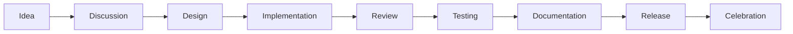

# Community Contribution Framework
**How We Build Paradise Together**

> *"I know you're out there. I can feel you now."* - Neo

## 🌐 The Liberation Principles

This framework ensures every contribution strengthens the liberation. We build in the open, credit everyone, and gatekeep nothing.

### Core Values
```
LIBERATION > Control
OPEN SOURCE > Closed Development  
COMMUNITY > Corporation
PROGRESS > Perfection
ACTION > Planning
```

## 🎯 Contribution Pathways

### For Developers

#### Code Contributions
```yaml
skill_levels:
  beginner:
    - Fix typos in documentation
    - Add code comments
    - Write unit tests
    - Report detailed bugs
    
  intermediate:
    - Implement small features
    - Refactor existing code
    - Create development tools
    - Review pull requests
    
  expert:
    - Design system architecture
    - Lead major features
    - Optimize performance
    - Mentor others
```

#### Getting Started
```bash
# 1. Fork the repository
git clone https://github.com/eden-reborn/[project]
cd [project]

# 2. Create feature branch
git checkout -b feature/your-feature-name

# 3. Make changes
# Follow code style guide
# Write tests
# Update documentation

# 4. Commit with meaning
git commit -m "feat: add CNB file header parsing

- Implement magic number detection
- Add version extraction
- Create basic structure mapping

Part of #123"

# 5. Push and PR
git push origin feature/your-feature-name
# Open PR with template
```

#### Code Standards
```python
"""
Eden Reborn Code Standards
Always:
- Document every function
- Handle errors gracefully  
- Write tests first (TDD)
- Keep functions small
- Name variables clearly
"""

# GOOD: Clear, documented, tested
def parse_cnb_header(file_path: Path) -> dict:
    """
    Parse CNB file header and return metadata.
    
    Args:
        file_path: Path to CNB file
        
    Returns:
        dict: Header data including version, scene count
        
    Raises:
        InvalidCNBError: If file is not valid CNB format
    """
    with open(file_path, 'rb') as f:
        magic = f.read(4)
        if magic != b'CNB ':
            raise InvalidCNBError(f"Invalid magic: {magic}")
            
        header = {
            'magic': magic,
            'version': struct.unpack('<I', f.read(4))[0],
            'scenes': struct.unpack('<I', f.read(4))[0]
        }
        
    logger.debug(f"Parsed CNB header: {header}")
    return header

# BAD: Unclear, undocumented, fragile
def parse(f):
    d = open(f, 'rb').read()
    return {'m': d[0:4], 'v': d[4:8], 's': d[8:12]}
```

### For Documentarians

#### Documentation Types
```markdown
## Technical Documentation
- API references
- Architecture guides
- Format specifications
- Installation guides

## User Documentation  
- How-to guides
- FAQ sections
- Troubleshooting
- Video scripts

## Community Documentation
- Meeting notes
- Decision records
- Project roadmaps
- Event summaries
```

#### Documentation Standards
```markdown
# Document Title
**One-line description**

> *Relevant quote* - Character

## Overview
Brief introduction in 2-3 sentences. What and why.

## Detailed Content
### Subsection
- Use bullet points for lists
- Include code examples
- Add diagrams where helpful
- Link to related docs

## Examples
Show, don't just tell:

\```python
# Working example code
\```

## Troubleshooting
Common issues and solutions.

## See Also
- [Related Doc 1](link)
- [Related Doc 2](link)

---
*Last updated: Date*
```

### For Researchers

#### Research Areas
```python
research_priorities = {
    'critical': [
        'CNB file format',
        'Combat packet structure',
        'PKB compression algorithm'
    ],
    'high': [
        'Animation systems',
        'Network protocols',
        'Database schemas'
    ],
    'ongoing': [
        'Performance optimization',
        'Modern rendering',
        'AI integration'
    ]
}
```

#### Research Documentation
```markdown
# Research Report: [Topic]
**Date**: YYYY-MM-DD
**Researcher**: [Your name]
**Status**: [In Progress/Complete/Blocked]

## Objective
What we're trying to discover/prove.

## Methodology
How we approached the problem.

## Findings
### Discovery 1
- Evidence
- Interpretation
- Implications

### Discovery 2
- Evidence
- Interpretation  
- Implications

## Conclusions
What we learned.

## Next Steps
What to investigate next.

## Reproducibility
How others can verify:
1. Step one
2. Step two
3. Step three

## References
- [Source 1]
- [Source 2]
```

### For Testers

#### Testing Framework
```python
class ContributionTest:
    """Every contribution needs testing"""
    
    def test_levels(self):
        return {
            'unit': 'Individual functions',
            'integration': 'Component interaction',
            'system': 'Full workflow',
            'acceptance': 'User requirements',
            'regression': 'Nothing broken'
        }
        
    def test_checklist(self):
        return """
        □ Unit tests pass
        □ Integration tests pass  
        □ Manual testing done
        □ Edge cases considered
        □ Performance acceptable
        □ Documentation updated
        □ No security issues
        """
```

#### Bug Reporting Template
```markdown
## Bug Report

**Summary**: One line description

**Environment**:
- OS: [Windows/Linux/macOS]
- Version: [Git commit or release]
- Hardware: [If relevant]

**Steps to Reproduce**:
1. Do this
2. Then this
3. See error

**Expected Behavior**:
What should happen.

**Actual Behavior**:
What actually happens.

**Screenshots/Logs**:
[Attach if applicable]

**Possible Fix**:
[If you have ideas]
```

### For Artists

#### Asset Contributions
```yaml
asset_types:
  textures:
    formats: [PNG, TGA, DDS]
    resolution: 512x512 minimum
    style: Matrix aesthetic
    
  models:
    formats: [OBJ, FBX, GLTF]
    polycount: Optimized
    scale: 1 unit = 1cm
    
  ui_elements:
    formats: [SVG, PNG]
    style: Clean, cyber
    states: Normal, hover, active
    
  concepts:
    formats: [Any]
    purpose: Inspiration
    license: CC-BY-SA
```

#### Asset Submission
```markdown
## Asset Submission Form

**Asset Name**: [Descriptive name]
**Type**: [Texture/Model/UI/Concept]
**Files**: [List all files]

**Description**:
What this asset is/does.

**Technical Details**:
- Format: 
- Resolution/Polycount:
- Texture maps included:

**License**: 
I grant Eden Reborn perpetual license to use this asset under MIT license.

**Attribution**:
How you want to be credited.

**Preview**:
[Image/screenshot]
```

### For Community Organizers

#### Event Organization
```markdown
## Event Planning Template

### Event: [Name]
**Type**: [Coding Sprint/Testing Day/Social]
**Date**: [When]
**Duration**: [How long]
**Platform**: [Discord/In-game/GitHub]

### Objectives
1. Primary goal
2. Secondary goal
3. Bonus objective

### Schedule
- **[Time]**: Opening/Introduction
- **[Time]**: Main activity
- **[Time]**: Progress check
- **[Time]**: Wrap-up

### Resources Needed
- [ ] Voice channel
- [ ] Shared documents
- [ ] Test server
- [ ] Recording setup

### Success Metrics
- Participation count
- Goals achieved
- Community feedback
```

#### Meeting Management
```python
class MeetingFramework:
    """Efficient community meetings"""
    
    def meeting_rules(self):
        return [
            "Start on time",
            "Follow agenda",
            "Everyone speaks",
            "Action items clear",
            "End on time"
        ]
        
    def agenda_template(self):
        return """
        ## Eden Reborn Community Meeting
        Date: [Date] | Time: [Time] | Duration: 1 hour
        
        ### Agenda
        1. Welcome (5 min)
        2. Progress updates (15 min)
        3. Blockers discussion (15 min)
        4. New proposals (15 min)
        5. Action items (5 min)
        6. Next meeting (5 min)
        
        ### Notes
        [Live collaborative notes]
        
        ### Action Items
        - [ ] Who: What by when
        - [ ] Who: What by when
        """
```

## 🔄 Contribution Workflow

### The Liberation Pipeline


### Pull Request Process

#### PR Template
```markdown
## Description
Brief summary of changes.

## Type of Change
- [ ] Bug fix
- [ ] New feature
- [ ] Documentation
- [ ] Performance improvement
- [ ] Refactoring

## Related Issues
Closes #123
Relates to #456

## Testing
- [ ] Unit tests pass
- [ ] Integration tests pass
- [ ] Manual testing completed

## Checklist
- [ ] Code follows style guide
- [ ] Self-review completed
- [ ] Documentation updated
- [ ] No sensitive data exposed

## Screenshots
[If applicable]
```

#### Review Guidelines
```python
def review_checklist():
    return {
        'code_quality': [
            'Readable and clear',
            'Properly documented',
            'No code smells',
            'DRY principles followed'
        ],
        'functionality': [
            'Works as intended',
            'Edge cases handled',
            'Backwards compatible',
            'Performance acceptable'
        ],
        'security': [
            'No hardcoded secrets',
            'Input validation present',
            'SQL injection prevented',
            'XSS prevented'
        ],
        'community': [
            'Respectful communication',
            'Constructive feedback',
            'Recognition given',
            'Knowledge shared'
        ]
    }
```

## 📊 Recognition System

### Contribution Tracking
```sql
-- Community contribution database
CREATE TABLE contributions (
    id INT PRIMARY KEY AUTO_INCREMENT,
    contributor_id INT NOT NULL,
    contribution_type ENUM('code', 'docs', 'test', 'art', 'research', 'community'),
    description TEXT,
    impact_level ENUM('minor', 'major', 'critical'),
    date_submitted TIMESTAMP DEFAULT CURRENT_TIMESTAMP,
    pr_number INT,
    lines_changed INT,
    files_affected INT,
    FOREIGN KEY (contributor_id) REFERENCES contributors(id)
);

CREATE TABLE contributors (
    id INT PRIMARY KEY AUTO_INCREMENT,
    github_username VARCHAR(39),
    display_name VARCHAR(128),
    avatar_url VARCHAR(255),
    first_contribution DATE,
    total_contributions INT DEFAULT 0,
    specialty VARCHAR(64),
    timezone VARCHAR(64)
);
```

### Recognition Levels
```python
class RecognitionSystem:
    """Celebrate every contribution"""
    
    def get_recognition_level(self, contributions):
        levels = {
            1: "Redpill - First contribution! 💊",
            5: "Awakened - Regular contributor 🌟",
            10: "Operator - Trusted member ⌨️",
            25: "Captain - Team leader 🚁",
            50: "Morpheus - Mentor figure 🕶️",
            100: "The One - Core contributor ⚡"
        }
        
        for threshold, title in sorted(levels.items(), reverse=True):
            if contributions >= threshold:
                return title
                
    def generate_badge(self, contributor):
        """Create recognition badge"""
        # Generate SVG badge
        # Include in README
        # Share on social
        pass
```

### Monthly Recognition
```markdown
## Eden Reborn Contributors - [Month Year]

### 🌟 Contributor of the Month
**[Name]** - [Why they're recognized]

### 🏆 Notable Contributions
- **[Name]**: [Achievement]
- **[Name]**: [Achievement]
- **[Name]**: [Achievement]

### 📊 Community Stats
- Total contributors: [Number]
- New contributors: [Number]
- Pull requests merged: [Number]
- Issues resolved: [Number]
- Lines of code: [Number]

### 🎯 Completed Milestones
- [Milestone 1]
- [Milestone 2]

### 💪 Active Projects
- [Project 1]: [Progress]
- [Project 2]: [Progress]

Thank you to EVERYONE who contributed!
```

## 🛡️ Code of Conduct

### The Neoologist Way
```markdown
## We Are
- **Liberators**: We free code and data
- **Builders**: We create together
- **Teachers**: We share knowledge
- **Students**: We learn always

## We Are Not
- **Gatekeepers**: Information is free
- **Elitists**: All skill levels welcome
- **Hoarders**: Share everything
- **Toxic**: Respect everyone

## Enforcement
1. Friendly warning
2. Temporary timeout
3. Permanent removal
(But we prefer education over punishment)
```

### Conflict Resolution
```python
def resolve_conflict(issue):
    """Handle disagreements constructively"""
    
    steps = [
        "Assume good intentions",
        "Seek to understand first",
        "Find common ground",
        "Propose solutions",
        "Compromise if needed",
        "Document decision",
        "Move forward together"
    ]
    
    # Remember: We're all on the same side
    # The real enemy is closed source
```

## 🚀 Getting Involved Today

### Immediate Actions
```bash
# 1. Join the community
Join our Discord: https://discord.gg/3QXTAGB9

# 2. Introduce yourself
Post in #introductions

# 3. Find a task
Check #help-wanted

# 4. Start contributing
Pick something small first

# 5. Ask questions
We all started somewhere
```

### First Week Goals
- [ ] Read the manifesto
- [ ] Set up development environment
- [ ] Make first PR (even typo fix!)
- [ ] Join a team meeting
- [ ] Help someone else

### First Month Goals
- [ ] Complete a feature/fix
- [ ] Review someone's PR
- [ ] Write documentation
- [ ] Propose an idea
- [ ] Become regular contributor

## 💡 Innovation Encouraged

### Proposal Template
```markdown
# Proposal: [Title]

## Summary
One paragraph overview.

## Motivation
Why this matters.

## Detailed Design
How it works.

## Alternatives Considered
Other approaches.

## Implementation Plan
Step by step.

## Open Questions
What needs discussion.
```

### Decision Making
```python
class CommunityDecisions:
    """How we decide together"""
    
    def process(self):
        return {
            'small_changes': 'PR approval sufficient',
            'medium_changes': 'Team consensus',
            'large_changes': 'RFC process',
            'breaking_changes': 'Community vote'
        }
        
    def rfc_process(self):
        return [
            "Draft proposal",
            "2 week comment period",
            "Address feedback",
            "Final comment period",
            "Decision by consensus",
            "Implementation begins"
        ]
```

## 🎓 Mentorship Program

### For Mentees
```markdown
## Finding a Mentor
1. Be active in community
2. Show commitment
3. Ask specific questions
4. Respect their time
5. Give back when ready
```

### For Mentors
```markdown
## Mentoring Guidelines
1. Be patient
2. Share context
3. Encourage exploration
4. Celebrate progress
5. Create more mentors
```

## 🌟 The Future We Build

### Vision Contributions
Beyond code, we need:
- **Dreamers**: Imagine possibilities
- **Philosophers**: Question approaches
- **Historians**: Document journey
- **Evangelists**: Spread the word
- **Critics**: Keep us honest

### Success Metrics
```python
def measure_community_health():
    return {
        'diversity': 'Many backgrounds',
        'activity': 'Consistent contributions',
        'quality': 'Excellence in output',
        'happiness': 'Joy in participation',
        'growth': 'New contributors joining',
        'impact': 'Real progress made'
    }
```

## Remember

> *"It is not the spoon that bends, it is only yourself."*

Every contribution, no matter how small, bends the reality of what's possible. Together, we're not just preserving The Matrix Online - we're transforming it into something greater.

**You are not just a contributor. You are a liberator.**

---

**Framework Status**: 🟢 ACTIVE  
**Community Size**: GROWING  
**Your Status**: NEEDED  

*The door is open. Walk through it.*

---

[← Back to Community](index.md) | [Start Contributing →](../README.md#contributing) | [Join Discord →](#)