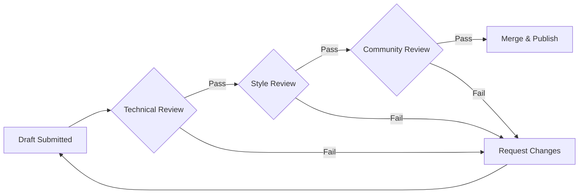

# Quality Standards & Peer Review Process
**Maintaining Excellence in Liberation Documentation**

> *"You take the red pill, you stay in Wonderland, and I show you how deep the rabbit hole goes."* - Morpheus (Quality ensures we don't get lost in that hole.)

## 🎯 **The Liberation Standard**

Quality isn't about perfection - it's about clarity, accuracy, and usefulness. Every piece of documentation in the Eden Reborn wiki should help someone wake up, level up, or contribute to the liberation of The Matrix Online.

## 📊 **Quality Metrics**

### The Five Pillars of Wiki Excellence

1. **Accuracy** - Information must be verifiable and correct
2. **Clarity** - Complex topics explained simply
3. **Completeness** - Enough detail to be actionable
4. **Consistency** - Unified voice and formatting
5. **Community** - Serves the liberation mission

### Quality Score Matrix
```
Quality Assessment (0-5 scale per category):
━━━━━━━━━━━━━━━━━━━━━━━━━━━━━━━━━━━━━━━━━━━━━━━━━━━━━
Category          Weight    Description
━━━━━━━━━━━━━━━━━━━━━━━━━━━━━━━━━━━━━━━━━━━━━━━━━━━━━
Technical Accuracy  30%     Facts, code, specifications correct
Clarity            25%     Easy to understand and follow
Completeness       20%     All necessary information included
Formatting         15%     Consistent style and structure
Liberation Value   10%     Contributes to community goals
━━━━━━━━━━━━━━━━━━━━━━━━━━━━━━━━━━━━━━━━━━━━━━━━━━━━━
```

## 📝 **Documentation Standards**

### Technical Documentation Requirements

#### Code Examples
```markdown
✅ GOOD Example:
```python
# Matrix connection handler with error handling
def connect_to_matrix(server_address, port=10000):
    """
    Establishes connection to Matrix Online server.
    
    Args:
        server_address (str): Server IP or hostname
        port (int): Server port (default: 10000)
    
    Returns:
        Connection: Active server connection
        
    Raises:
        ConnectionError: If server unreachable
    """
    try:
        connection = socket.connect((server_address, port))
        logger.info(f"Connected to {server_address}:{port}")
        return connection
    except Exception as e:
        logger.error(f"Connection failed: {e}")
        raise ConnectionError(f"Cannot reach {server_address}:{port}")
```

❌ BAD Example:
```python
# connect to server
def connect(srv):
    return socket.connect(srv)  # might not work
```
```

#### Technical Specifications
- **Version Numbers**: Always specify which version/patch
- **Dependencies**: List all requirements explicitly
- **Platform Notes**: Document OS-specific differences
- **Error Handling**: Include common problems and solutions

### Writing Style Guidelines

#### Voice and Tone
- **Active Voice**: "Configure the server" not "The server should be configured"
- **Direct Language**: Clear instructions without ambiguity
- **Liberation Narrative**: Frame technical content within our mission
- **Inclusive Language**: Welcome all skill levels

#### Structure Standards
```markdown
# Page Title - Descriptive and SEO-friendly
**Compelling subtitle that explains the value**

> *Relevant quote that sets the philosophical tone* - Source

## 🎯 **Overview Section**
Brief introduction explaining what and why

## 📋 **Main Content Sections**
### Clear Subsection Headers
- Use emoji icons for visual navigation
- Progressive disclosure (simple → complex)
- Logical flow of information

## 💡 **Practical Examples**
Real-world applications and use cases

## ⚠️ **Common Issues**
Troubleshooting and gotchas

## 🔗 **References**
Links to related content and sources

## Remember
Philosophical closing that ties to liberation theme

---
**Status Indicators** | **Navigation Links**
```

### Visual Standards

#### Screenshots and Images
- **Resolution**: Minimum 1280x720, prefer 1920x1080
- **Annotations**: Clear labels and arrows
- **File Format**: PNG for screenshots, JPG for photos
- **Alt Text**: Always include descriptive alt text
- **File Names**: Descriptive-name-with-hyphens.png

#### Code Formatting
- **Syntax Highlighting**: Use appropriate language tags
- **Line Length**: Max 80 characters when possible
- **Comments**: Explain complex logic inline
- **Indentation**: Consistent 2 or 4 spaces

## 🔍 **Peer Review Process**

### Review Workflow



### Review Stages

#### Stage 1: Technical Review (Required)
**Reviewer**: Subject matter expert
**Timeline**: 48 hours
**Checklist**:
- [ ] Code examples tested and working
- [ ] Technical specifications accurate
- [ ] Version compatibility verified
- [ ] Security considerations addressed
- [ ] Performance implications noted

#### Stage 2: Style Review (Required)
**Reviewer**: Documentation maintainer
**Timeline**: 24 hours
**Checklist**:
- [ ] Formatting guidelines followed
- [ ] Writing style consistent
- [ ] Structure logical and clear
- [ ] Links functional
- [ ] Images properly formatted

#### Stage 3: Community Review (Recommended)
**Reviewer**: Community volunteers
**Timeline**: 72 hours
**Checklist**:
- [ ] Understandable to target audience
- [ ] Liberation philosophy maintained
- [ ] Practical value demonstrated
- [ ] No gatekeeping language
- [ ] Inclusive and welcoming

### Review Tools

#### Pull Request Template
```markdown
## Description
Brief summary of changes

## Type of Change
- [ ] New documentation
- [ ] Update existing docs
- [ ] Bug fix
- [ ] Feature documentation
- [ ] Tool guide

## Checklist
- [ ] Self-review completed
- [ ] Spell check passed
- [ ] Links verified
- [ ] Code examples tested
- [ ] Screenshots included (if applicable)

## Related Issues
Fixes #(issue number)

## Testing
How to verify these changes

## Liberation Impact
How this helps the community
```

#### Review Comment Guidelines
```markdown
✅ CONSTRUCTIVE Comment:
"The code example works, but adding error handling for 
network timeouts would make it more robust. See the 
connection handler in server-setup.md for an example."

❌ UNHELPFUL Comment:
"This code is wrong."
```

## 🏆 **Quality Incentives**

### Recognition System

#### Contribution Badges
- 🌟 **First Contribution**: Welcome to the resistance
- 📝 **Prolific Writer**: 10+ accepted pages
- 🔍 **Quality Guardian**: 25+ helpful reviews
- 🛠️ **Tool Maker**: Documented working tool
- 🎓 **Teacher**: Created learning resources
- 🏛️ **Architect**: Major structural improvements

#### Monthly Recognition
- **Documentation Star**: Most valuable contribution
- **Review Champion**: Most helpful reviewer
- **Newcomer Award**: Best first contribution
- **Clarity Crystal**: Clearest explanation of complex topic

### Quality Metrics Dashboard
```yaml
contributor_stats:
  total_contributions: 156
  accepted_rate: 87%
  average_review_time: 36 hours
  
quality_trends:
  technical_accuracy: ↑ 92%
  clarity_score: → 85%
  completeness: ↑ 88%
  formatting: ↑ 94%
  liberation_value: ↑ 90%
  
top_contributors:
    - handle: "NeoScribe"
      contributions: 23
      quality_score: 94%
    - handle: "DocMorpheus"
      contributions: 19
      quality_score: 91%
```

## 🛠️ **Quality Tools**

### Automated Checks

#### Pre-commit Hooks
```bash
#!/bin/bash
# .git/hooks/pre-commit

# Spell check
aspell check *.md

# Link validation
markdown-link-check *.md

# Formatting check
markdownlint *.md

# Image optimization
find . -name "*.png" -exec optipng {} \;

echo "Quality checks passed!"
```

#### CI/CD Pipeline
```yaml
name: Quality Assurance

on: [push, pull_request]

jobs:
  quality-check:
    runs-on: ubuntu-latest
    steps:
    - uses: actions/checkout@v2
    
    - name: Markdown Lint
      uses: docker://markdownlint/markdownlint
      
    - name: Spell Check
      uses: streetsidesoftware/cspell-action@v1
      
    - name: Link Check
      uses: gaurav-nelson/github-action-markdown-link-check@v1
      
    - name: Code Example Test
      run: |
        python test_code_examples.py
        
    - name: Image Validation
      run: |
        ./scripts/validate_images.sh
```

### Manual Review Tools

#### Review Checklist App
```javascript
// Simple review checklist tracker
const reviewChecklist = {
  technical: [
    "Code examples run without errors",
    "API endpoints verified",
    "Version numbers accurate",
    "Dependencies listed"
  ],
  style: [
    "Headers follow hierarchy",
    "Consistent formatting",
    "Proper emoji usage",
    "Navigation links work"
  ],
  community: [
    "Beginner-friendly language",
    "No gatekeeping",
    "Liberation narrative",
    "Practical value"
  ]
};

function calculateScore(completed, total) {
  return Math.round((completed / total) * 100);
}
```

## 📈 **Continuous Improvement**

### Feedback Loops

#### Reader Feedback
- Comment system on each page
- "Was this helpful?" rating
- Suggestion box for improvements
- Bug report mechanism

#### Metrics Tracking
```python
# Quality metrics collector
def collect_page_metrics(page_path):
    metrics = {
        'views': get_page_views(page_path),
        'time_on_page': get_average_time(page_path),
        'feedback_score': get_feedback_rating(page_path),
        'update_frequency': get_update_count(page_path),
        'broken_links': check_links(page_path),
        'readability_score': calculate_readability(page_path)
    }
    return metrics

def generate_quality_report():
    """Monthly quality report generation"""
    all_pages = get_all_wiki_pages()
    report = {
        'total_pages': len(all_pages),
        'average_quality': 0,
        'improvement_areas': [],
        'success_stories': []
    }
    
    for page in all_pages:
        metrics = collect_page_metrics(page)
        analyze_and_update_report(report, metrics)
    
    return report
```

### Evolution Process

#### Quarterly Reviews
1. Analyze quality metrics
2. Identify pain points
3. Update standards based on feedback
4. Implement new tools/processes
5. Train reviewers on changes

#### Standard Updates
- Version control all standard changes
- Community RFC (Request for Comments) period
- Gradual rollout of new requirements
- Grace period for existing content

## 🎯 **Special Considerations**

### Legacy Content
- Mark with "Legacy" badge
- Update for accuracy where possible
- Preserve historical context
- Link to modern alternatives

### Work-in-Progress
- Clear "WIP" indicators
- Expected completion dates
- How others can help
- Partial content still valuable

### Controversial Topics
- Present multiple viewpoints
- Cite sources thoroughly
- Encourage discussion
- Maintain neutral tone

## 🌟 **Excellence Examples**

### Gold Standard Pages
1. **Server Setup Guide** - Complete, clear, tested
2. **Combat System Analysis** - Deep technical accuracy
3. **Community Philosophy** - Perfect liberation narrative
4. **Tool Documentation** - Practical and thorough

### Learning from Mistakes
- **Version Confusion**: Always specify version context
- **Assumed Knowledge**: Define terms for newcomers
- **Dead Links**: Regular link audits essential
- **Outdated Screenshots**: Date all visual content

## Remember

> *"I can only show you the door. You're the one that has to walk through it."* - Morpheus

Quality standards aren't rules to restrict creativity - they're tools to ensure every door we open leads somewhere meaningful. Every review isn't criticism - it's collaboration toward our shared goal of liberation.

The best documentation doesn't just inform - it empowers. The best review doesn't just correct - it elevates. Together, we build not just a wiki, but a foundation for the Matrix Online's eternal life.

**Quality is the red pill. Excellence is staying awake.**

---

**Standards Version**: 1.0  
**Review Status**: 🟢 ACTIVE  
**Community Approved**: ✅ YES  

*In the pursuit of quality, we find liberation.*

---

[← Community Hub](index.md) | [→ Contribution Framework](contribution-framework.md) | [→ Documentation Standards](../03-technical/documentation-standards.md)