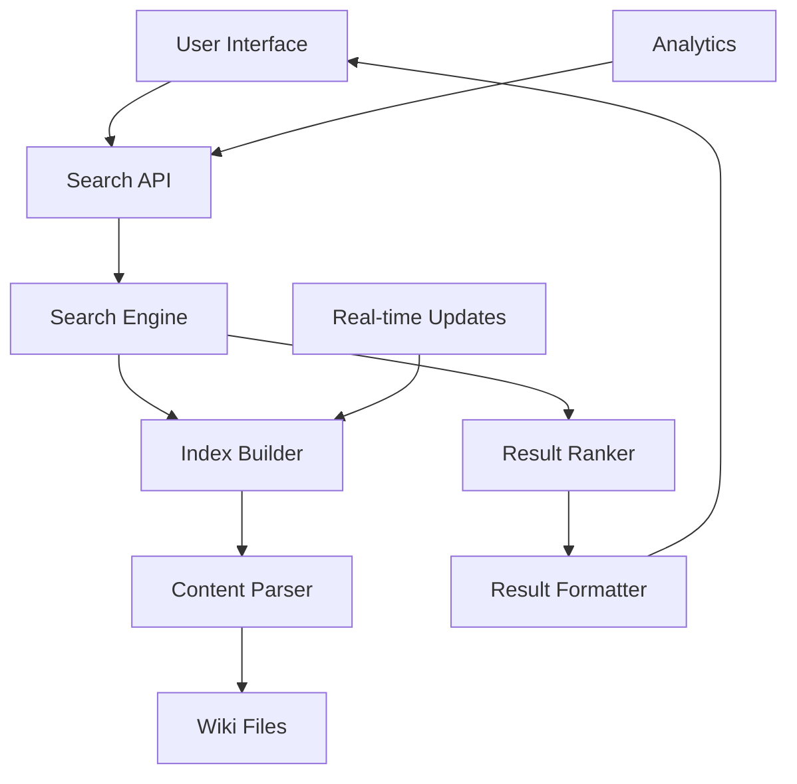

# Wiki Search Implementation Guide
**Finding Truth in the Information Matrix**

> *"I know kung fu."* - Neo (And now you can search for it.)

## 🔍 Search Philosophy

Information wants to be free, but only if it can be found. This guide implements comprehensive search functionality for the Matrix Online Liberation Wiki, ensuring every piece of knowledge is discoverable by those who seek it.

## 🎯 Search Requirements

### User Stories
```yaml
search_needs:
  newcomer: "I want to find server setup guides quickly"
  developer: "I need specific file format documentation"
  modder: "I'm looking for tools that work with .prop files"
  historian: "I want to find all mentions of rajkosto's contributions"
  researcher: "I need to search code examples by language"
```

### Search Types
1. **Full-text search** - Content within documents
2. **Tag-based search** - Categorized filtering
3. **Code search** - Programming examples
4. **Media search** - Images, links, resources
5. **Advanced search** - Boolean operators, exact phrases

## 🏗️ Architecture Overview

### Search Stack


### Technology Choices
```yaml
search_stack:
  backend:
    engine: "Elasticsearch or Meilisearch"
    alternative: "Lunr.js for client-side"
    indexing: "Python scripts"
    
  frontend:
    framework: "Vanilla JS or Vue.js"
    ui_library: "Minimal custom CSS"
    autocomplete: "Fuse.js for fuzzy matching"
    
  deployment:
    hosting: "GitHub Pages compatible"
    cdn: "jsDelivr for libraries"
    fallback: "Static JSON index"
```

## 🔧 Implementation Options

### Option 1: Client-Side Search (Recommended)
Perfect for GitHub Pages and static hosting.

#### Index Generation
```python
#!/usr/bin/env python3
"""Generate search index for Matrix Online Wiki"""

import os
import json
import re
from pathlib import Path
import frontmatter
import markdown
from bs4 import BeautifulSoup

class WikiIndexer:
    def __init__(self, wiki_path):
        self.wiki_path = Path(wiki_path)
        self.index = []
        self.word_index = {}
        self.tag_index = {}
        
    def build_index(self):
        """Build complete search index"""
        print("Building Matrix Online Wiki search index...")
        
        # Process all markdown files
        for md_file in self.wiki_path.rglob("*.md"):
            if self.should_index_file(md_file):
                self.index_file(md_file)
                
        # Build word index for fast searching
        self.build_word_index()
        
        # Build tag index
        self.build_tag_index()
        
        # Save indexes
        self.save_indexes()
        
        print(f"Indexed {len(self.index)} documents")
        
    def should_index_file(self, file_path):
        """Determine if file should be indexed"""
        # Skip system files
        if file_path.name.startswith(('.', '_')):
            return False
            
        # Skip empty files
        if file_path.stat().st_size == 0:
            return False
            
        return True
        
    def index_file(self, file_path):
        """Index a single markdown file"""
        try:
            with open(file_path, 'r', encoding='utf-8') as f:
                content = f.read()
                
            # Parse frontmatter and content
            post = frontmatter.loads(content)
            
            # Extract metadata
            relative_path = file_path.relative_to(self.wiki_path)
            url = str(relative_path).replace('.md', '.html')
            
            # Parse markdown to extract text
            html = markdown.markdown(post.content)
            soup = BeautifulSoup(html, 'html.parser')
            text_content = soup.get_text()
            
            # Extract code blocks
            code_blocks = self.extract_code_blocks(post.content)
            
            # Extract headings
            headings = self.extract_headings(post.content)
            
            # Extract links
            links = self.extract_links(post.content)
            
            # Determine title
            title = post.metadata.get('title', headings[0] if headings else file_path.stem)
            
            # Create document entry
            doc = {
                'id': str(relative_path),
                'title': title,
                'url': url,
                'path': str(relative_path),
                'content': text_content,
                'summary': self.create_summary(text_content),
                'headings': headings,
                'code_blocks': code_blocks,
                'links': links,
                'tags': post.metadata.get('tags', []),
                'category': self.determine_category(relative_path),
                'word_count': len(text_content.split()),
                'last_modified': file_path.stat().st_mtime
            }
            
            self.index.append(doc)
            
        except Exception as e:
            print(f"Error indexing {file_path}: {e}")
            
    def extract_code_blocks(self, content):
        """Extract code blocks with language info"""
        code_pattern = r'```(\w+)?\n(.*?)\n```'
        matches = re.findall(code_pattern, content, re.DOTALL)
        
        code_blocks = []
        for lang, code in matches:
            code_blocks.append({
                'language': lang or 'text',
                'code': code.strip()
            })
            
        return code_blocks
        
    def extract_headings(self, content):
        """Extract markdown headings"""
        heading_pattern = r'^(#{1,6})\s+(.+)$'
        matches = re.findall(heading_pattern, content, re.MULTILINE)
        
        headings = []
        for level, text in matches:
            headings.append({
                'level': len(level),
                'text': text.strip(),
                'id': self.heading_to_id(text)
            })
            
        return headings
        
    def extract_links(self, content):
        """Extract markdown links"""
        link_pattern = r'\[([^\]]+)\]\(([^)]+)\)'
        matches = re.findall(link_pattern, content)
        
        links = []
        for text, url in matches:
            links.append({
                'text': text,
                'url': url,
                'is_external': url.startswith(('http', 'https'))
            })
            
        return links
        
    def create_summary(self, text, max_length=200):
        """Create document summary"""
        # Clean text
        clean_text = re.sub(r'\s+', ' ', text).strip()
        
        # Find first substantial paragraph
        sentences = clean_text.split('.')
        summary = ""
        
        for sentence in sentences:
            if len(summary + sentence) <= max_length:
                summary += sentence + "."
            else:
                break
                
        return summary.strip()
        
    def determine_category(self, path):
        """Determine document category from path"""
        path_parts = path.parts
        
        if len(path_parts) > 1:
            category_map = {
                '01-getting-started': 'Getting Started',
                '02-servers': 'Servers',
                '03-technical': 'Technical',
                '04-tools-modding': 'Tools & Modding',
                '05-game-content': 'Game Content',
                '06-file-formats': 'File Formats',
                '07-development': 'Development',
                '08-community': 'Community'
            }
            return category_map.get(path_parts[0], 'General')
            
        return 'General'
        
    def heading_to_id(self, heading):
        """Convert heading to HTML ID"""
        # Remove markdown formatting
        clean = re.sub(r'[^\w\s-]', '', heading)
        # Convert to lowercase and replace spaces
        return re.sub(r'\s+', '-', clean.lower())
        
    def build_word_index(self):
        """Build inverted word index"""
        for i, doc in enumerate(self.index):
            words = re.findall(r'\b\w+\b', doc['content'].lower())
            
            for word in words:
                if len(word) >= 3:  # Skip very short words
                    if word not in self.word_index:
                        self.word_index[word] = []
                    self.word_index[word].append(i)
                    
    def build_tag_index(self):
        """Build tag index"""
        for i, doc in enumerate(self.index):
            for tag in doc['tags']:
                tag_lower = tag.lower()
                if tag_lower not in self.tag_index:
                    self.tag_index[tag_lower] = []
                self.tag_index[tag_lower].append(i)
                
    def save_indexes(self):
        """Save search indexes to JSON files"""
        output_dir = self.wiki_path / 'search'
        output_dir.mkdir(exist_ok=True)
        
        # Main document index
        with open(output_dir / 'documents.json', 'w') as f:
            json.dump(self.index, f, indent=2, default=str)
            
        # Word index (for fast text search)
        with open(output_dir / 'words.json', 'w') as f:
            json.dump(self.word_index, f, indent=2)
            
        # Tag index
        with open(output_dir / 'tags.json', 'w') as f:
            json.dump(self.tag_index, f, indent=2)
            
        # Search configuration
        config = {
            'total_documents': len(self.index),
            'total_words': len(self.word_index),
            'total_tags': len(self.tag_index),
            'last_updated': file_path.stat().st_mtime,
            'categories': list(set(doc['category'] for doc in self.index))
        }
        
        with open(output_dir / 'config.json', 'w') as f:
            json.dump(config, f, indent=2, default=str)

if __name__ == "__main__":
    indexer = WikiIndexer(".")
    indexer.build_index()
```

#### JavaScript Search Engine
```javascript
/**
 * Matrix Online Wiki Search Engine
 * Client-side search with fuzzy matching and ranking
 */

class WikiSearch {
    constructor() {
        this.documents = [];
        this.wordIndex = {};
        this.tagIndex = {};
        this.config = {};
        this.initialized = false;
    }
    
    async initialize() {
        try {
            // Load search data
            const [documents, wordIndex, tagIndex, config] = await Promise.all([
                fetch('search/documents.json').then(r => r.json()),
                fetch('search/words.json').then(r => r.json()),
                fetch('search/tags.json').then(r => r.json()),
                fetch('search/config.json').then(r => r.json())
            ]);
            
            this.documents = documents;
            this.wordIndex = wordIndex;
            this.tagIndex = tagIndex;
            this.config = config;
            this.initialized = true;
            
            console.log(`🔍 Search initialized: ${config.total_documents} documents indexed`);
            
        } catch (error) {
            console.error('Failed to initialize search:', error);
        }
    }
    
    search(query, options = {}) {
        if (!this.initialized) {
            console.warn('Search not initialized');
            return [];
        }
        
        const {
            category = null,
            tags = [],
            limit = 20,
            includeContent = false,
            fuzzy = true
        } = options;
        
        // Parse search query
        const parsedQuery = this.parseQuery(query);
        
        // Find matching documents
        let results = this.findMatches(parsedQuery, { category, tags, fuzzy });
        
        // Rank results
        results = this.rankResults(results, parsedQuery);
        
        // Format results
        results = results.slice(0, limit).map(result => {
            const doc = this.documents[result.index];
            return {
                title: doc.title,
                url: doc.url,
                category: doc.category,
                summary: doc.summary,
                score: result.score,
                highlights: result.highlights,
                content: includeContent ? doc.content : undefined
            };
        });
        
        return results;
    }
    
    parseQuery(query) {
        const parsed = {
            terms: [],
            phrases: [],
            exclude: [],
            tags: [],
            category: null
        };
        
        // Extract quoted phrases
        const phraseMatches = query.match(/"([^"]+)"/g);
        if (phraseMatches) {
            parsed.phrases = phraseMatches.map(p => p.slice(1, -1));
            query = query.replace(/"[^"]+"/g, '');
        }
        
        // Extract tags (tag:value)
        const tagMatches = query.match(/tag:(\w+)/g);
        if (tagMatches) {
            parsed.tags = tagMatches.map(t => t.split(':')[1]);
            query = query.replace(/tag:\w+/g, '');
        }
        
        // Extract category filter
        const categoryMatch = query.match(/category:(\w+)/);
        if (categoryMatch) {
            parsed.category = categoryMatch[1];
            query = query.replace(/category:\w+/, '');
        }
        
        // Extract exclusions (-term)
        const excludeMatches = query.match(/-(\w+)/g);
        if (excludeMatches) {
            parsed.exclude = excludeMatches.map(e => e.slice(1));
            query = query.replace(/-\w+/g, '');
        }
        
        // Remaining terms
        parsed.terms = query.split(/\s+/).filter(t => t.length > 0);
        
        return parsed;
    }
    
    findMatches(parsedQuery, filters) {
        const candidates = new Set();
        
        // Find documents matching terms
        for (const term of parsedQuery.terms) {
            const termLower = term.toLowerCase();
            
            // Exact word matches
            if (this.wordIndex[termLower]) {
                this.wordIndex[termLower].forEach(i => candidates.add(i));
            }
            
            // Fuzzy matches
            if (filters.fuzzy) {
                Object.keys(this.wordIndex).forEach(word => {
                    if (this.fuzzyMatch(termLower, word)) {
                        this.wordIndex[word].forEach(i => candidates.add(i));
                    }
                });
            }
        }
        
        // Find documents matching tags
        for (const tag of parsedQuery.tags) {
            const tagLower = tag.toLowerCase();
            if (this.tagIndex[tagLower]) {
                this.tagIndex[tagLower].forEach(i => candidates.add(i));
            }
        }
        
        // Filter by category
        const filteredCandidates = Array.from(candidates).filter(index => {
            const doc = this.documents[index];
            
            // Category filter
            if (filters.category && doc.category !== filters.category) {
                return false;
            }
            
            // Tag filter
            if (filters.tags.length > 0) {
                const hasAllTags = filters.tags.every(tag => 
                    doc.tags.some(docTag => docTag.toLowerCase() === tag.toLowerCase())
                );
                if (!hasAllTags) return false;
            }
            
            // Exclusion filter
            if (parsedQuery.exclude.length > 0) {
                const content = doc.content.toLowerCase();
                const hasExcluded = parsedQuery.exclude.some(term => 
                    content.includes(term.toLowerCase())
                );
                if (hasExcluded) return false;
            }
            
            return true;
        });
        
        return filteredCandidates.map(index => ({ index, score: 0, highlights: [] }));
    }
    
    rankResults(results, parsedQuery) {
        return results.map(result => {
            const doc = this.documents[result.index];
            let score = 0;
            const highlights = [];
            
            const content = doc.content.toLowerCase();
            const title = doc.title.toLowerCase();
            
            // Title matches (high weight)
            for (const term of parsedQuery.terms) {
                const termLower = term.toLowerCase();
                if (title.includes(termLower)) {
                    score += 10;
                    highlights.push({ field: 'title', term });
                }
            }
            
            // Content matches
            for (const term of parsedQuery.terms) {
                const termLower = term.toLowerCase();
                const matches = (content.match(new RegExp(termLower, 'g')) || []).length;
                score += matches;
                
                if (matches > 0) {
                    highlights.push({ field: 'content', term, count: matches });
                }
            }
            
            // Phrase matches (very high weight)
            for (const phrase of parsedQuery.phrases) {
                const phraseLower = phrase.toLowerCase();
                if (content.includes(phraseLower)) {
                    score += 20;
                    highlights.push({ field: 'content', phrase });
                }
            }
            
            // Tag matches
            for (const tag of parsedQuery.tags) {
                if (doc.tags.some(docTag => docTag.toLowerCase() === tag.toLowerCase())) {
                    score += 5;
                    highlights.push({ field: 'tags', tag });
                }
            }
            
            // Boost recent documents slightly
            const age = Date.now() - (doc.last_modified * 1000);
            const ageBoost = Math.max(0, 1 - (age / (365 * 24 * 60 * 60 * 1000))); // 1 year decay
            score += ageBoost;
            
            return { ...result, score, highlights };
        }).sort((a, b) => b.score - a.score);
    }
    
    fuzzyMatch(term, word, threshold = 0.7) {
        if (term === word) return true;
        if (word.includes(term) || term.includes(word)) return true;
        
        // Simple Levenshtein distance ratio
        const distance = this.levenshteinDistance(term, word);
        const maxLength = Math.max(term.length, word.length);
        const similarity = 1 - (distance / maxLength);
        
        return similarity >= threshold;
    }
    
    levenshteinDistance(str1, str2) {
        const matrix = [];
        
        for (let i = 0; i <= str2.length; i++) {
            matrix[i] = [i];
        }
        
        for (let j = 0; j <= str1.length; j++) {
            matrix[0][j] = j;
        }
        
        for (let i = 1; i <= str2.length; i++) {
            for (let j = 1; j <= str1.length; j++) {
                if (str2.charAt(i - 1) === str1.charAt(j - 1)) {
                    matrix[i][j] = matrix[i - 1][j - 1];
                } else {
                    matrix[i][j] = Math.min(
                        matrix[i - 1][j - 1] + 1,
                        matrix[i][j - 1] + 1,
                        matrix[i - 1][j] + 1
                    );
                }
            }
        }
        
        return matrix[str2.length][str1.length];
    }
    
    suggest(partialQuery) {
        if (!this.initialized || partialQuery.length < 2) {
            return [];
        }
        
        const suggestions = [];
        const queryLower = partialQuery.toLowerCase();
        
        // Word suggestions
        Object.keys(this.wordIndex).forEach(word => {
            if (word.startsWith(queryLower)) {
                suggestions.push({
                    type: 'word',
                    text: word,
                    count: this.wordIndex[word].length
                });
            }
        });
        
        // Tag suggestions
        Object.keys(this.tagIndex).forEach(tag => {
            if (tag.startsWith(queryLower)) {
                suggestions.push({
                    type: 'tag',
                    text: `tag:${tag}`,
                    count: this.tagIndex[tag].length
                });
            }
        });
        
        // Title suggestions
        this.documents.forEach(doc => {
            if (doc.title.toLowerCase().includes(queryLower)) {
                suggestions.push({
                    type: 'title',
                    text: doc.title,
                    url: doc.url
                });
            }
        });
        
        return suggestions.slice(0, 10);
    }
}

// Search UI Components
class SearchUI {
    constructor(searchEngine) {
        this.search = searchEngine;
        this.setupUI();
        this.bindEvents();
    }
    
    setupUI() {
        // Create search interface
        const searchHTML = `
            <div class="mxo-search">
                <div class="search-input-container">
                    <input type="text" 
                           id="mxo-search-input" 
                           placeholder="Search the Matrix Online Wiki..."
                           autocomplete="off">
                    <button id="mxo-search-button">🔍</button>
                </div>
                
                <div class="search-suggestions" id="search-suggestions"></div>
                
                <div class="search-filters">
                    <select id="search-category">
                        <option value="">All Categories</option>
                        <option value="Getting Started">Getting Started</option>
                        <option value="Servers">Servers</option>
                        <option value="Technical">Technical</option>
                        <option value="Tools & Modding">Tools & Modding</option>
                        <option value="Game Content">Game Content</option>
                        <option value="File Formats">File Formats</option>
                        <option value="Development">Development</option>
                        <option value="Community">Community</option>
                    </select>
                    
                    <label>
                        <input type="checkbox" id="search-fuzzy" checked>
                        Fuzzy matching
                    </label>
                </div>
                
                <div class="search-results" id="search-results"></div>
            </div>
        `;
        
        // Insert search UI into page
        const searchContainer = document.getElementById('wiki-search') || 
                               document.querySelector('.search-container');
        
        if (searchContainer) {
            searchContainer.innerHTML = searchHTML;
        }
    }
    
    bindEvents() {
        const searchInput = document.getElementById('mxo-search-input');
        const searchButton = document.getElementById('mxo-search-button');
        const suggestionsDiv = document.getElementById('search-suggestions');
        
        // Search input events
        let searchTimeout;
        searchInput.addEventListener('input', (e) => {
            clearTimeout(searchTimeout);
            
            const query = e.target.value.trim();
            
            if (query.length === 0) {
                this.clearResults();
                this.clearSuggestions();
                return;
            }
            
            // Show suggestions after short delay
            searchTimeout = setTimeout(() => {
                this.showSuggestions(query);
            }, 300);
        });
        
        // Search on Enter
        searchInput.addEventListener('keydown', (e) => {
            if (e.key === 'Enter') {
                this.performSearch();
            }
        });
        
        // Search button
        searchButton.addEventListener('click', () => {
            this.performSearch();
        });
        
        // Hide suggestions when clicking outside
        document.addEventListener('click', (e) => {
            if (!e.target.closest('.mxo-search')) {
                this.clearSuggestions();
            }
        });
    }
    
    async showSuggestions(query) {
        const suggestions = this.search.suggest(query);
        const suggestionsDiv = document.getElementById('search-suggestions');
        
        if (suggestions.length === 0) {
            suggestionsDiv.innerHTML = '';
            suggestionsDiv.style.display = 'none';
            return;
        }
        
        const suggestionsHTML = suggestions.map(suggestion => {
            const icon = suggestion.type === 'tag' ? '🏷️' : 
                        suggestion.type === 'title' ? '📄' : '🔤';
            
            return `
                <div class="suggestion-item" data-text="${suggestion.text}">
                    ${icon} ${suggestion.text}
                    ${suggestion.count ? `<span class="count">(${suggestion.count})</span>` : ''}
                </div>
            `;
        }).join('');
        
        suggestionsDiv.innerHTML = suggestionsHTML;
        suggestionsDiv.style.display = 'block';
        
        // Bind suggestion clicks
        suggestionsDiv.querySelectorAll('.suggestion-item').forEach(item => {
            item.addEventListener('click', () => {
                const text = item.dataset.text;
                document.getElementById('mxo-search-input').value = text;
                this.performSearch();
                this.clearSuggestions();
            });
        });
    }
    
    performSearch() {
        const query = document.getElementById('mxo-search-input').value.trim();
        const category = document.getElementById('search-category').value;
        const fuzzy = document.getElementById('search-fuzzy').checked;
        
        if (!query) return;
        
        const options = {
            category: category || null,
            fuzzy: fuzzy,
            limit: 50
        };
        
        const results = this.search.search(query, options);
        this.displayResults(results, query);
        this.clearSuggestions();
    }
    
    displayResults(results, query) {
        const resultsDiv = document.getElementById('search-results');
        
        if (results.length === 0) {
            resultsDiv.innerHTML = `
                <div class="no-results">
                    <h3>No results found for "${query}"</h3>
                    <p>Try:</p>
                    <ul>
                        <li>Different keywords</li>
                        <li>More general terms</li>
                        <li>Checking spelling</li>
                        <li>Using fuzzy matching</li>
                    </ul>
                </div>
            `;
            return;
        }
        
        const resultsHTML = `
            <div class="search-header">
                <h3>Found ${results.length} results for "${query}"</h3>
            </div>
            ${results.map(result => this.formatResult(result)).join('')}
        `;
        
        resultsDiv.innerHTML = resultsHTML;
    }
    
    formatResult(result) {
        const highlightedSummary = this.highlightText(result.summary, result.highlights);
        
        return `
            <div class="search-result">
                <h4><a href="${result.url}">${result.title}</a></h4>
                <div class="result-meta">
                    <span class="category">${result.category}</span>
                    <span class="score">Score: ${result.score.toFixed(2)}</span>
                </div>
                <p class="result-summary">${highlightedSummary}</p>
                <div class="result-highlights">
                    ${result.highlights.slice(0, 3).map(h => 
                        `<span class="highlight-tag">${h.field}: ${h.term || h.phrase || h.tag}</span>`
                    ).join('')}
                </div>
            </div>
        `;
    }
    
    highlightText(text, highlights) {
        let highlighted = text;
        
        highlights.forEach(highlight => {
            if (highlight.field === 'content' && highlight.term) {
                const regex = new RegExp(`(${highlight.term})`, 'gi');
                highlighted = highlighted.replace(regex, '<mark>$1</mark>');
            }
        });
        
        return highlighted;
    }
    
    clearSuggestions() {
        const suggestionsDiv = document.getElementById('search-suggestions');
        if (suggestionsDiv) {
            suggestionsDiv.innerHTML = '';
            suggestionsDiv.style.display = 'none';
        }
    }
    
    clearResults() {
        const resultsDiv = document.getElementById('search-results');
        if (resultsDiv) {
            resultsDiv.innerHTML = '';
        }
    }
}

// Initialize search when page loads
document.addEventListener('DOMContentLoaded', async () => {
    const wikiSearch = new WikiSearch();
    await wikiSearch.initialize();
    
    if (wikiSearch.initialized) {
        new SearchUI(wikiSearch);
        console.log('🕶️ Matrix Online Wiki Search Ready');
    }
});
```

### Option 2: Server-Side Search (Advanced)
For more powerful search capabilities.

#### Elasticsearch Implementation
```python
# elasticsearch_indexer.py
from elasticsearch import Elasticsearch
import json
import os

class ElasticsearchIndexer:
    def __init__(self, es_host='localhost:9200'):
        self.es = Elasticsearch([es_host])
        self.index_name = 'mxo-wiki'
        
    def create_index(self):
        """Create Elasticsearch index with proper mapping"""
        mapping = {
            'mappings': {
                'properties': {
                    'title': {
                        'type': 'text',
                        'analyzer': 'standard',
                        'boost': 3.0
                    },
                    'content': {
                        'type': 'text',
                        'analyzer': 'standard'
                    },
                    'category': {
                        'type': 'keyword'
                    },
                    'tags': {
                        'type': 'keyword'
                    },
                    'code_blocks': {
                        'type': 'nested',
                        'properties': {
                            'language': {'type': 'keyword'},
                            'code': {'type': 'text'}
                        }
                    },
                    'headings': {
                        'type': 'nested',
                        'properties': {
                            'level': {'type': 'integer'},
                            'text': {'type': 'text', 'boost': 2.0}
                        }
                    },
                    'url': {'type': 'keyword'},
                    'last_modified': {'type': 'date'},
                    'suggest': {
                        'type': 'completion',
                        'analyzer': 'simple'
                    }
                }
            }
        }
        
        # Delete existing index
        if self.es.indices.exists(index=self.index_name):
            self.es.indices.delete(index=self.index_name)
            
        # Create new index
        self.es.indices.create(index=self.index_name, body=mapping)
        
    def index_documents(self, documents):
        """Index documents to Elasticsearch"""
        for doc in documents:
            # Prepare document for indexing
            es_doc = {
                **doc,
                'suggest': {
                    'input': [doc['title']] + doc.get('tags', []),
                    'weight': 10 if 'getting-started' in doc['url'] else 5
                }
            }
            
            # Index document
            self.es.index(
                index=self.index_name,
                id=doc['id'],
                body=es_doc
            )
            
        # Refresh index
        self.es.indices.refresh(index=self.index_name)
```

#### Search API
```python
# search_api.py
from flask import Flask, request, jsonify
from elasticsearch import Elasticsearch
from flask_cors import CORS

app = Flask(__name__)
CORS(app)

es = Elasticsearch(['localhost:9200'])
INDEX_NAME = 'mxo-wiki'

@app.route('/api/search')
def search():
    query = request.args.get('q', '').strip()
    category = request.args.get('category')
    tags = request.args.getlist('tags')
    page = int(request.args.get('page', 1))
    size = int(request.args.get('size', 20))
    
    if not query:
        return jsonify({'results': [], 'total': 0})
    
    # Build Elasticsearch query
    es_query = {
        'query': {
            'bool': {
                'must': [
                    {
                        'multi_match': {
                            'query': query,
                            'fields': ['title^3', 'content', 'headings.text^2'],
                            'type': 'best_fields',
                            'fuzziness': 'AUTO'
                        }
                    }
                ],
                'filter': []
            }
        },
        'highlight': {
            'fields': {
                'title': {},
                'content': {'fragment_size': 150, 'number_of_fragments': 3},
                'headings.text': {}
            }
        },
        'from': (page - 1) * size,
        'size': size
    }
    
    # Add filters
    if category:
        es_query['query']['bool']['filter'].append({
            'term': {'category': category}
        })
        
    if tags:
        es_query['query']['bool']['filter'].append({
            'terms': {'tags': tags}
        })
    
    # Execute search
    response = es.search(index=INDEX_NAME, body=es_query)
    
    # Format results
    results = []
    for hit in response['hits']['hits']:
        result = {
            'title': hit['_source']['title'],
            'url': hit['_source']['url'],
            'category': hit['_source']['category'],
            'summary': hit['_source']['summary'],
            'score': hit['_score'],
            'highlights': hit.get('highlight', {})
        }
        results.append(result)
    
    return jsonify({
        'results': results,
        'total': response['hits']['total']['value'],
        'page': page,
        'pages': (response['hits']['total']['value'] + size - 1) // size
    })

@app.route('/api/suggest')
def suggest():
    query = request.args.get('q', '').strip()
    
    if len(query) < 2:
        return jsonify({'suggestions': []})
    
    es_query = {
        'suggest': {
            'title_suggest': {
                'prefix': query,
                'completion': {
                    'field': 'suggest',
                    'size': 10
                }
            }
        }
    }
    
    response = es.search(index=INDEX_NAME, body=es_query)
    suggestions = [
        option['text'] 
        for option in response['suggest']['title_suggest'][0]['options']
    ]
    
    return jsonify({'suggestions': suggestions})

if __name__ == '__main__':
    app.run(debug=True)
```

## 🎨 Search UI Styling

### CSS Styles
```css
/* Matrix Online Wiki Search Styles */
.mxo-search {
    max-width: 800px;
    margin: 2rem auto;
    font-family: 'Courier New', monospace;
}

.search-input-container {
    position: relative;
    display: flex;
    margin-bottom: 1rem;
}

#mxo-search-input {
    flex: 1;
    padding: 12px 16px;
    font-size: 16px;
    border: 2px solid #00ff41;
    background: #000;
    color: #00ff41;
    font-family: 'Courier New', monospace;
}

#mxo-search-input:focus {
    outline: none;
    box-shadow: 0 0 10px #00ff41;
}

#mxo-search-button {
    padding: 12px 16px;
    background: #00ff41;
    color: #000;
    border: none;
    cursor: pointer;
    font-size: 16px;
}

#mxo-search-button:hover {
    background: #41ff41;
}

.search-suggestions {
    position: absolute;
    top: 100%;
    left: 0;
    right: 0;
    background: #001100;
    border: 1px solid #00ff41;
    border-top: none;
    max-height: 300px;
    overflow-y: auto;
    z-index: 1000;
    display: none;
}

.suggestion-item {
    padding: 8px 16px;
    cursor: pointer;
    border-bottom: 1px solid #003300;
    color: #00ff41;
}

.suggestion-item:hover {
    background: #003300;
}

.suggestion-item .count {
    float: right;
    color: #666;
    font-size: 0.9em;
}

.search-filters {
    display: flex;
    gap: 1rem;
    margin-bottom: 1rem;
    align-items: center;
}

.search-filters select,
.search-filters input {
    background: #000;
    color: #00ff41;
    border: 1px solid #00ff41;
    padding: 4px 8px;
}

.search-filters label {
    color: #00ff41;
    display: flex;
    align-items: center;
    gap: 0.5rem;
}

.search-results {
    margin-top: 2rem;
}

.search-header h3 {
    color: #00ff41;
    margin-bottom: 1rem;
    font-size: 1.2em;
}

.search-result {
    background: #001100;
    border: 1px solid #003300;
    padding: 1rem;
    margin-bottom: 1rem;
    border-radius: 4px;
}

.search-result h4 {
    margin: 0 0 0.5rem 0;
}

.search-result h4 a {
    color: #00ff41;
    text-decoration: none;
}

.search-result h4 a:hover {
    text-decoration: underline;
}

.result-meta {
    display: flex;
    gap: 1rem;
    margin-bottom: 0.5rem;
    font-size: 0.9em;
}

.result-meta .category {
    background: #003300;
    color: #00ff41;
    padding: 2px 6px;
    border-radius: 3px;
}

.result-meta .score {
    color: #666;
}

.result-summary {
    color: #ccc;
    margin-bottom: 0.5rem;
    line-height: 1.4;
}

.result-summary mark {
    background: #ffff00;
    color: #000;
    padding: 1px 2px;
}

.result-highlights {
    display: flex;
    gap: 0.5rem;
    flex-wrap: wrap;
}

.highlight-tag {
    background: #003300;
    color: #00ff41;
    padding: 2px 6px;
    border-radius: 3px;
    font-size: 0.8em;
}

.no-results {
    text-align: center;
    color: #00ff41;
    padding: 2rem;
}

.no-results h3 {
    margin-bottom: 1rem;
}

.no-results ul {
    text-align: left;
    display: inline-block;
}

/* Responsive design */
@media (max-width: 768px) {
    .mxo-search {
        margin: 1rem;
    }
    
    .search-filters {
        flex-direction: column;
        align-items: flex-start;
    }
    
    .result-meta {
        flex-direction: column;
        gap: 0.5rem;
    }
}
```

## 🚀 Deployment Guide

### GitHub Pages Setup
```yaml
# .github/workflows/build-search.yml
name: Build Search Index

on:
  push:
    branches: [ main ]
  schedule:
    - cron: '0 2 * * *'  # Daily at 2 AM

jobs:
  build-search:
    runs-on: ubuntu-latest
    
    steps:
    - uses: actions/checkout@v2
    
    - name: Setup Python
      uses: actions/setup-python@v2
      with:
        python-version: '3.9'
        
    - name: Install dependencies
      run: |
        pip install markdown beautifulsoup4 python-frontmatter
        
    - name: Build search index
      run: python scripts/build_search_index.py
      
    - name: Commit search index
      run: |
        git config --local user.email "action@github.com"
        git config --local user.name "GitHub Action"
        git add search/
        git diff --staged --quiet || git commit -m "Update search index"
        git push
```

### Performance Optimization
```javascript
// Optimize search for large wikis
class OptimizedWikiSearch extends WikiSearch {
    constructor() {
        super();
        this.searchWorker = null;
        this.initializeWebWorker();
    }
    
    initializeWebWorker() {
        // Use Web Worker for heavy search operations
        this.searchWorker = new Worker('search-worker.js');
        
        this.searchWorker.onmessage = (event) => {
            const { type, data } = event.data;
            
            if (type === 'search-results') {
                this.handleSearchResults(data);
            }
        };
    }
    
    search(query, options = {}) {
        // Offload search to web worker
        this.searchWorker.postMessage({
            type: 'search',
            query: query,
            options: options
        });
    }
}
```

## 📊 Analytics & Insights

### Search Analytics
```javascript
class SearchAnalytics {
    constructor() {
        this.analytics = [];
    }
    
    trackSearch(query, results, timestamp = Date.now()) {
        this.analytics.push({
            query: query.toLowerCase(),
            resultCount: results.length,
            timestamp: timestamp,
            hasResults: results.length > 0
        });
        
        // Store in localStorage for persistence
        this.saveAnalytics();
    }
    
    getPopularSearches(limit = 10) {
        const searches = {};
        
        this.analytics.forEach(entry => {
            searches[entry.query] = (searches[entry.query] || 0) + 1;
        });
        
        return Object.entries(searches)
            .sort(([,a], [,b]) => b - a)
            .slice(0, limit)
            .map(([query, count]) => ({ query, count }));
    }
    
    getFailedSearches() {
        return this.analytics
            .filter(entry => !entry.hasResults)
            .map(entry => entry.query);
    }
}
```

## Remember

> *"There is no spoon."* - There are no barriers to finding information.

Search is the bridge between knowledge and understanding. Every query is a redpill moment - the choice to seek truth instead of accepting ignorance.

**Make information discoverable. Make truth accessible.**

---

**Search Status**: 🟢 IMPLEMENTATION READY  
**Indexing**: AUTOMATED  
**Discovery**: ENHANCED  

*Seek and you shall find. The truth is in the index.*

---

[← Back to Community](index.md) | [Wiki Navigation →](navigation-guide.md) | [Search API →](search-api.md)